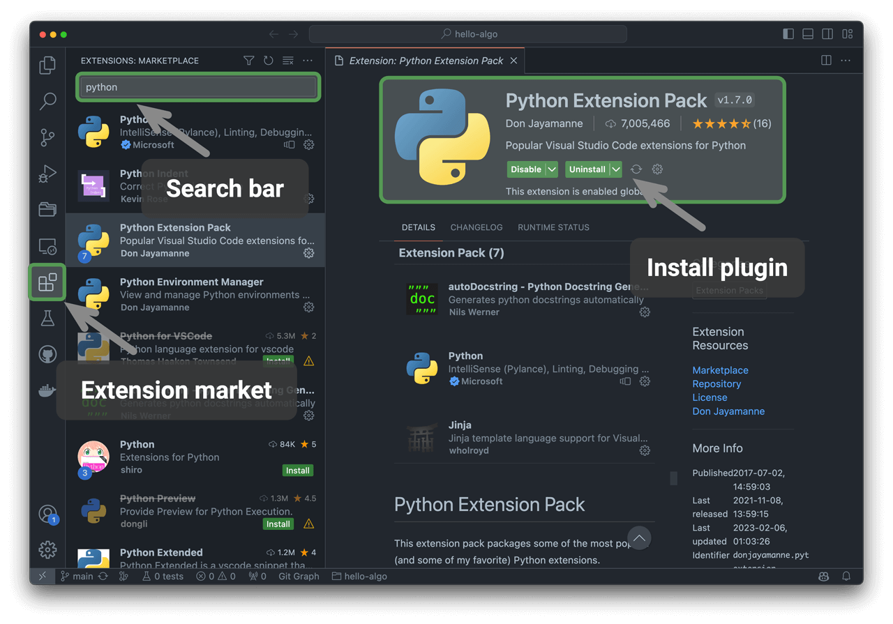

# Cài đặt môi trường lập trình

## Cài đặt IDE

Chúng tôi khuyến nghị sử dụng VS Code, một công cụ mã nguồn mở và nhẹ, làm môi trường phát triển tích hợp (IDE) cục bộ. Hãy truy cập [trang chủ VS Code](https://code.visualstudio.com/), tải về và cài đặt phiên bản VS Code phù hợp với hệ điều hành của bạn.

VS Code sở hữu một hệ sinh thái tiện ích mở rộng mạnh mẽ, hỗ trợ chạy và gỡ lỗi hầu hết các ngôn ngữ lập trình. Ví dụ, sau khi cài đặt tiện ích mở rộng "Python Extension Pack", bạn có thể gỡ lỗi mã Python. Các bước cài đặt được minh họa trong hình dưới đây.

## Cài đặt môi trường ngôn ngữ

### Môi trường Python

1. Tải về và cài đặt [Miniconda3](https://docs.conda.io/en/latest/miniconda.html) với phiên bản Python 3.10 trở lên.
2. Tìm kiếm `python` trong kho tiện ích mở rộng của VS Code và cài đặt Python Extension Pack.
3. (Tùy chọn) Nhập lệnh `pip install black` trên dòng lệnh để cài đặt công cụ định dạng mã nguồn.

### Môi trường C/C++

1. Hệ điều hành Windows cần cài đặt [MinGW](https://sourceforge.net/projects/mingw-w64/files/) ([hướng dẫn cấu hình](https://blog.csdn.net/qq_33698226/article/details/129031241)); macOS đã có sẵn Clang tích hợp nên không cần cài đặt.
2. Tìm kiếm `c++` trong kho tiện ích mở rộng của VS Code và cài đặt C/C++ Extension Pack.
3. (Tùy chọn) Mở trang Settings, tìm kiếm tùy chọn định dạng mã `Clang_format_fallback Style`, và đặt giá trị thành `{ BasedOnStyle: Microsoft, BreakBeforeBraces: Attach }`.

### Môi trường Java

1. Tải về và cài đặt [OpenJDK](https://jdk.java.net/18/) (phiên bản 10 trở lên).
2. Tìm kiếm `java` trong kho tiện ích mở rộng của VS Code và cài đặt Extension Pack for Java.

### Môi trường C#

1. Tải về và cài đặt [.NET 8.0](https://dotnet.microsoft.com/en-us/download).
2. Tìm kiếm `C# Dev Kit` trong kho tiện ích mở rộng của VS Code và cài đặt C# Dev Kit ([hướng dẫn cấu hình](https://code.visualstudio.com/docs/csharp/get-started)).
3. Bạn cũng có thể sử dụng Visual Studio ([hướng dẫn cài đặt](https://learn.microsoft.com/zh-cn/visualstudio/install/install-visual-studio?view=vs-2022)).

### Môi trường Go

1. Tải về và cài đặt [Go](https://go.dev/dl/).
2. Tìm kiếm `go` trong kho tiện ích mở rộng của VS Code và cài đặt Go.
3. Nhấn `Ctrl + Shift + P` để mở bảng lệnh, gõ `go`, chọn `Go: Install/Update Tools`, đánh dấu tất cả các tùy chọn và cài đặt.

### Môi trường Swift

1. Tải về và cài đặt [Swift](https://www.swift.org/download/).
2. Tìm kiếm `swift` trong kho tiện ích mở rộng của VS Code và cài đặt [Swift for Visual Studio Code](https://marketplace.visualstudio.com/items?itemName=sswg.swift-lang).

### Môi trường JavaScript

1. Tải về và cài đặt [Node.js](https://nodejs.org/en/).
2. (Tùy chọn) Tìm kiếm `Prettier` trong kho tiện ích mở rộng của VS Code và cài đặt công cụ định dạng mã nguồn.

### Môi trường TypeScript

1. Thực hiện theo các bước cài đặt tương tự như môi trường JavaScript.
2. Cài đặt [TypeScript Execute (tsx)](https://github.com/privatenumber/tsx?tab=readme-ov-file#global-installation).
3. Tìm kiếm `typescript` trong kho tiện ích mở rộng của VS Code và cài đặt [Pretty TypeScript Errors](https://marketplace.visualstudio.com/items?itemName=yoavbls.pretty-ts-errors).

### Môi trường Dart

1. Tải về và cài đặt [Dart](https://dart.dev/get-dart).
2. Tìm kiếm `dart` trong kho tiện ích mở rộng của VS Code và cài đặt [Dart](https://marketplace.visualstudio.com/items?itemName=Dart-Code.dart-code).

### Môi trường Rust

1. Tải về và cài đặt [Rust](https://www.rust-lang.org/tools/install).
2. Tìm kiếm `rust` trong kho tiện ích mở rộng của VS Code và cài đặt [rust-analyzer](https://marketplace.visualstudio.com/items?itemName=rust-lang.rust-analyzer).
