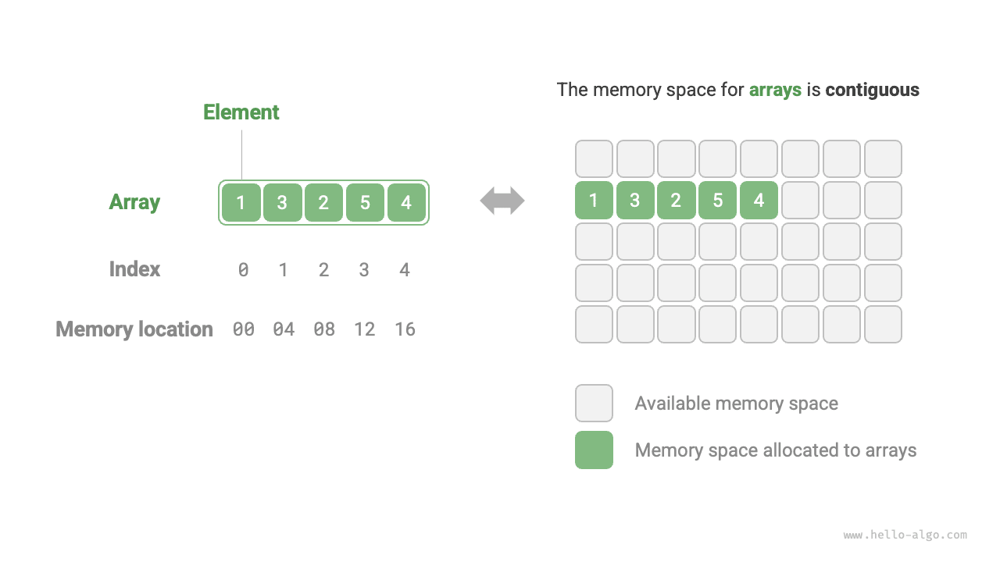
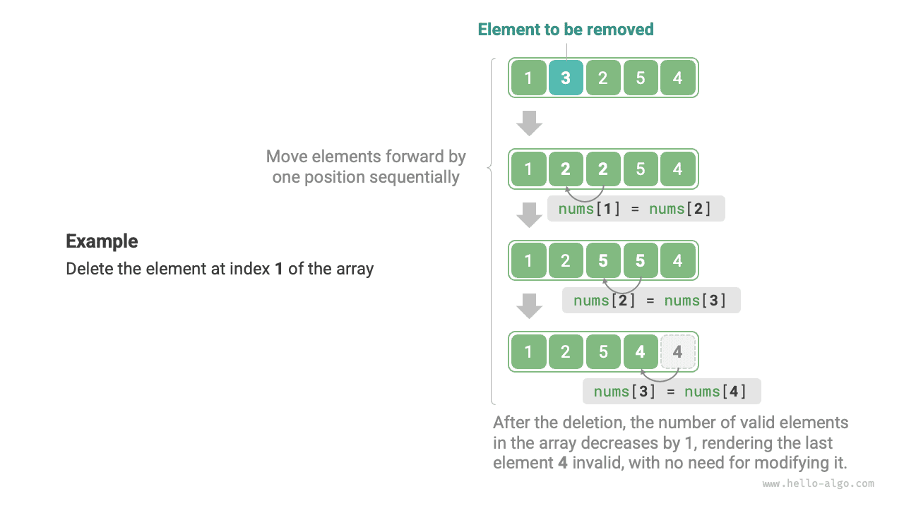

# Mảng

<u>Mảng</u> là một cấu trúc dữ liệu tuyến tính lưu trữ các phần tử cùng kiểu trong một vùng nhớ liên tục. Vị trí của một phần tử trong mảng được gọi là <u>chỉ số</u> của phần tử đó. Hình dưới đây minh họa các khái niệm chính và cách lưu trữ của mảng.



## Các thao tác thường gặp trên mảng

### Khởi tạo mảng

Chúng ta có thể chọn một trong hai cách khởi tạo mảng tùy theo nhu cầu: có hoặc không có giá trị ban đầu. Khi không chỉ định giá trị ban đầu, hầu hết các ngôn ngữ lập trình sẽ khởi tạo các phần tử của mảng bằng $0$:

=== "Python"

    ```python title="array.py"
    # Khởi tạo mảng
    arr: list[int] = [0] * 5  # [ 0, 0, 0, 0, 0 ]
    nums: list[int] = [1, 3, 2, 5, 4]
    ```

=== "C++"

    ```cpp title="array.cpp"
    /* Khởi tạo mảng */
    // Lưu trên stack
    int arr[5];
    int nums[5] = { 1, 3, 2, 5, 4 };
    // Lưu trên heap (cần giải phóng bộ nhớ thủ công)
    int* arr1 = new int[5];
    int* nums1 = new int[5] { 1, 3, 2, 5, 4 };
    ```

=== "Java"

    ```java title="array.java"
    /* Khởi tạo mảng */
    int[] arr = new int[5]; // { 0, 0, 0, 0, 0 }
    int[] nums = { 1, 3, 2, 5, 4 };
    ```

=== "C#"

    ```csharp title="array.cs"
    /* Khởi tạo mảng */
    int[] arr = new int[5]; // [ 0, 0, 0, 0, 0 ]
    int[] nums = [1, 3, 2, 5, 4];
    ```

=== "Go"

    ```go title="array.go"
    /* Khởi tạo mảng */
    var arr [5]int
    // Trong Go, nếu chỉ định độ dài ([5]int) ta có một mảng; nếu không chỉ định độ dài ([]int) ta có một slice
    // Vì mảng trong Go được thiết kế để có độ dài xác định tại thời điểm biên dịch, chỉ hằng số mới được dùng để chỉ định độ dài
    // Để thuận tiện khi cài đặt phương thức extend(), phần dưới đây coi slice như mảng
    nums := []int{1, 3, 2, 5, 4}
    ```

=== "Swift"

    ```swift title="array.swift"
    /* Khởi tạo mảng */
    let arr = Array(repeating: 0, count: 5) // [0, 0, 0, 0, 0]
    let nums = [1, 3, 2, 5, 4]
    ```

=== "JS"

    ```javascript title="array.js"
    /* Khởi tạo mảng */
    var arr = new Array(5).fill(0);
    var nums = [1, 3, 2, 5, 4];
    ```

=== "TS"

    ```typescript title="array.ts"
    /* Khởi tạo mảng */
    let arr: number[] = new Array(5).fill(0);
    let nums: number[] = [1, 3, 2, 5, 4];
    ```

=== "Dart"

    ```dart title="array.dart"
    /* Khởi tạo mảng */
    List<int> arr = List.filled(5, 0); // [0, 0, 0, 0, 0]
    List<int> nums = [1, 3, 2, 5, 4];
    ```

=== "Rust"

    ```rust title="array.rs"
    /* Khởi tạo mảng */
    let arr: [i32; 5] = [0; 5]; // [0, 0, 0, 0, 0]
    let slice: &[i32] = &[0; 5];
    // Trong Rust, nếu chỉ định độ dài ([i32; 5]) ta có một mảng; nếu không chỉ định độ dài (&[i32]) ta có một slice
    // Vì mảng trong Rust được thiết kế để có độ dài xác định tại thời điểm biên dịch, chỉ hằng số mới được dùng để chỉ định độ dài
    // Vector thường được dùng như mảng động trong Rust
    // Để thuận tiện khi cài đặt phương thức extend(), phần dưới đây coi vector như mảng
    let nums: Vec<i32> = vec![1, 3, 2, 5, 4];
    ```

=== "C"

    ```c title="array.c"
    /* Khởi tạo mảng */
    int arr[5] = { 0 }; // { 0, 0, 0, 0, 0 }
    int nums[5] = { 1, 3, 2, 5, 4 };
    ```

=== "Kotlin"

    ```kotlin title="array.kt"
    /* Khởi tạo mảng */
    var arr = IntArray(5) // { 0, 0, 0, 0, 0 }
    var nums = intArrayOf(1, 3, 2, 5, 4)
    ```

=== "Ruby"

    ```ruby title="array.rb"
    # Khởi tạo mảng
    arr = Array.new(5, 0)
    nums = [1, 3, 2, 5, 4]
    ```

??? pythontutor "Minh họa mã nguồn"

    https://pythontutor.com/render.html#code=%23%20%E5%88%9D%E5%A7%8B%E5%8C%96%E6%95%B0%E7%BB%84%0Aarr%20%3D%20%5B0%5D%20*%205%20%20%23%20%5B%200,%200,%200,%200,%200%20%5D%0Anums%20%3D%20%5B1,%203,%202,%205,%204%5D&cumulative=false&curInstr=0&heapPrimitives=nevernest&mode=display&origin=opt-frontend.js&py=311&rawInputLstJSON=%5B%5D&textReferences=false

### Truy cập phần tử

Các phần tử của mảng được lưu trong vùng nhớ liên tục, nghĩa là việc tính toán địa chỉ bộ nhớ của các phần tử trong mảng rất đơn giản. Biết địa chỉ bộ nhớ của mảng (địa chỉ bộ nhớ của phần tử đầu tiên) và chỉ số của một phần tử, ta có thể dùng công thức trong hình dưới đây để tính địa chỉ bộ nhớ của phần tử đó và truy cập trực tiếp phần tử này.


Quan sát hình trên, ta thấy phần tử đầu tiên của mảng có chỉ số $0$, điều này có vẻ hơi phản trực giác vì đếm từ $1$ có vẻ tự nhiên hơn. Tuy nhiên, xét theo góc độ công thức tính địa chỉ, **chỉ số về bản chất là độ lệch (offset) so với địa chỉ bộ nhớ gốc**. Độ lệch địa chỉ của phần tử đầu tiên là $0$, nên việc chỉ số của nó là $0$ là hợp lý.

Việc truy cập phần tử trong mảng có hiệu quả rất cao; ta có thể truy cập ngẫu nhiên bất kỳ phần tử nào trong mảng với thời gian $O(1)$.

```src
[file]{array}-[class]{}-[func]{random_access}
```

### Chèn phần tử

Các phần tử của mảng được xếp sát nhau trong bộ nhớ, không có khoảng trống dư để chứa thêm dữ liệu. Như hình dưới đây, nếu muốn chèn một phần tử vào giữa mảng, ta cần dịch chuyển tất cả các phần tử phía sau sang phải một vị trí, rồi mới gán giá trị vào chỉ số đó.


Cần lưu ý rằng vì độ dài của mảng là cố định, việc chèn một phần tử chắc chắn sẽ đẩy phần tử cuối cùng ra khỏi mảng. Chúng ta sẽ để lại cách giải quyết vấn đề này cho chương "Danh sách".

```src
[file]{array}-[class]{}-[func]{insert}
```

### Xóa phần tử

Tương tự, như hình dưới đây, để xóa phần tử tại chỉ số $i$, ta cần dịch chuyển tất cả các phần tử phía sau chỉ số $i$ về trước một vị trí.



Lưu ý rằng sau khi xóa xong, phần tử cuối cùng ban đầu không còn ý nghĩa nữa, vì vậy ta không cần phải sửa đổi nó một cách tường minh.

```src
[file]{array}-[class]{}-[func]{remove}
```

Nhìn chung, các thao tác chèn và xóa trên mảng có những hạn chế sau:

- **Độ phức tạp thời gian cao**: Độ phức tạp thời gian trung bình của cả thao tác chèn lẫn xóa trong mảng là $O(n)$, với $n$ là độ dài của mảng.
- **Mất mát phần tử**: Vì độ dài của mảng là bất biến, sau khi chèn một phần tử, các phần tử vượt quá độ dài của mảng sẽ bị mất.
- **Lãng phí bộ nhớ**: Ta có thể khởi tạo một mảng khá dài và chỉ sử dụng phần đầu, khi đó các phần tử bị ghi đè ở cuối chỉ là những vị trí trống chưa dùng đến, nhưng cách này lại lãng phí một phần bộ nhớ.

### Duyệt mảng

Trong hầu hết các ngôn ngữ lập trình, ta có thể duyệt mảng theo chỉ số hoặc duyệt trực tiếp qua từng phần tử của mảng:

```src
[file]{array}-[class]{}-[func]{traverse}
```

### Tìm kiếm phần tử

Để tìm một phần tử cụ thể trong mảng, ta cần duyệt qua mảng và kiểm tra xem giá trị phần tử có khớp hay không ở mỗi lượt duyệt; nếu khớp, xuất ra chỉ số tương ứng.

Vì mảng là một cấu trúc dữ liệu tuyến tính, thao tác tìm kiếm trên được gọi là "tìm kiếm tuyến tính".

```src
[file]{array}-[class]{}-[func]{find}
```

### Mở rộng mảng

Trong môi trường hệ thống phức tạp, chương trình không thể đảm bảo rằng vùng nhớ ngay sau mảng luôn còn trống, nên việc mở rộng dung lượng của mảng là không an toàn. Do đó, trong hầu hết các ngôn ngữ lập trình, **độ dài của mảng là bất biến**.

Nếu muốn mở rộng một mảng, ta cần tạo một mảng mới lớn hơn, rồi sao chép lần lượt các phần tử của mảng gốc sang mảng mới. Đây là thao tác có độ phức tạp $O(n)$, rất tốn thời gian khi mảng có kích thước lớn. Đoạn mã dưới đây minh họa điều này:

```src
[file]{array}-[class]{}-[func]{extend}
```

## Ưu điểm và hạn chế của mảng

Mảng được lưu trong vùng nhớ liên tục với các phần tử cùng kiểu. Cách tổ chức này chứa nhiều thông tin tiên nghiệm phong phú mà hệ thống có thể tận dụng để tối ưu hiệu quả các thao tác trên cấu trúc dữ liệu.

- **Hiệu quả sử dụng không gian cao**: Mảng phân bổ các khối bộ nhớ liên tục cho dữ liệu mà không có thêm chi phí cấu trúc phụ trợ nào.
- **Hỗ trợ truy cập ngẫu nhiên**: Mảng cho phép truy cập bất kỳ phần tử nào trong thời gian $O(1)$.
- **Tính cục bộ của bộ nhớ đệm (cache locality)**: Khi truy cập một phần tử của mảng, máy tính không chỉ nạp phần tử đó mà còn nạp cả dữ liệu lân cận vào bộ nhớ đệm, nhờ đó tận dụng bộ nhớ đệm để tăng tốc độ thực thi các thao tác tiếp theo.

Việc lưu trữ trong không gian liên tục là con dao hai lưỡi với những hạn chế sau:

- **Hiệu quả chèn và xóa thấp**: Khi mảng có nhiều phần tử, các thao tác chèn và xóa đòi hỏi phải dịch chuyển một lượng lớn phần tử.
- **Độ dài bất biến**: Sau khi mảng được khởi tạo, độ dài của nó là cố định. Việc mở rộng mảng đòi hỏi phải sao chép toàn bộ dữ liệu sang một mảng mới, rất tốn kém.
- **Lãng phí bộ nhớ**: Nếu kích thước cấp phát cho mảng vượt quá nhu cầu thực tế, phần bộ nhớ dư thừa sẽ bị lãng phí.

## Các ứng dụng tiêu biểu của mảng

Mảng là một cấu trúc dữ liệu cơ bản và phổ biến, được sử dụng rộng rãi trong nhiều thuật toán và để cài đặt nhiều cấu trúc dữ liệu phức tạp khác.

- **Truy cập ngẫu nhiên**: Nếu muốn lấy mẫu ngẫu nhiên một số phần tử, ta có thể dùng mảng để lưu trữ chúng và sinh ra một dãy ngẫu nhiên để thực hiện việc lấy mẫu dựa trên chỉ số.
- **Sắp xếp và tìm kiếm**: Mảng là cấu trúc dữ liệu được dùng phổ biến nhất trong các thuật toán sắp xếp và tìm kiếm. Sắp xếp nhanh (quick sort), sắp xếp trộn (merge sort), tìm kiếm nhị phân (binary search), và nhiều thuật toán khác chủ yếu được thực hiện trên mảng.
- **Bảng tra cứu**: Khi cần nhanh chóng tìm một phần tử hoặc mối quan hệ tương ứng của nó, ta có thể dùng mảng làm bảng tra cứu. Ví dụ, nếu muốn cài đặt một ánh xạ từ ký tự sang mã ASCII, ta có thể dùng giá trị mã ASCII của ký tự làm chỉ số, với phần tử tương ứng được lưu tại vị trí đó trong mảng.
- **Học máy**: Mạng nơ-ron sử dụng rất nhiều các phép toán đại số tuyến tính giữa vector, ma trận và tensor, tất cả đều được xây dựng dưới dạng mảng. Mảng là cấu trúc dữ liệu được dùng phổ biến nhất trong lập trình mạng nơ-ron.
- **Cài đặt cấu trúc dữ liệu**: Mảng có thể được dùng để cài đặt ngăn xếp, hàng đợi, bảng băm, heap, đồ thị và nhiều cấu trúc dữ liệu khác. Ví dụ, biểu diễn ma trận kề của đồ thị về bản chất là một mảng hai chiều.
