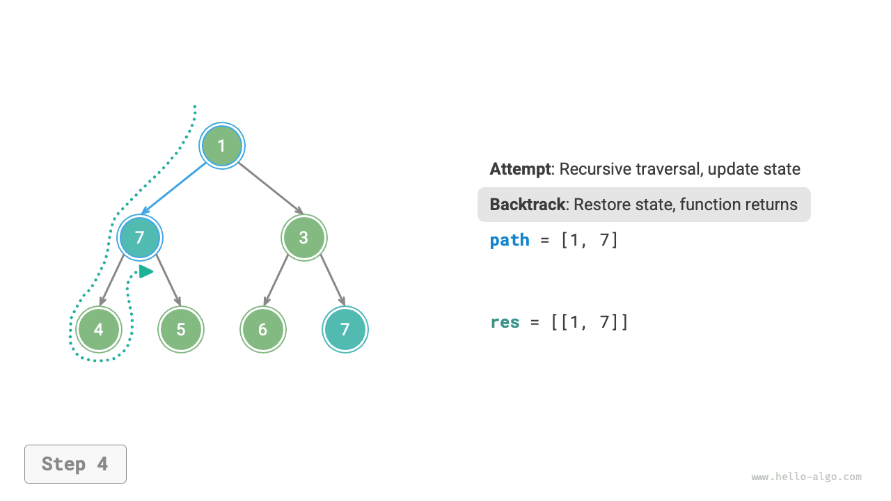
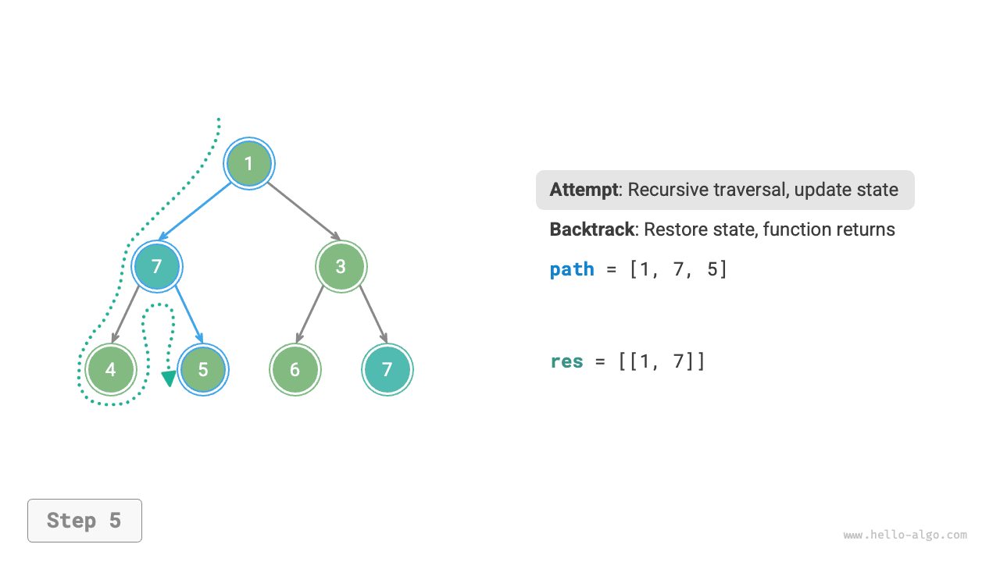
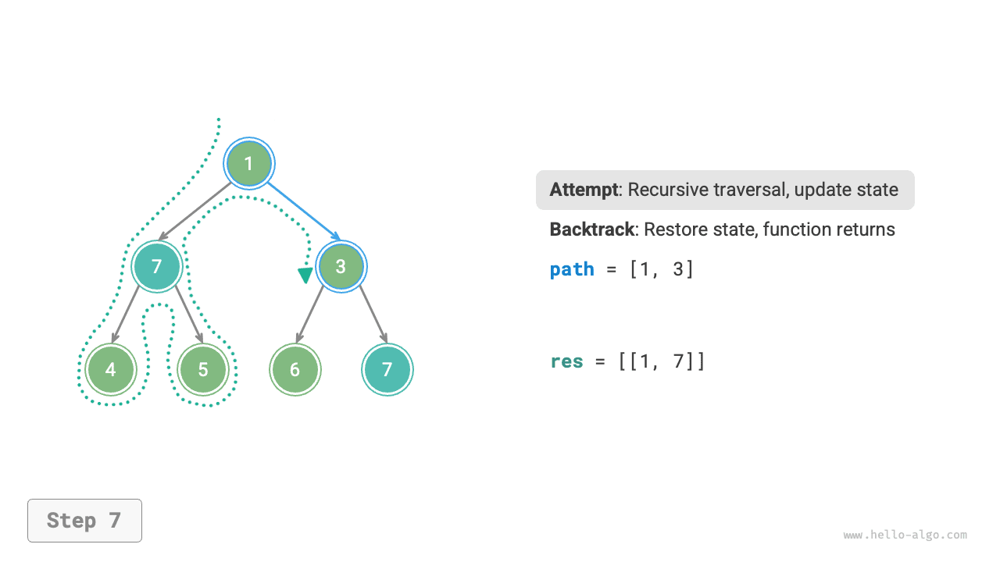
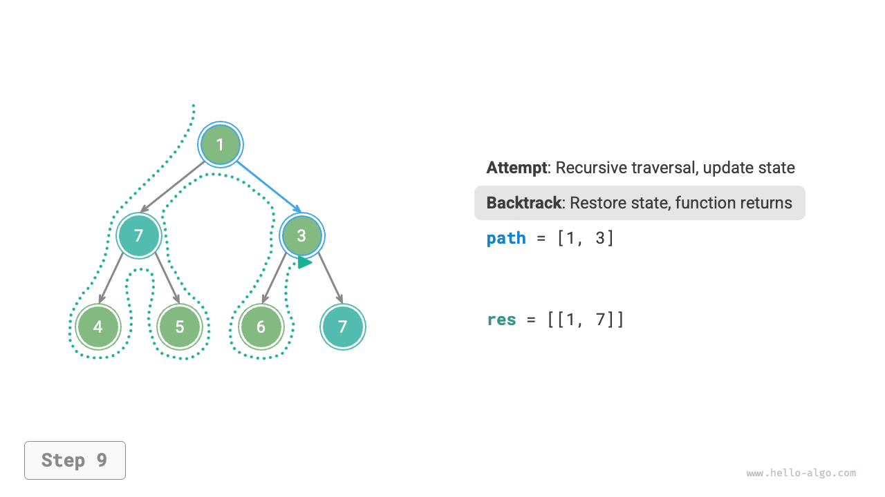
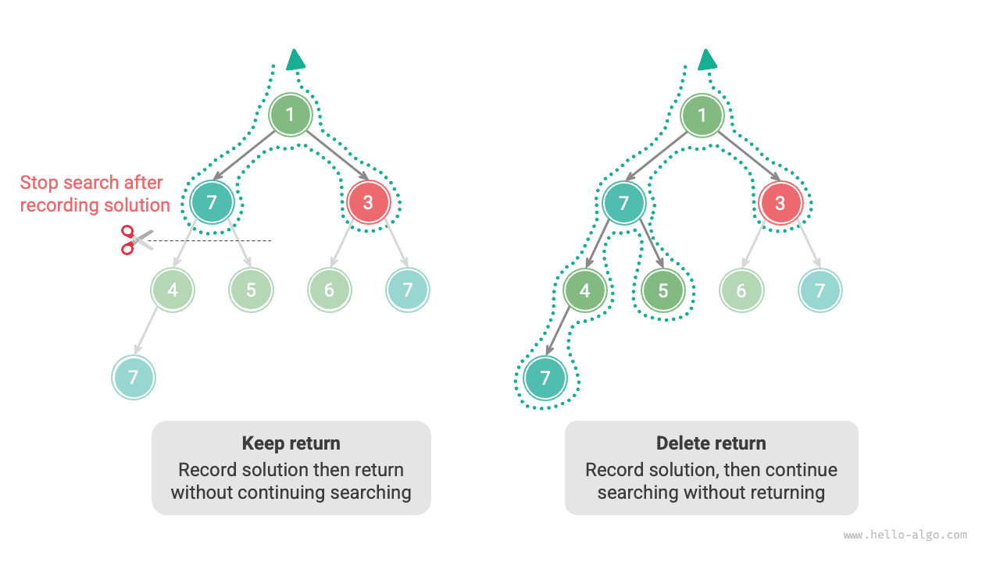

# Giải thuật quay lui

<u>Giải thuật quay lui</u> là một phương pháp giải quyết vấn đề bằng cách tìm kiếm vét cạn (duyệt toàn bộ). Ý tưởng cốt lõi của nó là bắt đầu từ một trạng thái ban đầu và tìm kiếm vét cạn tất cả các lời giải khả dĩ. Khi tìm được một lời giải đúng, nó sẽ được ghi lại. Quá trình này tiếp tục cho đến khi tìm được lời giải hoặc đã thử hết mọi lựa chọn có thể mà không tìm ra lời giải nào.

Giải thuật quay lui thường sử dụng "tìm kiếm theo chiều sâu" để duyệt không gian lời giải. Trong chương "Cây nhị phân", chúng ta đã đề cập rằng duyệt tiền thứ tự, trung thứ tự và hậu thứ tự đều thuộc về tìm kiếm theo chiều sâu. Tiếp theo, chúng ta sẽ xây dựng một bài toán quay lui bằng cách sử dụng duyệt tiền thứ tự để dần dần hiểu cách giải thuật quay lui hoạt động.

!!! question "Ví dụ 1"

    Cho một cây nhị phân, tìm kiếm và ghi lại tất cả các nút có giá trị $7$, sau đó trả về danh sách các nút này.

Với bài toán này, chúng ta thực hiện duyệt tiền thứ tự trên cây và kiểm tra xem giá trị của nút hiện tại có bằng $7$ hay không. Nếu đúng, chúng ta thêm nút đó vào danh sách kết quả `res`. Cách cài đặt tương ứng được thể hiện trong hình và đoạn mã dưới đây:

```src
[file]{preorder_traversal_i_compact}-[class]{}-[func]{pre_order}
```


## Thử và quay lui

**Sở dĩ được gọi là giải thuật quay lui vì nó sử dụng các chiến lược "thử" và "quay lui" khi tìm kiếm trong không gian lời giải**. Khi giải thuật gặp phải trạng thái không thể tiếp tục tiến lên hoặc không thể tìm ra lời giải thỏa mãn các ràng buộc, nó sẽ hoàn tác lựa chọn trước đó, quay về trạng thái trước đó và thử các lựa chọn khả dĩ khác.

Đối với Ví dụ 1, việc thăm mỗi nút đại diện cho một lần "thử", trong khi việc bỏ qua một nút lá hoặc câu lệnh `return` đưa quá trình duyệt trở về nút cha đại diện cho một lần "quay lui".

Cần lưu ý rằng **quay lui không chỉ giới hạn ở việc hàm trả về (return)**. Để minh họa điều này, hãy mở rộng Ví dụ 1 một chút.

!!! question "Ví dụ 2"

    Trong một cây nhị phân, tìm kiếm tất cả các nút có giá trị $7$, **và trả về các đường đi từ nút gốc đến các nút này**.

Dựa trên đoạn mã của Ví dụ 1, chúng ta cần sử dụng một danh sách `path` để ghi lại đường đi của các nút đã thăm. Khi đến một nút có giá trị $7$, chúng ta sao chép `path` và thêm nó vào danh sách kết quả `res`. Sau khi duyệt xong, `res` chứa tất cả các lời giải. Đoạn mã như sau:

```src
[file]{preorder_traversal_ii_compact}-[class]{}-[func]{pre_order}
```

Trong mỗi lần "thử", chúng ta ghi lại đường đi bằng cách thêm nút hiện tại vào `path`; trước khi "quay lui", chúng ta cần xóa nút đó khỏi `path`, **để khôi phục trạng thái trước lần thử này**.

Quan sát quá trình được thể hiện trong hình dưới đây, **chúng ta có thể hiểu thử và quay lui như "tiến lên" và "hoàn tác"**, hai thao tác ngược nhau.

=== "<1>"
    

=== "<2>"
    

=== "<3>"
    

=== "<4>"
    

=== "<5>"
    

=== "<6>"
    

=== "<7>"
    

=== "<8>"
    

=== "<9>"
    

=== "<10>"
    

=== "<11>"
    

## Cắt tỉa

Các bài toán quay lui phức tạp thường chứa một hoặc nhiều ràng buộc. **Các ràng buộc thường có thể được dùng để "cắt tỉa"**.

!!! question "Ví dụ 3"

    Trong một cây nhị phân, tìm kiếm tất cả các nút có giá trị $7$ và trả về các đường đi từ nút gốc đến các nút này, **nhưng yêu cầu các đường đi không được chứa nút có giá trị $3$**.

Để thỏa mãn ràng buộc trên, **chúng ta cần bổ sung thao tác cắt tỉa**: trong quá trình tìm kiếm, nếu gặp một nút có giá trị $3$, chúng ta trả về ngay lập tức và không tiếp tục tìm kiếm nữa. Đoạn mã như sau:

```src
[file]{preorder_traversal_iii_compact}-[class]{}-[func]{pre_order}
```

"Cắt tỉa" là một thuật ngữ rất hình tượng. Như thể hiện trong hình dưới đây, trong quá trình tìm kiếm, **chúng ta "cắt bỏ" các nhánh tìm kiếm không thỏa mãn ràng buộc**, tránh được nhiều lần thử vô nghĩa và từ đó nâng cao hiệu quả tìm kiếm.


## Mã khung sườn

Tiếp theo, chúng ta thử trích xuất một khung sườn tổng quát xoay quanh "thử, quay lui và cắt tỉa" của giải thuật quay lui để nâng cao tính tổng quát của đoạn mã.

Trong đoạn mã khung sườn dưới đây, `state` đại diện cho trạng thái hiện tại của bài toán, còn `choices` đại diện cho các lựa chọn khả dĩ ở trạng thái hiện tại:

=== "Python"

    ```python title=""
    def backtrack(state: State, choices: list[choice], res: list[state]):
        """Khung sườn giải thuật quay lui"""
        # Kiểm tra xem đây có phải là một lời giải hay không
        if is_solution(state):
            # Ghi lại lời giải
            record_solution(state, res)
            # Dừng tìm kiếm
            return
        # Duyệt qua tất cả các lựa chọn
        for choice in choices:
            # Cắt tỉa: kiểm tra xem lựa chọn có hợp lệ không
            if is_valid(state, choice):
                # Thử: thực hiện lựa chọn và cập nhật trạng thái
                make_choice(state, choice)
                backtrack(state, choices, res)
                # Quay lui: hoàn tác lựa chọn và khôi phục trạng thái trước đó
                undo_choice(state, choice)
    ```

=== "C++"

    ```cpp title=""
    /* Khung sườn giải thuật quay lui */
    void backtrack(State *state, vector<Choice *> &choices, vector<State *> &res) {
        // Kiểm tra xem đây có phải là một lời giải hay không
        if (isSolution(state)) {
            // Ghi lại lời giải
            recordSolution(state, res);
            // Dừng tìm kiếm
            return;
        }
        // Duyệt qua tất cả các lựa chọn
        for (Choice choice : choices) {
            // Cắt tỉa: kiểm tra xem lựa chọn có hợp lệ không
            if (isValid(state, choice)) {
                // Thử: thực hiện lựa chọn và cập nhật trạng thái
                makeChoice(state, choice);
                backtrack(state, choices, res);
                // Quay lui: hoàn tác lựa chọn và khôi phục trạng thái trước đó
                undoChoice(state, choice);
            }
        }
    }
    ```

=== "Java"

    ```java title=""
    /* Khung sườn giải thuật quay lui */
    void backtrack(State state, List<Choice> choices, List<State> res) {
        // Kiểm tra xem đây có phải là một lời giải hay không
        if (isSolution(state)) {
            // Ghi lại lời giải
            recordSolution(state, res);
            // Dừng tìm kiếm
            return;
        }
        // Duyệt qua tất cả các lựa chọn
        for (Choice choice : choices) {
            // Cắt tỉa: kiểm tra xem lựa chọn có hợp lệ không
            if (isValid(state, choice)) {
                // Thử: thực hiện lựa chọn và cập nhật trạng thái
                makeChoice(state, choice);
                backtrack(state, choices, res);
                // Quay lui: hoàn tác lựa chọn và khôi phục trạng thái trước đó
                undoChoice(state, choice);
            }
        }
    }
    ```

=== "C#"

    ```csharp title=""
    /* Khung sườn giải thuật quay lui */
    void Backtrack(State state, List<Choice> choices, List<State> res) {
        // Kiểm tra xem đây có phải là một lời giải hay không
        if (IsSolution(state)) {
            // Ghi lại lời giải
            RecordSolution(state, res);
            // Dừng tìm kiếm
            return;
        }
        // Duyệt qua tất cả các lựa chọn
        foreach (Choice choice in choices) {
            // Cắt tỉa: kiểm tra xem lựa chọn có hợp lệ không
            if (IsValid(state, choice)) {
                // Thử: thực hiện lựa chọn và cập nhật trạng thái
                MakeChoice(state, choice);
                Backtrack(state, choices, res);
                // Quay lui: hoàn tác lựa chọn và khôi phục trạng thái trước đó
                UndoChoice(state, choice);
            }
        }
    }
    ```

=== "Go"

    ```go title=""
    /* Khung sườn giải thuật quay lui */
    func backtrack(state *State, choices []Choice, res *[]State) {
        // Kiểm tra xem đây có phải là một lời giải hay không
        if isSolution(state) {
            // Ghi lại lời giải
            recordSolution(state, res)
            // Dừng tìm kiếm
            return
        }
        // Duyệt qua tất cả các lựa chọn
        for _, choice := range choices {
            // Cắt tỉa: kiểm tra xem lựa chọn có hợp lệ không
            if isValid(state, choice) {
                // Thử: thực hiện lựa chọn và cập nhật trạng thái
                makeChoice(state, choice)
                backtrack(state, choices, res)
                // Quay lui: hoàn tác lựa chọn và khôi phục trạng thái trước đó
                undoChoice(state, choice)
            }
        }
    }
    ```

=== "Swift"

    ```swift title=""
    /* Khung sườn giải thuật quay lui */
    func backtrack(state: inout State, choices: [Choice], res: inout [State]) {
        // Kiểm tra xem đây có phải là một lời giải hay không
        if isSolution(state: state) {
            // Ghi lại lời giải
            recordSolution(state: state, res: &res)
            // Dừng tìm kiếm
            return
        }
        // Duyệt qua tất cả các lựa chọn
        for choice in choices {
            // Cắt tỉa: kiểm tra xem lựa chọn có hợp lệ không
            if isValid(state: state, choice: choice) {
                // Thử: thực hiện lựa chọn và cập nhật trạng thái
                makeChoice(state: &state, choice: choice)
                backtrack(state: &state, choices: choices, res: &res)
                // Quay lui: hoàn tác lựa chọn và khôi phục trạng thái trước đó
                undoChoice(state: &state, choice: choice)
            }
        }
    }
    ```

=== "JS"

    ```javascript title=""
    /* Khung sườn giải thuật quay lui */
    function backtrack(state, choices, res) {
        // Kiểm tra xem đây có phải là một lời giải hay không
        if (isSolution(state)) {
            // Ghi lại lời giải
            recordSolution(state, res);
            // Dừng tìm kiếm
            return;
        }
        // Duyệt qua tất cả các lựa chọn
        for (let choice of choices) {
            // Cắt tỉa: kiểm tra xem lựa chọn có hợp lệ không
            if (isValid(state, choice)) {
                // Thử: thực hiện lựa chọn và cập nhật trạng thái
                makeChoice(state, choice);
                backtrack(state, choices, res);
                // Quay lui: hoàn tác lựa chọn và khôi phục trạng thái trước đó
                undoChoice(state, choice);
            }
        }
    }
    ```

=== "TS"

    ```typescript title=""
    /* Khung sườn giải thuật quay lui */
    function backtrack(state: State, choices: Choice[], res: State[]): void {
        // Kiểm tra xem đây có phải là một lời giải hay không
        if (isSolution(state)) {
            // Ghi lại lời giải
            recordSolution(state, res);
            // Dừng tìm kiếm
            return;
        }
        // Duyệt qua tất cả các lựa chọn
        for (let choice of choices) {
            // Cắt tỉa: kiểm tra xem lựa chọn có hợp lệ không
            if (isValid(state, choice)) {
                // Thử: thực hiện lựa chọn và cập nhật trạng thái
                makeChoice(state, choice);
                backtrack(state, choices, res);
                // Quay lui: hoàn tác lựa chọn và khôi phục trạng thái trước đó
                undoChoice(state, choice);
            }
        }
    }
    ```

=== "Dart"

    ```dart title=""
    /* Khung sườn giải thuật quay lui */
    void backtrack(State state, List<Choice>, List<State> res) {
      // Kiểm tra xem đây có phải là một lời giải hay không
      if (isSolution(state)) {
        // Ghi lại lời giải
        recordSolution(state, res);
        // Dừng tìm kiếm
        return;
      }
      // Duyệt qua tất cả các lựa chọn
      for (Choice choice in choices) {
        // Cắt tỉa: kiểm tra xem lựa chọn có hợp lệ không
        if (isValid(state, choice)) {
          // Thử: thực hiện lựa chọn và cập nhật trạng thái
          makeChoice(state, choice);
          backtrack(state, choices, res);
          // Quay lui: hoàn tác lựa chọn và khôi phục trạng thái trước đó
          undoChoice(state, choice);
        }
      }
    }
    ```

=== "Rust"

    ```rust title=""
    /* Khung sườn giải thuật quay lui */
    fn backtrack(state: &mut State, choices: &Vec<Choice>, res: &mut Vec<State>) {
        // Kiểm tra xem đây có phải là một lời giải hay không
        if is_solution(state) {
            // Ghi lại lời giải
            record_solution(state, res);
            // Dừng tìm kiếm
            return;
        }
        // Duyệt qua tất cả các lựa chọn
        for choice in choices {
            // Cắt tỉa: kiểm tra xem lựa chọn có hợp lệ không
            if is_valid(state, choice) {
                // Thử: thực hiện lựa chọn và cập nhật trạng thái
                make_choice(state, choice);
                backtrack(state, choices, res);
                // Quay lui: hoàn tác lựa chọn và khôi phục trạng thái trước đó
                undo_choice(state, choice);
            }
        }
    }
    ```

=== "C"

    ```c title=""
    /* Khung sườn giải thuật quay lui */
    void backtrack(State *state, Choice *choices, int numChoices, State *res, int numRes) {
        // Kiểm tra xem đây có phải là một lời giải hay không
        if (isSolution(state)) {
            // Ghi lại lời giải
            recordSolution(state, res, numRes);
            // Dừng tìm kiếm
            return;
        }
        // Duyệt qua tất cả các lựa chọn
        for (int i = 0; i < numChoices; i++) {
            // Cắt tỉa: kiểm tra xem lựa chọn có hợp lệ không
            if (isValid(state, &choices[i])) {
                // Thử: thực hiện lựa chọn và cập nhật trạng thái
                makeChoice(state, &choices[i]);
                backtrack(state, choices, numChoices, res, numRes);
                // Quay lui: hoàn tác lựa chọn và khôi phục trạng thái trước đó
                undoChoice(state, &choices[i]);
            }
        }
    }
    ```

=== "Kotlin"

    ```kotlin title=""
    /* Khung sườn giải thuật quay lui */
    fun backtrack(state: State?, choices: List<Choice?>, res: List<State?>?) {
        // Kiểm tra xem đây có phải là một lời giải hay không
        if (isSolution(state)) {
            // Ghi lại lời giải
            recordSolution(state, res)
            // Dừng tìm kiếm
            return
        }
        // Duyệt qua tất cả các lựa chọn
        for (choice in choices) {
            // Cắt tỉa: kiểm tra xem lựa chọn có hợp lệ không
            if (isValid(state, choice)) {
                // Thử: thực hiện lựa chọn và cập nhật trạng thái
                makeChoice(state, choice)
                backtrack(state, choices, res)
                // Quay lui: hoàn tác lựa chọn và khôi phục trạng thái trước đó
                undoChoice(state, choice)
            }
        }
    }
    ```

=== "Ruby"

    ```ruby title=""
    ### Khung sườn giải thuật quay lui ###
    def backtrack(state, choices, res)
        # Kiểm tra xem đây có phải là một lời giải hay không
        if is_solution?(state)
            # Ghi lại lời giải
            record_solution(state, res)
            return
        end

        # Duyệt qua tất cả các lựa chọn
        for choice in choices
            # Cắt tỉa: kiểm tra xem lựa chọn có hợp lệ không
            if is_valid?(state, choice)
                # Thử: thực hiện lựa chọn và cập nhật trạng thái
                make_choice(state, choice)
                backtrack(state, choices, res)
                # Quay lui: hoàn tác lựa chọn và khôi phục trạng thái trước đó
                undo_choice(state, choice)
            end
        end
    end
    ```

Tiếp theo, chúng ta giải Ví dụ 3 dựa trên đoạn mã khung sườn. Trạng thái `state` là đường đi duyệt qua các nút, các lựa chọn `choices` là các nút con trái và phải của nút hiện tại, và kết quả `res` là danh sách các đường đi:

```src
[file]{preorder_traversal_iii_template}-[class]{}-[func]{backtrack}
```

Theo yêu cầu đề bài, chúng ta cần tiếp tục tìm kiếm sau khi tìm thấy một nút có giá trị $7$. **Vì vậy, chúng ta cần bỏ câu lệnh `return` sau khi ghi lại lời giải**. Hình dưới đây so sánh quá trình tìm kiếm khi có và không có câu lệnh `return`.



So với đoạn mã dựa trên duyệt tiền thứ tự, đoạn mã dựa trên khung sườn giải thuật quay lui có vẻ dài dòng hơn, nhưng lại tổng quát hơn. Thực tế, **nhiều bài toán quay lui đều có thể giải quyết trong khuôn khổ này**. Chúng ta chỉ cần định nghĩa `state` và `choices` cho bài toán cụ thể và cài đặt từng phương thức trong khung sườn.

## Thuật ngữ thường dùng

Để phân tích các bài toán giải thuật rõ ràng hơn, chúng ta tổng hợp ý nghĩa của các thuật ngữ thường dùng trong giải thuật quay lui và cung cấp các ví dụ tương ứng từ Ví dụ 3, như trong bảng dưới đây.

<p align="center"> Bảng <id> &nbsp; Các thuật ngữ thường dùng trong giải thuật quay lui </p>

| Thuật ngữ                 | Định nghĩa                                                                                                                   | Ví dụ 3                                                                            |
| ------------------------- | ---------------------------------------------------------------------------------------------------------------------------- | ---------------------------------------------------------------------------------- |
| Lời giải (solution)       | Lời giải là một đáp án thỏa mãn các điều kiện cụ thể của bài toán; có thể có một hoặc nhiều lời giải                        | Tất cả các đường đi từ gốc đến các nút có giá trị $7$ thỏa mãn ràng buộc            |
| Ràng buộc (constraint)    | Ràng buộc là một điều kiện trong bài toán giới hạn tính khả thi của các lời giải, thường được dùng để cắt tỉa               | Đường đi không chứa nút có giá trị $3$                                             |
| Trạng thái (state)        | Trạng thái đại diện cho tình huống của bài toán tại một thời điểm nhất định, bao gồm các lựa chọn đã được thực hiện          | Đường đi các nút đã thăm hiện tại, tức là danh sách `path`                          |
| Thử (attempt)             | Thử là quá trình khám phá không gian lời giải theo các lựa chọn khả dĩ, bao gồm thực hiện lựa chọn, cập nhật trạng thái và kiểm tra xem đó có phải là lời giải | Đệ quy thăm nút con trái (phải), thêm nút vào `path`, kiểm tra giá trị nút có bằng $7$ hay không |
| Quay lui (backtracking)   | Quay lui nghĩa là hoàn tác lựa chọn trước đó và trở về trạng thái trước đó khi gặp một trạng thái không thỏa mãn ràng buộc   | Dừng tìm kiếm khi đi qua nút lá, kết thúc việc thăm nút, hoặc gặp nút có giá trị $3$; hàm trả về |
| Cắt tỉa (pruning)         | Cắt tỉa là phương pháp tránh các nhánh tìm kiếm vô nghĩa dựa trên đặc điểm và ràng buộc của bài toán, giúp nâng cao hiệu quả tìm kiếm | Khi gặp nút có giá trị $3$, không tiếp tục tìm kiếm nữa                            |

!!! tip

    Các khái niệm bài toán, lời giải, trạng thái, v.v. mang tính phổ quát và xuất hiện trong chia để trị, quay lui, quy hoạch động, giải thuật tham lam, v.v.

## Ưu điểm và hạn chế

Về bản chất, giải thuật quay lui là một giải thuật tìm kiếm theo chiều sâu, thử tất cả các lời giải khả dĩ cho đến khi tìm được một lời giải thỏa mãn điều kiện. Ưu điểm của cách tiếp cận này là có thể tìm ra tất cả các lời giải khả dĩ, và với các thao tác cắt tỉa hợp lý, nó đạt hiệu quả cao.

Tuy nhiên, khi xử lý các bài toán quy mô lớn hoặc phức tạp, **hiệu suất chạy của giải thuật quay lui có thể không thể chấp nhận được**.

- **Thời gian**: Giải thuật quay lui thường cần duyệt qua tất cả các khả năng trong không gian trạng thái, độ phức tạp thời gian có thể đạt bậc mũ hoặc giai thừa.
- **Không gian**: Trong quá trình gọi đệ quy, cần lưu trạng thái hiện tại (như các đường đi, các biến phụ trợ dùng cho cắt tỉa, v.v.), và khi độ sâu lớn, yêu cầu về không gian có thể trở nên rất lớn.

Tuy nhiên, **giải thuật quay lui vẫn là lời giải tốt nhất cho một số bài toán tìm kiếm và bài toán thỏa mãn ràng buộc nhất định**. Đối với những bài toán này, vì chúng ta không thể dự đoán lựa chọn nào sẽ tạo ra lời giải hợp lệ, nên chúng ta phải duyệt qua tất cả các lựa chọn khả dĩ. Trong trường hợp này, **điều quan trọng là làm thế nào để tối ưu hiệu quả**. Có hai phương pháp tối ưu hiệu quả thường gặp.

- **Cắt tỉa**: Tránh tìm kiếm các đường đi chắc chắn không tạo ra lời giải, từ đó tiết kiệm thời gian và không gian.
- **Tìm kiếm heuristic**: Đưa vào một số chiến lược hoặc giá trị ước lượng nhất định trong quá trình tìm kiếm để ưu tiên tìm kiếm các đường đi có khả năng tạo ra lời giải hợp lệ cao nhất.

## Các ví dụ điển hình về quay lui

Giải thuật quay lui có thể được dùng để giải nhiều bài toán tìm kiếm, bài toán thỏa mãn ràng buộc và bài toán tối ưu hóa tổ hợp.

**Bài toán tìm kiếm**: Mục tiêu của các bài toán này là tìm ra các lời giải thỏa mãn điều kiện cụ thể.

- Bài toán hoán vị: Cho một tập hợp, tìm tất cả các hoán vị và tổ hợp khả dĩ.
- Bài toán tổng tập con: Cho một tập hợp và một tổng đích, tìm tất cả các tập con trong tập hợp có tổng các phần tử bằng tổng đích.
- Tháp Hà Nội: Cho ba cọc và một loạt đĩa có kích thước khác nhau, di chuyển tất cả các đĩa từ cọc này sang cọc khác, mỗi lần chỉ di chuyển một đĩa, và không bao giờ đặt đĩa lớn hơn lên trên đĩa nhỏ hơn.

**Bài toán thỏa mãn ràng buộc**: Mục tiêu của các bài toán này là tìm ra các lời giải thỏa mãn tất cả các ràng buộc.

- Bài toán N quân hậu: Đặt $n$ quân hậu trên bàn cờ $n \times n$ sao cho chúng không tấn công lẫn nhau.
- Sudoku: Điền các số từ $1$ đến $9$ vào lưới $9 \times 9$ sao cho mỗi hàng, mỗi cột và mỗi ô vuông con $3 \times 3$ không chứa số trùng lặp.
- Tô màu đồ thị: Cho một đồ thị vô hướng, tô màu mỗi đỉnh với số lượng màu tối thiểu sao cho các đỉnh kề nhau có màu khác nhau.

**Bài toán tối ưu hóa tổ hợp**: Mục tiêu của các bài toán này là tìm ra lời giải tối ưu thỏa mãn một số điều kiện nhất định trong không gian tổ hợp.

- Bài toán cái túi 0-1: Cho một tập hợp các món đồ và một chiếc túi, mỗi món đồ có một giá trị và trọng lượng. Trong giới hạn dung lượng của túi, chọn các món đồ sao cho tổng giá trị đạt tối đa.
- Bài toán người bán hàng du lịch: Xuất phát từ một điểm trong đồ thị, thăm tất cả các điểm khác đúng một lần và quay trở lại điểm xuất phát, tìm đường đi ngắn nhất.
- Đồ thị con đầy đủ lớn nhất: Cho một đồ thị vô hướng, tìm đồ thị con đầy đủ lớn nhất, tức là đồ thị con mà bất kỳ hai đỉnh nào cũng được nối với nhau bằng một cạnh.

Lưu ý rằng đối với nhiều bài toán tối ưu hóa tổ hợp, quay lui không phải là lời giải tối ưu.

- Bài toán cái túi 0-1 thường được giải bằng quy hoạch động để đạt hiệu quả thời gian cao hơn.
- Bài toán người bán hàng du lịch là một bài toán NP-Hard nổi tiếng; các lời giải thường gặp bao gồm giải thuật di truyền và giải thuật đàn kiến.
- Bài toán đồ thị con đầy đủ lớn nhất là một bài toán kinh điển trong lý thuyết đồ thị và có thể được giải bằng các giải thuật heuristic như giải thuật tham lam.
