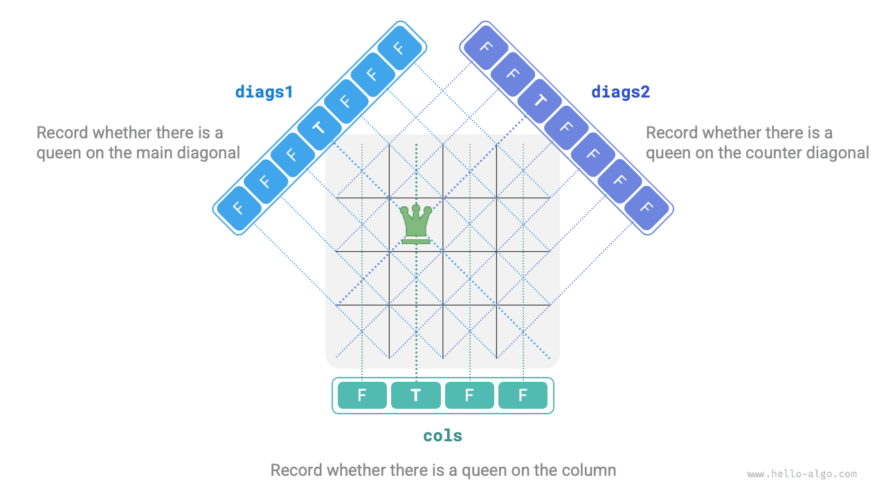

# Bài toán N quân hậu

!!! question

    Theo luật chơi cờ vua, một quân hậu có thể tấn công bất kỳ quân cờ nào cùng hàng, cùng cột hoặc cùng đường chéo với nó. Cho $n$ quân hậu và một bàn cờ $n \times n$, tìm một cách sắp xếp sao cho không có hai quân hậu nào tấn công lẫn nhau.

Như hình dưới đây, khi $n = 4$, có hai lời giải có thể tìm được. Từ góc độ giải thuật quay lui, một bàn cờ $n \times n$ có $n^2$ ô, cung cấp tất cả các lựa chọn `choices`. Trong quá trình đặt các quân hậu lần lượt, trạng thái của bàn cờ liên tục thay đổi, và bàn cờ tại mỗi thời điểm đại diện cho trạng thái `state`.


Hình dưới đây minh họa ba ràng buộc của bài toán này: **nhiều quân hậu không được ở cùng hàng, cùng cột hoặc cùng đường chéo**. Đáng lưu ý là đường chéo được chia thành hai loại: đường chéo chính `\` và đường chéo phụ `/`.


### Chiến lược đặt quân theo từng hàng

Vì số lượng quân hậu và số hàng trên bàn cờ đều bằng $n$, chúng ta dễ dàng rút ra kết luận: **mỗi hàng của bàn cờ chỉ cho phép đặt một và chỉ một quân hậu**.

Điều này có nghĩa là chúng ta có thể áp dụng chiến lược đặt quân theo từng hàng: bắt đầu từ hàng đầu tiên, đặt một quân hậu vào mỗi hàng cho đến khi hoàn thành hàng cuối cùng.

Hình dưới đây thể hiện quá trình đặt quân theo từng hàng cho bài toán 4 quân hậu. Do giới hạn về không gian, hình chỉ mở rộng một nhánh tìm kiếm của hàng đầu tiên, và tất cả các phương án vi phạm ràng buộc về cột hoặc đường chéo đều bị cắt tỉa.


Về bản chất, **chiến lược đặt quân theo từng hàng đóng vai trò của một thao tác cắt tỉa**, vì nó tránh được tất cả các nhánh tìm kiếm có nhiều quân hậu xuất hiện trên cùng một hàng.

### Cắt tỉa theo cột và đường chéo

Để thỏa mãn ràng buộc về cột, chúng ta có thể dùng một mảng boolean `cols` có độ dài $n$ để ghi lại xem mỗi cột đã có quân hậu hay chưa. Trước mỗi quyết định đặt quân, chúng ta dùng `cols` để cắt tỉa các cột đã có quân hậu, và cập nhật động trạng thái của `cols` trong quá trình quay lui.

!!! tip

    Xin lưu ý rằng gốc tọa độ của ma trận nằm ở góc trên bên trái, chỉ số hàng tăng dần từ trên xuống dưới, và chỉ số cột tăng dần từ trái sang phải.

Vậy làm thế nào để xử lý ràng buộc về đường chéo? Xét một ô trên bàn cờ có chỉ số hàng và cột là $(row, col)$. Nếu ta chọn một đường chéo chính cụ thể trong ma trận, ta thấy rằng tất cả các ô trên đường chéo đó đều có cùng hiệu số giữa chỉ số hàng và chỉ số cột, **nghĩa là $row - col$ là một hằng số đối với tất cả các ô trên đường chéo chính**.

Nói cách khác, nếu hai ô thỏa mãn $row_1 - col_1 = row_2 - col_2$, chúng chắc chắn nằm trên cùng một đường chéo chính. Sử dụng quy luật này, chúng ta có thể dùng mảng `diags1` như hình dưới đây để ghi lại xem mỗi đường chéo chính có quân hậu hay không.

Tương tự, **đối với tất cả các ô trên một đường chéo phụ, tổng $row + col$ là một hằng số**. Chúng ta cũng có thể dùng mảng `diags2` để xử lý ràng buộc đường chéo phụ theo cách tương tự.



### Cài đặt mã nguồn

Xin lưu ý rằng trong một ma trận vuông $n \times n$, phạm vi của $row - col$ là $[-n + 1, n - 1]$, và phạm vi của $row + col$ là $[0, 2n - 2]$. Do đó, số lượng đường chéo chính và đường chéo phụ đều là $2n - 1$, nghĩa là độ dài của cả hai mảng `diags1` và `diags2` đều là $2n - 1$.

```src
[file]{n_queens}-[class]{}-[func]{n_queens}
```

Đặt $n$ quân hậu theo từng hàng, xét đến ràng buộc về cột, từ hàng đầu tiên đến hàng cuối cùng lần lượt có $n$, $n-1$, $\dots$, $2$, $1$ lựa chọn, sử dụng thời gian $O(n!)$. Khi ghi lại một lời giải, cần sao chép ma trận `state` và thêm vào `res`, thao tác sao chép này tốn thời gian $O(n^2)$. Do đó, **độ phức tạp thời gian tổng thể là $O(n! \cdot n^2)$**. Trong thực tế, việc cắt tỉa dựa trên ràng buộc đường chéo cũng có thể làm giảm đáng kể không gian tìm kiếm, vì vậy hiệu quả tìm kiếm thường tốt hơn so với độ phức tạp thời gian nêu trên.

Mảng `state` sử dụng $O(n^2)$ không gian, và các mảng `cols`, `diags1`, `diags2` mỗi mảng sử dụng $O(n)$ không gian. Độ sâu đệ quy tối đa là $n$, sử dụng $O(n)$ không gian ngăn xếp. Do đó, **độ phức tạp không gian là $O(n^2)$**.
