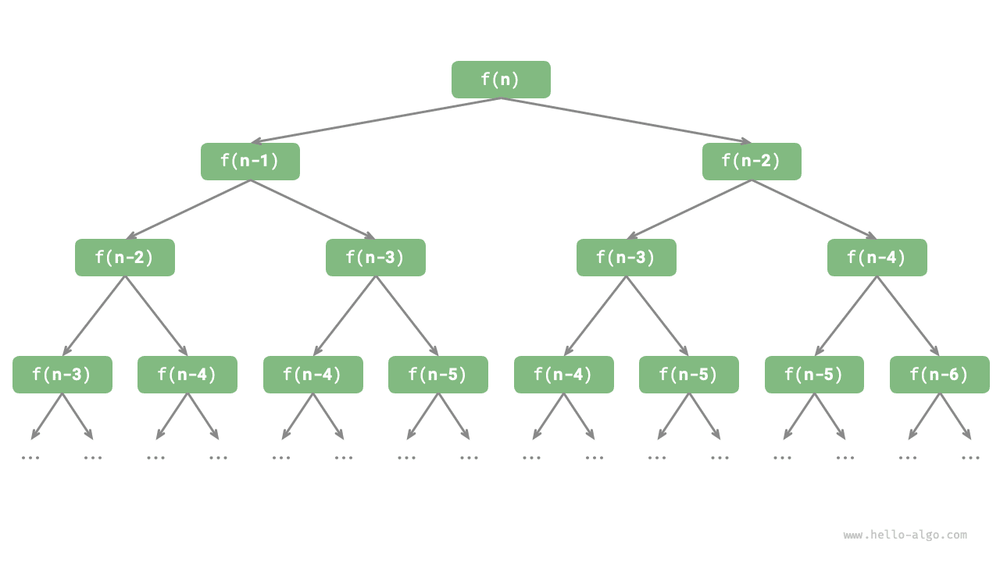

# Lặp và đệ quy

Trong giải thuật, việc thực thi lặp đi lặp lại một tác vụ là điều rất phổ biến và có liên hệ chặt chẽ với phân tích độ phức tạp. Vì vậy, trước khi giới thiệu độ phức tạp thời gian và độ phức tạp không gian, trước tiên chúng ta hãy tìm hiểu cách triển khai việc thực thi tác vụ lặp lại trong chương trình, cụ thể là hai cấu trúc điều khiển chương trình cơ bản: lặp và đệ quy.

## Lặp

<u>Lặp</u> là một cấu trúc điều khiển dùng để thực thi lặp đi lặp lại một tác vụ. Trong lặp, chương trình thực thi lặp lại một đoạn mã dưới một số điều kiện nhất định cho đến khi các điều kiện đó không còn được thỏa mãn nữa.

### Vòng lặp for

Vòng lặp `for` là một trong những dạng lặp phổ biến nhất, **phù hợp khi số lần lặp đã biết trước**.

Hàm dưới đây triển khai phép tính tổng $1 + 2 + \dots + n$ bằng vòng lặp `for`, với kết quả được lưu trong biến `res`. Lưu ý rằng trong Python, `range(a, b)` tương ứng với một khoảng "đóng trái, mở phải", với phạm vi duyệt là $a, a + 1, \dots, b-1$:

```src
[file]{iteration}-[class]{}-[func]{for_loop}
```

Hình dưới đây thể hiện lưu đồ của hàm tính tổng này.


Số lượng thao tác trong hàm tính tổng này tỷ lệ thuận với kích thước dữ liệu đầu vào $n$, hay nói cách khác có "quan hệ tuyến tính". Trên thực tế, **độ phức tạp thời gian mô tả chính xác "quan hệ tuyến tính" này**. Nội dung liên quan sẽ được giới thiệu chi tiết ở phần tiếp theo.

### Vòng lặp while

Tương tự vòng lặp `for`, vòng lặp `while` cũng là một cách để triển khai lặp. Trong vòng lặp `while`, chương trình kiểm tra điều kiện ở mỗi vòng; nếu điều kiện đúng, nó tiếp tục thực thi, ngược lại thì kết thúc vòng lặp.

Dưới đây ta dùng vòng lặp `while` để triển khai phép tính tổng $1 + 2 + \dots + n$:

```src
[file]{iteration}-[class]{}-[func]{while_loop}
```

**Vòng lặp `while` linh hoạt hơn vòng lặp `for`**. Trong vòng lặp `while`, ta có thể tự do thiết kế bước khởi tạo và cập nhật của biến điều kiện.

Ví dụ, trong đoạn mã dưới đây, biến điều kiện $i$ được cập nhật hai lần mỗi vòng, điều này không thuận tiện để triển khai bằng vòng lặp `for`:

```src
[file]{iteration}-[class]{}-[func]{while_loop_ii}
```

Nhìn chung, **vòng lặp `for` có mã nguồn gọn gàng hơn, trong khi vòng lặp `while` linh hoạt hơn**; cả hai đều có thể triển khai cấu trúc lặp. Việc chọn cách nào nên dựa trên yêu cầu của từng bài toán cụ thể.

### Vòng lặp lồng nhau

Ta có thể lồng một cấu trúc vòng lặp bên trong một cấu trúc vòng lặp khác. Dưới đây là ví dụ sử dụng vòng lặp `for`:

```src
[file]{iteration}-[class]{}-[func]{nested_for_loop}
```

Hình dưới đây thể hiện lưu đồ của vòng lặp lồng nhau này.


Trong trường hợp này, số lượng thao tác của hàm tỷ lệ thuận với $n^2$, hay nói cách khác thời gian chạy của giải thuật có "quan hệ bậc hai" với kích thước dữ liệu đầu vào $n$.

Ta có thể tiếp tục thêm các tầng lặp lồng nhau, mỗi tầng lồng thêm có thể được xem như tăng thêm một chiều, nâng độ phức tạp thời gian lên "quan hệ bậc ba", "quan hệ bậc bốn", và cứ thế tiếp tục.

## Đệ quy

<u>Đệ quy</u> là một chiến lược giải thuật giải quyết bài toán bằng cách cho một hàm tự gọi lại chính nó. Nó chủ yếu gồm hai giai đoạn.

1. **Đi xuống**: Chương trình liên tục tự gọi lại chính nó ở tầng sâu hơn, thường truyền vào các tham số nhỏ hơn hoặc đơn giản hơn, cho đến khi đạt tới một "điều kiện dừng".
2. **Đi lên**: Sau khi kích hoạt "điều kiện dừng", chương trình trả về theo từng tầng từ hàm đệ quy sâu nhất, tổng hợp kết quả của từng tầng.

Xét từ góc độ triển khai, mã đệ quy chủ yếu gồm ba yếu tố.

1. **Điều kiện dừng**: Dùng để xác định khi nào chuyển từ "đi xuống" sang "đi lên".
2. **Lệnh gọi đệ quy**: Tương ứng với "đi xuống", trong đó hàm tự gọi lại chính nó, thường với các tham số nhỏ hơn hoặc đơn giản hơn.
3. **Trả về kết quả**: Tương ứng với "đi lên", trả kết quả của tầng đệ quy hiện tại về tầng trước đó.

Hãy quan sát đoạn mã dưới đây. Ta chỉ cần gọi hàm `recur(n)` để hoàn thành phép tính $1 + 2 + \dots + n$:

```src
[file]{recursion}-[class]{}-[func]{recur}
```

Hình dưới đây thể hiện quá trình đệ quy của hàm này.


Mặc dù xét về mặt tính toán, lặp và đệ quy có thể đạt được kết quả giống nhau, **chúng lại đại diện cho hai hệ hình (paradigm) hoàn toàn khác nhau trong việc tư duy và giải quyết bài toán**.

- **Lặp**: Giải quyết bài toán theo hướng "từ dưới lên". Bắt đầu từ những bước cơ bản nhất, các bước này sau đó được thực thi hoặc tích lũy lặp đi lặp lại cho đến khi hoàn thành tác vụ.
- **Đệ quy**: Giải quyết bài toán theo hướng "từ trên xuống". Bài toán gốc được phân rã thành các bài toán con nhỏ hơn có cùng dạng với bài toán gốc. Các bài toán con này tiếp tục được phân rã thành những bài toán con nhỏ hơn nữa cho đến khi đạt tới trường hợp cơ sở (nơi lời giải đã được biết).

Lấy hàm tính tổng ở trên làm ví dụ, đặt bài toán là $f(n) = 1 + 2 + \dots + n$.

- **Lặp**: Mô phỏng quá trình tính tổng trong một vòng lặp, duyệt từ $1$ đến $n$, thực hiện phép cộng ở mỗi vòng để thu được $f(n)$.
- **Đệ quy**: Phân rã bài toán thành bài toán con $f(n) = n + f(n-1)$, liên tục phân rã (đệ quy) cho đến khi dừng lại ở trường hợp cơ sở $f(1) = 1$.

### Ngăn xếp lệnh gọi

Mỗi khi một hàm đệ quy tự gọi lại chính nó, hệ thống sẽ cấp phát bộ nhớ cho lần gọi mới này để lưu các biến cục bộ, địa chỉ gọi và các thông tin khác. Điều này dẫn đến hai hệ quả.

- Dữ liệu ngữ cảnh của hàm được lưu trong một vùng bộ nhớ gọi là "không gian khung ngăn xếp", vùng này không được giải phóng cho đến khi hàm trả về. Do đó, **đệ quy thường tiêu tốn nhiều bộ nhớ hơn lặp**.
- Các lệnh gọi hàm đệ quy phát sinh thêm chi phí. **Vì vậy, đệ quy thường có hiệu suất thời gian kém hơn vòng lặp**.

Như minh họa trong hình dưới đây, trước khi điều kiện dừng được kích hoạt, có $n$ hàm đệ quy chưa trả về tồn tại đồng thời, với **độ sâu đệ quy là $n$**.


Trong thực tế, độ sâu đệ quy mà các ngôn ngữ lập trình cho phép thường bị giới hạn, và đệ quy quá sâu có thể dẫn đến lỗi tràn ngăn xếp (stack overflow).

### Đệ quy đuôi

Điều thú vị là, **nếu một hàm thực hiện lệnh gọi đệ quy như là bước cuối cùng trước khi trả về**, trình biên dịch hoặc trình thông dịch có thể tối ưu hóa nó để hiệu suất không gian tương đương với lặp. Trường hợp này được gọi là <u>đệ quy đuôi</u>.

- **Đệ quy thông thường**: Khi một hàm trả về tầng trước đó, nó cần tiếp tục thực thi mã, nên hệ thống cần lưu lại ngữ cảnh của lệnh gọi ở tầng trước.
- **Đệ quy đuôi**: Lệnh gọi đệ quy là thao tác cuối cùng trước khi hàm trả về, nghĩa là sau khi trả về tầng trước, không cần tiếp tục thực thi thao tác nào khác, nên hệ thống không cần lưu ngữ cảnh của hàm ở tầng trước.

Lấy phép tính $1 + 2 + \dots + n$ làm ví dụ, ta có thể đặt biến kết quả `res` làm tham số của hàm để triển khai đệ quy đuôi:

```src
[file]{recursion}-[class]{}-[func]{tail_recur}
```

Quá trình thực thi của đệ quy đuôi được thể hiện trong hình dưới đây. So sánh giữa đệ quy thông thường và đệ quy đuôi, phép cộng được thực hiện tại các thời điểm khác nhau.

- **Đệ quy thông thường**: Phép cộng được thực hiện trong quá trình "đi lên", đòi hỏi thêm một phép cộng sau mỗi lần một tầng trả về.
- **Đệ quy đuôi**: Phép cộng được thực hiện trong quá trình "đi xuống"; quá trình "đi lên" chỉ cần trả về theo từng tầng.


!!! tip

    Xin lưu ý rằng nhiều trình biên dịch hoặc trình thông dịch không hỗ trợ tối ưu hóa đệ quy đuôi. Ví dụ, Python mặc định không hỗ trợ tối ưu hóa đệ quy đuôi, nên dù một hàm có ở dạng đệ quy đuôi, nó vẫn có thể gặp phải vấn đề tràn ngăn xếp.

### Cây đệ quy

Khi xử lý các bài toán giải thuật liên quan đến "chia để trị" (divide and conquer), đệ quy thường mang lại cách tiếp cận trực quan hơn và mã nguồn dễ đọc hơn so với lặp. Lấy "dãy Fibonacci" làm ví dụ.

!!! question

    Cho một dãy Fibonacci $0, 1, 1, 2, 3, 5, 8, 13, \dots$, tìm số thứ $n$ trong dãy.

Đặt số thứ $n$ của dãy Fibonacci là $f(n)$. Ta có thể dễ dàng rút ra hai kết luận.

- Hai số đầu tiên của dãy là $f(1) = 0$ và $f(2) = 1$.
- Mỗi số trong dãy là tổng của hai số liền trước, tức là $f(n) = f(n - 1) + f(n - 2)$.

Dựa theo hệ thức truy hồi để thực hiện các lệnh gọi đệ quy, với hai số đầu tiên làm điều kiện dừng, ta có thể viết mã đệ quy. Gọi `fib(n)` sẽ cho ta số thứ $n$ của dãy Fibonacci:

```src
[file]{recursion}-[class]{}-[func]{fib}
```

Quan sát đoạn mã trên, ta thấy có hai lệnh gọi đệ quy được thực hiện bên trong hàm, **nghĩa là một lệnh gọi tạo ra hai nhánh gọi**. Như minh họa trong hình dưới đây, việc gọi đệ quy lặp đi lặp lại này cuối cùng tạo ra một <u>cây đệ quy</u> với $n$ tầng.



Về bản chất, đệ quy thể hiện hệ hình "phân rã bài toán thành các bài toán con nhỏ hơn", và chiến lược chia để trị này đóng vai trò then chốt.

- Xét từ góc độ giải thuật, nhiều chiến lược giải thuật quan trọng như tìm kiếm, sắp xếp, quay lui, chia để trị, và quy hoạch động đều áp dụng trực tiếp hoặc gián tiếp cách tư duy này.
- Xét từ góc độ cấu trúc dữ liệu, đệ quy vốn thích hợp để xử lý các bài toán liên quan đến danh sách liên kết, cây, và đồ thị, vì chúng rất phù hợp để phân tích bằng tư duy chia để trị.

## So sánh hai cách tiếp cận

Tổng hợp lại những nội dung trên, như thể hiện trong bảng dưới đây, lặp và đệ quy khác nhau về cách triển khai, hiệu suất và khả năng áp dụng.

<p align="center"> Bảng <id> &nbsp; So sánh đặc điểm của lặp và đệ quy </p>

|                | Lặp                                                | Đệ quy                                                                              |
| -------------- | -------------------------------------------------------- | -------------------------------------------------------------------------------------- |
| Cách triển khai | Cấu trúc vòng lặp                                           | Hàm tự gọi lại chính nó                                                                  |
| Hiệu suất thời gian | Thường hiệu quả hơn, không có chi phí gọi hàm      | Mỗi lệnh gọi hàm phát sinh thêm chi phí                                                     |
| Sử dụng bộ nhớ   | Thường sử dụng một lượng bộ nhớ cố định              | Các lệnh gọi hàm tích lũy có thể sử dụng lượng lớn không gian khung ngăn xếp                 |
| Bài toán phù hợp | Phù hợp với các tác vụ lặp đơn giản, mã nguồn trực quan và dễ đọc | Phù hợp với việc phân rã bài toán con, như cây, đồ thị, chia để trị, quay lui, v.v., với cấu trúc mã nguồn ngắn gọn và rõ ràng |

!!! tip

    Nếu bạn thấy nội dung sau đây khó hiểu, bạn có thể quay lại xem sau khi đã đọc chương "Ngăn xếp".

Mối quan hệ nội tại giữa lặp và đệ quy là gì? Lấy hàm đệ quy ở trên làm ví dụ, phép cộng được thực hiện trong giai đoạn "đi lên" của đệ quy. Điều này có nghĩa là hàm được gọi đầu tiên thực ra lại hoàn thành phép cộng của nó sau cùng, **và cơ chế hoạt động này tương tự nguyên lý "vào sau ra trước" (last-in, first-out) của ngăn xếp**.

Trên thực tế, các thuật ngữ đệ quy như "ngăn xếp lệnh gọi" và "không gian khung ngăn xếp" đã ngầm gợi ý mối liên hệ chặt chẽ giữa đệ quy và ngăn xếp.

1. **Đi xuống**: Khi một hàm được gọi, hệ thống cấp phát một khung ngăn xếp mới trên "ngăn xếp lệnh gọi" cho hàm đó để lưu các biến cục bộ, tham số, địa chỉ trả về và các dữ liệu khác của hàm.
2. **Đi lên**: Khi hàm hoàn thành thực thi và trả về, khung ngăn xếp tương ứng bị gỡ bỏ khỏi "ngăn xếp lệnh gọi", khôi phục lại môi trường thực thi của hàm trước đó.

Do đó, **ta có thể dùng một ngăn xếp tường minh để mô phỏng hành vi của ngăn xếp lệnh gọi**, từ đó chuyển đổi đệ quy thành dạng lặp:

```src
[file]{recursion}-[class]{}-[func]{for_loop_recur}
```

Quan sát đoạn mã trên, khi đệ quy được chuyển thành lặp, mã nguồn trở nên phức tạp hơn. Mặc dù lặp và đệ quy có thể chuyển đổi qua lại lẫn nhau trong nhiều trường hợp, việc làm điều đó có thể không đáng, vì hai lý do sau.

- Mã nguồn sau khi chuyển đổi có thể khó hiểu hơn và kém dễ đọc hơn.
- Với một số bài toán phức tạp, việc mô phỏng hành vi của ngăn xếp lệnh gọi hệ thống có thể rất khó khăn.

Tóm lại, **việc lựa chọn giữa lặp và đệ quy phụ thuộc vào bản chất của từng bài toán cụ thể**. Trong thực hành lập trình, điều quan trọng là phải cân nhắc ưu nhược điểm của cả hai và chọn phương pháp phù hợp dựa trên ngữ cảnh.
