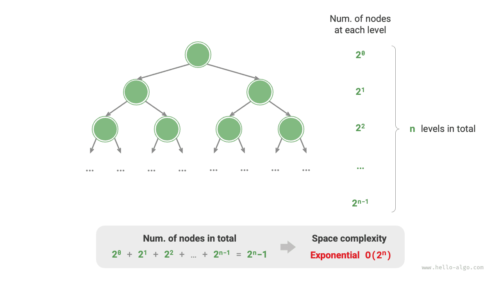

# Độ phức tạp không gian

<u>Độ phức tạp không gian</u> đo lường xu hướng tăng trưởng của dung lượng bộ nhớ mà một giải thuật chiếm dụng khi kích thước dữ liệu tăng lên. Khái niệm này rất giống với độ phức tạp thời gian, chỉ khác ở chỗ "thời gian chạy" được thay bằng "dung lượng bộ nhớ chiếm dụng".

## Không gian liên quan đến giải thuật

Bộ nhớ mà một giải thuật sử dụng trong quá trình thực thi chủ yếu bao gồm các loại sau.

- **Không gian đầu vào**: Dùng để lưu trữ dữ liệu đầu vào của giải thuật.
- **Không gian tạm thời**: Dùng để lưu trữ các biến, đối tượng, ngữ cảnh hàm, và các dữ liệu khác trong quá trình thực thi giải thuật.
- **Không gian đầu ra**: Dùng để lưu trữ dữ liệu đầu ra của giải thuật.

Thông thường, phạm vi thống kê độ phức tạp không gian là "không gian tạm thời" cộng với "không gian đầu ra".

Không gian tạm thời có thể được chia thành ba phần.

- **Dữ liệu tạm thời**: Dùng để lưu các hằng số, biến, đối tượng, v.v., khác nhau trong quá trình thực thi giải thuật.
- **Không gian khung ngăn xếp**: Dùng để lưu dữ liệu ngữ cảnh của các hàm được gọi. Hệ thống tạo một khung ngăn xếp ở đỉnh ngăn xếp mỗi khi một hàm được gọi, và không gian khung ngăn xếp được giải phóng sau khi hàm trả về.
- **Không gian lệnh**: Dùng để lưu các lệnh chương trình đã biên dịch, thường bị bỏ qua trong thống kê thực tế.

Khi phân tích độ phức tạp không gian của một chương trình, **chúng ta thường xem xét ba phần: dữ liệu tạm thời, không gian khung ngăn xếp, và dữ liệu đầu ra**, như thể hiện trong hình dưới đây.


Đoạn mã liên quan như sau:

=== "Python"

    ```python title=""
    class Node:
        """Lớp"""
        def __init__(self, x: int):
            self.val: int = x              # Giá trị của nút
            self.next: Node | None = None  # Tham chiếu đến nút tiếp theo

    def function() -> int:
        """Hàm"""
        # Thực hiện một số thao tác...
        return 0

    def algorithm(n) -> int:  # Dữ liệu đầu vào
        A = 0                 # Dữ liệu tạm thời (hằng số, thường được biểu diễn bằng chữ hoa)
        b = 0                 # Dữ liệu tạm thời (biến)
        node = Node(0)        # Dữ liệu tạm thời (đối tượng)
        c = function()        # Không gian khung ngăn xếp (lời gọi hàm)
        return A + b + c      # Dữ liệu đầu ra
    ```

=== "C++"

    ```cpp title=""
    /* Cấu trúc */
    struct Node {
        int val;
        Node *next;
        Node(int x) : val(x), next(nullptr) {}
    };

    /* Hàm */
    int func() {
        // Thực hiện một số thao tác...
        return 0;
    }

    int algorithm(int n) {        // Dữ liệu đầu vào
        const int a = 0;          // Dữ liệu tạm thời (hằng số)
        int b = 0;                // Dữ liệu tạm thời (biến)
        Node* node = new Node(0); // Dữ liệu tạm thời (đối tượng)
        int c = func();           // Không gian khung ngăn xếp (lời gọi hàm)
        return a + b + c;         // Dữ liệu đầu ra
    }
    ```

=== "Java"

    ```java title=""
    /* Lớp */
    class Node {
        int val;
        Node next;
        Node(int x) { val = x; }
    }

    /* Hàm */
    int function() {
        // Thực hiện một số thao tác...
        return 0;
    }

    int algorithm(int n) {        // Dữ liệu đầu vào
        final int a = 0;          // Dữ liệu tạm thời (hằng số)
        int b = 0;                // Dữ liệu tạm thời (biến)
        Node node = new Node(0);  // Dữ liệu tạm thời (đối tượng)
        int c = function();       // Không gian khung ngăn xếp (lời gọi hàm)
        return a + b + c;         // Dữ liệu đầu ra
    }
    ```

=== "C#"

    ```csharp title=""
    /* Lớp */
    class Node(int x) {
        int val = x;
        Node next;
    }

    /* Hàm */
    int Function() {
        // Thực hiện một số thao tác...
        return 0;
    }

    int Algorithm(int n) {        // Dữ liệu đầu vào
        const int a = 0;          // Dữ liệu tạm thời (hằng số)
        int b = 0;                // Dữ liệu tạm thời (biến)
        Node node = new(0);       // Dữ liệu tạm thời (đối tượng)
        int c = Function();       // Không gian khung ngăn xếp (lời gọi hàm)
        return a + b + c;         // Dữ liệu đầu ra
    }
    ```

=== "Go"

    ```go title=""
    /* Cấu trúc */
    type node struct {
        val  int
        next *node
    }

    /* Tạo cấu trúc node */
    func newNode(val int) *node {
        return &node{val: val}
    }

    /* Hàm */
    func function() int {
        // Thực hiện một số thao tác...
        return 0
    }

    func algorithm(n int) int { // Dữ liệu đầu vào
        const a = 0             // Dữ liệu tạm thời (hằng số)
        b := 0                  // Dữ liệu tạm thời (biến)
        newNode(0)              // Dữ liệu tạm thời (đối tượng)
        c := function()         // Không gian khung ngăn xếp (lời gọi hàm)
        return a + b + c        // Dữ liệu đầu ra
    }
    ```

=== "Swift"

    ```swift title=""
    /* Lớp */
    class Node {
        var val: Int
        var next: Node?

        init(x: Int) {
            val = x
        }
    }

    /* Hàm */
    func function() -> Int {
        // Thực hiện một số thao tác...
        return 0
    }

    func algorithm(n: Int) -> Int { // Dữ liệu đầu vào
        let a = 0             // Dữ liệu tạm thời (hằng số)
        var b = 0             // Dữ liệu tạm thời (biến)
        let node = Node(x: 0) // Dữ liệu tạm thời (đối tượng)
        let c = function()    // Không gian khung ngăn xếp (lời gọi hàm)
        return a + b + c      // Dữ liệu đầu ra
    }
    ```

=== "JS"

    ```javascript title=""
    /* Lớp */
    class Node {
        val;
        next;
        constructor(val) {
            this.val = val === undefined ? 0 : val; // Giá trị của nút
            this.next = null;                       // Tham chiếu đến nút tiếp theo
        }
    }

    /* Hàm */
    function constFunc() {
        // Thực hiện một số thao tác
        return 0;
    }

    function algorithm(n) {       // Dữ liệu đầu vào
        const a = 0;              // Dữ liệu tạm thời (hằng số)
        let b = 0;                // Dữ liệu tạm thời (biến)
        const node = new Node(0); // Dữ liệu tạm thời (đối tượng)
        const c = constFunc();    // Không gian khung ngăn xếp (lời gọi hàm)
        return a + b + c;         // Dữ liệu đầu ra
    }
    ```

=== "TS"

    ```typescript title=""
    /* Lớp */
    class Node {
        val: number;
        next: Node | null;
        constructor(val?: number) {
            this.val = val === undefined ? 0 : val; // Giá trị của nút
            this.next = null;                       // Tham chiếu đến nút tiếp theo
        }
    }

    /* Hàm */
    function constFunc(): number {
        // Thực hiện một số thao tác
        return 0;
    }

    function algorithm(n: number): number { // Dữ liệu đầu vào
        const a = 0;                        // Dữ liệu tạm thời (hằng số)
        let b = 0;                          // Dữ liệu tạm thời (biến)
        const node = new Node(0);           // Dữ liệu tạm thời (đối tượng)
        const c = constFunc();              // Không gian khung ngăn xếp (lời gọi hàm)
        return a + b + c;                   // Dữ liệu đầu ra
    }
    ```

=== "Dart"

    ```dart title=""
    /* Lớp */
    class Node {
      int val;
      Node next;
      Node(this.val, [this.next]);
    }

    /* Hàm */
    int function() {
      // Thực hiện một số thao tác...
      return 0;
    }

    int algorithm(int n) {  // Dữ liệu đầu vào
      const int a = 0;      // Dữ liệu tạm thời (hằng số)
      int b = 0;            // Dữ liệu tạm thời (biến)
      Node node = Node(0);  // Dữ liệu tạm thời (đối tượng)
      int c = function();   // Không gian khung ngăn xếp (lời gọi hàm)
      return a + b + c;     // Dữ liệu đầu ra
    }
    ```

=== "Rust"

    ```rust title=""
    use std::rc::Rc;
    use std::cell::RefCell;

    /* Cấu trúc */
    struct Node {
        val: i32,
        next: Option<Rc<RefCell<Node>>>,
    }

    /* Tạo cấu trúc Node */
    impl Node {
        fn new(val: i32) -> Self {
            Self { val: val, next: None }
        }
    }

    /* Hàm */
    fn function() -> i32 {
        // Thực hiện một số thao tác...
        return 0;
    }

    fn algorithm(n: i32) -> i32 {       // Dữ liệu đầu vào
        const a: i32 = 0;               // Dữ liệu tạm thời (hằng số)
        let mut b = 0;                  // Dữ liệu tạm thời (biến)
        let node = Node::new(0);        // Dữ liệu tạm thời (đối tượng)
        let c = function();             // Không gian khung ngăn xếp (lời gọi hàm)
        return a + b + c;               // Dữ liệu đầu ra
    }
    ```

=== "C"

    ```c title=""
    /* Hàm */
    int func() {
        // Thực hiện một số thao tác...
        return 0;
    }

    int algorithm(int n) { // Dữ liệu đầu vào
        const int a = 0;   // Dữ liệu tạm thời (hằng số)
        int b = 0;         // Dữ liệu tạm thời (biến)
        int c = func();    // Không gian khung ngăn xếp (lời gọi hàm)
        return a + b + c;  // Dữ liệu đầu ra
    }
    ```

=== "Kotlin"

    ```kotlin title=""
    /* Lớp */
    class Node(var _val: Int) {
        var next: Node? = null
    }

    /* Hàm */
    fun function(): Int {
        // Thực hiện một số thao tác...
        return 0
    }

    fun algorithm(n: Int): Int { // Dữ liệu đầu vào
        val a = 0                // Dữ liệu tạm thời (hằng số)
        var b = 0                // Dữ liệu tạm thời (biến)
        val node = Node(0)       // Dữ liệu tạm thời (đối tượng)
        val c = function()       // Không gian khung ngăn xếp (lời gọi hàm)
        return a + b + c         // Dữ liệu đầu ra
    }
    ```

=== "Ruby"

    ```ruby title=""
    ### Lớp ###
    class Node
        attr_accessor :val      # Giá trị của nút
        attr_accessor :next     # Tham chiếu đến nút tiếp theo

        def initialize(x)
            @val = x
        end
    end

    ### Hàm ###
    def function
        # Thực hiện một số thao tác...
        0
    end

    ### Giải thuật ###
    def algorithm(n)        # Dữ liệu đầu vào
        a = 0               # Dữ liệu tạm thời (hằng số)
        b = 0               # Dữ liệu tạm thời (biến)
        node = Node.new(0)  # Dữ liệu tạm thời (đối tượng)
        c = function        # Không gian khung ngăn xếp (lời gọi hàm)
        a + b + c           # Dữ liệu đầu ra
    end
    ```

## Phương pháp tính toán

Phương pháp tính toán độ phức tạp không gian gần giống với độ phức tạp thời gian, chỉ khác ở chỗ đại lượng ta đo lường thay đổi từ "số lượng thao tác" sang "dung lượng bộ nhớ sử dụng".

Khác với độ phức tạp thời gian, **chúng ta thường chỉ quan tâm đến độ phức tạp không gian trong trường hợp xấu nhất**. Điều này là do dung lượng bộ nhớ là một yêu cầu bắt buộc, và chúng ta phải đảm bảo có đủ bộ nhớ dự trữ cho mọi dữ liệu đầu vào.

Hãy quan sát đoạn mã dưới đây. Ở đây, "trường hợp xấu nhất" trong độ phức tạp không gian trường hợp xấu nhất mang hai ý nghĩa.

1. **Dựa trên dữ liệu đầu vào xấu nhất**: Khi $n < 10$, độ phức tạp không gian là $O(1)$; nhưng khi $n > 10$, mảng `nums` được khởi tạo chiếm không gian $O(n)$, do đó độ phức tạp không gian trường hợp xấu nhất là $O(n)$.
2. **Dựa trên đỉnh bộ nhớ trong quá trình thực thi giải thuật**: Ví dụ, trước khi thực thi dòng cuối cùng, chương trình chiếm không gian $O(1)$; khi khởi tạo mảng `nums`, chương trình chiếm không gian $O(n)$, do đó độ phức tạp không gian trường hợp xấu nhất là $O(n)$.

=== "Python"

    ```python title=""
    def algorithm(n: int):
        a = 0               # O(1)
        b = [0] * 10000     # O(1)
        if n > 10:
            nums = [0] * n  # O(n)
    ```

=== "C++"

    ```cpp title=""
    void algorithm(int n) {
        int a = 0;               // O(1)
        vector<int> b(10000);    // O(1)
        if (n > 10)
            vector<int> nums(n); // O(n)
    }
    ```

=== "Java"

    ```java title=""
    void algorithm(int n) {
        int a = 0;                   // O(1)
        int[] b = new int[10000];    // O(1)
        if (n > 10)
            int[] nums = new int[n]; // O(n)
    }
    ```

=== "C#"

    ```csharp title=""
    void Algorithm(int n) {
        int a = 0;                   // O(1)
        int[] b = new int[10000];    // O(1)
        if (n > 10) {
            int[] nums = new int[n]; // O(n)
        }
    }
    ```

=== "Go"

    ```go title=""
    func algorithm(n int) {
        a := 0                      // O(1)
        b := make([]int, 10000)     // O(1)
        var nums []int
        if n > 10 {
            nums := make([]int, n)  // O(n)
        }
        fmt.Println(a, b, nums)
    }
    ```

=== "Swift"

    ```swift title=""
    func algorithm(n: Int) {
        let a = 0 // O(1)
        let b = Array(repeating: 0, count: 10000) // O(1)
        if n > 10 {
            let nums = Array(repeating: 0, count: n) // O(n)
        }
    }
    ```

=== "JS"

    ```javascript title=""
    function algorithm(n) {
        const a = 0;                   // O(1)
        const b = new Array(10000);    // O(1)
        if (n > 10) {
            const nums = new Array(n); // O(n)
        }
    }
    ```

=== "TS"

    ```typescript title=""
    function algorithm(n: number): void {
        const a = 0;                   // O(1)
        const b = new Array(10000);    // O(1)
        if (n > 10) {
            const nums = new Array(n); // O(n)
        }
    }
    ```

=== "Dart"

    ```dart title=""
    void algorithm(int n) {
      int a = 0;                            // O(1)
      List<int> b = List.filled(10000, 0);  // O(1)
      if (n > 10) {
        List<int> nums = List.filled(n, 0); // O(n)
      }
    }
    ```

=== "Rust"

    ```rust title=""
    fn algorithm(n: i32) {
        let a = 0;                              // O(1)
        let b = [0; 10000];                     // O(1)
        if n > 10 {
            let nums = vec![0; n as usize];     // O(n)
        }
    }
    ```

=== "C"

    ```c title=""
    void algorithm(int n) {
        int a = 0;               // O(1)
        int b[10000];            // O(1)
        if (n > 10)
            int nums[n] = {0};   // O(n)
    }
    ```

=== "Kotlin"

    ```kotlin title=""
    fun algorithm(n: Int) {
        val a = 0                    // O(1)
        val b = IntArray(10000)      // O(1)
        if (n > 10) {
            val nums = IntArray(n)   // O(n)
        }
    }
    ```

=== "Ruby"

    ```ruby title=""
    def algorithm(n)
        a = 0                           # O(1)
        b = Array.new(10000)            # O(1)
        nums = Array.new(n) if n > 10   # O(n)
    end
    ```

**Trong các hàm đệ quy, cần phải tính đến không gian khung ngăn xếp**. Hãy quan sát đoạn mã dưới đây:

=== "Python"

    ```python title=""
    def function() -> int:
        # Thực hiện một số thao tác
        return 0

    def loop(n: int):
        """Vòng lặp có độ phức tạp không gian là O(1)"""
        for _ in range(n):
            function()

    def recur(n: int):
        """Đệ quy có độ phức tạp không gian là O(n)"""
        if n == 1:
            return
        return recur(n - 1)
    ```

=== "C++"

    ```cpp title=""
    int func() {
        // Thực hiện một số thao tác
        return 0;
    }
    /* Vòng lặp có độ phức tạp không gian là O(1) */
    void loop(int n) {
        for (int i = 0; i < n; i++) {
            func();
        }
    }
    /* Đệ quy có độ phức tạp không gian là O(n) */
    void recur(int n) {
        if (n == 1) return;
        recur(n - 1);
    }
    ```

=== "Java"

    ```java title=""
    int function() {
        // Thực hiện một số thao tác
        return 0;
    }
    /* Vòng lặp có độ phức tạp không gian là O(1) */
    void loop(int n) {
        for (int i = 0; i < n; i++) {
            function();
        }
    }
    /* Đệ quy có độ phức tạp không gian là O(n) */
    void recur(int n) {
        if (n == 1) return;
        recur(n - 1);
    }
    ```

=== "C#"

    ```csharp title=""
    int Function() {
        // Thực hiện một số thao tác
        return 0;
    }
    /* Vòng lặp có độ phức tạp không gian là O(1) */
    void Loop(int n) {
        for (int i = 0; i < n; i++) {
            Function();
        }
    }
    /* Đệ quy có độ phức tạp không gian là O(n) */
    int Recur(int n) {
        if (n == 1) return 1;
        return Recur(n - 1);
    }
    ```

=== "Go"

    ```go title=""
    func function() int {
        // Thực hiện một số thao tác
        return 0
    }

    /* Vòng lặp có độ phức tạp không gian là O(1) */
    func loop(n int) {
        for i := 0; i < n; i++ {
            function()
        }
    }

    /* Đệ quy có độ phức tạp không gian là O(n) */
    func recur(n int) {
        if n == 1 {
            return
        }
        recur(n - 1)
    }
    ```

=== "Swift"

    ```swift title=""
    @discardableResult
    func function() -> Int {
        // Thực hiện một số thao tác
        return 0
    }

    /* Vòng lặp có độ phức tạp không gian là O(1) */
    func loop(n: Int) {
        for _ in 0 ..< n {
            function()
        }
    }

    /* Đệ quy có độ phức tạp không gian là O(n) */
    func recur(n: Int) {
        if n == 1 {
            return
        }
        recur(n: n - 1)
    }
    ```

=== "JS"

    ```javascript title=""
    function constFunc() {
        // Thực hiện một số thao tác
        return 0;
    }
    /* Vòng lặp có độ phức tạp không gian là O(1) */
    function loop(n) {
        for (let i = 0; i < n; i++) {
            constFunc();
        }
    }
    /* Đệ quy có độ phức tạp không gian là O(n) */
    function recur(n) {
        if (n === 1) return;
        return recur(n - 1);
    }
    ```

=== "TS"

    ```typescript title=""
    function constFunc(): number {
        // Thực hiện một số thao tác
        return 0;
    }
    /* Vòng lặp có độ phức tạp không gian là O(1) */
    function loop(n: number): void {
        for (let i = 0; i < n; i++) {
            constFunc();
        }
    }
    /* Đệ quy có độ phức tạp không gian là O(n) */
    function recur(n: number): void {
        if (n === 1) return;
        return recur(n - 1);
    }
    ```

=== "Dart"

    ```dart title=""
    int function() {
      // Thực hiện một số thao tác
      return 0;
    }
    /* Vòng lặp có độ phức tạp không gian là O(1) */
    void loop(int n) {
      for (int i = 0; i < n; i++) {
        function();
      }
    }
    /* Đệ quy có độ phức tạp không gian là O(n) */
    void recur(int n) {
      if (n == 1) return;
      recur(n - 1);
    }
    ```

=== "Rust"

    ```rust title=""
    fn function() -> i32 {
        // Thực hiện một số thao tác
        return 0;
    }
    /* Vòng lặp có độ phức tạp không gian là O(1) */
    fn loop(n: i32) {
        for i in 0..n {
            function();
        }
    }
    /* Đệ quy có độ phức tạp không gian là O(n) */
    fn recur(n: i32) {
        if n == 1 {
            return;
        }
        recur(n - 1);
    }
    ```

=== "C"

    ```c title=""
    int func() {
        // Thực hiện một số thao tác
        return 0;
    }
    /* Vòng lặp có độ phức tạp không gian là O(1) */
    void loop(int n) {
        for (int i = 0; i < n; i++) {
            func();
        }
    }
    /* Đệ quy có độ phức tạp không gian là O(n) */
    void recur(int n) {
        if (n == 1) return;
        recur(n - 1);
    }
    ```

=== "Kotlin"

    ```kotlin title=""
    fun function(): Int {
        // Thực hiện một số thao tác
        return 0
    }
    /* Vòng lặp có độ phức tạp không gian là O(1) */
    fun loop(n: Int) {
        for (i in 0..<n) {
            function()
        }
    }
    /* Đệ quy có độ phức tạp không gian là O(n) */
    fun recur(n: Int) {
        if (n == 1) return
        return recur(n - 1)
    }
    ```

=== "Ruby"

    ```ruby title=""
    def function
        # Thực hiện một số thao tác
        0
    end

    ### Vòng lặp có độ phức tạp không gian là O(1) ###
    def loop(n)
        (0...n).each { function }
    end

    ### Đệ quy có độ phức tạp không gian là O(n) ###
    def recur(n)
        return if n == 1
        recur(n - 1)
    end
    ```

Độ phức tạp thời gian của cả hai hàm `loop()` và `recur()` đều là $O(n)$, nhưng độ phức tạp không gian của chúng lại khác nhau.

- Hàm `loop()` gọi `function()` $n$ lần trong một vòng lặp. Ở mỗi lần lặp, `function()` trả về và giải phóng không gian khung ngăn xếp của nó, do đó độ phức tạp không gian vẫn là $O(1)$.
- Hàm đệ quy `recur()` có $n$ thực thể `recur()` chưa trả về tồn tại đồng thời trong quá trình thực thi, do đó chiếm không gian khung ngăn xếp $O(n)$.

## Các loại thường gặp

Giả sử kích thước dữ liệu đầu vào là $n$. Hình dưới đây thể hiện các loại độ phức tạp không gian thường gặp (được sắp xếp từ thấp đến cao).

$$
\begin{aligned}
& O(1) < O(\log n) < O(n) < O(n^2) < O(2^n) \newline
& \text{Hằng số} < \text{Logarit} < \text{Tuyến tính} < \text{Bình phương} < \text{Mũ}
\end{aligned}
$$


### Bậc hằng số $O(1)$

Bậc hằng số thường gặp ở các hằng số, biến, và đối tượng có số lượng không phụ thuộc vào kích thước dữ liệu đầu vào $n$.

Cần lưu ý rằng bộ nhớ chiếm dụng bởi việc khởi tạo biến hoặc gọi hàm trong một vòng lặp sẽ được giải phóng khi bước sang lần lặp tiếp theo, do đó không tích lũy không gian, và độ phức tạp không gian vẫn là $O(1)$:

```src
[file]{space_complexity}-[class]{}-[func]{constant}
```

### Bậc tuyến tính $O(n)$

Bậc tuyến tính thường gặp ở mảng, danh sách liên kết, ngăn xếp, hàng đợi, v.v., nơi số lượng phần tử tỷ lệ thuận với $n$:

```src
[file]{space_complexity}-[class]{}-[func]{linear}
```

Như thể hiện trong hình dưới đây, độ sâu đệ quy của hàm này là $n$, nghĩa là có $n$ hàm `linear_recur()` chưa trả về tồn tại đồng thời, sử dụng không gian khung ngăn xếp $O(n)$:

```src
[file]{space_complexity}-[class]{}-[func]{linear_recur}
```


### Bậc bình phương $O(n^2)$

Bậc bình phương thường gặp ở ma trận và đồ thị, nơi số lượng phần tử có quan hệ bình phương với $n$:

```src
[file]{space_complexity}-[class]{}-[func]{quadratic}
```

Như thể hiện trong hình dưới đây, độ sâu đệ quy của hàm này là $n$, và một mảng được khởi tạo trong mỗi lần gọi đệ quy với độ dài lần lượt là $n$, $n-1$, $\dots$, $2$, $1$, với độ dài trung bình là $n / 2$, do đó chiếm tổng cộng không gian $O(n^2)$:

```src
[file]{space_complexity}-[class]{}-[func]{quadratic_recur}
```


### Bậc mũ $O(2^n)$

Bậc mũ thường gặp ở cây nhị phân. Hãy quan sát hình dưới đây: một "cây nhị phân đầy đủ" có $n$ tầng sẽ có $2^n - 1$ nút, chiếm không gian $O(2^n)$:

```src
[file]{space_complexity}-[class]{}-[func]{build_tree}
```



### Bậc logarit $O(\log n)$

Bậc logarit thường gặp ở các giải thuật chia để trị. Ví dụ, sắp xếp trộn (merge sort): với một mảng đầu vào có độ dài $n$, mỗi lần đệ quy chia mảng làm đôi tại điểm giữa, tạo thành một cây đệ quy có chiều cao $\log n$, sử dụng không gian khung ngăn xếp $O(\log n)$.

Một ví dụ khác là chuyển đổi một số thành chuỗi. Với một số nguyên dương $n$, nó có $\lfloor \log_{10} n \rfloor + 1$ chữ số, tức là độ dài chuỗi tương ứng là $\lfloor \log_{10} n \rfloor + 1$, do đó độ phức tạp không gian là $O(\log_{10} n + 1) = O(\log n)$.

## Đánh đổi thời gian lấy không gian

Trong điều kiện lý tưởng, chúng ta mong muốn cả độ phức tạp thời gian lẫn độ phức tạp không gian của một giải thuật đều đạt mức tối ưu. Tuy nhiên, trong thực tế, việc tối ưu hóa đồng thời cả hai loại độ phức tạp thường rất khó khăn.

**Giảm độ phức tạp thời gian thường phải trả giá bằng việc tăng độ phức tạp không gian, và ngược lại**. Việc hy sinh dung lượng bộ nhớ để cải thiện tốc độ thực thi được gọi là "đánh đổi không gian lấy thời gian"; ngược lại được gọi là "đánh đổi thời gian lấy không gian".

Việc lựa chọn cách tiếp cận nào phụ thuộc vào việc chúng ta coi trọng khía cạnh nào hơn. Trong hầu hết các trường hợp, thời gian quý giá hơn không gian, do đó "đánh đổi không gian lấy thời gian" thường là chiến lược phổ biến hơn. Tất nhiên, khi khối lượng dữ liệu rất lớn, việc kiểm soát độ phức tạp không gian cũng rất quan trọng.
