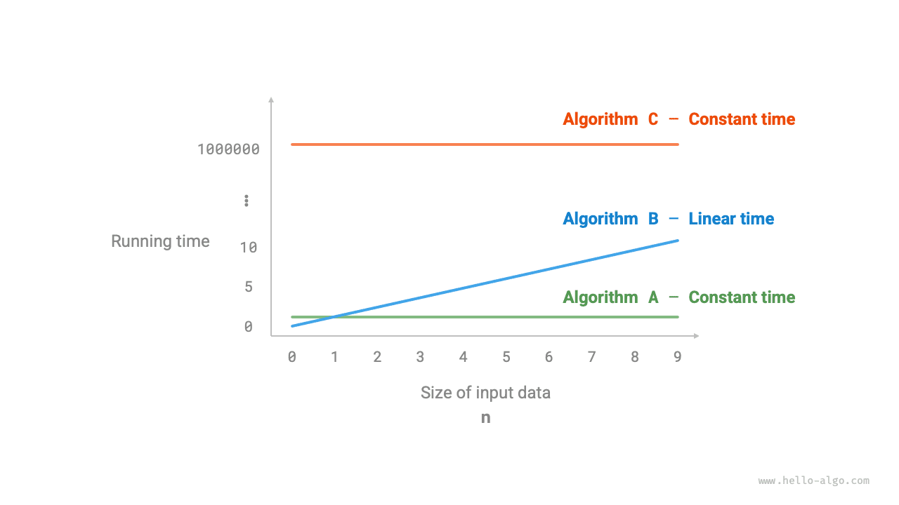
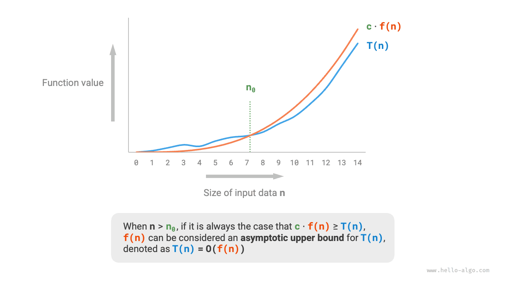
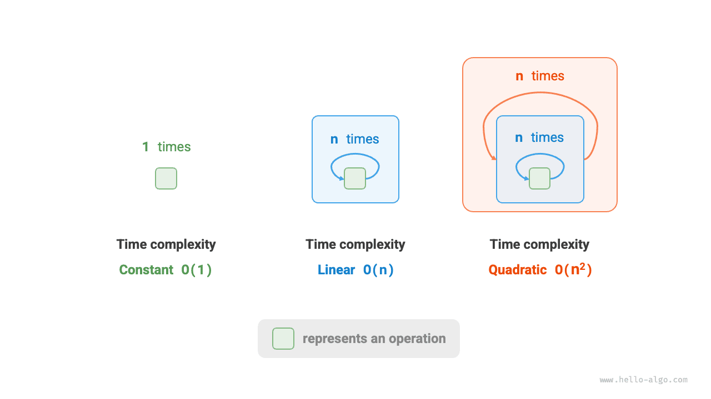

# Độ phức tạp thời gian

Thời gian chạy có thể phản ánh hiệu suất của một giải thuật một cách trực quan và chính xác. Nếu muốn ước lượng chính xác thời gian chạy của một đoạn mã, chúng ta nên tiến hành như thế nào?

1. **Xác định nền tảng chạy**, bao gồm cấu hình phần cứng, ngôn ngữ lập trình, môi trường hệ thống, v.v., vì các yếu tố này đều ảnh hưởng đến hiệu suất thực thi mã.
2. **Đánh giá thời gian chạy cần thiết cho từng loại thao tác tính toán**, ví dụ, một phép cộng `+` cần 1 ns, một phép nhân `*` cần 10 ns, một thao tác in `print()` cần 5 ns, v.v.
3. **Đếm tất cả các thao tác tính toán trong mã**, và cộng dồn thời gian thực thi của tất cả các thao tác để có được thời gian chạy.

Ví dụ, trong đoạn mã dưới đây, kích thước dữ liệu đầu vào là $n$:

=== "Python"

    ```python title=""
    # Trên một nền tảng chạy nhất định
    def algorithm(n: int):
        a = 2      # 1 ns
        a = a + 1  # 1 ns
        a = a * 2  # 10 ns
        # Lặp n lần
        for _ in range(n):  # 1 ns
            print(0)        # 5 ns
    ```

=== "C++"

    ```cpp title=""
    // Trên một nền tảng chạy nhất định
    void algorithm(int n) {
        int a = 2;  // 1 ns
        a = a + 1;  // 1 ns
        a = a * 2;  // 10 ns
        // Lặp n lần
        for (int i = 0; i < n; i++) {  // 1 ns
            cout << 0 << endl;         // 5 ns
        }
    }
    ```

=== "Java"

    ```java title=""
    // Trên một nền tảng chạy nhất định
    void algorithm(int n) {
        int a = 2;  // 1 ns
        a = a + 1;  // 1 ns
        a = a * 2;  // 10 ns
        // Lặp n lần
        for (int i = 0; i < n; i++) {  // 1 ns
            System.out.println(0);     // 5 ns
        }
    }
    ```

=== "C#"

    ```csharp title=""
    // Trên một nền tảng chạy nhất định
    void Algorithm(int n) {
        int a = 2;  // 1 ns
        a = a + 1;  // 1 ns
        a = a * 2;  // 10 ns
        // Lặp n lần
        for (int i = 0; i < n; i++) {  // 1 ns
            Console.WriteLine(0);      // 5 ns
        }
    }
    ```

=== "Go"

    ```go title=""
    // Trên một nền tảng chạy nhất định
    func algorithm(n int) {
        a := 2     // 1 ns
        a = a + 1  // 1 ns
        a = a * 2  // 10 ns
        // Lặp n lần
        for i := 0; i < n; i++ {  // 1 ns
            fmt.Println(a)        // 5 ns
        }
    }
    ```

=== "Swift"

    ```swift title=""
    // Trên một nền tảng chạy nhất định
    func algorithm(n: Int) {
        var a = 2 // 1 ns
        a = a + 1 // 1 ns
        a = a * 2 // 10 ns
        // Lặp n lần
        for _ in 0 ..< n { // 1 ns
            print(0) // 5 ns
        }
    }
    ```

=== "JS"

    ```javascript title=""
    // Trên một nền tảng chạy nhất định
    function algorithm(n) {
        var a = 2; // 1 ns
        a = a + 1; // 1 ns
        a = a * 2; // 10 ns
        // Lặp n lần
        for(let i = 0; i < n; i++) { // 1 ns
            console.log(0); // 5 ns
        }
    }
    ```

=== "TS"

    ```typescript title=""
    // Trên một nền tảng chạy nhất định
    function algorithm(n: number): void {
        var a: number = 2; // 1 ns
        a = a + 1; // 1 ns
        a = a * 2; // 10 ns
        // Lặp n lần
        for(let i = 0; i < n; i++) { // 1 ns
            console.log(0); // 5 ns
        }
    }
    ```

=== "Dart"

    ```dart title=""
    // Trên một nền tảng chạy nhất định
    void algorithm(int n) {
      int a = 2; // 1 ns
      a = a + 1; // 1 ns
      a = a * 2; // 10 ns
      // Lặp n lần
      for (int i = 0; i < n; i++) { // 1 ns
        print(0); // 5 ns
      }
    }
    ```

=== "Rust"

    ```rust title=""
    // Trên một nền tảng chạy nhất định
    fn algorithm(n: i32) {
        let mut a = 2;      // 1 ns
        a = a + 1;          // 1 ns
        a = a * 2;          // 10 ns
        // Lặp n lần
        for _ in 0..n {     // 1 ns
            println!("{}", 0);  // 5 ns
        }
    }
    ```

=== "C"

    ```c title=""
    // Trên một nền tảng chạy nhất định
    void algorithm(int n) {
        int a = 2;  // 1 ns
        a = a + 1;  // 1 ns
        a = a * 2;  // 10 ns
        // Lặp n lần
        for (int i = 0; i < n; i++) {   // 1 ns
            printf("%d", 0);            // 5 ns
        }
    }
    ```

=== "Kotlin"

    ```kotlin title=""
    // Trên một nền tảng chạy nhất định
    fun algorithm(n: Int) {
        var a = 2 // 1 ns
        a = a + 1 // 1 ns
        a = a * 2 // 10 ns
        // Lặp n lần
        for (i in 0..<n) {  // 1 ns
            println(0)      // 5 ns
        }
    }
    ```

=== "Ruby"

    ```ruby title=""
    # Trên một nền tảng chạy nhất định
    def algorithm(n)
        a = 2       # 1 ns
        a = a + 1   # 1 ns
        a = a * 2   # 10 ns
        # Lặp n lần
        (0...n).each do # 1 ns
            puts 0      # 5 ns
        end
    end
    ```

Theo phương pháp trên, thời gian chạy của giải thuật có thể được tính là $(6n + 12)$ ns:

$$
1 + 1 + 10 + (1 + 5) \times n = 6n + 12
$$

Tuy nhiên trên thực tế, **việc cố gắng đếm chính xác thời gian chạy của một giải thuật vừa không thực tế vừa không khả thi**. Thứ nhất, chúng ta không muốn ràng buộc thời gian ước tính với nền tảng chạy, vì giải thuật cần chạy trên nhiều nền tảng khác nhau. Thứ hai, rất khó để biết chính xác thời gian chạy của từng loại thao tác, khiến quá trình ước tính trở nên vô cùng khó khăn.

## Đếm xu hướng tăng trưởng thời gian

Phân tích độ phức tạp thời gian không đếm thời gian chạy thực tế của giải thuật, **mà thay vào đó đếm xu hướng tăng trưởng của thời gian chạy khi khối lượng dữ liệu tăng lên**.

Khái niệm "xu hướng tăng trưởng thời gian" khá trừu tượng; hãy cùng tìm hiểu qua một ví dụ. Giả sử kích thước dữ liệu đầu vào là $n$, và cho ba giải thuật `A`, `B`, và `C`:

=== "Python"

    ```python title=""
    # Độ phức tạp thời gian của giải thuật A: bậc hằng số
    def algorithm_A(n: int):
        print(0)
    # Độ phức tạp thời gian của giải thuật B: bậc tuyến tính
    def algorithm_B(n: int):
        for _ in range(n):
            print(0)
    # Độ phức tạp thời gian của giải thuật C: bậc hằng số
    def algorithm_C(n: int):
        for _ in range(1000000):
            print(0)
    ```

=== "C++"

    ```cpp title=""
    // Độ phức tạp thời gian của giải thuật A: bậc hằng số
    void algorithm_A(int n) {
        cout << 0 << endl;
    }
    // Độ phức tạp thời gian của giải thuật B: bậc tuyến tính
    void algorithm_B(int n) {
        for (int i = 0; i < n; i++) {
            cout << 0 << endl;
        }
    }
    // Độ phức tạp thời gian của giải thuật C: bậc hằng số
    void algorithm_C(int n) {
        for (int i = 0; i < 1000000; i++) {
            cout << 0 << endl;
        }
    }
    ```

=== "Java"

    ```java title=""
    // Độ phức tạp thời gian của giải thuật A: bậc hằng số
    void algorithm_A(int n) {
        System.out.println(0);
    }
    // Độ phức tạp thời gian của giải thuật B: bậc tuyến tính
    void algorithm_B(int n) {
        for (int i = 0; i < n; i++) {
            System.out.println(0);
        }
    }
    // Độ phức tạp thời gian của giải thuật C: bậc hằng số
    void algorithm_C(int n) {
        for (int i = 0; i < 1000000; i++) {
            System.out.println(0);
        }
    }
    ```

=== "C#"

    ```csharp title=""
    // Độ phức tạp thời gian của giải thuật A: bậc hằng số
    void AlgorithmA(int n) {
        Console.WriteLine(0);
    }
    // Độ phức tạp thời gian của giải thuật B: bậc tuyến tính
    void AlgorithmB(int n) {
        for (int i = 0; i < n; i++) {
            Console.WriteLine(0);
        }
    }
    // Độ phức tạp thời gian của giải thuật C: bậc hằng số
    void AlgorithmC(int n) {
        for (int i = 0; i < 1000000; i++) {
            Console.WriteLine(0);
        }
    }
    ```

=== "Go"

    ```go title=""
    // Độ phức tạp thời gian của giải thuật A: bậc hằng số
    func algorithm_A(n int) {
        fmt.Println(0)
    }
    // Độ phức tạp thời gian của giải thuật B: bậc tuyến tính
    func algorithm_B(n int) {
        for i := 0; i < n; i++ {
            fmt.Println(0)
        }
    }
    // Độ phức tạp thời gian của giải thuật C: bậc hằng số
    func algorithm_C(n int) {
        for i := 0; i < 1000000; i++ {
            fmt.Println(0)
        }
    }
    ```

=== "Swift"

    ```swift title=""
    // Độ phức tạp thời gian của giải thuật A: bậc hằng số
    func algorithmA(n: Int) {
        print(0)
    }

    // Độ phức tạp thời gian của giải thuật B: bậc tuyến tính
    func algorithmB(n: Int) {
        for _ in 0 ..< n {
            print(0)
        }
    }

    // Độ phức tạp thời gian của giải thuật C: bậc hằng số
    func algorithmC(n: Int) {
        for _ in 0 ..< 1_000_000 {
            print(0)
        }
    }
    ```

=== "JS"

    ```javascript title=""
    // Độ phức tạp thời gian của giải thuật A: bậc hằng số
    function algorithm_A(n) {
        console.log(0);
    }
    // Độ phức tạp thời gian của giải thuật B: bậc tuyến tính
    function algorithm_B(n) {
        for (let i = 0; i < n; i++) {
            console.log(0);
        }
    }
    // Độ phức tạp thời gian của giải thuật C: bậc hằng số
    function algorithm_C(n) {
        for (let i = 0; i < 1000000; i++) {
            console.log(0);
        }
    }

    ```

=== "TS"

    ```typescript title=""
    // Độ phức tạp thời gian của giải thuật A: bậc hằng số
    function algorithm_A(n: number): void {
        console.log(0);
    }
    // Độ phức tạp thời gian của giải thuật B: bậc tuyến tính
    function algorithm_B(n: number): void {
        for (let i = 0; i < n; i++) {
            console.log(0);
        }
    }
    // Độ phức tạp thời gian của giải thuật C: bậc hằng số
    function algorithm_C(n: number): void {
        for (let i = 0; i < 1000000; i++) {
            console.log(0);
        }
    }
    ```

=== "Dart"

    ```dart title=""
    // Độ phức tạp thời gian của giải thuật A: bậc hằng số
    void algorithmA(int n) {
      print(0);
    }
    // Độ phức tạp thời gian của giải thuật B: bậc tuyến tính
    void algorithmB(int n) {
      for (int i = 0; i < n; i++) {
        print(0);
      }
    }
    // Độ phức tạp thời gian của giải thuật C: bậc hằng số
    void algorithmC(int n) {
      for (int i = 0; i < 1000000; i++) {
        print(0);
      }
    }
    ```

=== "Rust"

    ```rust title=""
    // Độ phức tạp thời gian của giải thuật A: bậc hằng số
    fn algorithm_A(n: i32) {
        println!("{}", 0);
    }
    // Độ phức tạp thời gian của giải thuật B: bậc tuyến tính
    fn algorithm_B(n: i32) {
        for _ in 0..n {
            println!("{}", 0);
        }
    }
    // Độ phức tạp thời gian của giải thuật C: bậc hằng số
    fn algorithm_C(n: i32) {
        for _ in 0..1000000 {
            println!("{}", 0);
        }
    }
    ```

=== "C"

    ```c title=""
    // Độ phức tạp thời gian của giải thuật A: bậc hằng số
    void algorithm_A(int n) {
        printf("%d", 0);
    }
    // Độ phức tạp thời gian của giải thuật B: bậc tuyến tính
    void algorithm_B(int n) {
        for (int i = 0; i < n; i++) {
            printf("%d", 0);
        }
    }
    // Độ phức tạp thời gian của giải thuật C: bậc hằng số
    void algorithm_C(int n) {
        for (int i = 0; i < 1000000; i++) {
            printf("%d", 0);
        }
    }
    ```

=== "Kotlin"

    ```kotlin title=""
    // Độ phức tạp thời gian của giải thuật A: bậc hằng số
    fun algoritm_A(n: Int) {
        println(0)
    }
    // Độ phức tạp thời gian của giải thuật B: bậc tuyến tính
    fun algorithm_B(n: Int) {
        for (i in 0..<n){
            println(0)
        }
    }
    // Độ phức tạp thời gian của giải thuật C: bậc hằng số
    fun algorithm_C(n: Int) {
        for (i in 0..<1000000) {
            println(0)
        }
    }
    ```

=== "Ruby"

    ```ruby title=""
    # Độ phức tạp thời gian của giải thuật A: bậc hằng số
    def algorithm_A(n)
        puts 0
    end

    # Độ phức tạp thời gian của giải thuật B: bậc tuyến tính
    def algorithm_B(n)
        (0...n).each { puts 0 }
    end

    # Độ phức tạp thời gian của giải thuật C: bậc hằng số
    def algorithm_C(n)
        (0...1_000_000).each { puts 0 }
    end
    ```

Hình dưới đây thể hiện độ phức tạp thời gian của ba hàm giải thuật trên.

- Giải thuật `A` chỉ có $1$ thao tác in, và thời gian chạy của giải thuật không tăng khi $n$ tăng. Ta gọi độ phức tạp thời gian của giải thuật này là "bậc hằng số".
- Trong giải thuật `B`, thao tác in cần lặp $n$ lần, và thời gian chạy của giải thuật tăng tuyến tính khi $n$ tăng. Độ phức tạp thời gian của giải thuật này được gọi là "bậc tuyến tính".
- Trong giải thuật `C`, thao tác in cần lặp $1000000$ lần. Mặc dù thời gian chạy khá dài, nó không phụ thuộc vào kích thước dữ liệu đầu vào $n$. Do đó, độ phức tạp thời gian của `C` giống với `A`, vẫn là "bậc hằng số".



So với việc đếm trực tiếp thời gian chạy của giải thuật, phân tích độ phức tạp thời gian có những đặc điểm gì?

- **Độ phức tạp thời gian có thể đánh giá hiệu quả hiệu suất của giải thuật một cách hiệu quả**. Ví dụ, thời gian chạy của giải thuật `B` tăng tuyến tính; khi $n > 1$ nó chậm hơn giải thuật `A`, và khi $n > 1000000$ nó chậm hơn giải thuật `C`. Trên thực tế, chỉ cần kích thước dữ liệu đầu vào $n$ đủ lớn, một giải thuật có độ phức tạp "bậc hằng số" sẽ luôn vượt trội hơn một giải thuật có độ phức tạp "bậc tuyến tính", đây chính xác là ý nghĩa của xu hướng tăng trưởng thời gian.
- **Phương pháp suy ra độ phức tạp thời gian đơn giản hơn**. Rõ ràng, nền tảng chạy và các loại thao tác tính toán đều không liên quan đến xu hướng tăng trưởng của thời gian chạy giải thuật. Do đó, trong phân tích độ phức tạp thời gian, chúng ta có thể đơn giản coi thời gian thực thi của tất cả các thao tác tính toán là cùng một "đơn vị thời gian", quy việc "theo dõi thời gian chạy của từng thao tác" thành "đếm số lượng thao tác", giúp giảm đáng kể độ khó của việc ước tính.
- **Độ phức tạp thời gian cũng có những hạn chế nhất định**. Ví dụ, mặc dù giải thuật `A` và `C` có cùng độ phức tạp thời gian, nhưng thời gian chạy thực tế của chúng lại khác nhau đáng kể. Tương tự, mặc dù giải thuật `B` có độ phức tạp thời gian cao hơn `C`, nhưng khi kích thước dữ liệu đầu vào $n$ nhỏ, giải thuật `B` rõ ràng vượt trội hơn giải thuật `C`. Trong những trường hợp như vậy, thường rất khó để đánh giá hiệu quả của giải thuật chỉ dựa trên độ phức tạp thời gian. Tất nhiên, dù có những vấn đề nêu trên, phân tích độ phức tạp vẫn là phương pháp hiệu quả và được sử dụng phổ biến nhất để đánh giá hiệu suất giải thuật.

## Cận trên tiệm cận của hàm số

Cho một hàm số với kích thước đầu vào $n$:

=== "Python"

    ```python title=""
    def algorithm(n: int):
        a = 1      # +1
        a = a + 1  # +1
        a = a * 2  # +1
        # Lặp n lần
        for i in range(n):  # +1
            print(0)        # +1
    ```

=== "C++"

    ```cpp title=""
    void algorithm(int n) {
        int a = 1;  // +1
        a = a + 1;  // +1
        a = a * 2;  // +1
        // Lặp n lần
        for (int i = 0; i < n; i++) { // +1 (i++ được thực thi mỗi vòng)
            cout << 0 << endl;    // +1
        }
    }
    ```

=== "Java"

    ```java title=""
    void algorithm(int n) {
        int a = 1;  // +1
        a = a + 1;  // +1
        a = a * 2;  // +1
        // Lặp n lần
        for (int i = 0; i < n; i++) { // +1 (i++ được thực thi mỗi vòng)
            System.out.println(0);    // +1
        }
    }
    ```

=== "C#"

    ```csharp title=""
    void Algorithm(int n) {
        int a = 1;  // +1
        a = a + 1;  // +1
        a = a * 2;  // +1
        // Lặp n lần
        for (int i = 0; i < n; i++) {   // +1 (i++ được thực thi mỗi vòng)
            Console.WriteLine(0);   // +1
        }
    }
    ```

=== "Go"

    ```go title=""
    func algorithm(n int) {
        a := 1      // +1
        a = a + 1   // +1
        a = a * 2   // +1
        // Lặp n lần
        for i := 0; i < n; i++ {   // +1
            fmt.Println(a)         // +1
        }
    }
    ```

=== "Swift"

    ```swift title=""
    func algorithm(n: Int) {
        var a = 1 // +1
        a = a + 1 // +1
        a = a * 2 // +1
        // Lặp n lần
        for _ in 0 ..< n { // +1
            print(0) // +1
        }
    }
    ```

=== "JS"

    ```javascript title=""
    function algorithm(n) {
        var a = 1; // +1
        a += 1; // +1
        a *= 2; // +1
        // Lặp n lần
        for(let i = 0; i < n; i++){ // +1 (i++ được thực thi mỗi vòng)
            console.log(0); // +1
        }
    }
    ```

=== "TS"

    ```typescript title=""
    function algorithm(n: number): void{
        var a: number = 1; // +1
        a += 1; // +1
        a *= 2; // +1
        // Lặp n lần
        for(let i = 0; i < n; i++){ // +1 (i++ được thực thi mỗi vòng)
            console.log(0); // +1
        }
    }
    ```

=== "Dart"

    ```dart title=""
    void algorithm(int n) {
      int a = 1; // +1
      a = a + 1; // +1
      a = a * 2; // +1
      // Lặp n lần
      for (int i = 0; i < n; i++) { // +1 (i++ được thực thi mỗi vòng)
        print(0); // +1
      }
    }
    ```

=== "Rust"

    ```rust title=""
    fn algorithm(n: i32) {
        let mut a = 1;   // +1
        a = a + 1;      // +1
        a = a * 2;      // +1

        // Lặp n lần
        for _ in 0..n { // +1 (i++ được thực thi mỗi vòng)
            println!("{}", 0); // +1
        }
    }
    ```

=== "C"

    ```c title=""
    void algorithm(int n) {
        int a = 1;  // +1
        a = a + 1;  // +1
        a = a * 2;  // +1
        // Lặp n lần
        for (int i = 0; i < n; i++) {   // +1 (i++ được thực thi mỗi vòng)
            printf("%d", 0);            // +1
        }
    }
    ```

=== "Kotlin"

    ```kotlin title=""
    fun algorithm(n: Int) {
        var a = 1 // +1
        a = a + 1 // +1
        a = a * 2 // +1
        // Lặp n lần
        for (i in 0..<n) { // +1 (i++ được thực thi mỗi vòng)
            println(0) // +1
        }
    }
    ```

=== "Ruby"

    ```ruby title=""
    def algorithm(n)
        a = 1       # +1
        a = a + 1   # +1
        a = a * 2   # +1
        # Lặp n lần
        (0...n).each do # +1
            puts 0      # +1
        end
    end
    ```

Gọi số lượng thao tác của giải thuật là một hàm của kích thước dữ liệu đầu vào $n$, ký hiệu là $T(n)$. Khi đó số lượng thao tác của hàm trên là:

$$
T(n) = 3 + 2n
$$

$T(n)$ là một hàm tuyến tính, cho thấy xu hướng tăng trưởng thời gian chạy của nó là tuyến tính, do đó độ phức tạp thời gian của nó là bậc tuyến tính.

Ta ký hiệu độ phức tạp thời gian bậc tuyến tính là $O(n)$. Ký hiệu toán học này được gọi là <u>ký hiệu big-$O$</u>, biểu diễn <u>cận trên tiệm cận</u> của hàm $T(n)$.

Về bản chất, phân tích độ phức tạp thời gian là tính toán cận trên tiệm cận của "số lượng thao tác $T(n)$", có một định nghĩa toán học rõ ràng.

!!! note "Cận trên tiệm cận của hàm số"

    Nếu tồn tại các số thực dương $c$ và $n_0$ sao cho với mọi $n > n_0$, ta có $T(n) \leq c \cdot f(n)$, thì $f(n)$ có thể được coi là một cận trên tiệm cận của $T(n)$, ký hiệu là $T(n) = O(f(n))$.

Như thể hiện trong hình dưới đây, việc tính toán cận trên tiệm cận là tìm một hàm $f(n)$ sao cho khi $n$ tiến tới vô cùng, $T(n)$ và $f(n)$ có cùng mức độ tăng trưởng, chỉ khác nhau bởi một hệ số hằng số $c$.



## Phương pháp suy luận

Ý tưởng về cận trên tiệm cận có phần mang tính toán học. Nếu bạn cảm thấy chưa hiểu hoàn toàn, đừng lo lắng. Chúng ta có thể nắm vững phương pháp suy luận trước, rồi dần dần nắm bắt ý nghĩa toán học của nó thông qua thực hành liên tục.

Theo định nghĩa, sau khi xác định $f(n)$, ta có thể thu được độ phức tạp thời gian $O(f(n))$. Vậy làm thế nào để xác định cận trên tiệm cận $f(n)$? Nhìn chung, việc này được chia thành hai bước: đầu tiên đếm số lượng thao tác, sau đó xác định cận trên tiệm cận.

### Bước 1: Đếm số lượng thao tác

Đối với mã nguồn, hãy đếm từ trên xuống dưới, từng dòng một. Tuy nhiên, vì hệ số hằng số $c$ trong $c \cdot f(n)$ ở trên có thể có kích thước bất kỳ, **các hệ số và số hạng hằng số trong số lượng thao tác $T(n)$ đều có thể bị bỏ qua**. Dựa theo nguyên tắc này, có thể tổng kết các kỹ thuật đơn giản hóa việc đếm sau đây.

1. **Bỏ qua các hằng số trong $T(n)$**. Vì chúng đều không phụ thuộc vào $n$, nên không ảnh hưởng đến độ phức tạp thời gian.
2. **Lược bỏ tất cả các hệ số**. Ví dụ, lặp $2n$ lần, $5n + 1$ lần, v.v., đều có thể được đơn giản hóa thành $n$ lần, vì hệ số đứng trước $n$ không ảnh hưởng đến độ phức tạp thời gian.
3. **Dùng phép nhân cho các vòng lặp lồng nhau**. Tổng số lượng thao tác bằng tích của số lượng thao tác trong vòng lặp ngoài và vòng lặp trong, mỗi tầng vòng lặp vẫn có thể áp dụng riêng các kỹ thuật `1.` và `2.`.

Cho một hàm, ta có thể sử dụng các kỹ thuật trên để đếm số lượng thao tác:

=== "Python"

    ```python title=""
    def algorithm(n: int):
        a = 1      # +0 (Kỹ thuật 1)
        a = a + n  # +0 (Kỹ thuật 1)
        # +n (Kỹ thuật 2)
        for i in range(5 * n + 1):
            print(0)
        # +n*n (Kỹ thuật 3)
        for i in range(2 * n):
            for j in range(n + 1):
                print(0)
    ```

=== "C++"

    ```cpp title=""
    void algorithm(int n) {
        int a = 1;  // +0 (Kỹ thuật 1)
        a = a + n;  // +0 (Kỹ thuật 1)
        // +n (Kỹ thuật 2)
        for (int i = 0; i < 5 * n + 1; i++) {
            cout << 0 << endl;
        }
        // +n*n (Kỹ thuật 3)
        for (int i = 0; i < 2 * n; i++) {
            for (int j = 0; j < n + 1; j++) {
                cout << 0 << endl;
            }
        }
    }
    ```

=== "Java"

    ```java title=""
    void algorithm(int n) {
        int a = 1;  // +0 (Kỹ thuật 1)
        a = a + n;  // +0 (Kỹ thuật 1)
        // +n (Kỹ thuật 2)
        for (int i = 0; i < 5 * n + 1; i++) {
            System.out.println(0);
        }
        // +n*n (Kỹ thuật 3)
        for (int i = 0; i < 2 * n; i++) {
            for (int j = 0; j < n + 1; j++) {
                System.out.println(0);
            }
        }
    }
    ```

=== "C#"

    ```csharp title=""
    void Algorithm(int n) {
        int a = 1;  // +0 (Kỹ thuật 1)
        a = a + n;  // +0 (Kỹ thuật 1)
        // +n (Kỹ thuật 2)
        for (int i = 0; i < 5 * n + 1; i++) {
            Console.WriteLine(0);
        }
        // +n*n (Kỹ thuật 3)
        for (int i = 0; i < 2 * n; i++) {
            for (int j = 0; j < n + 1; j++) {
                Console.WriteLine(0);
            }
        }
    }
    ```

=== "Go"

    ```go title=""
    func algorithm(n int) {
        a := 1     // +0 (Kỹ thuật 1)
        a = a + n  // +0 (Kỹ thuật 1)
        // +n (Kỹ thuật 2)
        for i := 0; i < 5 * n + 1; i++ {
            fmt.Println(0)
        }
        // +n*n (Kỹ thuật 3)
        for i := 0; i < 2 * n; i++ {
            for j := 0; j < n + 1; j++ {
                fmt.Println(0)
            }
        }
    }
    ```

=== "Swift"

    ```swift title=""
    func algorithm(n: Int) {
        var a = 1 // +0 (Kỹ thuật 1)
        a = a + n // +0 (Kỹ thuật 1)
        // +n (Kỹ thuật 2)
        for _ in 0 ..< (5 * n + 1) {
            print(0)
        }
        // +n*n (Kỹ thuật 3)
        for _ in 0 ..< (2 * n) {
            for _ in 0 ..< (n + 1) {
                print(0)
            }
        }
    }
    ```

=== "JS"

    ```javascript title=""
    function algorithm(n) {
        let a = 1;  // +0 (Kỹ thuật 1)
        a = a + n;  // +0 (Kỹ thuật 1)
        // +n (Kỹ thuật 2)
        for (let i = 0; i < 5 * n + 1; i++) {
            console.log(0);
        }
        // +n*n (Kỹ thuật 3)
        for (let i = 0; i < 2 * n; i++) {
            for (let j = 0; j < n + 1; j++) {
                console.log(0);
            }
        }
    }
    ```

=== "TS"

    ```typescript title=""
    function algorithm(n: number): void {
        let a = 1;  // +0 (Kỹ thuật 1)
        a = a + n;  // +0 (Kỹ thuật 1)
        // +n (Kỹ thuật 2)
        for (let i = 0; i < 5 * n + 1; i++) {
            console.log(0);
        }
        // +n*n (Kỹ thuật 3)
        for (let i = 0; i < 2 * n; i++) {
            for (let j = 0; j < n + 1; j++) {
                console.log(0);
            }
        }
    }
    ```

=== "Dart"

    ```dart title=""
    void algorithm(int n) {
      int a = 1; // +0 (Kỹ thuật 1)
      a = a + n; // +0 (Kỹ thuật 1)
      // +n (Kỹ thuật 2)
      for (int i = 0; i < 5 * n + 1; i++) {
        print(0);
      }
      // +n*n (Kỹ thuật 3)
      for (int i = 0; i < 2 * n; i++) {
        for (int j = 0; j < n + 1; j++) {
          print(0);
        }
      }
    }
    ```

=== "Rust"

    ```rust title=""
    fn algorithm(n: i32) {
        let mut a = 1;     // +0 (Kỹ thuật 1)
        a = a + n;        // +0 (Kỹ thuật 1)

        // +n (Kỹ thuật 2)
        for i in 0..(5 * n + 1) {
            println!("{}", 0);
        }

        // +n*n (Kỹ thuật 3)
        for i in 0..(2 * n) {
            for j in 0..(n + 1) {
                println!("{}", 0);
            }
        }
    }
    ```

=== "C"

    ```c title=""
    void algorithm(int n) {
        int a = 1;  // +0 (Kỹ thuật 1)
        a = a + n;  // +0 (Kỹ thuật 1)
        // +n (Kỹ thuật 2)
        for (int i = 0; i < 5 * n + 1; i++) {
            printf("%d", 0);
        }
        // +n*n (Kỹ thuật 3)
        for (int i = 0; i < 2 * n; i++) {
            for (int j = 0; j < n + 1; j++) {
                printf("%d", 0);
            }
        }
    }
    ```

=== "Kotlin"

    ```kotlin title=""
    fun algorithm(n: Int) {
        var a = 1   // +0 (Kỹ thuật 1)
        a = a + n   // +0 (Kỹ thuật 1)
        // +n (Kỹ thuật 2)
        for (i in 0..<5 * n + 1) {
            println(0)
        }
        // +n*n (Kỹ thuật 3)
        for (i in 0..<2 * n) {
            for (j in 0..<n + 1) {
                println(0)
            }
        }
    }
    ```

=== "Ruby"

    ```ruby title=""
    def algorithm(n)
        a = 1       # +0 (Kỹ thuật 1)
        a = a + n   # +0 (Kỹ thuật 1)
        # +n (Kỹ thuật 2)
        (0...(5 * n + 1)).each do { puts 0 }
        # +n*n (Kỹ thuật 3)
        (0...(2 * n)).each do
            (0...(n + 1)).each do { puts 0 }
        end
    end
    ```

Công thức dưới đây thể hiện kết quả đếm trước và sau khi sử dụng các kỹ thuật trên; cả hai đều suy ra độ phức tạp thời gian là $O(n^2)$.

$$
\begin{aligned}
T(n) & = 2n(n + 1) + (5n + 1) + 2 & \text{Đếm đầy đủ (-.-|||)} \newline
& = 2n^2 + 7n + 3 \newline
T(n) & = n^2 + n & \text{Đếm đơn giản hóa (o.O)}
\end{aligned}
$$

### Bước 2: Xác định cận trên tiệm cận

**Độ phức tạp thời gian được xác định bởi số hạng bậc cao nhất trong $T(n)$**. Điều này là vì khi $n$ tiến tới vô cùng, số hạng bậc cao nhất sẽ đóng vai trò chi phối, và ảnh hưởng của các số hạng khác có thể bị bỏ qua.

Bảng dưới đây thể hiện một số ví dụ, trong đó một số giá trị được phóng đại để nhấn mạnh kết luận rằng "hệ số không thể làm thay đổi bậc". Khi $n$ tiến tới vô cùng, các hằng số này trở nên không đáng kể.

<p align="center"> Bảng <id> &nbsp; Độ phức tạp thời gian tương ứng với các số lượng thao tác khác nhau </p>

| Số lượng thao tác $T(n)$ | Độ phức tạp thời gian $O(f(n))$ |
| ---------------------- | -------------------- |
| $100000$               | $O(1)$               |
| $3n + 2$               | $O(n)$               |
| $2n^2 + 3n + 2$        | $O(n^2)$             |
| $n^3 + 10000n^2$       | $O(n^3)$             |
| $2^n + 10000n^{10000}$ | $O(2^n)$             |

## Các loại thường gặp

Giả sử kích thước dữ liệu đầu vào là $n$. Các loại độ phức tạp thời gian thường gặp được thể hiện trong hình dưới đây (được sắp xếp theo thứ tự từ thấp đến cao).

$$
\begin{aligned}
& O(1) < O(\log n) < O(n) < O(n \log n) < O(n^2) < O(2^n) < O(n!) \newline
& \text{Hằng số} < \text{Logarit} < \text{Tuyến tính} < \text{Tuyến tính-logarit} < \text{Bình phương} < \text{Mũ} < \text{Giai thừa}
\end{aligned}
$$


### Bậc hằng số $O(1)$

Số lượng thao tác trong bậc hằng số không phụ thuộc vào kích thước dữ liệu đầu vào $n$, nghĩa là nó không thay đổi khi $n$ thay đổi.

Trong hàm dưới đây, mặc dù giá trị của `size` có thể lớn, nó không phụ thuộc vào kích thước dữ liệu đầu vào $n$, do đó độ phức tạp thời gian vẫn là $O(1)$:

```src
[file]{time_complexity}-[class]{}-[func]{constant}
```

### Bậc tuyến tính $O(n)$

Số lượng thao tác trong bậc tuyến tính tăng trưởng tuyến tính theo kích thước dữ liệu đầu vào $n$. Bậc tuyến tính thường xuất hiện trong các vòng lặp đơn tầng:

```src
[file]{time_complexity}-[class]{}-[func]{linear}
```

Các thao tác như duyệt mảng và duyệt danh sách liên kết có độ phức tạp thời gian là $O(n)$, trong đó $n$ là độ dài của mảng hoặc danh sách liên kết:

```src
[file]{time_complexity}-[class]{}-[func]{array_traversal}
```

Đáng chú ý là **kích thước dữ liệu đầu vào $n$ cần được xác định tùy theo loại dữ liệu đầu vào**. Ví dụ, trong ví dụ đầu tiên, biến $n$ chính là kích thước dữ liệu đầu vào; trong ví dụ thứ hai, độ dài mảng $n$ chính là kích thước dữ liệu.

### Bậc bình phương $O(n^2)$

Số lượng thao tác trong bậc bình phương tăng trưởng theo quan hệ bình phương với kích thước dữ liệu đầu vào $n$. Bậc bình phương thường xuất hiện trong các vòng lặp lồng nhau, khi cả vòng lặp ngoài lẫn vòng lặp trong đều có độ phức tạp thời gian $O(n)$, dẫn đến độ phức tạp thời gian tổng thể là $O(n^2)$:

```src
[file]{time_complexity}-[class]{}-[func]{quadratic}
```

Hình dưới đây so sánh độ phức tạp thời gian bậc hằng số, bậc tuyến tính, và bậc bình phương.



Lấy sắp xếp nổi bọt (bubble sort) làm ví dụ, vòng lặp ngoài thực thi $n - 1$ lần, và vòng lặp trong thực thi lần lượt $n-1$, $n-2$, $\dots$, $2$, $1$ lần, trung bình $n / 2$ lần, dẫn đến độ phức tạp thời gian là $O((n - 1) n / 2) = O(n^2)$:

```src
[file]{time_complexity}-[class]{}-[func]{bubble_sort}
```

### Bậc mũ $O(2^n)$

"Sự phân bào" trong sinh học là một ví dụ điển hình cho tăng trưởng bậc mũ: trạng thái ban đầu là $1$ tế bào, sau một vòng phân chia trở thành $2$, sau hai vòng trở thành $4$, và cứ thế tiếp tục; sau $n$ vòng phân chia sẽ có $2^n$ tế bào.

Hình dưới đây và đoạn mã sau mô phỏng quá trình phân bào, với độ phức tạp thời gian là $O(2^n)$. Lưu ý rằng đầu vào $n$ biểu diễn số vòng phân chia, và giá trị trả về `count` biểu diễn tổng số lần phân chia.

```src
[file]{time_complexity}-[class]{}-[func]{exponential}
```


Trong các giải thuật thực tế, bậc mũ thường xuất hiện trong các hàm đệ quy. Ví dụ, trong đoạn mã dưới đây, nó chia đôi một cách đệ quy, dừng lại sau $n$ lần chia:

```src
[file]{time_complexity}-[class]{}-[func]{exp_recur}
```

Tăng trưởng bậc mũ diễn ra rất nhanh và thường gặp trong các phương pháp vét cạn (tìm kiếm vét cạn, quay lui, v.v.). Đối với các bài toán có quy mô dữ liệu lớn, bậc mũ là không thể chấp nhận được và thường cần đến quy hoạch động hoặc giải thuật tham lam để giải quyết.

### Bậc logarit $O(\log n)$

Trái ngược với bậc mũ, bậc logarit phản ánh tình huống "giảm một nửa mỗi vòng". Giả sử kích thước dữ liệu đầu vào là $n$. Vì nó giảm một nửa mỗi vòng, số lần lặp là $\log_2 n$, chính là hàm nghịch đảo của $2^n$.

Hình dưới đây và đoạn mã sau mô phỏng quá trình "giảm một nửa mỗi vòng", với độ phức tạp thời gian là $O(\log_2 n)$, viết tắt là $O(\log n)$:

```src
[file]{time_complexity}-[class]{}-[func]{logarithmic}
```


Giống như bậc mũ, bậc logarit cũng thường xuất hiện trong các hàm đệ quy. Đoạn mã dưới đây tạo thành một cây đệ quy có chiều cao $\log_2 n$:

```src
[file]{time_complexity}-[class]{}-[func]{log_recur}
```

Bậc logarit thường xuất hiện trong các giải thuật dựa trên chiến lược chia để trị, phản ánh ý tưởng chia nhỏ bài toán và đơn giản hóa nó nhiều lần. Nó tăng trưởng chậm và là độ phức tạp thời gian lý tưởng, chỉ đứng sau bậc hằng số.

!!! tip "Cơ số của $O(\log n)$ là gì?"

    Để chính xác hơn, "chia thành $m$ phần" tương ứng với độ phức tạp thời gian $O(\log_m n)$. Và thông qua công thức đổi cơ số của logarit, ta có thể thu được các độ phức tạp thời gian với cơ số khác nhau nhưng bằng nhau:

    $$
    O(\log_m n) = O(\log_k n / \log_k m) = O(\log_k n)
    $$

    Điều này có nghĩa là cơ số $m$ có thể chuyển đổi mà không ảnh hưởng đến độ phức tạp. Do đó, ta thường bỏ qua cơ số $m$ và ký hiệu bậc logarit đơn giản là $O(\log n)$.

### Bậc tuyến tính-logarit $O(n \log n)$

Bậc tuyến tính-logarit thường xuất hiện trong các vòng lặp lồng nhau, khi độ phức tạp thời gian của hai tầng vòng lặp lần lượt là $O(\log n)$ và $O(n)$. Đoạn mã liên quan như sau:

```src
[file]{time_complexity}-[class]{}-[func]{linear_log_recur}
```

Hình dưới đây thể hiện cách bậc tuyến tính-logarit được sinh ra. Mỗi tầng của cây nhị phân có tổng cộng $n$ thao tác, và cây có $\log_2 n + 1$ tầng, dẫn đến độ phức tạp thời gian $O(n \log n)$.


Các giải thuật sắp xếp phổ biến thường có độ phức tạp thời gian $O(n \log n)$, chẳng hạn như sắp xếp nhanh (quicksort), sắp xếp trộn (merge sort), và sắp xếp vun đống (heap sort).

### Bậc giai thừa $O(n!)$

Bậc giai thừa tương ứng với bài toán "hoán vị" trong toán học. Cho $n$ phần tử khác nhau, tìm tất cả các cách hoán vị có thể; số lượng cách là:

$$
n! = n \times (n - 1) \times (n - 2) \times \dots \times 2 \times 1
$$

Giai thừa thường được cài đặt bằng đệ quy. Như thể hiện trong hình dưới đây và đoạn mã sau, tầng đầu tiên chia thành $n$ nhánh, tầng thứ hai chia thành $n - 1$ nhánh, và cứ thế tiếp tục, cho đến tầng thứ $n$ thì việc chia dừng lại:

```src
[file]{time_complexity}-[class]{}-[func]{factorial_recur}
```


Lưu ý rằng vì khi $n \geq 4$ ta luôn có $n! > 2^n$, bậc giai thừa tăng trưởng nhanh hơn bậc mũ, và cũng không thể chấp nhận được đối với $n$ lớn.

## Độ phức tạp thời gian trường hợp xấu nhất, tốt nhất và trung bình

**Hiệu suất thời gian của một giải thuật thường không cố định, mà liên quan đến phân bố của dữ liệu đầu vào**. Giả sử ta đưa vào một mảng `nums` có độ dài $n$, trong đó `nums` gồm các số từ $1$ đến $n$, mỗi số chỉ xuất hiện một lần, nhưng thứ tự các phần tử được xáo trộn ngẫu nhiên. Nhiệm vụ là trả về chỉ số của phần tử $1$. Ta có thể rút ra các kết luận sau.

- Khi `nums = [?, ?, ..., 1]`, tức là khi phần tử cuối cùng là $1$, cần phải duyệt toàn bộ mảng, **đạt đến độ phức tạp thời gian trường hợp xấu nhất $O(n)$**.
- Khi `nums = [1, ?, ?, ...]`, tức là khi phần tử đầu tiên là $1$, bất kể mảng dài bao nhiêu, cũng không cần tiếp tục duyệt, **đạt đến độ phức tạp thời gian trường hợp tốt nhất $\Omega(1)$**.

"Độ phức tạp thời gian trường hợp xấu nhất" tương ứng với cận trên tiệm cận của hàm số, được ký hiệu bằng ký hiệu big-$O$. Tương ứng, "độ phức tạp thời gian trường hợp tốt nhất" tương ứng với cận dưới tiệm cận của hàm số, được ký hiệu bằng ký hiệu $\Omega$:

```src
[file]{worst_best_time_complexity}-[class]{}-[func]{find_one}
```

Đáng chú ý là chúng ta hiếm khi sử dụng độ phức tạp thời gian trường hợp tốt nhất trong thực tế, vì nó thường chỉ đạt được với xác suất rất nhỏ và có thể gây hiểu lầm phần nào. **Độ phức tạp thời gian trường hợp xấu nhất thực tế hơn vì nó đưa ra một giá trị an toàn về hiệu suất**, cho phép chúng ta sử dụng giải thuật một cách tự tin.

Từ ví dụ trên, ta có thể thấy rằng cả độ phức tạp thời gian trường hợp xấu nhất lẫn trường hợp tốt nhất chỉ phát sinh dưới các phân bố dữ liệu đầu vào đặc biệt, có thể xảy ra với xác suất rất thấp và có thể không phản ánh đúng hiệu suất chạy thực tế của giải thuật. Ngược lại, **độ phức tạp thời gian trung bình có thể phản ánh hiệu suất chạy của giải thuật dưới dữ liệu đầu vào ngẫu nhiên**, được ký hiệu bằng ký hiệu $\Theta$.

Đối với một số giải thuật, ta có thể dễ dàng suy ra trường hợp trung bình dưới phân bố dữ liệu ngẫu nhiên. Ví dụ, trong ví dụ trên, vì mảng đầu vào được xáo trộn, xác suất phần tử $1$ xuất hiện tại bất kỳ chỉ số nào là như nhau, do đó số lần lặp trung bình của giải thuật là một nửa độ dài mảng $n / 2$, cho ra độ phức tạp thời gian trung bình là $\Theta(n / 2) = \Theta(n)$.

Nhưng đối với các giải thuật phức tạp hơn, việc tính toán độ phức tạp thời gian trung bình thường khá khó khăn, vì rất khó để phân tích kỳ vọng toán học tổng thể dưới phân bố dữ liệu. Trong trường hợp này, ta thường sử dụng độ phức tạp thời gian trường hợp xấu nhất làm tiêu chí đánh giá hiệu suất giải thuật.

!!! question "Tại sao hiếm khi thấy ký hiệu $\Theta$?"

    Điều này có thể là do ký hiệu $O$ quá dễ nhớ, nên chúng ta thường dùng nó để biểu diễn độ phức tạp thời gian trung bình. Nhưng nói một cách chặt chẽ, cách làm này không chuẩn xác. Trong cuốn sách này và các tài liệu khác, nếu bạn gặp các biểu thức như "độ phức tạp thời gian trung bình $O(n)$", hãy hiểu nó trực tiếp là $\Theta(n)$.
