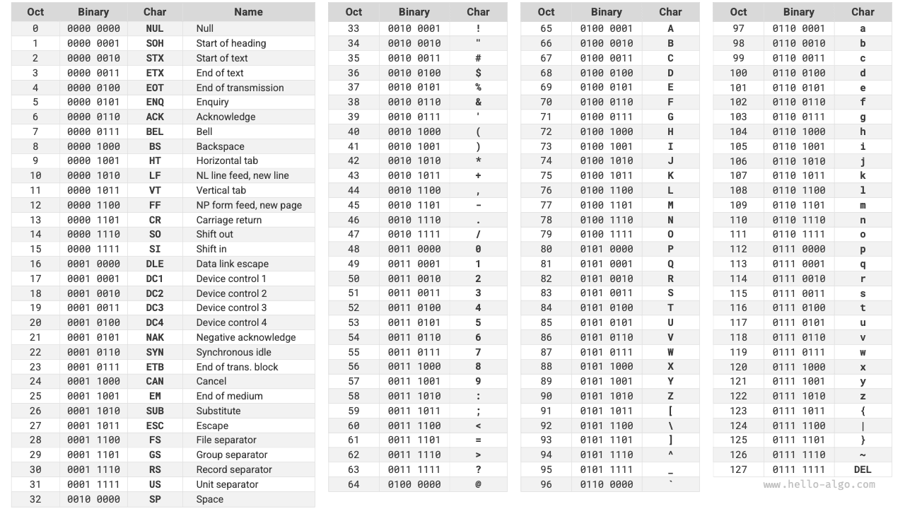
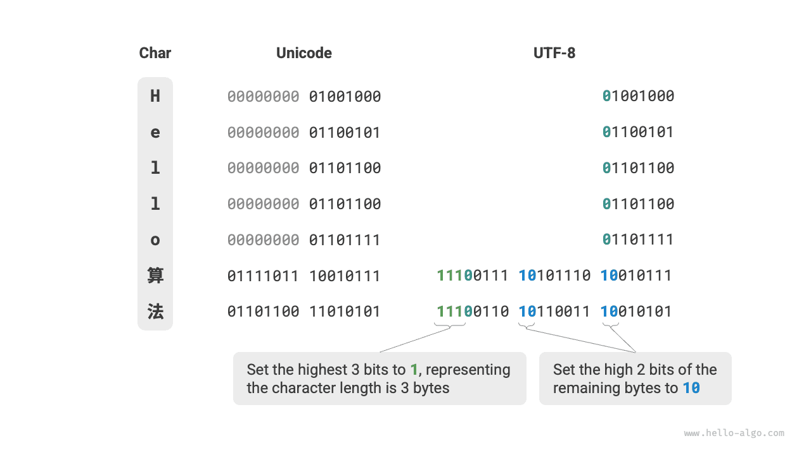

# Mã hóa ký tự *

Trong máy tính, mọi dữ liệu đều được lưu trữ dưới dạng nhị phân, và ký tự `char` cũng không ngoại lệ. Để biểu diễn ký tự, ta cần xây dựng một "bộ ký tự" (character set) định nghĩa mối tương ứng một - một giữa mỗi ký tự và các số nhị phân. Có bộ ký tự, máy tính có thể chuyển đổi số nhị phân thành ký tự bằng cách tra bảng.

## Bộ ký tự ASCII

<u>Mã ASCII</u> là bộ ký tự ra đời sớm nhất, tên đầy đủ là American Standard Code for Information Interchange (Bộ mã chuẩn Hoa Kỳ dùng cho trao đổi thông tin). Nó dùng 7 bit nhị phân (7 bit thấp của một byte) để biểu diễn một ký tự, và có thể biểu diễn tối đa 128 ký tự khác nhau. Như hình minh họa dưới đây, mã ASCII bao gồm chữ cái tiếng Anh viết hoa và viết thường, các chữ số 0 ~ 9, một số dấu câu, và một số ký tự điều khiển (như ký tự xuống dòng và tab).

Tuy nhiên, **mã ASCII chỉ có thể biểu diễn tiếng Anh**. Cùng với xu hướng toàn cầu hóa của máy tính, một bộ ký tự có tên <u>EASCII</u>, có khả năng biểu diễn nhiều ngôn ngữ hơn, đã ra đời. Nó mở rộng từ nền tảng 7-bit của ASCII lên 8 bit, và có thể biểu diễn 256 ký tự khác nhau.

Trên khắp thế giới, hàng loạt bộ ký tự EASCII phù hợp với từng khu vực khác nhau đã lần lượt xuất hiện. 128 ký tự đầu tiên của các bộ ký tự này đều thống nhất theo mã ASCII, còn 128 ký tự cuối được định nghĩa khác nhau để phù hợp với nhu cầu của từng ngôn ngữ.

## Bộ ký tự GBK

Về sau, người ta nhận ra rằng **EASCII vẫn không cung cấp đủ ký tự cho nhiều ngôn ngữ**. Ví dụ, có gần một trăm nghìn chữ Hán, trong đó vài nghìn chữ được dùng phổ biến trong đời sống hằng ngày. Năm 1980, Cục Tiêu chuẩn hóa Quốc gia Trung Quốc công bố bộ ký tự <u>GB2312</u>, bao gồm 6.763 chữ Hán, về cơ bản đáp ứng được nhu cầu xử lý tiếng Trung của máy tính.

Tuy nhiên, GB2312 không thể xử lý một số chữ hiếm và chữ Hán phồn thể. Bộ ký tự <u>GBK</u> là phần mở rộng dựa trên GB2312, bao gồm tổng cộng 21.886 chữ Hán. Trong lược đồ mã hóa GBK, ký tự ASCII được biểu diễn bằng một byte, còn chữ Hán được biểu diễn bằng hai byte.

## Bộ ký tự Unicode

Cùng với sự phát triển mạnh mẽ của công nghệ máy tính, các bộ ký tự và chuẩn mã hóa nở rộ, kéo theo nhiều vấn đề. Một mặt, các bộ ký tự này nhìn chung chỉ định nghĩa ký tự cho một ngôn ngữ cụ thể và không thể hoạt động bình thường trong môi trường đa ngôn ngữ. Mặt khác, cùng một ngôn ngữ lại tồn tại nhiều chuẩn bộ ký tự khác nhau, và nếu hai máy tính sử dụng các chuẩn mã hóa khác nhau, hiện tượng lỗi phông chữ (garbled text) sẽ xuất hiện khi truyền tải thông tin.

Các nhà nghiên cứu thời đó đã nghĩ: **Nếu phát hành một bộ ký tự đủ hoàn chỉnh để bao gồm tất cả ngôn ngữ và ký hiệu trên thế giới, chẳng phải điều đó sẽ giải quyết được các vấn đề trong môi trường đa ngôn ngữ và loại bỏ hiện tượng lỗi phông chữ hay sao**? Xuất phát từ ý tưởng này, một bộ ký tự lớn và toàn diện mang tên Unicode đã ra đời.

<u>Unicode</u>, hay Mã thống nhất, về mặt lý thuyết có thể chứa hơn một triệu ký tự. Nó hướng đến việc đưa các ký tự từ khắp nơi trên thế giới vào một bộ ký tự thống nhất, cung cấp một bộ ký tự phổ quát để xử lý và hiển thị văn bản của nhiều ngôn ngữ khác nhau, giảm thiểu vấn đề lỗi phông chữ do các chuẩn mã hóa khác nhau gây ra. Kể từ khi phát hành vào năm 1991, Unicode đã liên tục mở rộng để bao gồm thêm các ngôn ngữ và ký tự mới. Tính đến tháng 9 năm 2022, Unicode đã bao gồm 149.186 ký tự, bao gồm chữ viết, ký hiệu, và thậm chí cả biểu tượng cảm xúc (emoji) của nhiều ngôn ngữ.

Là một bộ ký tự phổ quát, về bản chất Unicode gán cho mỗi ký tự một "điểm mã" (code point, định danh ký tự) duy nhất, có phạm vi từ U+0000 đến U+10FFFF, tạo thành một không gian đánh số ký tự thống nhất. Tuy nhiên, **Unicode không quy định cách lưu trữ các điểm mã ký tự này trong máy tính**. Ta không khỏi đặt câu hỏi: khi các điểm mã Unicode có độ dài khác nhau xuất hiện đồng thời trong một văn bản, hệ thống sẽ phân tích các ký tự như thế nào? Ví dụ, với một mã có độ dài 2 byte, hệ thống làm sao xác định đó là một ký tự 2 byte hay là hai ký tự 1 byte?

Đối với vấn đề trên, **một giải pháp đơn giản là lưu trữ tất cả các ký tự dưới dạng mã có độ dài bằng nhau**. Như hình minh họa dưới đây, mỗi ký tự trong "Hello" chiếm 1 byte, còn mỗi ký tự trong "算法" (giải thuật) chiếm 2 byte. Ta có thể mã hóa tất cả các ký tự trong "Hello 算法" với độ dài 2 byte bằng cách đệm thêm số 0 vào các bit cao. Bằng cách này, hệ thống có thể phân tích một ký tự sau mỗi 2 byte và khôi phục lại nội dung của cụm từ này.

Tuy nhiên, mã ASCII đã cho ta thấy rằng mã hóa tiếng Anh chỉ cần 1 byte. Nếu áp dụng lược đồ nêu trên, kích thước của văn bản tiếng Anh sẽ gấp đôi so với khi dùng mã hóa ASCII, gây lãng phí không gian bộ nhớ đáng kể. Do đó, ta cần một phương pháp mã hóa Unicode hiệu quả hơn.

## Mã hóa UTF-8

Hiện nay, UTF-8 đã trở thành phương pháp mã hóa Unicode được sử dụng rộng rãi nhất trên toàn thế giới. **Đây là một cách mã hóa có độ dài thay đổi**, sử dụng từ 1 đến 4 byte để biểu diễn một ký tự, tùy thuộc vào độ phức tạp của ký tự đó. Ký tự ASCII chỉ cần 1 byte, chữ cái Latin và Hy Lạp cần 2 byte, chữ Hán thông dụng cần 3 byte, và một số ký tự hiếm khác cần 4 byte.

Quy tắc mã hóa của UTF-8 không phức tạp, có thể chia thành hai trường hợp sau.

- Đối với ký tự 1 byte, đặt bit cao nhất là $0$, và đặt 7 bit còn lại thành điểm mã Unicode. Đáng chú ý là ký tự ASCII chiếm 128 điểm mã đầu tiên trong bộ ký tự Unicode. Nói cách khác, **mã hóa UTF-8 tương thích ngược với mã ASCII**. Điều này có nghĩa là ta có thể dùng UTF-8 để phân tích các văn bản mã ASCII rất cũ.
- Đối với ký tự có độ dài $n$ byte (với $n > 1$), đặt $n$ bit cao nhất của byte đầu tiên thành $1$, và đặt bit thứ $(n + 1)$ thành $0$; kể từ byte thứ hai trở đi, đặt 2 bit cao nhất của mỗi byte thành $10$; dùng toàn bộ các bit còn lại để điền điểm mã Unicode của ký tự đó.

Hình minh họa dưới đây thể hiện mã UTF-8 tương ứng với "Hello 算法". Có thể quan sát thấy rằng vì $n$ bit cao nhất đều được đặt là $1$, hệ thống có thể xác định độ dài của ký tự bằng cách đếm số bit $1$ liên tiếp ở đầu.

Nhưng vì sao lại đặt 2 bit cao nhất của tất cả các byte còn lại thành $10$? Thực ra, cặp bit $10$ này có thể đóng vai trò như một ký hiệu kiểm tra. Giả sử hệ thống bắt đầu phân tích văn bản từ một byte không đúng vị trí, cặp bit $10$ ở đầu byte có thể giúp hệ thống nhanh chóng phát hiện bất thường.

Lý do dùng $10$ làm ký hiệu kiểm tra là vì theo quy tắc mã hóa UTF-8, không thể có trường hợp 2 bit cao nhất của một ký tự là $10$. Kết luận này có thể được chứng minh bằng phản chứng: giả sử 2 bit cao nhất của một ký tự là $10$, nghĩa là độ dài của ký tự đó là $1$, tương ứng với mã ASCII. Tuy nhiên, bit cao nhất của mã ASCII phải là $0$, điều này mâu thuẫn với giả thiết.

Bên cạnh UTF-8, các phương pháp mã hóa phổ biến khác còn bao gồm hai loại sau.

- **Mã hóa UTF-16**: Dùng 2 hoặc 4 byte để biểu diễn một ký tự. Tất cả ký tự ASCII và các ký tự không phải tiếng Anh thường dùng đều được biểu diễn bằng 2 byte; một số ít ký tự cần dùng 4 byte. Đối với ký tự 2 byte, mã UTF-16 bằng đúng điểm mã Unicode.
- **Mã hóa UTF-32**: Mỗi ký tự đều dùng 4 byte. Điều này có nghĩa là UTF-32 chiếm nhiều không gian hơn UTF-8 và UTF-16, đặc biệt với văn bản có tỷ lệ ký tự ASCII cao.

Xét về mặt không gian lưu trữ, dùng UTF-8 để biểu diễn ký tự tiếng Anh rất hiệu quả vì chỉ cần 1 byte; dùng mã hóa UTF-16 cho một số ký tự không phải tiếng Anh (như chữ Hán) sẽ hiệu quả hơn vì chỉ cần 2 byte, trong khi UTF-8 có thể cần đến 3 byte.

Xét về khả năng tương thích, UTF-8 có tính phổ quát tốt nhất, và nhiều công cụ, thư viện ưu tiên hỗ trợ UTF-8.

## Mã hóa ký tự trong các ngôn ngữ lập trình

Đối với nhiều ngôn ngữ lập trình trước đây, chuỗi ký tự trong quá trình chương trình chạy sử dụng các mã hóa nội bộ như UTF-16 hoặc UTF-32. Với các cách biểu diễn này, ta thường có thể xử lý chuỗi ký tự giống như mảng, và cách tiếp cận này có những ưu điểm sau.

- **Truy cập ngẫu nhiên**: Chuỗi mã hóa UTF-16 có thể dễ dàng truy cập ngẫu nhiên. UTF-8 là mã hóa có độ dài thay đổi. Để tìm ký tự thứ $i$, ta cần duyệt từ đầu chuỗi đến ký tự thứ $i$, yêu cầu thời gian $O(n)$.
- **Đếm ký tự**: Tương tự truy cập ngẫu nhiên, việc tính độ dài của chuỗi mã hóa UTF-16 cũng là một phép toán $O(1)$. Tuy nhiên, việc tính độ dài của chuỗi mã hóa UTF-8 đòi hỏi phải duyệt qua toàn bộ chuỗi.
- **Các phép toán trên chuỗi**: Nhiều phép toán trên chuỗi (như tách, nối, chèn, xóa, v.v.) trên chuỗi mã hóa UTF-16 dễ thực hiện hơn. Thực hiện các phép toán này trên chuỗi mã hóa UTF-8 thường đòi hỏi thêm các tính toán để đảm bảo không tạo ra mã UTF-8 không hợp lệ.

Trên thực tế, việc thiết kế lược đồ mã hóa ký tự cho các ngôn ngữ lập trình là một chủ đề rất thú vị, liên quan đến nhiều yếu tố.

- Kiểu `String` của Java dùng mã hóa UTF-16, mỗi ký tự chiếm 2 byte. Đó là vì vào thời điểm thiết kế ban đầu của ngôn ngữ Java, người ta tin rằng 16 bit là đủ để biểu diễn mọi ký tự có thể có. Tuy nhiên, đây là một nhận định sai lầm. Về sau, đặc tả Unicode đã mở rộng vượt quá 16 bit, do đó các ký tự trong Java hiện nay có thể được biểu diễn bằng một cặp giá trị 16-bit (gọi là "cặp thay thế" - surrogate pairs).
- Chuỗi ký tự của JavaScript và TypeScript dùng mã hóa UTF-16 với lý do tương tự Java. Khi Netscape lần đầu giới thiệu ngôn ngữ JavaScript vào năm 1995, Unicode vẫn còn ở giai đoạn phát triển ban đầu, và lúc đó, mã hóa 16-bit là đủ để biểu diễn mọi ký tự Unicode.
- C# dùng mã hóa UTF-16 chủ yếu vì nền tảng .NET do Microsoft thiết kế, và nhiều công nghệ của Microsoft (bao gồm cả hệ điều hành Windows) sử dụng rộng rãi mã hóa UTF-16.

Do việc đánh giá thấp số lượng ký tự cần biểu diễn của các ngôn ngữ lập trình nêu trên, chúng đã phải áp dụng phương pháp "cặp thay thế" để biểu diễn các ký tự Unicode có độ dài vượt quá 16 bit. Đây là một giải pháp bất đắc dĩ. Một mặt, trong các chuỗi chứa cặp thay thế, một ký tự có thể chiếm 2 byte hoặc 4 byte, do đó mất đi ưu điểm của mã hóa độ dài cố định. Mặt khác, việc xử lý cặp thay thế đòi hỏi thêm mã nguồn, làm tăng độ phức tạp và khó khăn khi gỡ lỗi trong lập trình.

Vì những lý do trên, một số ngôn ngữ lập trình đã đề xuất các lược đồ mã hóa khác nhau.

- Kiểu `str` của Python dùng mã hóa Unicode và áp dụng cách biểu diễn chuỗi linh hoạt, trong đó độ dài ký tự được lưu trữ phụ thuộc vào điểm mã Unicode lớn nhất trong chuỗi. Nếu tất cả ký tự trong chuỗi đều là ký tự ASCII, mỗi ký tự chiếm 1 byte; nếu có ký tự vượt ra ngoài phạm vi ASCII nhưng vẫn nằm trong Mặt phẳng đa ngôn ngữ cơ bản (BMP), mỗi ký tự chiếm 2 byte; nếu có ký tự vượt ra ngoài BMP, mỗi ký tự chiếm 4 byte.
- Kiểu `string` của ngôn ngữ Go dùng mã hóa UTF-8 ở bên trong. Go cũng cung cấp kiểu `rune`, dùng để biểu diễn một điểm mã Unicode đơn lẻ.
- Các kiểu `str` và `String` của ngôn ngữ Rust dùng mã hóa UTF-8 ở bên trong. Rust cũng cung cấp kiểu `char` để biểu diễn một điểm mã Unicode đơn lẻ.

Cần lưu ý rằng nội dung thảo luận ở trên là về cách chuỗi ký tự được lưu trữ trong các ngôn ngữ lập trình, **điều này khác với cách chuỗi ký tự được lưu trữ trong tệp tin hoặc truyền tải qua mạng**. Khi lưu trữ trong tệp tin hoặc truyền tải qua mạng, ta thường mã hóa chuỗi ký tự theo định dạng UTF-8 để đạt được khả năng tương thích và hiệu quả không gian tối ưu.
