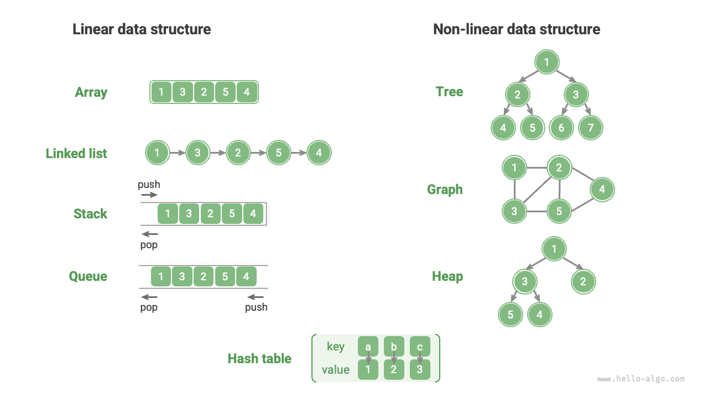
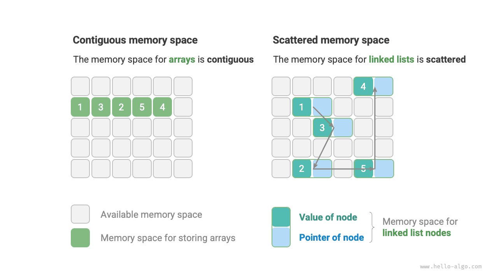

# Phân loại cấu trúc dữ liệu

Các cấu trúc dữ liệu phổ biến bao gồm mảng, danh sách liên kết, ngăn xếp, hàng đợi, bảng băm, cây, heap và đồ thị. Chúng có thể được phân loại theo hai khía cạnh: "cấu trúc logic" và "cấu trúc vật lý".

## Cấu trúc logic: tuyến tính và phi tuyến tính

**Cấu trúc logic thể hiện mối quan hệ logic giữa các phần tử dữ liệu**. Trong mảng và danh sách liên kết, dữ liệu được sắp xếp theo một trật tự nhất định, thể hiện mối quan hệ tuyến tính giữa các phần tử; còn trong cây, dữ liệu được sắp xếp theo thứ bậc từ trên xuống dưới, thể hiện mối quan hệ cha - con cháu; đồ thị được cấu thành từ các đỉnh và cạnh, phản ánh những mối quan hệ mạng lưới phức tạp.

Như hình minh họa dưới đây, cấu trúc logic có thể được chia thành hai nhóm lớn: "tuyến tính" và "phi tuyến tính". Cấu trúc tuyến tính trực quan hơn, thể hiện việc dữ liệu được sắp xếp tuyến tính về mặt quan hệ logic; cấu trúc phi tuyến tính thì ngược lại, được sắp xếp theo cách phi tuyến tính.

- **Cấu trúc dữ liệu tuyến tính**: Mảng, danh sách liên kết, ngăn xếp, hàng đợi, bảng băm, trong đó các phần tử có quan hệ tuần tự một - một.
- **Cấu trúc dữ liệu phi tuyến tính**: Cây, heap, đồ thị, bảng băm.

Cấu trúc dữ liệu phi tuyến tính có thể được chia nhỏ hơn thành cấu trúc dạng cây và cấu trúc dạng mạng.

- **Cấu trúc dạng cây**: Cây, heap, bảng băm, trong đó các phần tử có quan hệ một - nhiều.
- **Cấu trúc dạng mạng**: Đồ thị, trong đó các phần tử có quan hệ nhiều - nhiều.

## Cấu trúc vật lý: liên tục và phân tán

**Khi một chương trình giải thuật chạy, dữ liệu được xử lý chủ yếu được lưu trữ trong bộ nhớ**. Hình minh họa dưới đây cho thấy một thanh RAM máy tính, trong đó mỗi ô vuông đen chứa một không gian bộ nhớ. Ta có thể hình dung bộ nhớ như một bảng tính Excel khổng lồ, trong đó mỗi ô có thể lưu trữ một lượng dữ liệu nhất định.

**Hệ thống truy cập dữ liệu tại vị trí đích thông qua địa chỉ bộ nhớ**. Như hình minh họa dưới đây, máy tính gán cho mỗi ô trong bảng tính một số hiệu theo những quy tắc nhất định, đảm bảo mỗi không gian bộ nhớ có một địa chỉ bộ nhớ duy nhất. Nhờ các địa chỉ này, chương trình có thể truy cập dữ liệu trong bộ nhớ.

!!! tip

    Cần lưu ý rằng việc so sánh bộ nhớ với bảng tính Excel chỉ là một phép ẩn dụ đơn giản hóa. Cách thức hoạt động thực tế của bộ nhớ phức tạp hơn nhiều, liên quan đến các khái niệm như không gian địa chỉ, quản lý bộ nhớ, cơ chế bộ nhớ đệm (cache), bộ nhớ ảo và bộ nhớ vật lý.

Bộ nhớ là tài nguyên dùng chung cho tất cả các chương trình. Khi một khối bộ nhớ đã bị một chương trình chiếm dụng, nó thường không thể được các chương trình khác sử dụng đồng thời. **Do đó, trong việc thiết kế cấu trúc dữ liệu và giải thuật, tài nguyên bộ nhớ là một yếu tố cần cân nhắc quan trọng**. Chẳng hạn, mức sử dụng bộ nhớ đỉnh của một giải thuật không được vượt quá bộ nhớ trống còn lại của hệ thống; nếu thiếu các khối bộ nhớ lớn liên tục, thì cấu trúc dữ liệu được chọn phải có khả năng lưu trữ trong các không gian bộ nhớ phân tán.

Như hình minh họa dưới đây, **cấu trúc vật lý phản ánh cách dữ liệu được lưu trữ trong bộ nhớ máy tính**. Nó có thể được chia thành lưu trữ không gian liên tục (mảng) và lưu trữ không gian phân tán (danh sách liên kết). Ở mức thấp, cấu trúc vật lý quyết định cách dữ liệu được truy cập, cập nhật, chèn và xóa. Hai cấu trúc vật lý này thể hiện những đặc điểm bổ sung cho nhau về hiệu quả thời gian và hiệu quả không gian.

Đáng chú ý là **mọi cấu trúc dữ liệu đều được hiện thực dựa trên mảng, danh sách liên kết, hoặc sự kết hợp của cả hai**. Ví dụ, ngăn xếp và hàng đợi có thể được hiện thực bằng mảng hoặc danh sách liên kết; còn việc hiện thực bảng băm có thể bao gồm cả mảng lẫn danh sách liên kết.

- **Có thể hiện thực dựa trên mảng**: Ngăn xếp, hàng đợi, bảng băm, cây, heap, đồ thị, ma trận, tensor (mảng có số chiều $\geq 3$), v.v.
- **Có thể hiện thực dựa trên danh sách liên kết**: Ngăn xếp, hàng đợi, bảng băm, cây, heap, đồ thị, v.v.

Sau khi khởi tạo, danh sách liên kết vẫn có thể điều chỉnh độ dài trong quá trình chương trình thực thi, do đó còn được gọi là "cấu trúc dữ liệu động". Sau khi khởi tạo, độ dài của mảng không thể thay đổi, do đó còn được gọi là "cấu trúc dữ liệu tĩnh". Đáng chú ý là mảng vẫn có thể thay đổi độ dài bằng cách cấp phát lại bộ nhớ, nhờ đó vẫn giữ được một mức độ linh hoạt nhất định.

!!! tip

    Nếu bạn thấy khó hiểu về cấu trúc vật lý, nên đọc chương tiếp theo trước, sau đó quay lại xem lại phần này.
