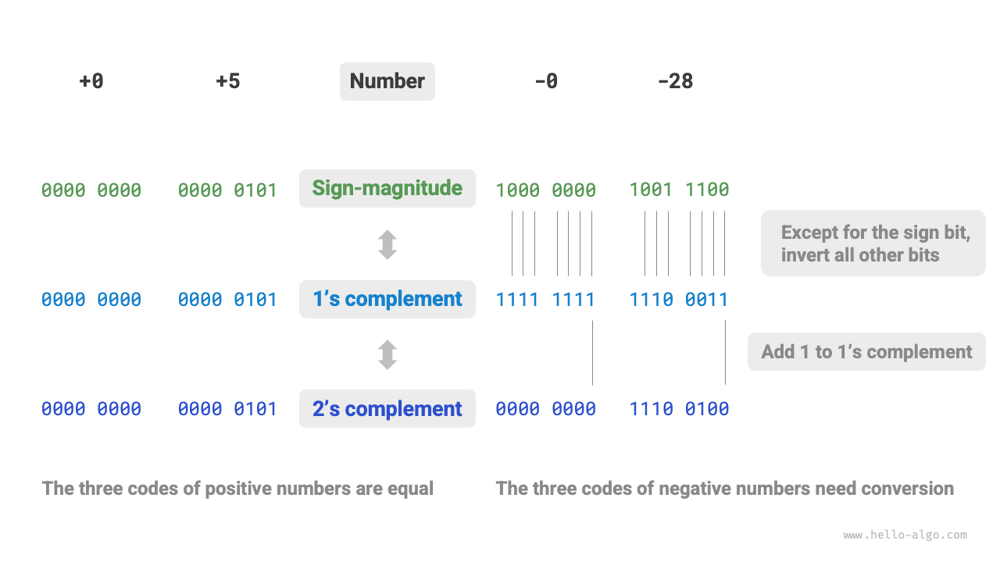

# Mã hóa số *

!!! tip

    Trong cuốn sách này, các chương được đánh dấu bằng dấu hoa thị * là nội dung đọc thêm không bắt buộc. Nếu bạn eo hẹp về thời gian hoặc thấy chúng khó hiểu, bạn có thể tạm bỏ qua và quay lại sau khi đã hoàn thành các chương thiết yếu.

## Mã thuận, mã ngược và mã bù

Trong bảng ở phần trước, ta thấy rằng mọi kiểu số nguyên đều có thể biểu diễn số âm nhiều hơn số dương đúng một đơn vị. Ví dụ, phạm vi của `byte` là $[-128, 127]$. Hiện tượng này khá phản trực giác, và nguyên nhân sâu xa của nó nằm ở các cách biểu diễn mã thuận (sign-magnitude), mã ngược (1's complement) và mã bù (2's complement).

Trước hết, cần lưu ý rằng **số được lưu trữ trong máy tính dưới dạng "mã bù"**. Trước khi phân tích lý do vì sao lại như vậy, hãy cùng định nghĩa ba khái niệm này.

- **Mã thuận (sign-magnitude)**: Ta coi bit cao nhất trong biểu diễn nhị phân của một số là bit dấu, trong đó $0$ biểu thị số dương và $1$ biểu thị số âm, còn các bit còn lại biểu diễn giá trị tuyệt đối của số đó.
- **Mã ngược (1's complement)**: Mã ngược của một số dương giống hệt mã thuận của nó. Đối với số âm, mã ngược thu được bằng cách đảo tất cả các bit trừ bit dấu trong mã thuận của số đó.
- **Mã bù (2's complement)**: Mã bù của một số dương giống hệt mã thuận của nó. Đối với số âm, mã bù thu được bằng cách cộng thêm $1$ vào mã ngược của số đó.

Hình minh họa dưới đây thể hiện cách chuyển đổi giữa mã thuận, mã ngược và mã bù.

<u>Mã thuận</u>, dù trực quan nhất, lại có một số hạn chế. Một mặt, **mã thuận của số âm không thể được dùng trực tiếp trong các phép tính**. Ví dụ, tính $1 + (-2)$ bằng mã thuận cho ra kết quả $-3$, rõ ràng là sai.

$$
\begin{aligned}
& 1 + (-2) \newline
& \rightarrow 0000 \; 0001 + 1000 \; 0010 \newline
& = 1000 \; 0011 \newline
& \rightarrow -3
\end{aligned}
$$

Để giải quyết vấn đề này, máy tính đã đưa vào <u>mã ngược</u>. Nếu trước tiên ta chuyển mã thuận thành mã ngược và tính $1 + (-2)$ bằng mã ngược, rồi chuyển kết quả trở lại thành mã thuận, ta sẽ thu được kết quả đúng là $-1$.

$$
\begin{aligned}
& 1 + (-2) \newline
& \rightarrow 0000 \; 0001 \; \text{(Mã thuận)} + 1000 \; 0010 \; \text{(Mã thuận)} \newline
& = 0000 \; 0001 \; \text{(Mã ngược)} + 1111  \; 1101 \; \text{(Mã ngược)} \newline
& = 1111 \; 1110 \; \text{(Mã ngược)} \newline
& = 1000 \; 0001 \; \text{(Mã thuận)} \newline
& \rightarrow -1
\end{aligned}
$$

Mặt khác, **mã thuận của số 0 có hai cách biểu diễn, $+0$ và $-0$**. Điều này có nghĩa là số 0 tương ứng với hai mã nhị phân khác nhau, có thể gây ra sự mập mờ. Ví dụ, trong các phép so sánh điều kiện, nếu ta không phân biệt giữa số không dương và số không âm, điều đó có thể dẫn đến kết quả so sánh sai. Nếu muốn xử lý sự mập mờ giữa số không dương và số không âm, ta cần bổ sung thêm các phép so sánh, điều này có thể làm giảm hiệu suất tính toán của máy tính.

$$
\begin{aligned}
+0 & \rightarrow 0000 \; 0000 \newline
-0 & \rightarrow 1000 \; 0000
\end{aligned}
$$

Giống như mã thuận, mã ngược cũng gặp vấn đề mập mờ giữa số không dương và số không âm. Do đó, máy tính đã tiếp tục đưa vào <u>mã bù</u>. Trước tiên, hãy quan sát quá trình chuyển đổi số không âm từ mã thuận sang mã ngược rồi sang mã bù:

$$
\begin{aligned}
-0 \rightarrow \; & 1000 \; 0000 \; \text{(Mã thuận)} \newline
= \; & 1111 \; 1111 \; \text{(Mã ngược)} \newline
= 1 \; & 0000 \; 0000 \; \text{(Mã bù)} \newline
\end{aligned}
$$

Việc cộng thêm $1$ vào mã ngược của số không âm tạo ra một số nhớ, nhưng vì kiểu `byte` chỉ có độ dài 8 bit, nên $1$ tràn ra bit thứ 9 sẽ bị loại bỏ. Nói cách khác, **mã bù của số không âm là $0000 \; 0000$, giống hệt mã bù của số không dương**. Điều này có nghĩa là trong biểu diễn mã bù, chỉ tồn tại duy nhất một số 0, nhờ đó sự mập mờ giữa số không dương và số không âm được giải quyết.

Còn một câu hỏi cuối cùng: phạm vi của kiểu `byte` là $[-128, 127]$, vậy số âm dư ra $-128$ đến từ đâu? Ta nhận thấy rằng mọi số nguyên trong khoảng $[-127, +127]$ đều có mã thuận, mã ngược và mã bù tương ứng, và mã thuận với mã bù có thể chuyển đổi qua lại lẫn nhau.

Tuy nhiên, **mã bù $1000 \; 0000$ lại là một ngoại lệ, nó không có mã thuận tương ứng**. Theo phương pháp chuyển đổi, ta suy ra mã thuận của mã bù này là $0000 \; 0000$. Điều này rõ ràng mâu thuẫn, vì mã thuận này biểu diễn số $0$, và mã bù của nó lẽ ra phải là chính nó. Máy tính quy định rằng mã bù đặc biệt $1000 \; 0000$ này biểu diễn $-128$. Thực tế, kết quả tính $(-1) + (-127)$ bằng mã bù chính là $-128$.

$$
\begin{aligned}
& (-127) + (-1) \newline
& \rightarrow 1111 \; 1111 \; \text{(Mã thuận)} + 1000 \; 0001 \; \text{(Mã thuận)} \newline
& = 1000 \; 0000 \; \text{(Mã ngược)} + 1111  \; 1110 \; \text{(Mã ngược)} \newline
& = 1000 \; 0001 \; \text{(Mã bù)} + 1111  \; 1111 \; \text{(Mã bù)} \newline
& = 1000 \; 0000 \; \text{(Mã bù)} \newline
& \rightarrow -128
\end{aligned}
$$

Bạn có thể nhận thấy rằng tất cả các phép tính ở trên đều là phép cộng. Điều này gợi ý một sự thật quan trọng: **các mạch phần cứng bên trong máy tính chủ yếu được thiết kế dựa trên phép cộng**. Đó là vì phép cộng đơn giản hơn để hiện thực trên phần cứng so với các phép toán khác (như nhân, chia, trừ), dễ song song hóa hơn, và có tốc độ tính toán nhanh hơn.

Xin lưu ý, điều này không có nghĩa là máy tính chỉ có thể thực hiện phép cộng. **Bằng cách kết hợp phép cộng với một số phép toán luận lý cơ bản, máy tính có thể hiện thực nhiều phép toán khác**. Ví dụ, phép tính trừ $a - b$ có thể được chuyển thành phép tính cộng $a + (-b)$; phép nhân và phép chia có thể được chuyển thành nhiều phép cộng hoặc trừ liên tiếp.

Giờ ta có thể tổng kết lý do vì sao máy tính sử dụng mã bù: với biểu diễn mã bù, máy tính có thể dùng chung mạch điện và các phép toán để xử lý phép cộng của cả số dương lẫn số âm, mà không cần thiết kế mạch phần cứng riêng cho phép trừ hay xử lý riêng sự mập mờ giữa số không dương và số không âm. Điều này giúp đơn giản hóa đáng kể việc thiết kế phần cứng và nâng cao hiệu suất.

Thiết kế của mã bù thực sự rất tinh tế. Do giới hạn về dung lượng, ta sẽ dừng lại ở đây. Bạn đọc quan tâm được khuyến khích tìm hiểu thêm.

## Mã hóa số thực dấu phẩy động

Những bạn đọc để ý có thể nhận ra: `int` và `float` có cùng độ dài, đều là 4 byte, nhưng vì sao `float` lại có phạm vi lớn hơn nhiều so với `int`? Điều này khá phản trực giác, vì lẽ ra `float` cần biểu diễn số thập phân, nên phạm vi của nó phải nhỏ hơn mới hợp lý.

Trên thực tế, **đó là vì số thực dấu phẩy động `float` sử dụng một phương pháp biểu diễn khác**. Hãy ký hiệu một số nhị phân 32 bit là:

$$
b_{31} b_{30} b_{29} \ldots b_2 b_1 b_0
$$

Theo chuẩn IEEE 754, một `float` 32-bit gồm ba phần sau.

- Bit dấu $\mathrm{S}$: chiếm 1 bit, tương ứng với $b_{31}$.
- Bit mũ $\mathrm{E}$: chiếm 8 bit, tương ứng với $b_{30} b_{29} \ldots b_{23}$.
- Bit phần định trị $\mathrm{N}$: chiếm 23 bit, tương ứng với $b_{22} b_{21} \ldots b_0$.

Cách tính giá trị tương ứng với `float` dạng nhị phân là:

$$
\text {val} = (-1)^{b_{31}} \times 2^{\left(b_{30} b_{29} \ldots b_{23}\right)_2-127} \times\left(1 . b_{22} b_{21} \ldots b_0\right)_2
$$

Chuyển sang thập phân, công thức tính là:

$$
\text {val}=(-1)^{\mathrm{S}} \times 2^{\mathrm{E} -127} \times (1 + \mathrm{N})
$$

Phạm vi của mỗi thành phần là:

$$
\begin{aligned}
\mathrm{S} \in & \{ 0, 1\}, \quad \mathrm{E} \in \{ 1, 2, \dots, 254 \} \newline
(1 + \mathrm{N}) = & (1 + \sum_{i=1}^{23} b_{23-i} 2^{-i}) \subset [1, 2 - 2^{-23}]
\end{aligned}
$$

Quan sát hình trên, với dữ liệu ví dụ $\mathrm{S} = 0$, $\mathrm{E} = 124$, $\mathrm{N} = 2^{-2} + 2^{-3} = 0.375$, ta có:

$$
\text { val } = (-1)^0 \times 2^{124 - 127} \times (1 + 0.375) = 0.171875
$$

Giờ ta có thể trả lời câu hỏi ban đầu: **cách biểu diễn của `float` bao gồm bit mũ, khiến phạm vi của nó lớn hơn nhiều so với `int`**. Theo cách tính ở trên, số dương lớn nhất mà `float` có thể biểu diễn là $2^{254 - 127} \times (2 - 2^{-23}) \approx 3.4 \times 10^{38}$, và số âm nhỏ nhất có thể thu được bằng cách đổi bit dấu.

**Mặc dù số thực dấu phẩy động `float` mở rộng phạm vi, nhưng cái giá phải trả là hy sinh độ chính xác**. Kiểu số nguyên `int` dùng toàn bộ 32 bit để biểu diễn số, và các số được phân bố đều nhau; tuy nhiên, do sự tồn tại của bit mũ, giá trị của số thực dấu phẩy động `float` càng lớn thì khoảng cách giữa hai số liền kề thường càng lớn.

Như bảng dưới đây, bit mũ $\mathrm{E} = 0$ và $\mathrm{E} = 255$ mang ý nghĩa đặc biệt, **dùng để biểu diễn số 0, vô cực, $\mathrm{NaN}$, v.v.**

 Bảng <id> &nbsp; Ý nghĩa của bit mũ 

| Bit mũ E           | Bit phần định trị $\mathrm{N} = 0$ | Bit phần định trị $\mathrm{N} \ne 0$ | Công thức tính                                                          |
| ------------------ | ----------------------------- | ------------------------------- | ---------------------------------------------------------------------- |
| $0$                | $\pm 0$                       | Số không chuẩn hóa (subnormal)  | $(-1)^{\mathrm{S}} \times 2^{-126} \times (0.\mathrm{N})$              |
| $1, 2, \dots, 254$ | Số chuẩn hóa (normal)         | Số chuẩn hóa (normal)           | $(-1)^{\mathrm{S}} \times 2^{(\mathrm{E} -127)} \times (1.\mathrm{N})$ |
| $255$              | $\pm \infty$                  | $\mathrm{NaN}$                  |                                                                        |

Đáng chú ý là số không chuẩn hóa (subnormal number) giúp cải thiện đáng kể độ chính xác của số thực dấu phẩy động. Số dương chuẩn hóa nhỏ nhất là $2^{-126}$, còn số dương không chuẩn hóa nhỏ nhất là $2^{-126} \times 2^{-23}$.

Kiểu số thực độ chính xác kép `double` cũng dùng phương pháp biểu diễn tương tự `float`, ta sẽ không trình bày chi tiết ở đây.
