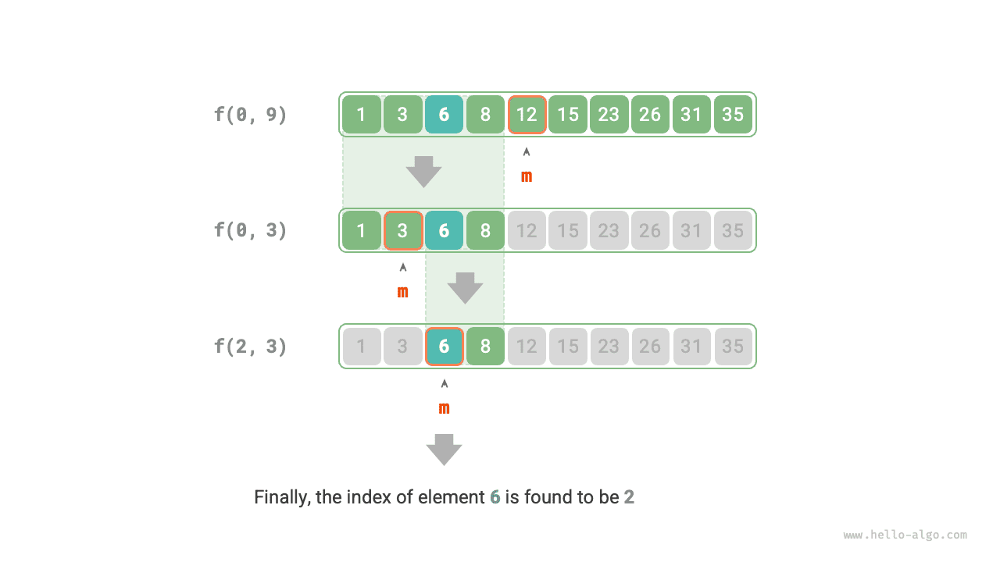

# Chiến lược tìm kiếm chia để trị

Chúng ta đã biết rằng các thuật toán tìm kiếm được chia thành hai loại lớn.

- **Tìm kiếm vét cạn**: Được triển khai bằng cách duyệt qua cấu trúc dữ liệu, với độ phức tạp thời gian là $O(n)$.
- **Tìm kiếm thích ứng**: Tận dụng cách tổ chức dữ liệu cụ thể hoặc thông tin đã biết trước, đạt độ phức tạp thời gian $O(\log n)$ hoặc thậm chí $O(1)$.

Trên thực tế, **các thuật toán tìm kiếm có độ phức tạp thời gian $O(\log n)$ thường được triển khai dựa trên chiến lược chia để trị**, chẳng hạn như tìm kiếm nhị phân và cây.

- Mỗi bước của tìm kiếm nhị phân chia bài toán (tìm phần tử mục tiêu trong một mảng) thành một bài toán nhỏ hơn (tìm phần tử mục tiêu trong một nửa mảng), tiếp tục cho đến khi mảng rỗng hoặc tìm thấy phần tử mục tiêu.
- Cây là đại diện tiêu biểu cho ý tưởng chia để trị. Trong các cấu trúc dữ liệu như cây tìm kiếm nhị phân, cây AVL và đống, độ phức tạp thời gian của các thao tác khác nhau đều là $O(\log n)$.

Chiến lược chia để trị của tìm kiếm nhị phân như sau.

- **Bài toán có thể phân rã được**: Tìm kiếm nhị phân đệ quy phân rã bài toán gốc (tìm kiếm trong một mảng) thành các bài toán con (tìm kiếm trong một nửa mảng), đạt được bằng cách so sánh phần tử ở giữa với phần tử mục tiêu.
- **Các bài toán con độc lập với nhau**: Trong tìm kiếm nhị phân, mỗi vòng chỉ xử lý một bài toán con, không bị ảnh hưởng bởi các bài toán con khác.
- **Lời giải của các bài toán con không cần được hợp nhất**: Tìm kiếm nhị phân nhằm mục đích tìm một phần tử cụ thể, nên không cần hợp nhất lời giải của các bài toán con. Khi một bài toán con được giải, bài toán gốc cũng được giải.

Chia để trị có thể cải thiện hiệu suất tìm kiếm vì tìm kiếm vét cạn chỉ có thể loại bỏ một lựa chọn mỗi vòng, **trong khi tìm kiếm chia để trị có thể loại bỏ một nửa số lựa chọn mỗi vòng**.

### Triển khai tìm kiếm nhị phân dựa trên chia để trị

Trong các phần trước, tìm kiếm nhị phân được triển khai dựa trên lặp. Bây giờ ta sẽ triển khai nó dựa trên chia để trị (đệ quy).

!!! question

    Cho một mảng đã sắp xếp `nums` có độ dài $n$, trong đó tất cả các phần tử đều duy nhất, tìm `target`.

Theo góc nhìn chia để trị, ta ký hiệu bài toán con tương ứng với khoảng tìm kiếm $[i, j]$ là $f(i, j)$.

Bắt đầu từ bài toán gốc $f(0, n-1)$, thực hiện tìm kiếm nhị phân qua các bước sau đây.

1. Tính điểm giữa $m$ của khoảng tìm kiếm $[i, j]$, và dùng nó để loại bỏ một nửa khoảng tìm kiếm.
2. Đệ quy giải bài toán con có kích thước giảm đi một nửa, có thể là $f(i, m-1)$ hoặc $f(m+1, j)$.
3. Lặp lại bước `1.` và `2.` cho đến khi tìm thấy `target`, hoặc trả về khi khoảng tìm kiếm rỗng.

Hình dưới đây minh họa quá trình chia để trị của tìm kiếm nhị phân đối với phần tử $6$ trong một mảng.



Trong mã triển khai, ta khai báo một hàm đệ quy `dfs()` để giải bài toán $f(i, j)$:

```src
[file]{binary_search_recur}-[class]{}-[func]{binary_search}
```
