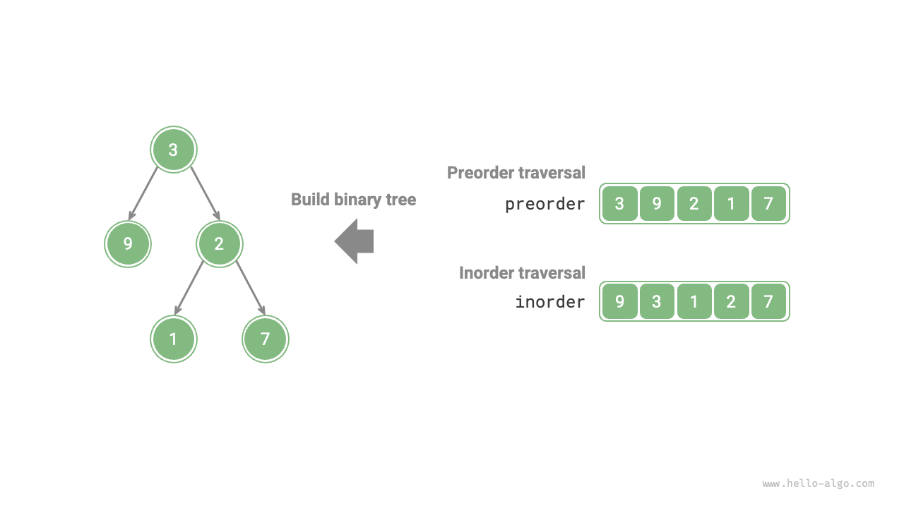
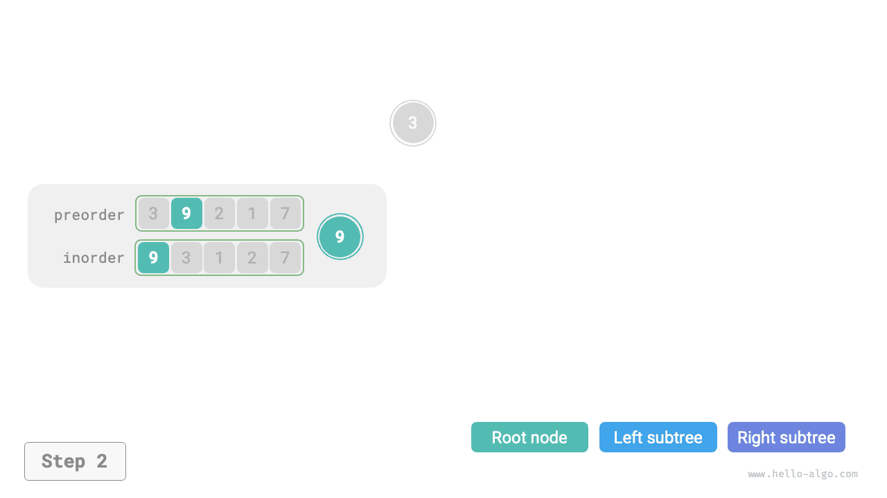
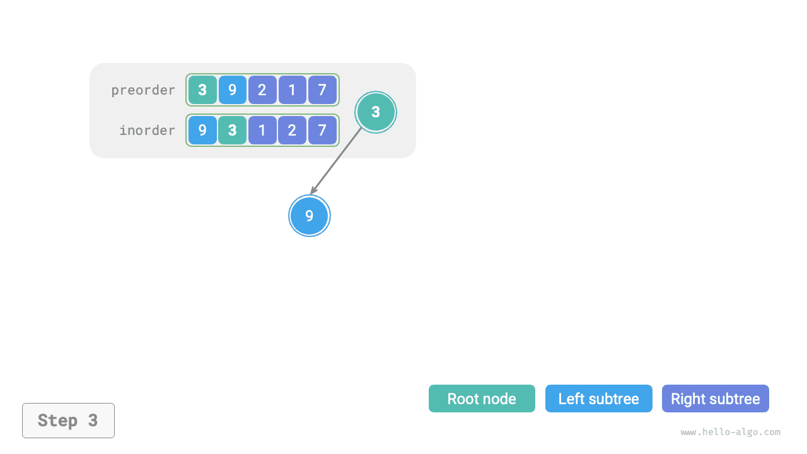
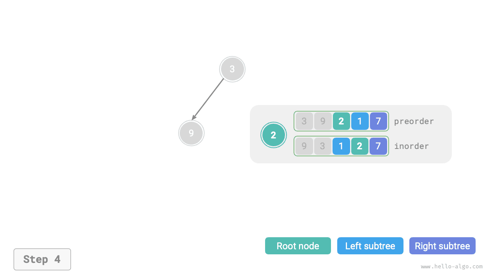
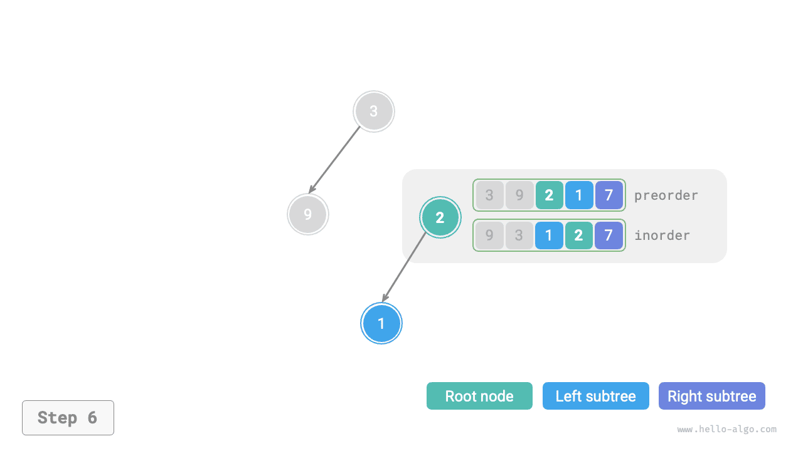
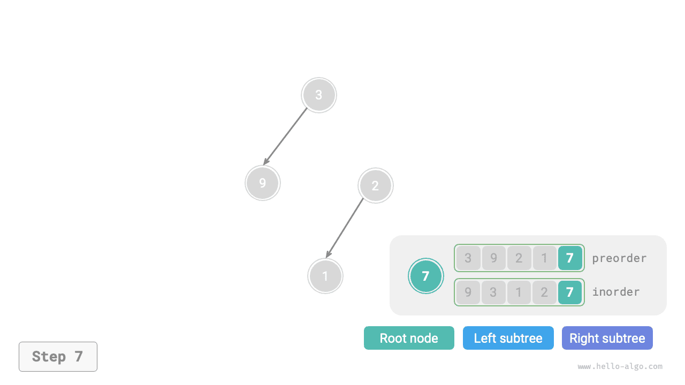
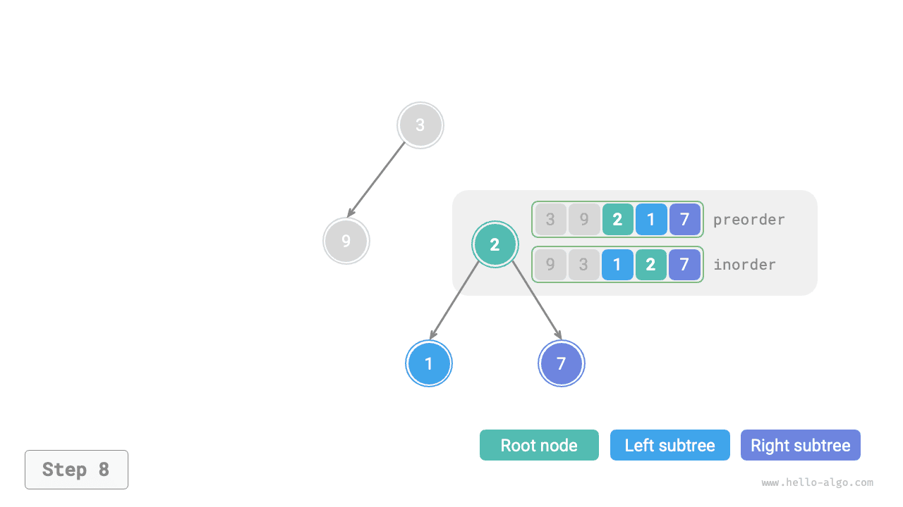
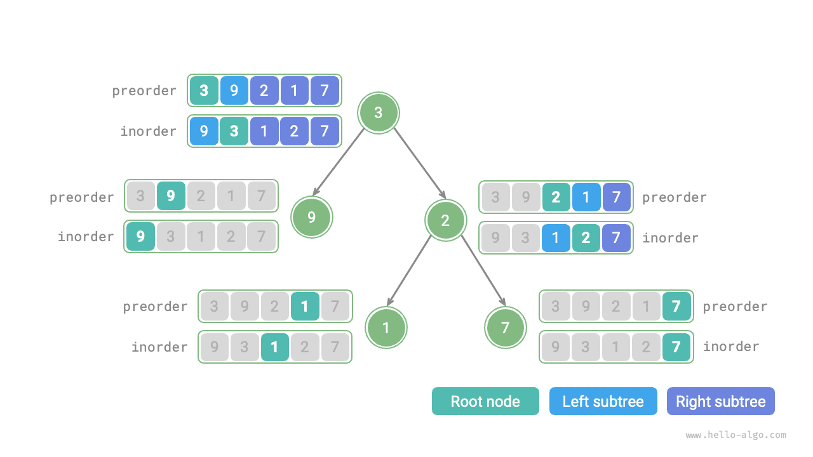

# Bài toán xây dựng cây nhị phân

!!! question

    Cho dãy duyệt trước `preorder` và dãy duyệt giữa `inorder` của một cây nhị phân, hãy xây dựng lại cây nhị phân đó và trả về nút gốc của cây. Giả sử cây nhị phân không có giá trị nút trùng lặp (như hình minh họa dưới đây).



### Xác định xem đây có phải là bài toán chia để trị

Bài toán gốc được định nghĩa là xây dựng cây nhị phân từ `preorder` và `inorder`, đây là một bài toán chia để trị điển hình.

- **Bài toán có thể phân rã**: Xét theo góc độ chia để trị, ta có thể chia bài toán gốc thành hai bài toán con: xây dựng cây con trái và xây dựng cây con phải, cộng thêm một thao tác: khởi tạo nút gốc. Với mỗi cây con (bài toán con), ta vẫn có thể áp dụng lại cách chia trên, tiếp tục chia thành các cây con nhỏ hơn (bài toán con nhỏ hơn) cho đến khi đạt bài toán con nhỏ nhất (cây con rỗng).
- **Các bài toán con độc lập với nhau**: Cây con trái và cây con phải độc lập với nhau, không có sự chồng lấp giữa chúng. Khi xây dựng cây con trái, ta chỉ cần quan tâm đến phần dãy duyệt giữa và duyệt trước tương ứng với cây con trái. Tương tự đối với cây con phải.
- **Lời giải của các bài toán con có thể hợp nhất**: Sau khi có được cây con trái và cây con phải (lời giải của các bài toán con), ta có thể liên kết chúng với nút gốc để thu được lời giải cho bài toán gốc.

### Cách chia các cây con

Dựa trên phân tích trên, bài toán này có thể được giải bằng chia để trị, **nhưng làm thế nào để chia cây con trái và cây con phải thông qua dãy duyệt trước `preorder` và dãy duyệt giữa `inorder`**?

Theo định nghĩa, cả `preorder` và `inorder` đều có thể được chia thành ba phần.

- Duyệt trước: `[ Nút gốc | Cây con trái | Cây con phải ]`, ví dụ, cây trong hình trên tương ứng với `[ 3 | 9 | 2 1 7 ]`.
- Duyệt giữa: `[ Cây con trái | Nút gốc ｜ Cây con phải ]`, ví dụ, cây trong hình trên tương ứng với `[ 9 | 3 | 1 2 7 ]`.

Lấy dữ liệu trong hình trên làm ví dụ, ta có thể thu được kết quả chia thông qua các bước dưới đây.

1. Phần tử đầu tiên 3 trong dãy duyệt trước chính là giá trị của nút gốc.
2. Tìm chỉ số của nút gốc 3 trong `inorder`, và dùng chỉ số này để chia `inorder` thành `[ 9 | 3 ｜ 1 2 7 ]`.
3. Dựa vào kết quả chia của `inorder`, dễ dàng xác định cây con trái và cây con phải lần lượt có 1 và 3 nút, từ đó ta có thể chia `preorder` thành `[ 3 | 9 | 2 1 7 ]`.


### Mô tả khoảng cây con dựa trên biến

Dựa trên cách chia trên, **ta đã thu được khoảng chỉ số của nút gốc, cây con trái và cây con phải trong `preorder` và `inorder`**. Để mô tả các khoảng chỉ số này, ta cần sử dụng một vài biến chỉ số.

- Ký hiệu chỉ số của nút gốc của cây hiện tại trong `preorder` là $i$.
- Ký hiệu chỉ số của nút gốc của cây hiện tại trong `inorder` là $m$.
- Ký hiệu khoảng chỉ số của cây hiện tại trong `inorder` là $[l, r]$.

Như bảng dưới đây thể hiện, thông qua các biến này ta có thể biểu diễn chỉ số của nút gốc trong `preorder` và khoảng chỉ số của các cây con trong `inorder`.

<p align="center"> Bảng <id> &nbsp; Chỉ số của nút gốc và các cây con trong dãy duyệt trước và duyệt giữa </p>

|              | Chỉ số nút gốc trong `preorder` | Khoảng chỉ số cây con trong `inorder` |
| ------------ | -------------------------------- | -------------------------------------- |
| Cây hiện tại | $i$                               | $[l, r]$                                |
| Cây con trái | $i + 1$                           | $[l, m-1]$                              |
| Cây con phải | $i + 1 + (m - l)$                 | $[m+1, r]$                              |

Xin lưu ý rằng $(m-l)$ trong chỉ số nút gốc của cây con phải có nghĩa là "số lượng nút trong cây con trái". Nên hiểu điều này kết hợp với hình minh họa dưới đây.


### Triển khai mã nguồn

Để cải thiện hiệu quả truy vấn $m$, ta dùng một bảng băm `hmap` để lưu ánh xạ từ các phần tử trong mảng `inorder` đến chỉ số của chúng:

```src
[file]{build_tree}-[class]{}-[func]{build_tree}
```

Hình dưới đây minh họa quá trình đệ quy xây dựng cây nhị phân. Mỗi nút được thiết lập trong quá trình "đệ quy" đi xuống, còn mỗi cạnh (tham chiếu) được thiết lập trong quá trình "quay lui" đi lên.

=== "<1>"
    

=== "<2>"
    

=== "<3>"
    

=== "<4>"
    

=== "<5>"
    

=== "<6>"
    

=== "<7>"
    

=== "<8>"
    

=== "<9>"
    

Kết quả chia của dãy duyệt trước `preorder` và dãy duyệt giữa `inorder` trong mỗi lần gọi hàm đệ quy được thể hiện trong hình dưới đây.



Gọi số lượng nút trong cây là $n$. Việc khởi tạo mỗi nút (thực thi một lần hàm đệ quy `dfs()`) tốn thời gian $O(1)$. **Do đó, độ phức tạp thời gian tổng thể là $O(n)$**.

Bảng băm lưu ánh xạ từ các phần tử `inorder` đến chỉ số của chúng, với độ phức tạp không gian là $O(n)$. Trong trường hợp xấu nhất, khi cây nhị phân suy biến thành danh sách liên kết, độ sâu đệ quy đạt tới $n$, sử dụng $O(n)$ không gian ngăn xếp hàm. **Do đó, độ phức tạp không gian tổng thể là $O(n)$**.
