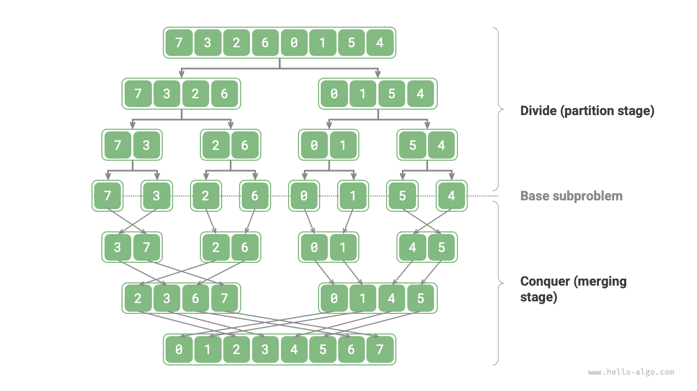

# Thuật toán chia để trị

<u>Chia để trị</u> là một chiến lược thuật toán rất quan trọng và phổ biến. Chia để trị thường được triển khai dựa trên đệ quy, bao gồm hai bước: "chia" và "trị".

1. **Chia (giai đoạn phân chia)**: Đệ quy chia bài toán gốc thành hai hoặc nhiều bài toán con cho đến khi đạt được bài toán con nhỏ nhất.
2. **Trị (giai đoạn hợp nhất)**: Bắt đầu từ các bài toán con nhỏ nhất đã có lời giải, hợp nhất các lời giải của bài toán con từ dưới lên trên để xây dựng lời giải cho bài toán gốc.

Như hình minh họa dưới đây, "sắp xếp trộn" là một trong những ứng dụng tiêu biểu của chiến lược chia để trị.

1. **Chia**: Đệ quy chia mảng gốc (bài toán gốc) thành hai mảng con (bài toán con) cho đến khi mảng con chỉ còn một phần tử (bài toán con nhỏ nhất).
2. **Trị**: Hợp nhất các mảng con đã sắp xếp (lời giải của bài toán con) từ dưới lên trên để thu được mảng gốc đã sắp xếp (lời giải của bài toán gốc).

## Cách xác định bài toán chia để trị

Việc một bài toán có phù hợp để giải bằng chia để trị hay không thường có thể được xác định dựa trên các tiêu chí sau đây.

1. **Bài toán có thể phân rã được**: Bài toán gốc có thể được chia thành các bài toán con nhỏ hơn, tương tự nhau, và có thể tiếp tục được chia đệ quy theo cùng một cách.
2. **Các bài toán con độc lập với nhau**: Không có sự chồng chéo giữa các bài toán con, chúng độc lập với nhau và có thể được giải độc lập.
3. **Lời giải của các bài toán con có thể được hợp nhất**: Lời giải của bài toán gốc thu được bằng cách hợp nhất lời giải của các bài toán con.

Rõ ràng, sắp xếp trộn thỏa mãn cả ba tiêu chí này.

1. **Bài toán có thể phân rã được**: Đệ quy chia mảng (bài toán gốc) thành hai mảng con (bài toán con).
2. **Các bài toán con độc lập với nhau**: Mỗi mảng con có thể được sắp xếp độc lập (các bài toán con có thể được giải độc lập).
3. **Lời giải của các bài toán con có thể được hợp nhất**: Hai mảng con đã sắp xếp (lời giải của các bài toán con) có thể được hợp nhất thành một mảng đã sắp xếp (lời giải của bài toán gốc).

## Cải thiện hiệu suất nhờ chia để trị

**Chia để trị không chỉ giải quyết hiệu quả các bài toán thuật toán mà còn thường có thể cải thiện hiệu suất của thuật toán**. Trong các thuật toán sắp xếp, sắp xếp nhanh, sắp xếp trộn và sắp xếp vun đống nhanh hơn sắp xếp chọn, sắp xếp nổi bọt và sắp xếp chèn vì chúng áp dụng chiến lược chia để trị.

Điều này đặt ra câu hỏi: **Vì sao chia để trị có thể cải thiện hiệu suất thuật toán, và logic đằng sau đó là gì**? Nói cách khác, tại sao việc chia một bài toán lớn thành nhiều bài toán con, giải các bài toán con rồi hợp nhất lời giải của chúng lại hiệu quả hơn so với việc giải trực tiếp bài toán gốc? Câu hỏi này có thể được bàn luận từ hai khía cạnh: số lượng phép toán và tính toán song song.

### Tối ưu hóa số lượng phép toán

Lấy "sắp xếp nổi bọt" làm ví dụ, xử lý một mảng có độ dài $n$ cần thời gian $O(n^2)$. Giả sử ta chia mảng tại điểm giữa thành hai mảng con, như hình minh họa dưới đây. Việc chia cần thời gian $O(n)$, sắp xếp mỗi mảng con cần thời gian $O((n / 2)^2)$, và hợp nhất hai mảng con cần thời gian $O(n)$, dẫn đến độ phức tạp thời gian tổng thể là:

$$
O(n + (\frac{n}{2})^2 \times 2 + n) = O(\frac{n^2}{2} + 2n)
$$

Tiếp theo, ta tính bất đẳng thức sau, trong đó vế trái và vế phải lần lượt đại diện cho tổng số phép toán trước và sau khi chia:

$$
\begin{aligned}
n^2 & > \frac{n^2}{2} + 2n \newline
n^2 - \frac{n^2}{2} - 2n & > 0 \newline
n(n - 4) & > 0
\end{aligned}
$$

**Điều này có nghĩa là khi $n > 4$, số lượng phép toán sau khi chia sẽ nhỏ hơn, và hiệu suất sắp xếp sẽ cao hơn**. Lưu ý rằng độ phức tạp thời gian sau khi chia vẫn là bậc hai $O(n^2)$, nhưng hằng số trong độ phức tạp đã trở nên nhỏ hơn.

Đi xa hơn nữa, **điều gì sẽ xảy ra nếu ta tiếp tục chia các mảng con từ điểm giữa của chúng thành hai mảng con** cho đến khi mảng con chỉ còn một phần tử? Cách tiếp cận này chính là "sắp xếp trộn", với độ phức tạp thời gian là $O(n \log n)$.

Suy nghĩ xa hơn nữa, **điều gì sẽ xảy ra nếu ta đặt nhiều điểm chia** và chia đều mảng gốc thành $k$ mảng con? Tình huống này rất giống với "sắp xếp theo giỏ", vốn rất phù hợp để sắp xếp lượng dữ liệu khổng lồ, với độ phức tạp thời gian lý thuyết là $O(n + k)$.

### Tối ưu hóa tính toán song song

Ta biết rằng các bài toán con được sinh ra bởi chia để trị độc lập với nhau, **nên chúng thường có thể được giải song song**. Điều này có nghĩa là chia để trị không chỉ giúp giảm độ phức tạp thời gian của thuật toán, **mà còn dễ dàng được hệ điều hành tối ưu hóa song song**.

Tối ưu hóa song song đặc biệt hiệu quả trong môi trường đa lõi hoặc đa bộ xử lý, vì hệ thống có thể xử lý đồng thời nhiều bài toán con, tận dụng tối đa tài nguyên tính toán và giảm đáng kể thời gian chạy tổng thể.

Ví dụ, trong "sắp xếp theo giỏ" như hình minh họa dưới đây, ta phân phối đều lượng dữ liệu khổng lồ vào các giỏ khác nhau, và các tác vụ sắp xếp cho tất cả các giỏ có thể được phân bổ cho các đơn vị tính toán khác nhau. Sau khi hoàn thành, các kết quả sẽ được hợp nhất lại.

## Các ứng dụng phổ biến của chia để trị

Một mặt, chia để trị có thể được dùng để giải nhiều bài toán thuật toán kinh điển.

- **Tìm cặp điểm gần nhau nhất**: Thuật toán này trước tiên chia tập điểm thành hai phần, sau đó tìm cặp điểm gần nhau nhất trong mỗi phần một cách riêng biệt, và cuối cùng tìm cặp điểm gần nhau nhất trải dài qua cả hai phần.
- **Nhân số nguyên lớn**: Ví dụ, thuật toán Karatsuba, phân rã phép nhân số nguyên lớn thành nhiều phép nhân và phép cộng số nguyên nhỏ hơn.
- **Nhân ma trận**: Ví dụ, thuật toán Strassen, phân rã phép nhân ma trận lớn thành nhiều phép nhân và phép cộng ma trận nhỏ hơn.
- **Bài toán tháp Hà Nội**: Bài toán tháp Hà Nội có thể được giải thông qua đệ quy, đây là một ứng dụng tiêu biểu của chiến lược chia để trị.
- **Giải bài toán cặp nghịch thế**: Trong một dãy, nếu một số đứng trước lớn hơn một số đứng sau, hai số này tạo thành một cặp nghịch thế. Việc giải bài toán cặp nghịch thế có thể sử dụng phương pháp chia để trị với sự trợ giúp của sắp xếp trộn.

Mặt khác, chia để trị được ứng dụng rộng rãi trong việc thiết kế thuật toán và cấu trúc dữ liệu.

- **Tìm kiếm nhị phân**: Tìm kiếm nhị phân chia một mảng đã sắp xếp thành hai phần từ chỉ số giữa, sau đó quyết định loại bỏ nửa nào dựa trên kết quả so sánh giữa giá trị mục tiêu và giá trị phần tử ở giữa, rồi thực hiện cùng bước tìm kiếm nhị phân đó trên khoảng còn lại.
- **Sắp xếp trộn**: Đã được giới thiệu ở đầu phần này, không cần trình bày thêm.
- **Sắp xếp nhanh**: Sắp xếp nhanh chọn một giá trị chốt, sau đó chia mảng thành hai mảng con, một mảng chứa các phần tử nhỏ hơn giá trị chốt và mảng còn lại chứa các phần tử lớn hơn giá trị chốt, rồi thực hiện cùng thao tác chia đó trên hai phần này cho đến khi mảng con chỉ còn một phần tử.
- **Sắp xếp theo giỏ**: Ý tưởng cơ bản của sắp xếp theo giỏ là phân tán dữ liệu vào nhiều giỏ, sau đó sắp xếp các phần tử bên trong mỗi giỏ, và cuối cùng lấy ra các phần tử từ mỗi giỏ theo thứ tự để thu được một mảng đã sắp xếp.
- **Cây**: Ví dụ, cây tìm kiếm nhị phân, cây AVL, cây đỏ đen, cây B, cây B+, v.v. Các thao tác tìm kiếm, thêm và xóa của chúng đều có thể được xem là ứng dụng của chiến lược chia để trị.
- **Đống (heap)**: Đống là một loại cây nhị phân hoàn chỉnh đặc biệt, và các thao tác khác nhau của nó, chẳng hạn như thêm, xóa và vun đống, thực chất đều hàm chứa ý tưởng chia để trị.
- **Bảng băm**: Mặc dù bảng băm không trực tiếp áp dụng chia để trị, một số phương pháp giải quyết xung đột băm lại gián tiếp áp dụng chiến lược chia để trị. Ví dụ, các danh sách liên kết dài trong phương pháp nối chuỗi có thể được chuyển đổi thành cây đỏ đen để cải thiện hiệu suất tra cứu.

Có thể thấy rằng **chia để trị là một ý tưởng thuật toán "âm thầm len lỏi khắp nơi"**, được nhúng vào trong nhiều thuật toán và cấu trúc dữ liệu khác nhau.
