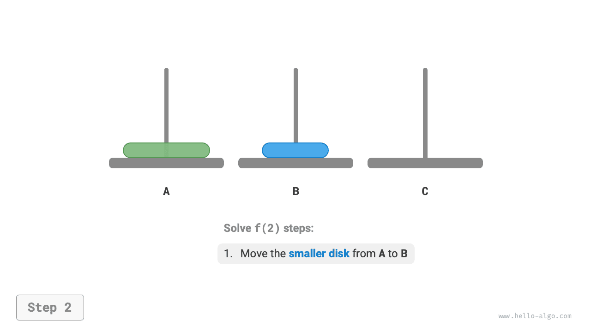
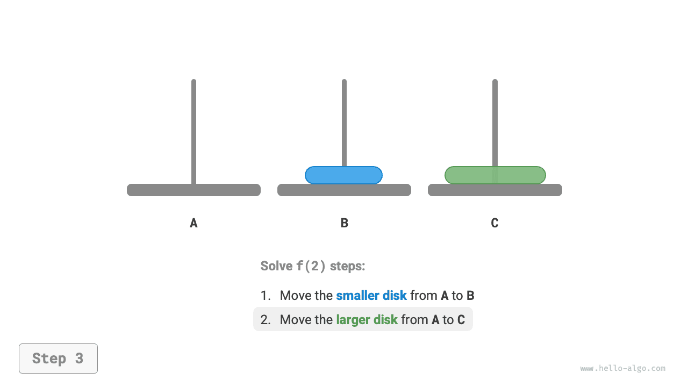
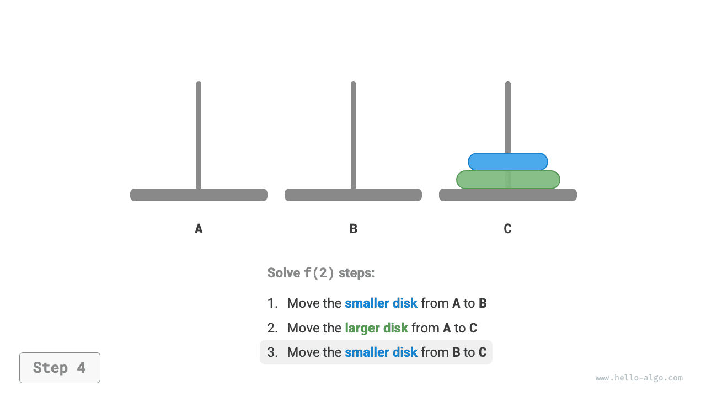
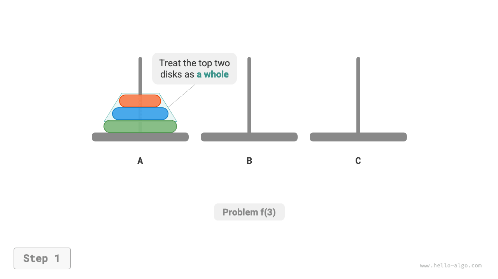
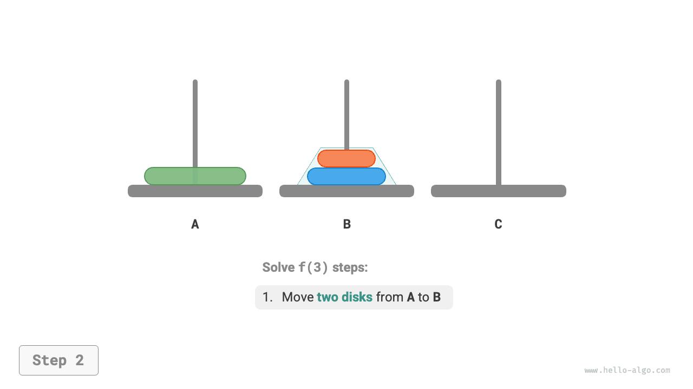
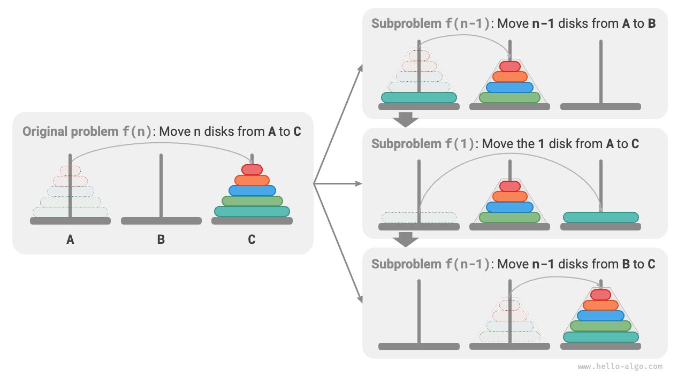
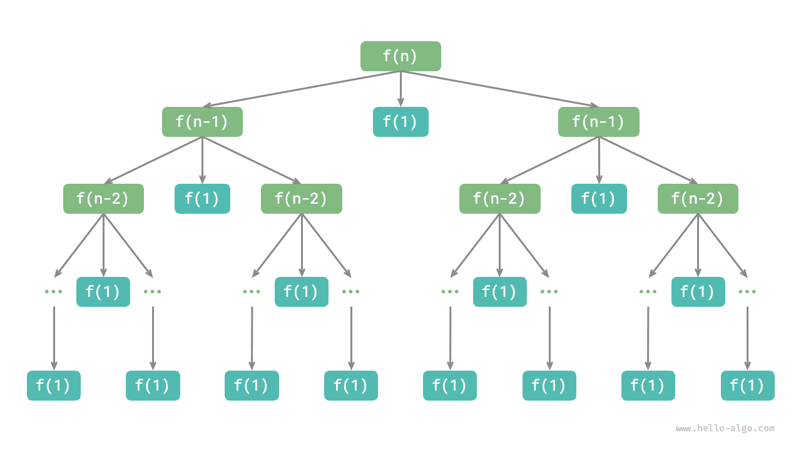

# Bài toán tháp Hà Nội

Trong sắp xếp trộn và xây dựng cây nhị phân, ta phân rã bài toán gốc thành hai bài toán con, mỗi bài toán con có kích thước bằng một nửa bài toán gốc. Tuy nhiên, đối với bài toán tháp Hà Nội, ta áp dụng một chiến lược phân rã khác.

!!! question

    Cho ba cột trụ, ký hiệu là `A`, `B` và `C`. Ban đầu, cột `A` có $n$ đĩa xếp chồng lên nhau, được sắp xếp từ trên xuống dưới theo thứ tự kích thước tăng dần. Nhiệm vụ của chúng ta là di chuyển $n$ đĩa này sang cột `C` trong khi vẫn giữ nguyên thứ tự ban đầu của chúng (như hình minh họa dưới đây). Các quy tắc sau phải được tuân thủ khi di chuyển đĩa.

    1. Một đĩa chỉ có thể được lấy từ đỉnh của một cột trụ và đặt lên đỉnh của một cột trụ khác.
    2. Mỗi lần chỉ được di chuyển một đĩa.
    3. Đĩa nhỏ hơn luôn phải nằm trên đĩa lớn hơn.


**Ta ký hiệu bài toán tháp Hà Nội có kích thước $i$ là $f(i)$**. Ví dụ, $f(3)$ biểu thị việc di chuyển $3$ đĩa từ `A` sang `C`.

### Xét các trường hợp cơ sở

Như hình dưới đây thể hiện, đối với bài toán $f(1)$, khi chỉ có một đĩa, ta có thể di chuyển trực tiếp từ `A` sang `C`.

=== "<1>"
    

=== "<2>"
    

Như hình dưới đây thể hiện, đối với bài toán $f(2)$, khi có hai đĩa, **vì ta luôn phải giữ đĩa nhỏ hơn nằm trên đĩa lớn hơn, ta cần sử dụng `B` để hỗ trợ việc di chuyển**.

1. Trước tiên, di chuyển đĩa nhỏ hơn từ `A` sang `B`.
2. Sau đó di chuyển đĩa lớn hơn từ `A` sang `C`.
3. Cuối cùng, di chuyển đĩa nhỏ hơn từ `B` sang `C`.

=== "<1>"
    

=== "<2>"
    

=== "<3>"
    

=== "<4>"
    

Quá trình giải bài toán $f(2)$ có thể tóm tắt là: **di chuyển hai đĩa từ `A` sang `C` với sự hỗ trợ của `B`**. Ở đây, `C` được gọi là cột đích, còn `B` được gọi là cột đệm.

### Phân rã bài toán con

Đối với bài toán $f(3)$, khi có ba đĩa, tình huống trở nên phức tạp hơn một chút.

Vì ta đã biết lời giải của $f(1)$ và $f(2)$, ta có thể tư duy theo góc độ chia để trị, **coi hai đĩa trên cùng của `A` như một khối thống nhất**, và thực hiện các bước như hình dưới đây. Điều này thành công trong việc di chuyển ba đĩa từ `A` sang `C`.

1. Coi `B` là cột đích và `C` là cột đệm, di chuyển hai đĩa từ `A` sang `B`.
2. Di chuyển đĩa còn lại từ `A` trực tiếp sang `C`.
3. Coi `C` là cột đích và `A` là cột đệm, di chuyển hai đĩa từ `B` sang `C`.

=== "<1>"
    

=== "<2>"
    

=== "<3>"
    

=== "<4>"
    

Về bản chất, **ta chia bài toán $f(3)$ thành hai bài toán con $f(2)$ và một bài toán con $f(1)$**. Bằng cách giải ba bài toán con này theo đúng thứ tự, bài toán gốc được giải quyết. Điều này cho thấy các bài toán con độc lập với nhau và lời giải của chúng có thể được hợp nhất.

Từ đó, ta có thể tổng kết chiến lược chia để trị để giải bài toán tháp Hà Nội như hình dưới đây: chia bài toán gốc $f(n)$ thành hai bài toán con $f(n-1)$ và một bài toán con $f(1)$, rồi giải ba bài toán con này theo thứ tự sau.

1. Di chuyển $n-1$ đĩa từ `A` sang `B` với sự hỗ trợ của `C`.
2. Di chuyển $1$ đĩa còn lại trực tiếp từ `A` sang `C`.
3. Di chuyển $n-1$ đĩa từ `B` sang `C` với sự hỗ trợ của `A`.

Đối với hai bài toán con $f(n-1)$ này, **ta có thể tiếp tục chia đệ quy theo cùng cách thức** cho đến khi đạt bài toán con nhỏ nhất $f(1)$. Lời giải của $f(1)$ đã biết và chỉ cần một thao tác di chuyển.



### Triển khai mã nguồn

Trong mã nguồn, ta khai báo một hàm đệ quy `dfs(i, src, buf, tar)`, với mục đích di chuyển $i$ đĩa trên cùng từ cột `src` sang cột đích `tar` với sự hỗ trợ của cột đệm `buf`:

```src
[file]{hanota}-[class]{}-[func]{solve_hanota}
```

Như hình dưới đây thể hiện, bài toán tháp Hà Nội hình thành một cây đệ quy có chiều cao $n$, trong đó mỗi nút biểu diễn một bài toán con tương ứng với một lần gọi hàm `dfs()`, **do đó độ phức tạp thời gian là $O(2^n)$ và độ phức tạp không gian là $O(n)$**.



!!! quote

    Bài toán tháp Hà Nội bắt nguồn từ một truyền thuyết cổ xưa. Tại một ngôi đền ở Ấn Độ cổ đại, các nhà sư có ba cột trụ kim cương cao và $64$ đĩa vàng với kích thước khác nhau. Các nhà sư liên tục di chuyển các đĩa, tin rằng khi đĩa cuối cùng được đặt đúng vị trí, thế giới sẽ đến ngày tận thế.

    Tuy nhiên, ngay cả khi các nhà sư di chuyển một đĩa mỗi giây, việc này sẽ mất khoảng $2^{64} \approx 1.84×10^{19}$ giây, tức khoảng $585$ tỷ năm, vượt xa ước tính hiện tại về tuổi của vũ trụ. Vì vậy, nếu truyền thuyết này là thật, chúng ta cũng không cần phải lo lắng về ngày tận thế.
