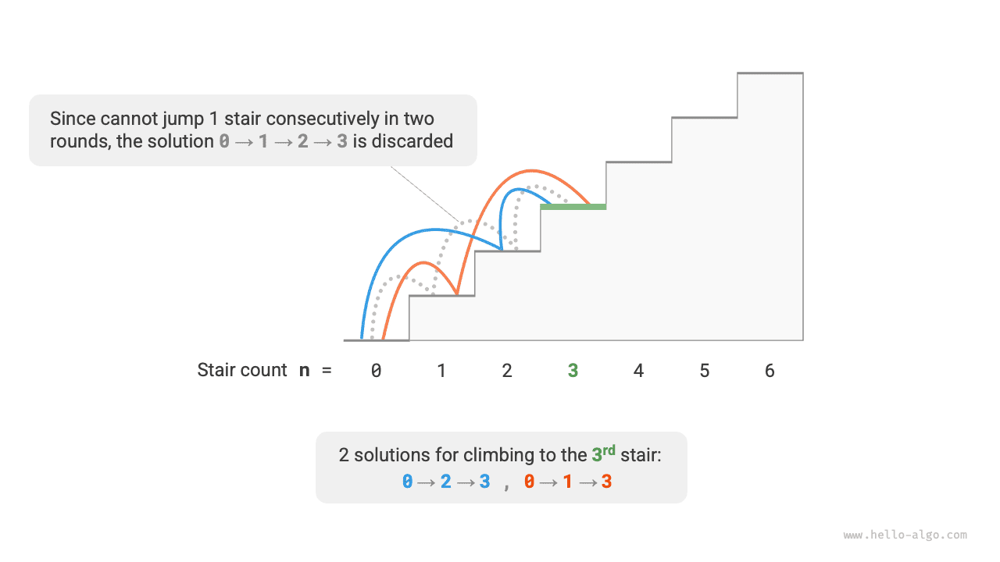

# Đặc điểm của bài toán quy hoạch động

Trong phần trước, ta đã tìm hiểu cách quy hoạch động giải bài toán gốc bằng cách phân rã nó thành các bài toán con. Thực tế, việc phân rã bài toán con là một cách tiếp cận thuật toán tổng quát, với những trọng tâm khác nhau trong chia để trị, quy hoạch động và quay lui.

- Các thuật toán chia để trị đệ quy chia bài toán gốc thành nhiều bài toán con độc lập cho đến khi đạt tới các bài toán con nhỏ nhất, rồi hợp nhất lời giải của các bài toán con trong quá trình quay lui để cuối cùng thu được lời giải của bài toán gốc.
- Quy hoạch động cũng phân rã bài toán một cách đệ quy, nhưng điểm khác biệt chính so với các thuật toán chia để trị là các bài toán con trong quy hoạch động phụ thuộc lẫn nhau, và có nhiều bài toán con chồng lặp xuất hiện trong quá trình phân rã.
- Các thuật toán quay lui liệt kê tất cả các lời giải khả dĩ thông qua thử và sai, đồng thời tránh những nhánh tìm kiếm không cần thiết nhờ cắt tỉa. Lời giải của bài toán gốc bao gồm một chuỗi các bước ra quyết định, và ta có thể xem chuỗi con trước mỗi bước ra quyết định là một bài toán con.

Trên thực tế, quy hoạch động thường được dùng để giải các bài toán tối ưu hóa, không chỉ chứa các bài toán con chồng lặp mà còn có thêm hai đặc điểm quan trọng khác: cấu trúc con tối ưu và không có hậu quả (vô hậu hiệu).

## Cấu trúc con tối ưu

Ta sẽ điều chỉnh nhẹ bài toán leo cầu thang để nó phù hợp hơn cho việc minh họa khái niệm cấu trúc con tối ưu.

!!! question "Leo cầu thang với chi phí tối thiểu"

    Cho một cầu thang, mỗi lần bạn có thể bước lên $1$ hoặc $2$ bậc, và mỗi bậc được gắn một số nguyên không âm biểu diễn chi phí khi bước lên bậc đó. Cho một mảng số nguyên không âm $cost$, trong đó $cost[i]$ biểu diễn chi phí của bậc thứ $i$ và $cost[0]$ là mặt đất (điểm xuất phát), hỏi chi phí tối thiểu cần thiết để lên đến đỉnh là bao nhiêu?

Như minh họa trong hình bên dưới, nếu chi phí của bậc thứ $1$, $2$ và $3$ lần lượt là $1$, $10$ và $1$, thì việc leo từ mặt đất lên đến bậc thứ $3$ cần chi phí tối thiểu là $2$.


Gọi $dp[i]$ là tổng chi phí tích lũy khi leo đến bậc thứ $i$. Vì bậc thứ $i$ chỉ có thể đến từ bậc thứ $i-1$ hoặc $i-2$, nên $dp[i]$ chỉ có thể bằng $dp[i-1] + cost[i]$ hoặc $dp[i-2] + cost[i]$. Để tối thiểu hóa chi phí, ta nên chọn giá trị nhỏ hơn trong hai giá trị đó:

$$
dp[i] = \min(dp[i-1], dp[i-2]) + cost[i]
$$

Điều này dẫn ta đến ý nghĩa của cấu trúc con tối ưu: **lời giải tối ưu của bài toán gốc được xây dựng từ lời giải tối ưu của các bài toán con**.

Bài toán này rõ ràng có cấu trúc con tối ưu: ta chọn phương án tốt hơn từ lời giải tối ưu của hai bài toán con $dp[i-1]$ và $dp[i-2]$, rồi dùng nó để xây dựng lời giải tối ưu của bài toán gốc $dp[i]$.

Vậy, bài toán leo cầu thang ở phần trước có cấu trúc con tối ưu hay không? Mục tiêu của nó là tìm số lượng cách đi, có vẻ như là một bài toán đếm, nhưng nếu ta thay đổi câu hỏi thành: "Tìm số lượng cách đi lớn nhất". Ta bất ngờ phát hiện ra rằng **mặc dù bài toán trước và sau khi điều chỉnh là tương đương, nhưng cấu trúc con tối ưu đã xuất hiện**: số lượng cách đi lớn nhất đến bậc thứ $n$ bằng tổng số lượng cách đi lớn nhất đến bậc thứ $n-1$ và $n-2$. Do đó, cách diễn giải cấu trúc con tối ưu khá linh hoạt và sẽ mang ý nghĩa khác nhau trong từng bài toán khác nhau.

Dựa trên phương trình chuyển trạng thái và các trạng thái khởi tạo $dp[1] = cost[1]$ và $dp[2] = cost[2]$, ta có thể thu được đoạn mã quy hoạch động:

```src
[file]{min_cost_climbing_stairs_dp}-[class]{}-[func]{min_cost_climbing_stairs_dp}
```

Hình bên dưới cho thấy quá trình quy hoạch động của đoạn mã trên.


Bài toán này cũng có thể được tối ưu không gian, nén từ một chiều xuống còn không chiều, giảm độ phức tạp không gian từ $O(n)$ xuống còn $O(1)$:

```src
[file]{min_cost_climbing_stairs_dp}-[class]{}-[func]{min_cost_climbing_stairs_dp_comp}
```

## Không có hậu quả (vô hậu hiệu)

Vô hậu hiệu là một trong những đặc điểm quan trọng giúp quy hoạch động giải quyết bài toán một cách hiệu quả. Định nghĩa của nó là: **cho một trạng thái nhất định, sự phát triển trong tương lai của nó chỉ liên quan đến trạng thái hiện tại và không liên quan đến bất kỳ trạng thái nào trong quá khứ**.

Lấy bài toán leo cầu thang làm ví dụ, cho trạng thái $i$, nó sẽ phát triển thành trạng thái $i+1$ và $i+2$, tương ứng với việc nhảy $1$ bậc và nhảy $2$ bậc. Khi đưa ra hai lựa chọn này, ta không cần xét đến các trạng thái trước trạng thái $i$, vì chúng không ảnh hưởng đến tương lai của trạng thái $i$.

Tuy nhiên, nếu ta thêm một ràng buộc vào bài toán leo cầu thang, tình huống sẽ thay đổi.

!!! question "Leo cầu thang có ràng buộc"

    Cho một cầu thang gồm $n$ bậc, mỗi lần bạn có thể bước lên $1$ hoặc $2$ bậc, **nhưng không được phép nhảy $1$ bậc trong hai vòng liên tiếp**. Hỏi có bao nhiêu cách để leo lên đến đỉnh?

Như minh họa trong hình bên dưới, chỉ có $2$ cách khả thi để leo đến bậc thứ $3$. Đường đi với ba lần nhảy $1$ bậc liên tiếp không thỏa mãn ràng buộc nên bị loại bỏ.



Trong bài toán này, nếu vòng trước đã nhảy $1$ bậc, thì vòng tiếp theo bắt buộc phải nhảy $2$ bậc. Điều này có nghĩa là **lựa chọn tiếp theo không thể chỉ được xác định bởi trạng thái hiện tại (số thứ tự bậc thang hiện tại), mà còn phụ thuộc vào trạng thái trước đó (số thứ tự bậc thang của vòng trước)**.

Không khó để nhận ra rằng bài toán này không còn thỏa mãn tính vô hậu hiệu nữa, và phương trình chuyển trạng thái $dp[i] = dp[i-1] + dp[i-2]$ cũng không còn đúng, vì $dp[i-1]$ biểu diễn việc nhảy $1$ bậc ở vòng này, nhưng nó lại bao gồm nhiều lời giải có "vòng trước đã nhảy $1$ bậc", những lời giải này không thể được tính trực tiếp vào $dp[i]$ để thỏa mãn ràng buộc.

Vì lý do này, ta cần mở rộng định nghĩa trạng thái: **trạng thái $[i, j]$ biểu diễn việc đang ở bậc thứ $i$ với vòng trước đã nhảy $j$ bậc**, trong đó $j \in \{1, 2\}$. Định nghĩa trạng thái này giúp phân biệt hiệu quả xem vòng trước đã nhảy $1$ bậc hay $2$ bậc, từ đó cho phép ta xác định trạng thái hiện tại đến từ đâu.

- Khi vòng trước nhảy $1$ bậc, thì vòng trước đó nữa chỉ có thể chọn nhảy $2$ bậc, tức là $dp[i, 1]$ chỉ có thể chuyển từ $dp[i-1, 2]$.
- Khi vòng trước nhảy $2$ bậc, thì vòng trước đó nữa có thể chọn nhảy $1$ bậc hoặc $2$ bậc, tức là $dp[i, 2]$ có thể chuyển từ $dp[i-2, 1]$ hoặc $dp[i-2, 2]$.

Như minh họa trong hình bên dưới, theo định nghĩa này, $dp[i, j]$ biểu diễn số lượng cách đi cho trạng thái $[i, j]$. Phương trình chuyển trạng thái khi đó là:

$$
\begin{cases}
dp[i, 1] = dp[i-1, 2] \\
dp[i, 2] = dp[i-2, 1] + dp[i-2, 2]
\end{cases}
$$


Cuối cùng, trả về $dp[n, 1] + dp[n, 2]$, trong đó tổng của hai giá trị này biểu diễn tổng số cách để leo đến bậc thứ $n$:

```src
[file]{climbing_stairs_constraint_dp}-[class]{}-[func]{climbing_stairs_constraint_dp}
```

Trong trường hợp trên, vì ta chỉ cần xét thêm một trạng thái đứng trước, ta vẫn có thể làm cho bài toán thỏa mãn tính vô hậu hiệu bằng cách mở rộng định nghĩa trạng thái. Tuy nhiên, một số bài toán có "hậu quả" rất nghiêm trọng.

!!! question "Leo cầu thang với chướng ngại vật sinh ra"

    Cho một cầu thang gồm $n$ bậc, mỗi lần bạn có thể bước lên $1$ hoặc $2$ bậc. **Mỗi khi bạn đến bậc thứ $i$, hệ thống sẽ tự động đặt một chướng ngại vật tại bậc thứ $2i$, và không vòng nào tiếp theo được phép nhảy đến bậc thứ $2i$ đó**. Ví dụ, nếu hai vòng đầu tiên nhảy đến bậc thứ $2$ và $3$, thì sau đó bạn không thể nhảy đến bậc thứ $4$ và $6$. Hỏi có bao nhiêu cách để leo lên đến đỉnh?

Trong bài toán này, bước nhảy tiếp theo phụ thuộc vào tất cả các trạng thái trong quá khứ, vì mỗi lần nhảy đều đặt chướng ngại vật ở những bậc cao hơn, ảnh hưởng đến các bước nhảy trong tương lai. Với những bài toán như thế này, quy hoạch động thường khó có thể giải quyết.

Trên thực tế, nhiều bài toán tối ưu hóa tổ hợp phức tạp (chẳng hạn như bài toán người bán hàng du lịch) không thỏa mãn tính vô hậu hiệu. Đối với những bài toán như vậy, ta thường sử dụng các phương pháp khác, chẳng hạn như tìm kiếm heuristic, thuật toán di truyền, và học tăng cường, để thu được các lời giải tối ưu cục bộ khả dụng trong thời gian giới hạn.
