# Quy trình giải bài toán quy hoạch động

Hai phần trước đã giới thiệu những đặc điểm chính của bài toán quy hoạch động. Tiếp theo, hãy cùng tìm hiểu hai vấn đề mang tính thực tiễn hơn.

1. Làm thế nào để xác định một bài toán có phải là bài toán quy hoạch động hay không?
2. Quy trình đầy đủ để giải một bài toán quy hoạch động là gì, và ta nên bắt đầu từ đâu?

## Nhận diện bài toán

Nhìn chung, nếu một bài toán chứa các bài toán con chồng lặp, cấu trúc con tối ưu, và thỏa mãn tính vô hậu hiệu, thì bài toán đó thường phù hợp để giải bằng quy hoạch động. Tuy nhiên, rất khó để trực tiếp rút ra những đặc điểm này từ mô tả bài toán. Do đó, ta thường nới lỏng điều kiện và **trước tiên quan sát xem bài toán có phù hợp để giải bằng quay lui (tìm kiếm vét cạn) hay không**.

**Những bài toán phù hợp để giải bằng quay lui thường thỏa mãn "mô hình cây quyết định"**, nghĩa là bài toán có thể được mô tả bằng cấu trúc cây, trong đó mỗi nút biểu diễn một quyết định và mỗi đường đi biểu diễn một chuỗi các quyết định.

Nói cách khác, nếu một bài toán chứa khái niệm quyết định một cách rõ ràng, và lời giải được tạo ra thông qua một chuỗi các quyết định, thì bài toán đó thỏa mãn mô hình cây quyết định và thường có thể giải bằng quay lui.

Trên cơ sở đó, các bài toán quy hoạch động còn có một số dấu hiệu tích cực.

- Bài toán chứa những mô tả như lớn nhất (nhỏ nhất) hoặc nhiều nhất (ít nhất), cho thấy đây là một bài toán tối ưu hóa.
- Trạng thái của bài toán có thể được biểu diễn bằng một danh sách, ma trận nhiều chiều, hoặc cây, và một trạng thái có quan hệ truy hồi với các trạng thái xung quanh nó.

Tương ứng, cũng có một số dấu hiệu tiêu cực.

- Mục tiêu của bài toán là tìm tất cả các lời giải khả dĩ, thay vì tìm lời giải tối ưu.
- Mô tả bài toán mang đặc điểm hoán vị và tổ hợp rõ ràng, yêu cầu trả về nhiều lời giải cụ thể.

Nếu một bài toán thỏa mãn mô hình cây quyết định và có những dấu hiệu tích cực tương đối rõ ràng, ta có thể giả định đó là bài toán quy hoạch động và xác minh giả định đó trong quá trình giải.

## Các bước giải bài toán

Quy trình giải bài toán quy hoạch động thay đổi tùy theo bản chất và độ khó của từng bài toán, nhưng nhìn chung đều tuân theo các bước sau: mô tả các quyết định, định nghĩa trạng thái, thiết lập bảng $dp$, suy ra phương trình chuyển trạng thái, xác định điều kiện biên, v.v.

Để minh họa các bước giải bài toán một cách sinh động hơn, ta sử dụng một bài toán kinh điển "tổng đường đi nhỏ nhất" làm ví dụ.

!!! question

    Cho một lưới hai chiều `grid` kích thước $n \times m$, trong đó mỗi ô chứa một số nguyên không âm biểu diễn chi phí, một robot xuất phát từ ô trên cùng bên trái và ở mỗi bước chỉ có thể di chuyển xuống dưới hoặc sang phải cho đến khi đến được ô dưới cùng bên phải. Hãy trả về tổng đường đi nhỏ nhất từ ô trên cùng bên trái đến ô dưới cùng bên phải.

Hình bên dưới cho thấy một ví dụ trong đó tổng đường đi nhỏ nhất cho lưới đã cho là $13$.

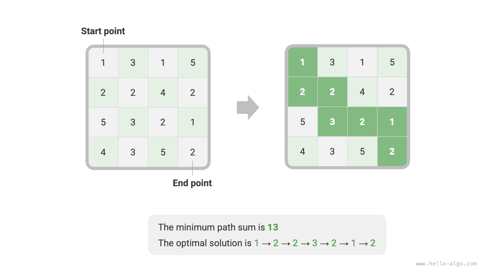

**Bước 1: Suy nghĩ về các quyết định trong mỗi vòng, định nghĩa trạng thái, từ đó thu được bảng $dp$**

Quyết định trong mỗi vòng của bài toán này là di chuyển một bước xuống dưới hoặc sang phải từ ô hiện tại. Gọi chỉ số hàng và cột của ô hiện tại là $[i, j]$. Sau khi di chuyển xuống dưới hoặc sang phải, chỉ số trở thành $[i+1, j]$ hoặc $[i, j+1]$. Do đó, trạng thái nên bao gồm hai biến, chỉ số hàng và chỉ số cột, ký hiệu là $[i, j]$.

Trạng thái $[i, j]$ tương ứng với bài toán con: **tổng đường đi nhỏ nhất từ điểm xuất phát $[0, 0]$ đến $[i, j]$**, ký hiệu là $dp[i, j]$.

Từ đó, ta thu được ma trận $dp$ hai chiều như hình bên dưới, có kích thước giống với lưới đầu vào $grid$.


!!! note

    Quá trình quy hoạch động và quay lui có thể được mô tả như một chuỗi các quyết định, và trạng thái bao gồm tất cả các biến quyết định. Nó cần chứa mọi biến mô tả tiến trình giải bài toán, và cần chứa đủ thông tin để suy ra trạng thái tiếp theo.

    Mỗi trạng thái tương ứng với một bài toán con, và ta định nghĩa một bảng $dp$ để lưu trữ lời giải của tất cả các bài toán con. Mỗi biến độc lập của trạng thái là một chiều của bảng $dp$. Về bản chất, bảng $dp$ là một ánh xạ giữa các trạng thái và lời giải của các bài toán con.

**Bước 2: Xác định cấu trúc con tối ưu, sau đó suy ra phương trình chuyển trạng thái**

Với trạng thái $[i, j]$, nó chỉ có thể chuyển từ ô phía trên $[i-1, j]$ hoặc ô bên trái $[i, j-1]$. Do đó, cấu trúc con tối ưu là: tổng đường đi nhỏ nhất để đến được $[i, j]$ được xác định bởi giá trị nhỏ hơn giữa tổng đường đi nhỏ nhất của $[i, j-1]$ và $[i-1, j]$.

Dựa trên phân tích trên, ta có thể suy ra phương trình chuyển trạng thái như hình bên dưới:

$$
dp[i, j] = \min(dp[i-1, j], dp[i, j-1]) + grid[i, j]
$$


!!! note

    Dựa trên bảng $dp$ đã định nghĩa, hãy suy nghĩ về mối quan hệ giữa bài toán gốc và các bài toán con, tìm ra cách xây dựng lời giải tối ưu của bài toán gốc từ lời giải tối ưu của các bài toán con, đây chính là cấu trúc con tối ưu.

    Sau khi xác định được cấu trúc con tối ưu, ta có thể dùng nó để xây dựng phương trình chuyển trạng thái.

**Bước 3: Xác định điều kiện biên và thứ tự chuyển trạng thái**

Trong bài toán này, các trạng thái ở hàng đầu tiên chỉ có thể đến từ trạng thái bên trái, còn các trạng thái ở cột đầu tiên chỉ có thể đến từ trạng thái phía trên. Do đó, hàng đầu tiên $i = 0$ và cột đầu tiên $j = 0$ là các điều kiện biên.

Như minh họa trong hình bên dưới, vì mỗi ô chuyển từ ô bên trái và ô phía trên nó, ta dùng vòng lặp để duyệt qua ma trận, với vòng lặp ngoài duyệt theo hàng và vòng lặp trong duyệt theo cột.


!!! note

    Điều kiện biên trong quy hoạch động được dùng để khởi tạo bảng $dp$, trong khi ở tìm kiếm chúng được dùng để cắt tỉa.

    Cốt lõi của thứ tự chuyển trạng thái là đảm bảo rằng khi tính lời giải của bài toán hiện tại, tất cả các bài toán con nhỏ hơn mà nó phụ thuộc vào đã được tính toán chính xác từ trước.

Dựa trên phân tích trên, ta có thể viết trực tiếp đoạn mã quy hoạch động. Tuy nhiên, vì việc phân rã bài toán con là một cách tiếp cận từ trên xuống, nên việc triển khai theo thứ tự "tìm kiếm vét cạn $\rightarrow$ ghi nhớ $\rightarrow$ quy hoạch động" sẽ phù hợp hơn với thói quen tư duy.

### Phương pháp 1: Tìm kiếm vét cạn

Bắt đầu từ trạng thái $[i, j]$, ta liên tục phân rã nó thành các trạng thái nhỏ hơn $[i-1, j]$ và $[i, j-1]$. Hàm đệ quy bao gồm các thành phần sau.

- **Tham số đệ quy**: trạng thái $[i, j]$.
- **Giá trị trả về**: tổng đường đi nhỏ nhất từ $[0, 0]$ đến $[i, j]$, chính là $dp[i, j]$.
- **Điều kiện dừng**: khi $i = 0$ và $j = 0$, trả về chi phí $grid[0, 0]$.
- **Cắt tỉa**: khi $i < 0$ hoặc $j < 0$, chỉ số nằm ngoài phạm vi, trả về chi phí $+\infty$, biểu diễn tính không khả thi.

Đoạn mã triển khai như sau:

```src
[file]{min_path_sum}-[class]{}-[func]{min_path_sum_dfs}
```

Hình bên dưới cho thấy cây đệ quy gốc tại $dp[2, 1]$, bao gồm một số bài toán con chồng lặp mà số lượng của chúng sẽ tăng lên nhanh chóng khi kích thước lưới `grid` tăng lên.

Về bản chất, nguyên nhân của các bài toán con chồng lặp là: **có nhiều đường đi khác nhau từ góc trên cùng bên trái để đến được một ô nhất định**.

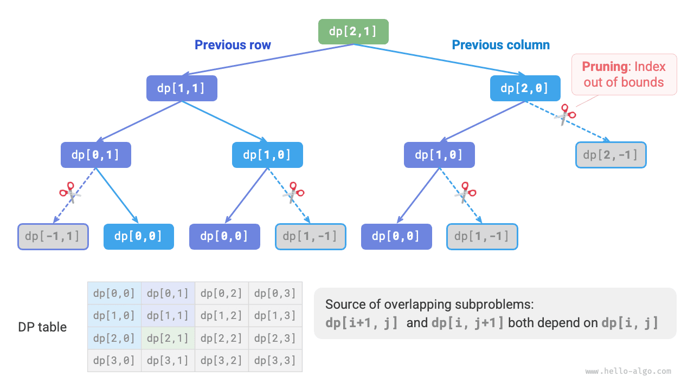

Mỗi trạng thái có hai lựa chọn, xuống dưới và sang phải, nên tổng số bước từ góc trên cùng bên trái đến góc dưới cùng bên phải là $m + n - 2$, cho ra độ phức tạp thời gian trong trường hợp xấu nhất là $O(2^{m + n})$, trong đó $n$ và $m$ lần lượt là số hàng và số cột của lưới. Lưu ý rằng phép tính này không tính đến các tình huống gần biên của lưới, nơi chỉ còn một lựa chọn khi đến biên lưới, vì vậy số lượng đường đi thực tế sẽ ít hơn phần nào.

### Phương pháp 2: Ghi nhớ

Ta đưa vào một danh sách ghi nhớ `mem` có cùng kích thước với lưới `grid` để ghi lại lời giải của các bài toán con và cắt tỉa các bài toán con chồng lặp:

```src
[file]{min_path_sum}-[class]{}-[func]{min_path_sum_dfs_mem}
```

Như minh họa trong hình bên dưới, sau khi áp dụng ghi nhớ, mọi lời giải của bài toán con chỉ cần được tính toán một lần, do đó độ phức tạp thời gian phụ thuộc vào tổng số trạng thái, chính là kích thước lưới $O(nm)$.


### Phương pháp 3: Quy hoạch động

Triển khai lời giải quy hoạch động dựa trên vòng lặp, như đoạn mã bên dưới:

```src
[file]{min_path_sum}-[class]{}-[func]{min_path_sum_dp}
```

Hình bên dưới cho thấy quá trình chuyển trạng thái cho bài toán tổng đường đi nhỏ nhất, quá trình này duyệt qua toàn bộ lưới, **do đó độ phức tạp thời gian là $O(nm)$**.

Mảng `dp` có kích thước $n \times m$, **do đó độ phức tạp không gian là $O(nm)$**.

=== "<1>"
    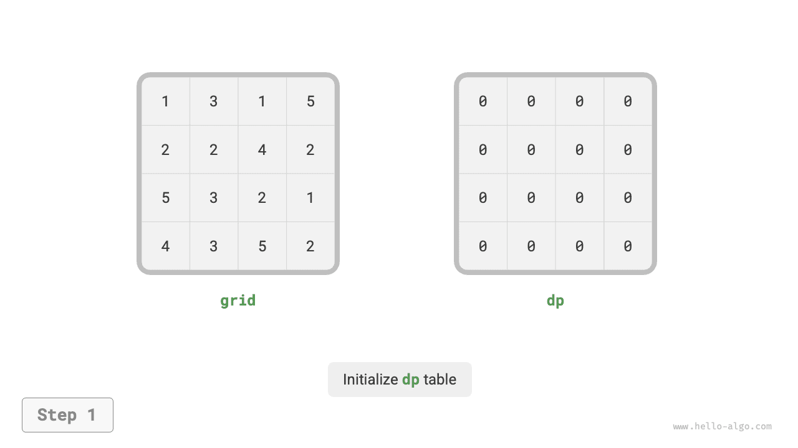

=== "<2>"
    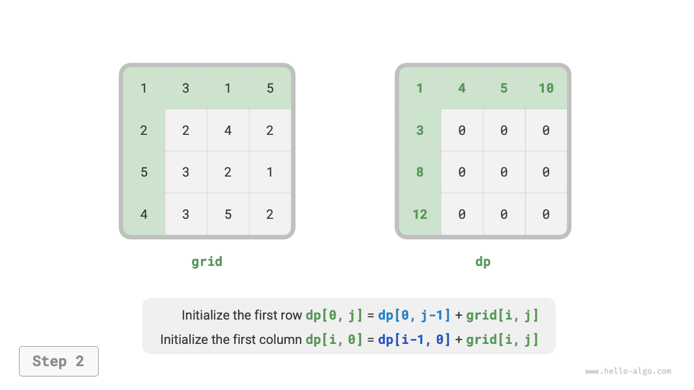

=== "<3>"
    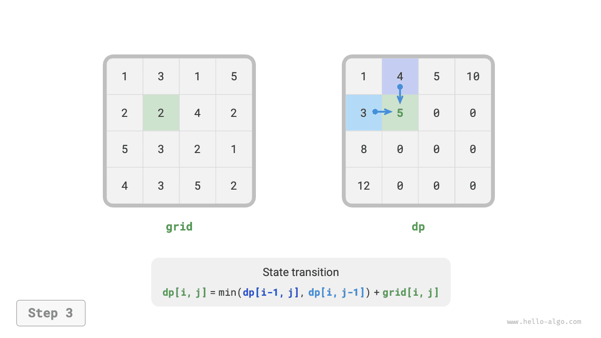

=== "<4>"
    

=== "<5>"
    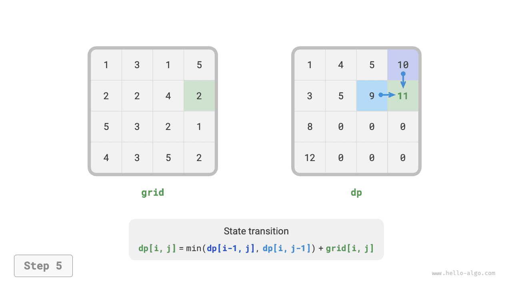

=== "<6>"
    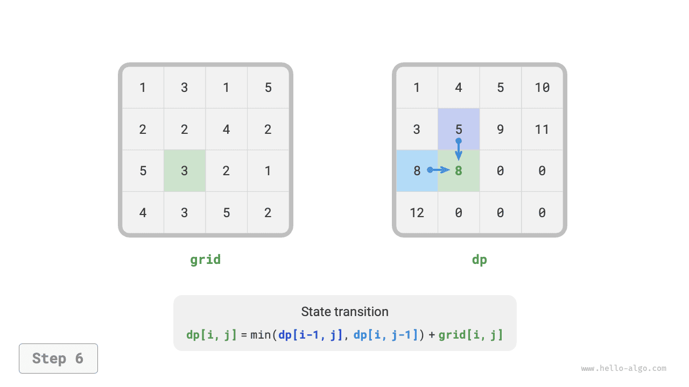

=== "<7>"
    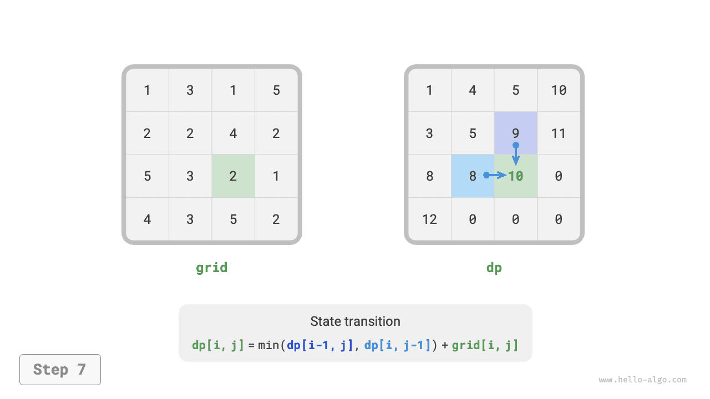

=== "<8>"
    

=== "<9>"
    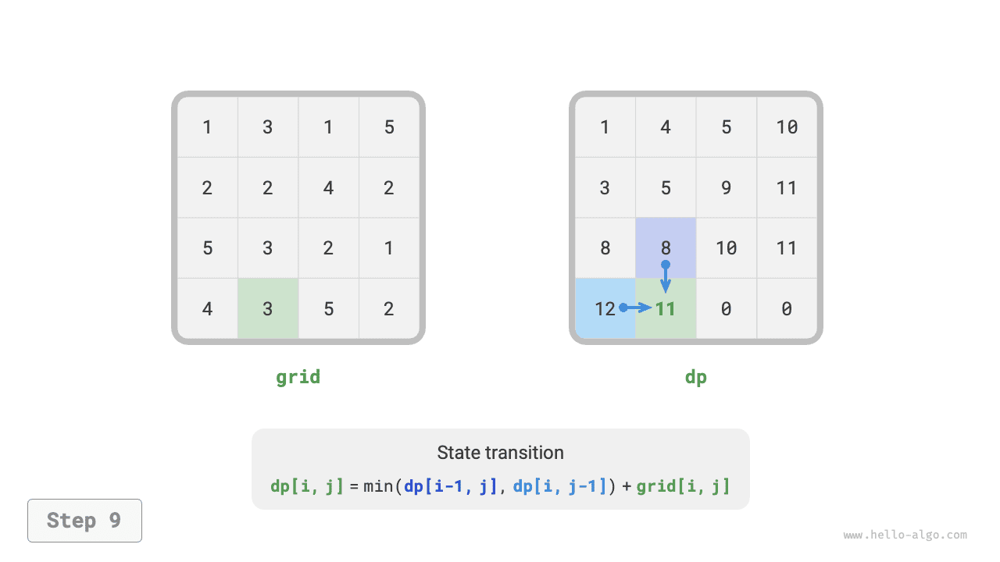

=== "<10>"
    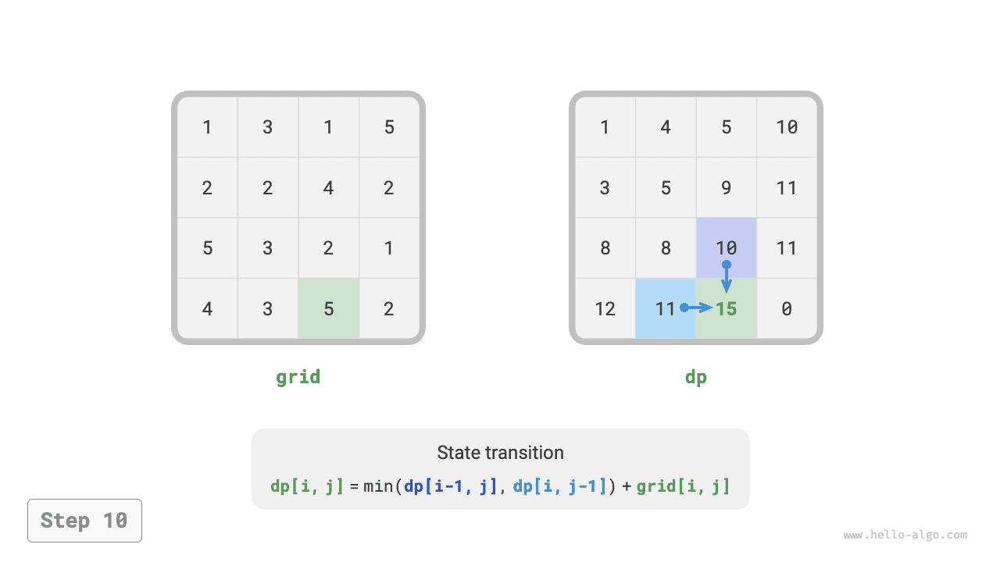

=== "<11>"
    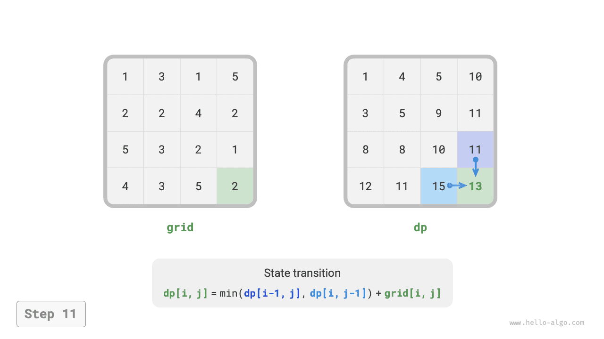

=== "<12>"
    

### Tối ưu không gian

Vì mỗi ô chỉ liên quan đến ô bên trái và ô phía trên nó, ta có thể dùng một mảng một hàng duy nhất để triển khai bảng $dp$.

Lưu ý rằng vì mảng `dp` chỉ có thể biểu diễn trạng thái của một hàng, ta không thể khởi tạo trước trạng thái của cột đầu tiên, mà phải cập nhật nó khi duyệt qua từng hàng:

```src
[file]{min_path_sum}-[class]{}-[func]{min_path_sum_dp_comp}
```
