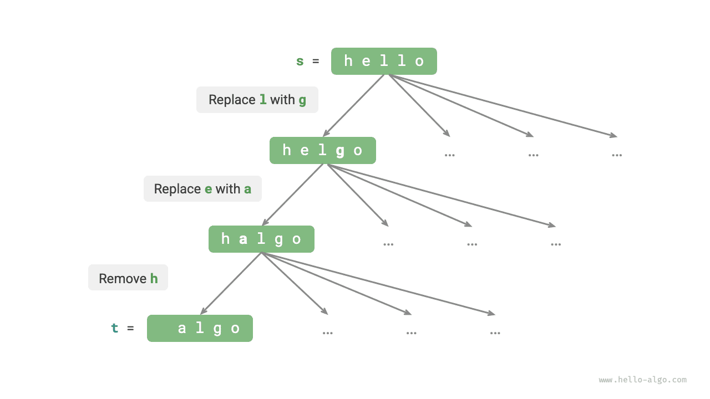
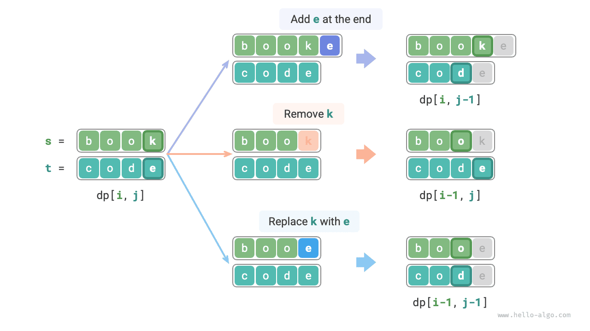
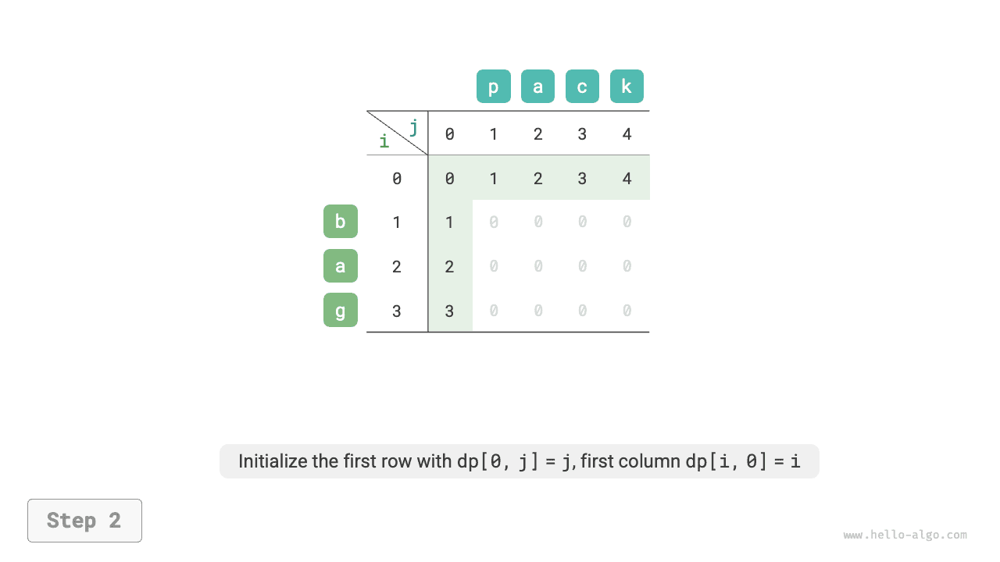
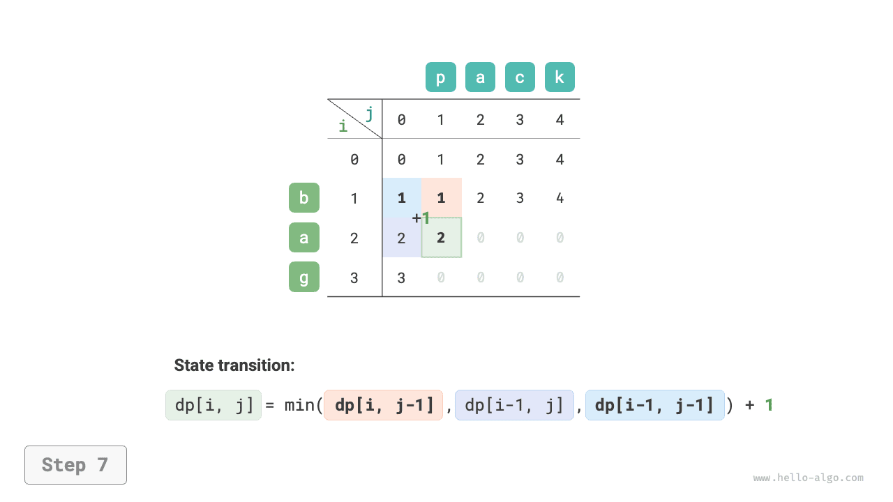
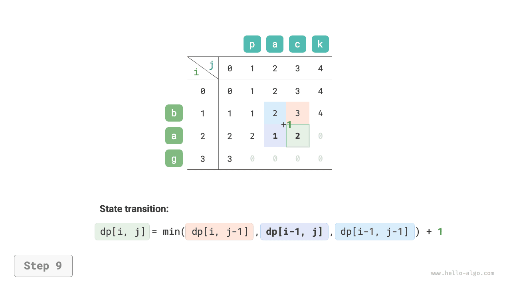
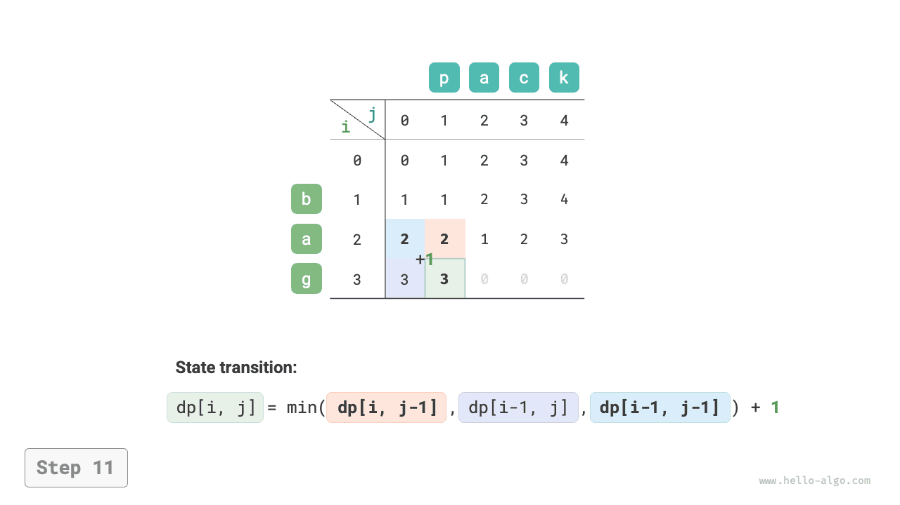
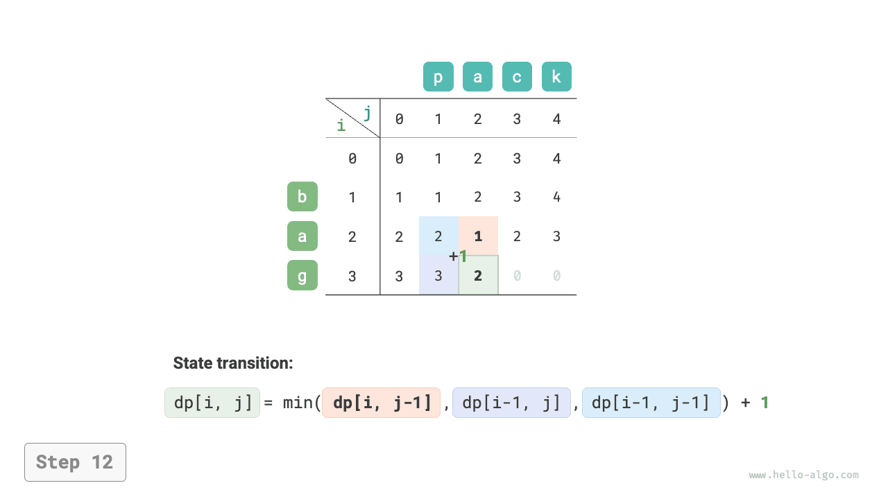
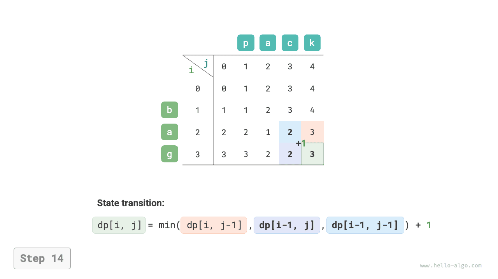

# Bài toán khoảng cách chỉnh sửa

Khoảng cách chỉnh sửa, còn được gọi là khoảng cách Levenshtein, là số lần chỉnh sửa tối thiểu cần thiết để biến đổi một chuỗi này thành một chuỗi khác, thường được dùng trong truy xuất thông tin và xử lý ngôn ngữ tự nhiên để đo lường mức độ tương đồng giữa hai chuỗi.

!!! question

    Cho hai chuỗi $s$ và $t$, hãy trả về số lần chỉnh sửa tối thiểu cần thiết để biến đổi $s$ thành $t$.

    Bạn có thể thực hiện ba loại thao tác chỉnh sửa trên chuỗi: chèn một ký tự, xóa một ký tự, hoặc thay thế một ký tự bằng một ký tự bất kỳ khác.

Như minh họa trong hình bên dưới, việc biến đổi `kitten` thành `sitting` cần 3 lần chỉnh sửa, bao gồm 2 lần thay thế và 1 lần chèn; việc biến đổi `hello` thành `algo` cần 3 bước, bao gồm 2 lần thay thế và 1 lần xóa.


**Bài toán khoảng cách chỉnh sửa có thể được giải thích một cách tự nhiên bằng mô hình cây quyết định**. Các chuỗi tương ứng với các nút của cây, và mỗi thao tác chỉnh sửa tương ứng với một cạnh trong cây.

Như minh họa trong hình bên dưới, nếu không giới hạn các thao tác, mỗi nút có thể phân nhánh thành nhiều cạnh, mỗi cạnh tương ứng với một thao tác, nghĩa là có rất nhiều đường đi khả dĩ để biến đổi `hello` thành `algo`.

Từ góc độ cây quyết định, mục tiêu của bài toán này là tìm đường đi ngắn nhất giữa nút `hello` và nút `algo`.



### Phương pháp quy hoạch động

**Bước 1: Suy nghĩ về các quyết định trong mỗi vòng, định nghĩa trạng thái, từ đó thu được bảng $dp$**

Mỗi vòng ra quyết định là thực hiện một thao tác chỉnh sửa trên chuỗi $s$.

Ta muốn kích thước bài toán giảm dần trong quá trình chỉnh sửa để có thể xây dựng các bài toán con. Gọi độ dài của chuỗi $s$ và $t$ lần lượt là $n$ và $m$. Trước tiên, ta xét các ký tự cuối cùng của hai chuỗi, $s[n-1]$ và $t[m-1]$.

- Nếu $s[n-1]$ và $t[m-1]$ giống nhau, ta có thể bỏ qua chúng và xét trực tiếp $s[n-2]$ và $t[m-2]$.
- Nếu $s[n-1]$ và $t[m-1]$ khác nhau, ta cần thực hiện một thao tác chỉnh sửa trên $s$ (chèn, xóa, hoặc thay thế) để làm cho các ký tự cuối cùng của hai chuỗi giống nhau, từ đó cho phép ta bỏ qua chúng và xét một bài toán có quy mô nhỏ hơn.

Nói cách khác, mỗi vòng ra quyết định (thao tác chỉnh sửa) mà ta thực hiện trên chuỗi $s$ sẽ làm thay đổi các ký tự còn lại cần khớp trong $s$ và $t$. Do đó, trạng thái là ký tự thứ $i$ và thứ $j$ đang được xét trong $s$ và $t$, ký hiệu là $[i, j]$.

Trạng thái $[i, j]$ tương ứng với bài toán con: **số lần chỉnh sửa tối thiểu cần thiết để biến đổi $i$ ký tự đầu tiên của $s$ thành $j$ ký tự đầu tiên của $t$**.

Từ đó, ta thu được một bảng $dp$ hai chiều có kích thước $(i+1) \times (j+1)$.

**Bước 2: Xác định cấu trúc con tối ưu, sau đó suy ra phương trình chuyển trạng thái**

Xét bài toán con $dp[i, j]$, trong đó ký tự cuối cùng của hai chuỗi tương ứng là $s[i-1]$ và $t[j-1]$, có thể được chia thành ba trường hợp như hình bên dưới tùy theo các thao tác chỉnh sửa khác nhau.

1. Chèn $t[j-1]$ vào sau $s[i-1]$, khi đó bài toán con còn lại là $dp[i, j-1]$.
2. Xóa $s[i-1]$, khi đó bài toán con còn lại là $dp[i-1, j]$.
3. Thay thế $s[i-1]$ bằng $t[j-1]$, khi đó bài toán con còn lại là $dp[i-1, j-1]$.



Dựa trên phân tích trên, ta thu được cấu trúc con tối ưu: số lần chỉnh sửa tối thiểu cho $dp[i, j]$ bằng giá trị nhỏ nhất trong số $dp[i, j-1]$, $dp[i-1, j]$, và $dp[i-1, j-1]$, cộng thêm chi phí chỉnh sửa hiện tại là $1$. Phương trình chuyển trạng thái tương ứng là:

$$
dp[i, j] = \min(dp[i, j-1], dp[i-1, j], dp[i-1, j-1]) + 1
$$

Xin lưu ý rằng **khi $s[i-1]$ và $t[j-1]$ giống nhau, không cần chỉnh sửa ký tự hiện tại**, trong trường hợp đó phương trình chuyển trạng thái là:

$$
dp[i, j] = dp[i-1, j-1]
$$

**Bước 3: Xác định điều kiện biên và thứ tự chuyển trạng thái**

Khi cả hai chuỗi đều rỗng, số bước chỉnh sửa là $0$, tức là $dp[0, 0] = 0$. Khi $s$ rỗng nhưng $t$ không rỗng, số bước chỉnh sửa tối thiểu bằng độ dài của $t$, tức là hàng đầu tiên $dp[0, j] = j$. Khi $s$ không rỗng nhưng $t$ rỗng, số bước chỉnh sửa tối thiểu bằng độ dài của $s$, tức là cột đầu tiên $dp[i, 0] = i$.

Quan sát phương trình chuyển trạng thái, lời giải $dp[i, j]$ phụ thuộc vào các lời giải ở bên trái, phía trên, và phía trên bên trái, vì vậy toàn bộ bảng $dp$ có thể được duyệt theo thứ tự thông qua hai vòng lặp lồng nhau.

### Triển khai mã

```src
[file]{edit_distance}-[class]{}-[func]{edit_distance_dp}
```

Như minh họa trong hình bên dưới, quá trình chuyển trạng thái cho bài toán khoảng cách chỉnh sửa rất giống với bài toán cái túi; cả hai đều có thể được xem như quá trình điền vào một lưới hai chiều.

=== "<1>"
    

=== "<2>"
    

=== "<3>"
    

=== "<4>"
    

=== "<5>"
    

=== "<6>"
    

=== "<7>"
    

=== "<8>"
    

=== "<9>"
    

=== "<10>"
    

=== "<11>"
    

=== "<12>"
    

=== "<13>"
    

=== "<14>"
    

=== "<15>"
    

### Tối ưu không gian

Vì $dp[i, j]$ phụ thuộc vào trạng thái phía trên $dp[i-1, j]$, bên trái $dp[i, j-1]$, và phía trên bên trái $dp[i-1, j-1]$, duyệt thuận sẽ làm mất trạng thái phía trên bên trái $dp[i-1, j-1]$, trong khi duyệt ngược không thể xây dựng trước $dp[i, j-1]$, nên cả hai thứ tự duyệt đều không phù hợp.

Vì lý do này, ta có thể dùng một biến `leftup` để tạm thời lưu lời giải phía trên bên trái $dp[i-1, j-1]$, nhờ đó ta chỉ cần xét đến các lời giải bên trái và phía trên. Tình huống này giống với bài toán cái túi không giới hạn, nên ta có thể dùng duyệt thuận. Đoạn mã như sau:

```src
[file]{edit_distance}-[class]{}-[func]{edit_distance_dp_comp}
```
