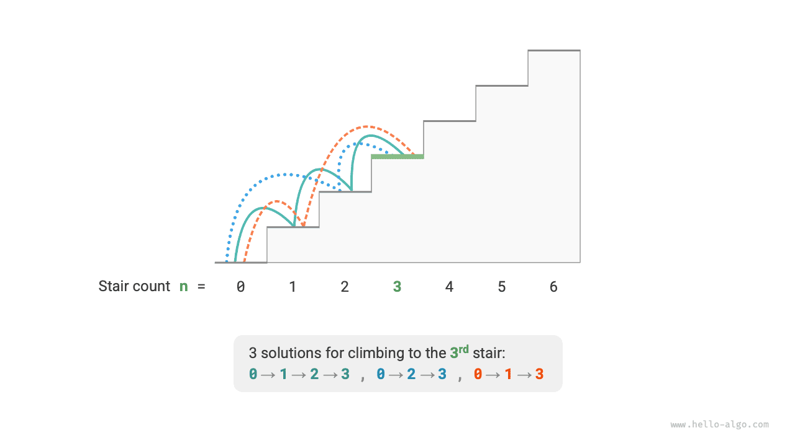
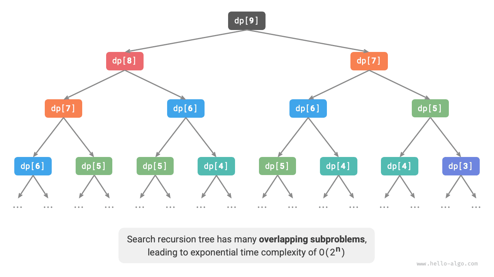

# Giới thiệu về quy hoạch động

<u>Quy hoạch động</u> là một mô hình thuật toán quan trọng, phân rã một bài toán thành một chuỗi các bài toán con nhỏ hơn và tránh việc tính toán lặp lại bằng cách lưu trữ lời giải của các bài toán con, nhờ đó cải thiện đáng kể hiệu suất về mặt thời gian.

Trong phần này, chúng ta bắt đầu với một ví dụ kinh điển, trước tiên trình bày lời giải vét cạn bằng quay lui, quan sát các bài toán con chồng lặp bên trong nó, rồi dần dần suy ra một lời giải quy hoạch động hiệu quả hơn.

!!! question "Leo cầu thang"

    Cho một cầu thang gồm $n$ bậc, mỗi lần bạn có thể bước lên $1$ hoặc $2$ bậc, hỏi có bao nhiêu cách khác nhau để lên đến đỉnh cầu thang?

Như minh họa trong hình bên dưới, với một cầu thang $3$ bậc, có $3$ cách khác nhau để lên đến đỉnh.



Mục tiêu của bài toán này là xác định số lượng cách đi, nên **ta có thể nghĩ đến việc dùng quay lui để liệt kê tất cả các khả năng**. Cụ thể, hãy hình dung việc leo cầu thang như một quá trình lựa chọn qua nhiều vòng: bắt đầu từ mặt đất, mỗi vòng chọn bước lên $1$ hoặc $2$ bậc, tăng bộ đếm lên $1$ mỗi khi lên đến đỉnh cầu thang, và cắt tỉa khi vượt quá đỉnh. Đoạn mã như sau:

```src
[file]{climbing_stairs_backtrack}-[class]{}-[func]{climbing_stairs_backtrack}
```

## Phương pháp 1: Tìm kiếm vét cạn

Các thuật toán quay lui thường không phân rã bài toán một cách tường minh, mà xem việc giải bài toán như một chuỗi các bước ra quyết định, tìm kiếm mọi lời giải khả dĩ thông qua thử và cắt tỉa.

Ta có thể thử phân tích bài toán này từ góc độ phân rã bài toán. Gọi số cách leo đến bậc thứ $i$ là $dp[i]$, khi đó $dp[i]$ chính là bài toán gốc, và các bài toán con của nó bao gồm:

$$
dp[i-1], dp[i-2], \dots, dp[2], dp[1]
$$

Vì mỗi vòng ta chỉ có thể bước lên $1$ hoặc $2$ bậc, nên khi đang đứng ở bậc thứ $i$, ở vòng trước đó ta chỉ có thể đang đứng ở bậc thứ $i-1$ hoặc $i-2$. Nói cách khác, ta chỉ có thể đến được bậc thứ $i$ từ bậc thứ $i-1$ hoặc $i-2$.

Điều này dẫn đến một kết luận quan trọng: **số cách leo đến bậc thứ $i-1$ cộng với số cách leo đến bậc thứ $i-2$ bằng số cách leo đến bậc thứ $i$**. Công thức như sau:

$$
dp[i] = dp[i-1] + dp[i-2]
$$

Điều này có nghĩa là trong bài toán leo cầu thang, tồn tại một quan hệ truy hồi giữa các bài toán con, và **lời giải của bài toán gốc có thể được xây dựng từ lời giải của các bài toán con**. Hình bên dưới minh họa quan hệ truy hồi này.


Ta có thể thu được một lời giải tìm kiếm vét cạn dựa trên công thức truy hồi này. Bắt đầu từ $dp[n]$, **phân rã đệ quy một bài toán lớn hơn thành tổng của hai bài toán nhỏ hơn**, cho đến khi chạm tới các bài toán con nhỏ nhất $dp[1]$ và $dp[2]$ rồi quay lui trở về. Trong đó, lời giải của các bài toán con nhỏ nhất đã biết trước, cụ thể là $dp[1] = 1$ và $dp[2] = 2$, tương ứng với $1$ và $2$ cách leo đến bậc thứ $1$ và thứ $2$.

Hãy quan sát đoạn mã sau: giống như mã quay lui tiêu chuẩn, nó cũng sử dụng tìm kiếm theo chiều sâu nhưng ngắn gọn hơn:

```src
[file]{climbing_stairs_dfs}-[class]{}-[func]{climbing_stairs_dfs}
```

Hình bên dưới cho thấy cây đệ quy được hình thành bởi tìm kiếm vét cạn. Với bài toán $dp[n]$, độ sâu của cây đệ quy là $n$, với độ phức tạp thời gian $O(2^n)$. Sự tăng trưởng theo cấp số nhân này bùng nổ rất nhanh; nếu ta nhập vào một giá trị $n$ tương đối lớn, thời gian chờ có thể rất lâu.



Quan sát hình trên, ta thấy **độ phức tạp thời gian theo cấp số nhân là do "các bài toán con chồng lặp" gây ra**. Ví dụ, $dp[9]$ được phân rã thành $dp[8]$ và $dp[7]$, còn $dp[8]$ lại được phân rã thành $dp[7]$ và $dp[6]$, cả hai đều chứa bài toán con $dp[7]$.

Cứ như vậy, các bài toán con lại chứa các bài toán con chồng lặp nhỏ hơn, tiếp diễn mãi. Phần lớn tài nguyên tính toán bị lãng phí vào những bài toán con chồng lặp này.

## Phương pháp 2: Ghi nhớ

Để cải thiện hiệu suất thuật toán, **ta muốn mọi bài toán con chồng lặp chỉ được tính toán đúng một lần**. Vì mục đích này, ta khai báo một mảng `mem` để ghi lại lời giải của từng bài toán con và cắt tỉa các bài toán con chồng lặp trong quá trình tìm kiếm.

1. Khi tính $dp[i]$ lần đầu tiên, ta ghi lại kết quả vào `mem[i]` để dùng sau này.
2. Khi cần tính $dp[i]$ lần nữa, ta có thể trực tiếp lấy kết quả từ `mem[i]`, nhờ đó tránh được việc tính toán lặp lại bài toán con đó.

Đoạn mã như sau:

```src
[file]{climbing_stairs_dfs_mem}-[class]{}-[func]{climbing_stairs_dfs_mem}
```

Hãy quan sát hình bên dưới: **sau khi áp dụng ghi nhớ, mọi bài toán con chồng lặp chỉ cần được tính toán một lần**, giúp giảm độ phức tạp thời gian xuống còn $O(n)$, một bước tiến vượt bậc.


## Phương pháp 3: Quy hoạch động

**Ghi nhớ là một phương pháp "từ trên xuống"**: ta bắt đầu từ bài toán gốc (nút gốc), đệ quy phân rã các bài toán con lớn hơn thành các bài toán con nhỏ hơn, cho đến khi chạm tới các bài toán con nhỏ nhất đã biết (nút lá). Sau đó, thông qua việc quay lui, ta thu thập lời giải của các bài toán con theo từng lớp để xây dựng lời giải của bài toán gốc.

Ngược lại, **quy hoạch động là một phương pháp "từ dưới lên"**: bắt đầu từ lời giải của các bài toán con nhỏ nhất, xây dựng dần lời giải của các bài toán con lớn hơn cho đến khi thu được lời giải của bài toán gốc.

Vì quy hoạch động không bao gồm quá trình quay lui, nó chỉ cần lặp bằng vòng lặp để triển khai và không cần đến đệ quy. Trong đoạn mã dưới đây, ta khởi tạo một mảng `dp` để lưu trữ lời giải của các bài toán con, đảm nhiệm chức năng ghi lại tương tự như mảng `mem` trong ghi nhớ:

```src
[file]{climbing_stairs_dp}-[class]{}-[func]{climbing_stairs_dp}
```

Hình bên dưới mô phỏng quá trình thực thi của đoạn mã trên.


Giống như các thuật toán quay lui, quy hoạch động cũng sử dụng khái niệm "trạng thái" để biểu diễn các giai đoạn cụ thể trong quá trình giải bài toán, mỗi trạng thái tương ứng với một bài toán con và lời giải tối ưu cục bộ tương ứng của nó. Ví dụ, trạng thái trong bài toán leo cầu thang được định nghĩa là số thứ tự bậc thang hiện tại $i$.

Dựa trên nội dung trên, ta có thể tổng kết một số thuật ngữ thường dùng trong quy hoạch động.

- Mảng `dp` được gọi là <u>bảng dp</u>, trong đó $dp[i]$ biểu diễn lời giải của bài toán con tương ứng với trạng thái $i$.
- Các trạng thái tương ứng với những bài toán con nhỏ nhất (bậc thứ $1$ và thứ $2$) được gọi là <u>trạng thái khởi tạo</u>.
- Công thức truy hồi $dp[i] = dp[i-1] + dp[i-2]$ được gọi là <u>phương trình chuyển trạng thái</u>.

## Tối ưu không gian

Những bạn đọc tinh ý có thể đã nhận ra rằng **vì $dp[i]$ chỉ liên quan đến $dp[i-1]$ và $dp[i-2]$, ta không cần dùng một mảng `dp` để lưu trữ lời giải của tất cả các bài toán con**, mà có thể thay bằng hai biến luân chuyển liên tục. Đoạn mã như sau:

```src
[file]{climbing_stairs_dp}-[class]{}-[func]{climbing_stairs_dp_comp}
```

Như đoạn mã trên cho thấy, bằng cách loại bỏ không gian bộ nhớ mà mảng `dp` chiếm dụng, độ phức tạp không gian được giảm từ $O(n)$ xuống còn $O(1)$.

Trong các bài toán quy hoạch động, trạng thái hiện tại thường chỉ phụ thuộc vào một số lượng hạn chế các trạng thái đứng trước, cho phép ta chỉ giữ lại những trạng thái cần thiết và tiết kiệm bộ nhớ thông qua "giảm chiều". **Kỹ thuật tối ưu không gian này được gọi là "biến luân chuyển" hoặc "mảng luân chuyển"**.
