# Bài toán cái túi 0-1

Bài toán cái túi (knapsack problem) là một bài toán nhập môn tuyệt vời cho quy hoạch động và là một trong những dạng bài toán phổ biến nhất trong quy hoạch động. Nó có nhiều biến thể, chẳng hạn như bài toán cái túi 0-1, bài toán cái túi không giới hạn, và bài toán cái túi nhiều lần.

Trong phần này, trước tiên ta sẽ giải bài toán cái túi 0-1 phổ biến nhất.

!!! question

    Cho $n$ vật phẩm và một cái túi có sức chứa $cap$, trong đó khối lượng và giá trị của vật phẩm thứ $i$ lần lượt là $wgt[i-1]$ và $val[i-1]$. Mỗi vật phẩm chỉ có thể được chọn tối đa một lần. Hỏi giá trị lớn nhất có thể chứa trong túi trong giới hạn sức chứa là bao nhiêu?

Hãy quan sát hình bên dưới. Vì số thứ tự vật phẩm $i$ bắt đầu đếm từ $1$ còn chỉ số mảng bắt đầu từ $0$, nên vật phẩm $i$ tương ứng với khối lượng $wgt[i-1]$ và giá trị $val[i-1]$.


Ta có thể xem bài toán cái túi 0-1 như một quá trình gồm $n$ vòng ra quyết định, trong đó với mỗi vật phẩm có hai quyết định: không cho vào túi và cho vào túi, do đó bài toán thỏa mãn mô hình cây quyết định.

Mục tiêu của bài toán này là tìm "giá trị lớn nhất có thể đặt vào túi trong giới hạn sức chứa", vì vậy nhiều khả năng đây là một bài toán quy hoạch động.

**Bước 1: Suy nghĩ về các quyết định trong mỗi vòng, định nghĩa trạng thái, từ đó thu được bảng $dp$**

Với mỗi vật phẩm, nếu không đặt vào túi, sức chứa của túi không đổi; nếu đặt vào, sức chứa của túi giảm đi. Từ đó, ta có thể suy ra định nghĩa trạng thái: số thứ tự vật phẩm hiện tại $i$ và sức chứa túi $c$, ký hiệu là $[i, c]$.

Trạng thái $[i, c]$ tương ứng với bài toán con: **giá trị lớn nhất trong số $i$ vật phẩm đầu tiên với một cái túi có sức chứa $c$**, ký hiệu là $dp[i, c]$.

Điều ta cần tìm là $dp[n, cap]$, vì vậy ta cần một bảng $dp$ hai chiều có kích thước $(n+1) \times (cap+1)$.

**Bước 2: Xác định cấu trúc con tối ưu, sau đó suy ra phương trình chuyển trạng thái**

Sau khi đưa ra quyết định cho vật phẩm $i$, phần còn lại là bài toán con của $i-1$ vật phẩm đầu tiên, có thể được chia thành hai trường hợp sau.

- **Không đặt vật phẩm $i$ vào túi**: Sức chứa túi giữ nguyên, và trạng thái chuyển thành $[i-1, c]$.
- **Đặt vật phẩm $i$ vào túi**: Sức chứa túi giảm đi $wgt[i-1]$, giá trị tăng thêm $val[i-1]$, và trạng thái chuyển thành $[i-1, c-wgt[i-1]]$.

Phân tích trên cho thấy cấu trúc con tối ưu của bài toán này: **giá trị lớn nhất $dp[i, c]$ bằng giá trị lớn hơn giữa giá trị thu được khi không đặt vật phẩm $i$ vào túi và khi đặt vào túi**. Từ đó, ta có thể suy ra phương trình chuyển trạng thái:

$$
dp[i, c] = \max(dp[i-1, c], dp[i-1, c - wgt[i-1]] + val[i-1])
$$

Lưu ý rằng nếu khối lượng của vật phẩm hiện tại $wgt[i - 1]$ vượt quá sức chứa còn lại của túi $c$, thì lựa chọn duy nhất là không đặt nó vào túi.

**Bước 3: Xác định điều kiện biên và thứ tự chuyển trạng thái**

Khi không có vật phẩm nào hoặc sức chứa túi bằng $0$, giá trị lớn nhất bằng $0$, tức là cột đầu tiên $dp[i, 0]$ và hàng đầu tiên $dp[0, c]$ đều bằng $0$.

Trạng thái hiện tại $[i, c]$ chuyển từ trạng thái phía trên $[i-1, c]$ và trạng thái phía trên bên trái $[i-1, c-wgt[i-1]]$, nên ta có thể duyệt qua toàn bộ bảng $dp$ theo thứ tự thuận bằng hai vòng lặp lồng nhau.

Dựa trên phân tích trên, tiếp theo ta sẽ lần lượt triển khai các lời giải tìm kiếm vét cạn, ghi nhớ, và quy hoạch động.

### Phương pháp 1: Tìm kiếm vét cạn

Đoạn mã tìm kiếm bao gồm các thành phần sau.

- **Tham số đệ quy**: trạng thái $[i, c]$.
- **Giá trị trả về**: lời giải của bài toán con $dp[i, c]$.
- **Điều kiện dừng**: khi không còn vật phẩm nào ($i = 0$) hoặc sức chứa túi còn lại bằng $0$, dừng đệ quy và trả về giá trị $0$.
- **Cắt tỉa**: nếu khối lượng của vật phẩm hiện tại vượt quá sức chứa túi còn lại, chỉ có lựa chọn không đặt vào túi.

```src
[file]{knapsack}-[class]{}-[func]{knapsack_dfs}
```

Như minh họa trong hình bên dưới, vì mỗi vật phẩm tạo ra hai nhánh tìm kiếm, loại trừ nó và bao gồm nó, nên độ phức tạp thời gian là $O(2^n)$.

Quan sát cây đệ quy, dễ dàng nhận thấy các bài toán con chồng lặp, chẳng hạn như $dp[1, 10]$. Khi có nhiều vật phẩm, sức chứa túi lớn, và đặc biệt là nhiều vật phẩm có cùng khối lượng, số lượng bài toán con chồng lặp sẽ tăng lên đáng kể.


### Phương pháp 2: Ghi nhớ

Để đảm bảo các bài toán con chồng lặp chỉ được tính toán một lần, ta dùng một danh sách ghi nhớ `mem` để ghi lại lời giải của các bài toán con, trong đó `mem[i][c]` tương ứng với $dp[i, c]$.

Sau khi áp dụng ghi nhớ, **độ phức tạp thời gian phụ thuộc vào số lượng bài toán con**, chính là $O(n \times cap)$. Đoạn mã triển khai như sau:

```src
[file]{knapsack}-[class]{}-[func]{knapsack_dfs_mem}
```

Hình bên dưới cho thấy các nhánh tìm kiếm bị cắt tỉa trong ghi nhớ.

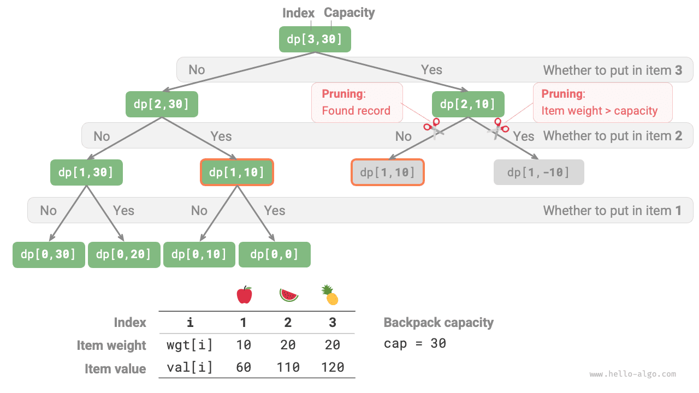

### Phương pháp 3: Quy hoạch động

Về bản chất, quy hoạch động là quá trình điền vào bảng $dp$ trong khi chuyển trạng thái. Đoạn mã như sau:

```src
[file]{knapsack}-[class]{}-[func]{knapsack_dp}
```

Như minh họa trong hình bên dưới, cả độ phức tạp thời gian và độ phức tạp không gian đều được xác định bởi kích thước của mảng `dp`, chính là $O(n \times cap)$.

=== "<1>"
    

=== "<2>"
    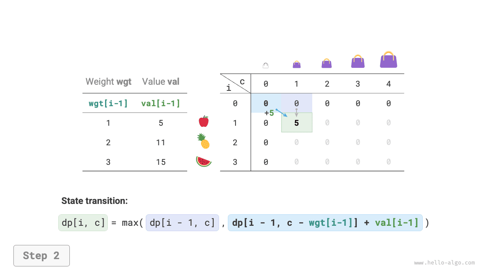

=== "<3>"
    

=== "<4>"
    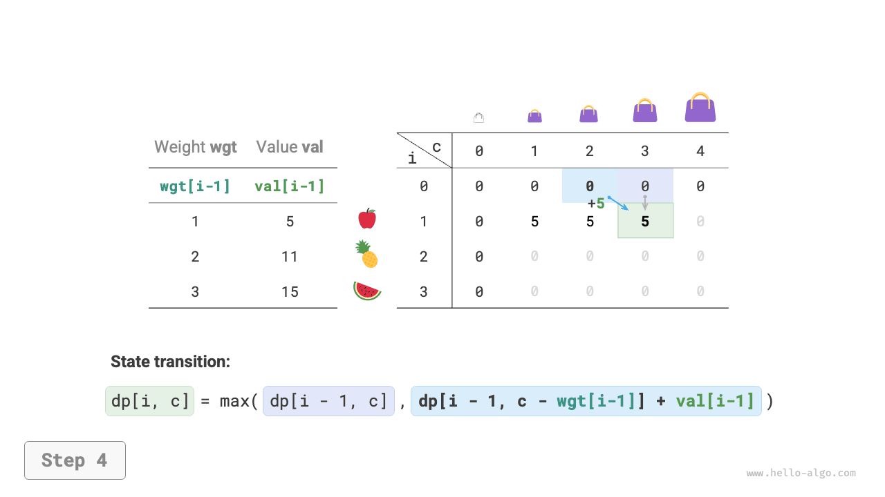

=== "<5>"
    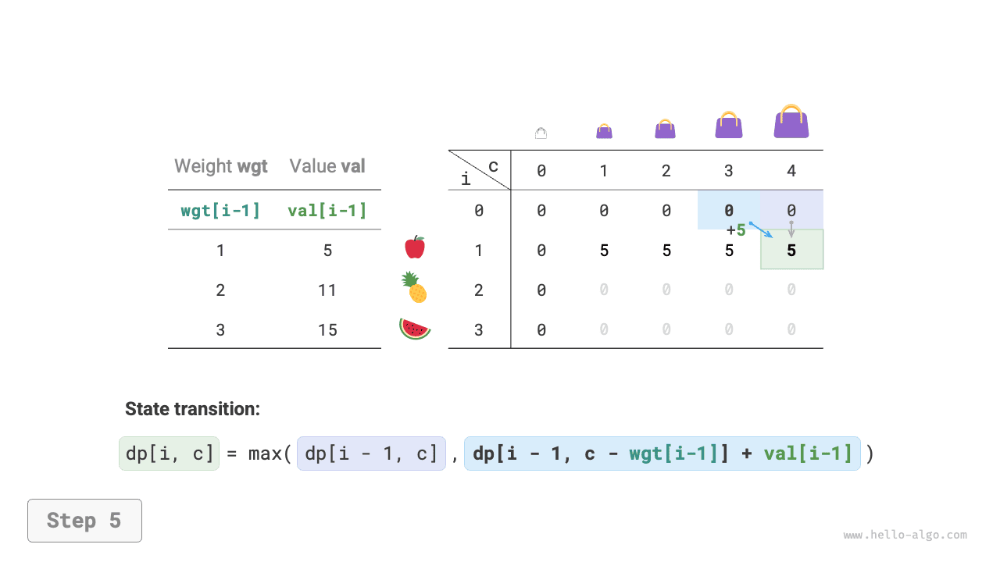

=== "<6>"
    

=== "<7>"
    

=== "<8>"
    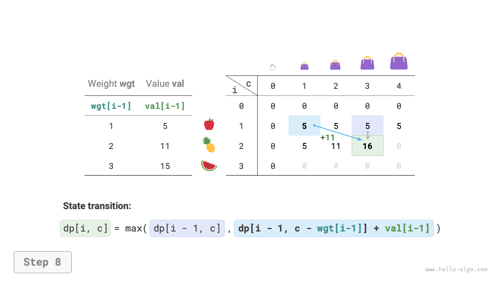

=== "<9>"
    

=== "<10>"
    

=== "<11>"
    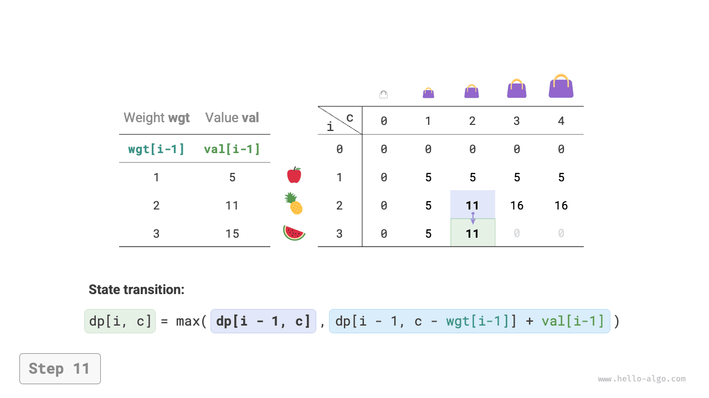

=== "<12>"
    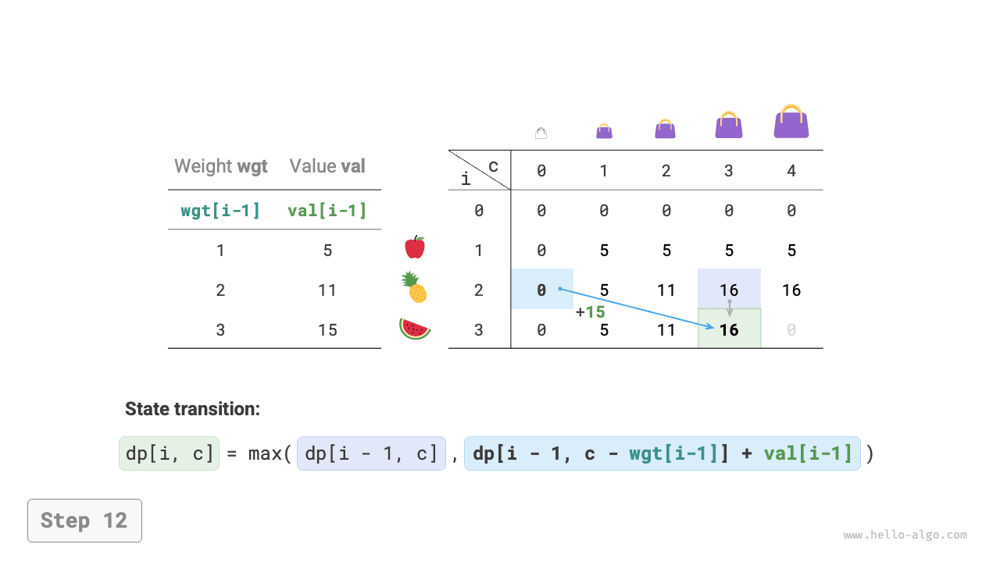

=== "<13>"
    

=== "<14>"
    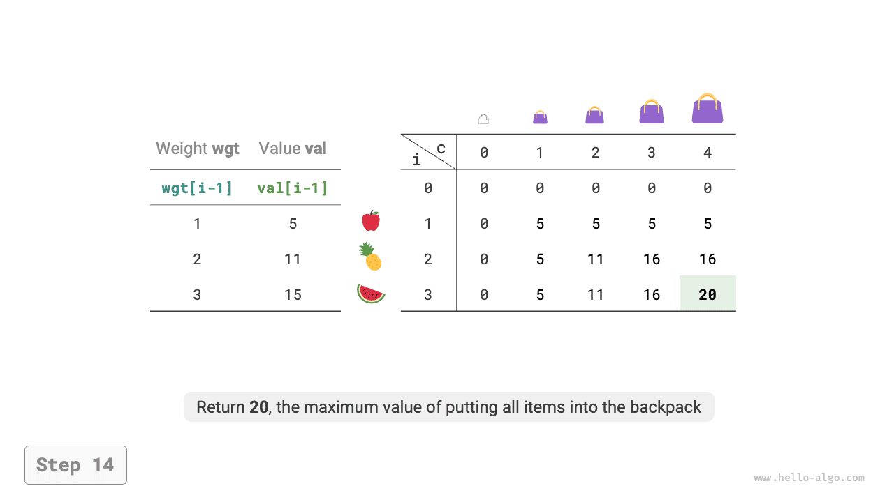

### Tối ưu không gian

Vì mỗi trạng thái chỉ liên quan đến trạng thái ở hàng phía trên nó, ta có thể dùng hai mảng luân chuyển liên tục để giảm độ phức tạp không gian từ $O(n^2)$ xuống còn $O(n)$.

Suy nghĩ sâu hơn, liệu ta có thể đạt được tối ưu không gian chỉ với một mảng duy nhất hay không? Quan sát kỹ, ta thấy mỗi trạng thái được chuyển từ ô ngay phía trên hoặc ô phía trên bên trái. Nếu chỉ có một mảng duy nhất, khi ta bắt đầu duyệt qua hàng $i$, mảng đó vẫn đang lưu trạng thái của hàng $i-1$.

- Nếu dùng duyệt thuận, thì khi duyệt đến $dp[i, j]$, các giá trị ở phía trên bên trái $dp[i-1, 1]$ ~ $dp[i-1, j-1]$ có thể đã bị ghi đè, do đó ngăn cản việc chuyển trạng thái chính xác.
- Nếu dùng duyệt ngược, sẽ không xảy ra vấn đề ghi đè, và việc chuyển trạng thái có thể diễn ra chính xác.

Hình bên dưới cho thấy quá trình chuyển từ hàng $i = 1$ sang hàng $i = 2$ khi dùng một mảng duy nhất. Hãy suy nghĩ về sự khác biệt giữa duyệt thuận và duyệt ngược.

=== "<1>"
    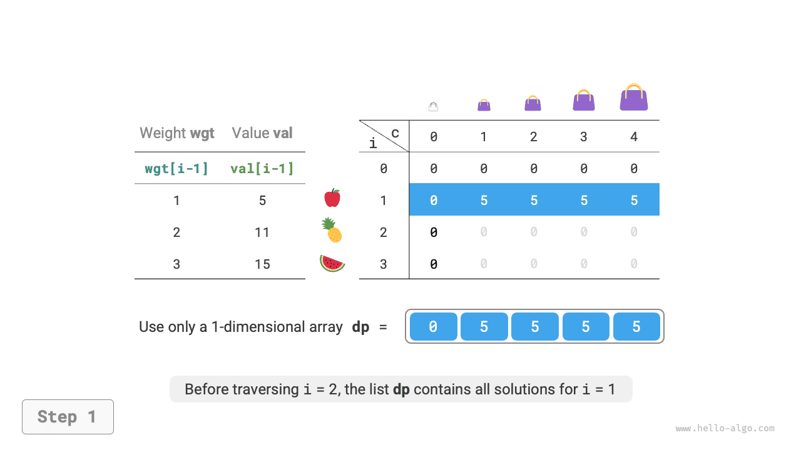

=== "<2>"
    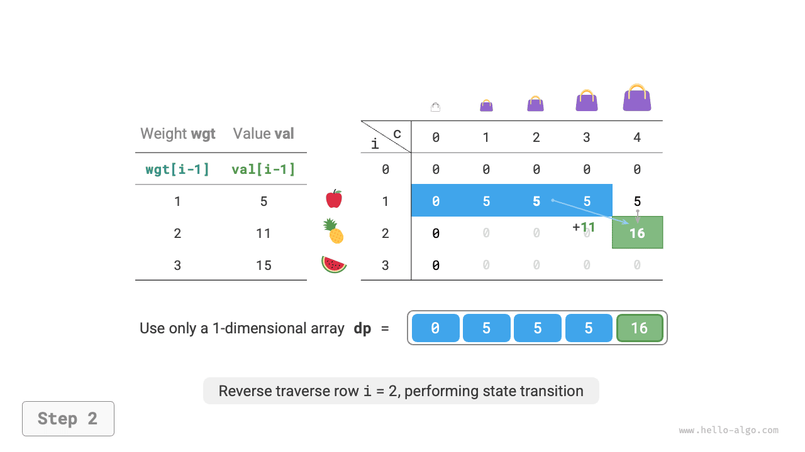

=== "<3>"
    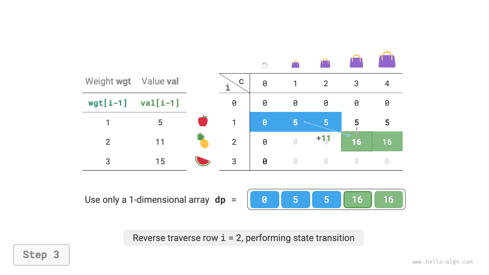

=== "<4>"
    

=== "<5>"
    

=== "<6>"
    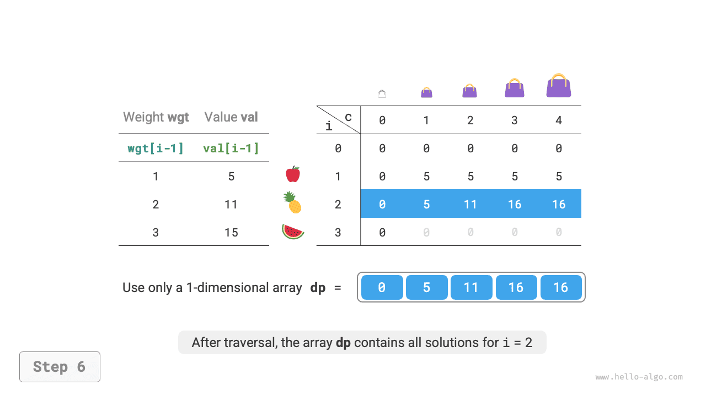

Trong việc triển khai mã, ta chỉ cần xóa chiều đầu tiên $i$ của mảng `dp` và đổi vòng lặp trong thành duyệt ngược:

```src
[file]{knapsack}-[class]{}-[func]{knapsack_dp_comp}
```
