# Bài toán cái túi không giới hạn

Trong phần này, trước tiên ta sẽ giải một bài toán cái túi phổ biến khác: cái túi không giới hạn, sau đó khám phá một trường hợp đặc biệt của nó: bài toán đổi tiền xu.

## Bài toán cái túi không giới hạn

!!! question

    Cho $n$ vật phẩm, trong đó khối lượng của vật phẩm thứ $i$ là $wgt[i-1]$ và giá trị của nó là $val[i-1]$, cùng một cái túi có sức chứa $cap$. **Mỗi vật phẩm có thể được chọn nhiều lần**. Hỏi giá trị lớn nhất có thể đặt vào túi trong giới hạn sức chứa là bao nhiêu? Một ví dụ được minh họa trong hình bên dưới.


### Phương pháp quy hoạch động

Bài toán cái túi không giới hạn rất giống với bài toán cái túi 0-1, **chỉ khác ở chỗ không có giới hạn về số lần một vật phẩm có thể được chọn**.

- Trong bài toán cái túi 0-1, mỗi loại vật phẩm chỉ có một cái duy nhất, nên sau khi đặt vật phẩm $i$ vào túi, ta chỉ có thể chọn tiếp từ $i-1$ vật phẩm đầu tiên.
- Trong bài toán cái túi không giới hạn, số lượng mỗi loại vật phẩm là không giới hạn, nên sau khi đặt vật phẩm $i$ vào túi, **ta vẫn có thể chọn tiếp từ $i$ vật phẩm đầu tiên**.

Theo quy tắc của bài toán cái túi không giới hạn, sự thay đổi của trạng thái $[i, c]$ được chia thành hai trường hợp.

- **Không đặt vật phẩm $i$ vào túi**: Giống như bài toán cái túi 0-1, chuyển sang $[i-1, c]$.
- **Đặt vật phẩm $i$ vào túi**: Khác với bài toán cái túi 0-1, chuyển sang $[i, c-wgt[i-1]]$.

Do đó, phương trình chuyển trạng thái trở thành:

$$
dp[i, c] = \max(dp[i-1, c], dp[i, c - wgt[i-1]] + val[i-1])
$$

### Triển khai mã

So sánh đoạn mã của hai bài toán, có một thay đổi trong chuyển trạng thái từ $i-1$ thành $i$, còn lại đều giống hệt nhau:

```src
[file]{unbounded_knapsack}-[class]{}-[func]{unbounded_knapsack_dp}
```

### Tối ưu không gian

Vì trạng thái hiện tại được chuyển từ các trạng thái ở bên trái và phía trên, **sau khi tối ưu không gian, mỗi hàng trong bảng $dp$ nên được duyệt theo thứ tự thuận**.

Thứ tự duyệt này hoàn toàn ngược lại so với bài toán cái túi 0-1. Hãy tham khảo hình bên dưới để hiểu sự khác biệt giữa hai bài toán.

=== "<1>"
    

=== "<2>"
    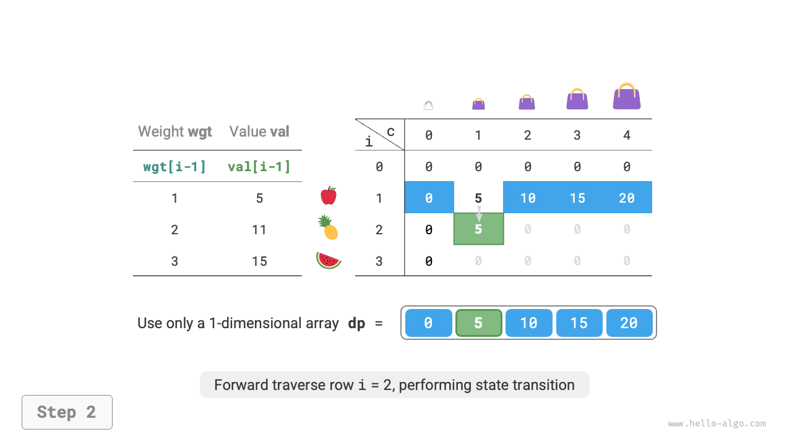

=== "<3>"
    

=== "<4>"
    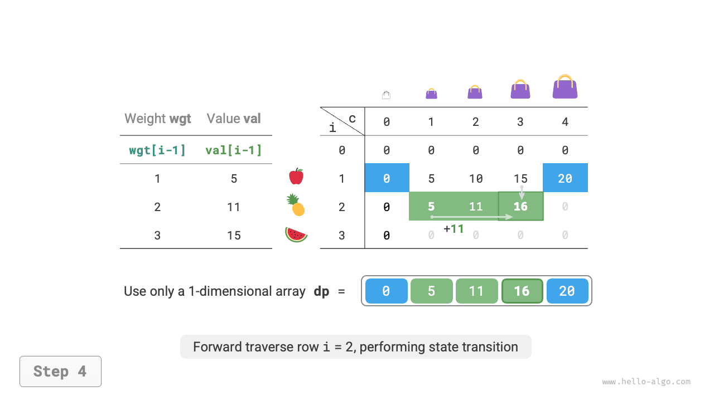

=== "<5>"
    

=== "<6>"
    

Việc triển khai mã tương đối đơn giản, chỉ cần xóa chiều đầu tiên của mảng `dp`:

```src
[file]{unbounded_knapsack}-[class]{}-[func]{unbounded_knapsack_dp_comp}
```

## Bài toán đổi tiền xu

Bài toán cái túi đại diện cho một lớp lớn các bài toán quy hoạch động và có nhiều biến thể, chẳng hạn như bài toán đổi tiền xu.

!!! question

    Cho $n$ loại tiền xu, trong đó mệnh giá của loại tiền xu thứ $i$ là $coins[i - 1]$, và số tiền mục tiêu là $amt$. **Mỗi loại tiền xu có thể được chọn nhiều lần**. Hỏi số lượng tiền xu tối thiểu cần dùng để tạo thành số tiền mục tiêu là bao nhiêu? Nếu không thể tạo thành số tiền mục tiêu, trả về $-1$. Một ví dụ được minh họa trong hình bên dưới.

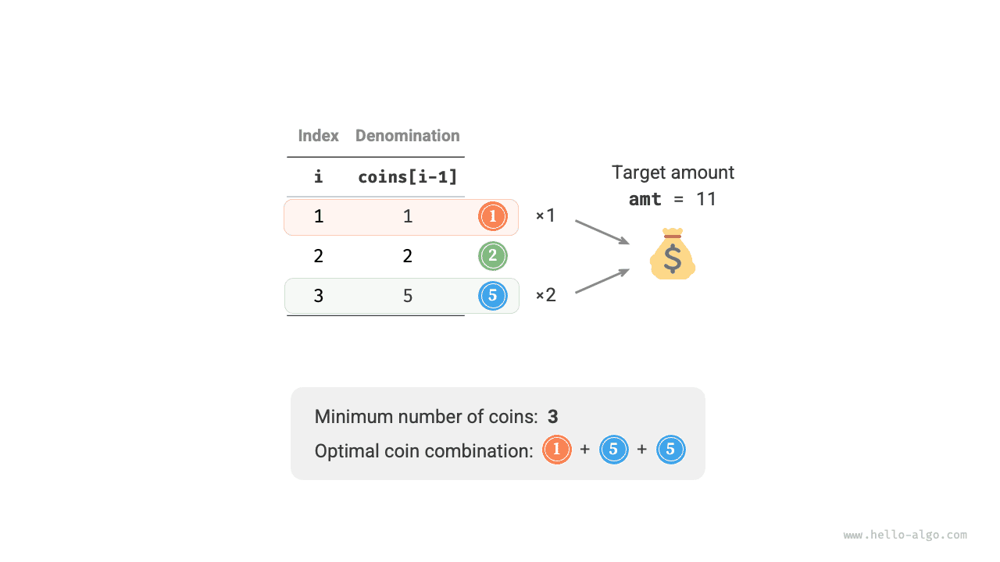

### Phương pháp quy hoạch động

**Bài toán đổi tiền xu có thể được xem như một trường hợp đặc biệt của bài toán cái túi không giới hạn**, với những liên hệ và khác biệt sau.

- Hai bài toán có thể được chuyển đổi qua lại: "vật phẩm" tương ứng với "đồng xu", "khối lượng vật phẩm" tương ứng với "mệnh giá đồng xu", và "sức chứa túi" tương ứng với "số tiền mục tiêu".
- Mục tiêu tối ưu hóa là trái ngược nhau: bài toán cái túi không giới hạn nhằm tối đa hóa giá trị vật phẩm, trong khi bài toán đổi tiền xu nhằm tối thiểu hóa số lượng đồng xu.
- Bài toán cái túi không giới hạn tìm lời giải "không vượt quá" sức chứa túi, trong khi bài toán đổi tiền xu tìm lời giải "tạo thành chính xác" số tiền mục tiêu.

**Bước 1: Suy nghĩ về các quyết định trong mỗi vòng, định nghĩa trạng thái, từ đó thu được bảng $dp$**

Trạng thái $[i, a]$ tương ứng với bài toán con: **số lượng đồng xu tối thiểu trong số $i$ loại tiền xu đầu tiên để tạo thành số tiền $a$**, ký hiệu là $dp[i, a]$.

Bảng $dp$ hai chiều có kích thước $(n+1) \times (amt+1)$.

**Bước 2: Xác định cấu trúc con tối ưu, sau đó suy ra phương trình chuyển trạng thái**

Bài toán này khác với bài toán cái túi không giới hạn ở hai khía cạnh sau về phương trình chuyển trạng thái.

- Bài toán này tìm giá trị nhỏ nhất, nên toán tử $\max()$ cần được đổi thành $\min()$.
- Mục tiêu tối ưu hóa là số lượng đồng xu chứ không phải giá trị vật phẩm, nên khi một đồng xu được chọn, chỉ cần cộng thêm $1$.

$$
dp[i, a] = \min(dp[i-1, a], dp[i, a - coins[i-1]] + 1)
$$

**Bước 3: Xác định điều kiện biên và thứ tự chuyển trạng thái**

Khi số tiền mục tiêu bằng $0$, số lượng đồng xu tối thiểu cần dùng để tạo thành nó là $0$, nên tất cả $dp[i, 0]$ ở cột đầu tiên đều bằng $0$.

Khi không có đồng xu nào, **không thể tạo thành bất kỳ số tiền $> 0$ nào**, đây là một lời giải không hợp lệ. Để hàm $\min()$ trong phương trình chuyển trạng thái có thể nhận diện và loại bỏ những lời giải không hợp lệ, ta xem xét dùng $+ \infty$ để biểu diễn chúng, tức là đặt tất cả $dp[0, a]$ ở hàng đầu tiên bằng $+ \infty$.

### Triển khai mã

Hầu hết các ngôn ngữ lập trình không cung cấp một biến $+ \infty$, và chỉ có thể dùng giá trị lớn nhất của kiểu số nguyên `int` để thay thế. Tuy nhiên, điều này có thể dẫn đến tràn số nguyên: phép toán $+ 1$ trong phương trình chuyển trạng thái có thể gây tràn.

Vì lý do này, ta dùng số $amt + 1$ để biểu diễn các lời giải không hợp lệ, vì số lượng đồng xu tối đa cần dùng để tạo thành $amt$ nhiều nhất là $amt$. Trước khi trả về, kiểm tra xem $dp[n, amt]$ có bằng $amt + 1$ hay không; nếu có, trả về $-1$, cho biết không thể tạo thành số tiền mục tiêu. Đoạn mã như sau:

```src
[file]{coin_change}-[class]{}-[func]{coin_change_dp}
```

Hình bên dưới cho thấy quá trình quy hoạch động cho bài toán đổi tiền xu, quá trình này rất giống với bài toán cái túi không giới hạn.

=== "<1>"
    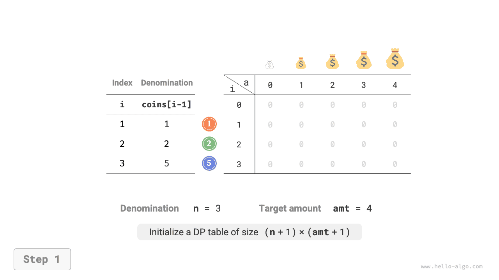

=== "<2>"
    

=== "<3>"
    

=== "<4>"
    

=== "<5>"
    

=== "<6>"
    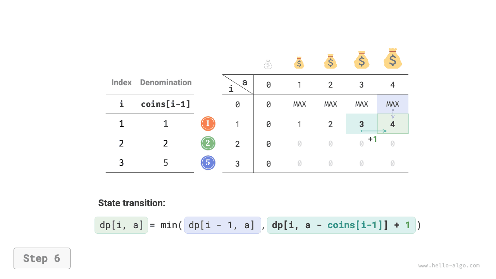

=== "<7>"
    

=== "<8>"
    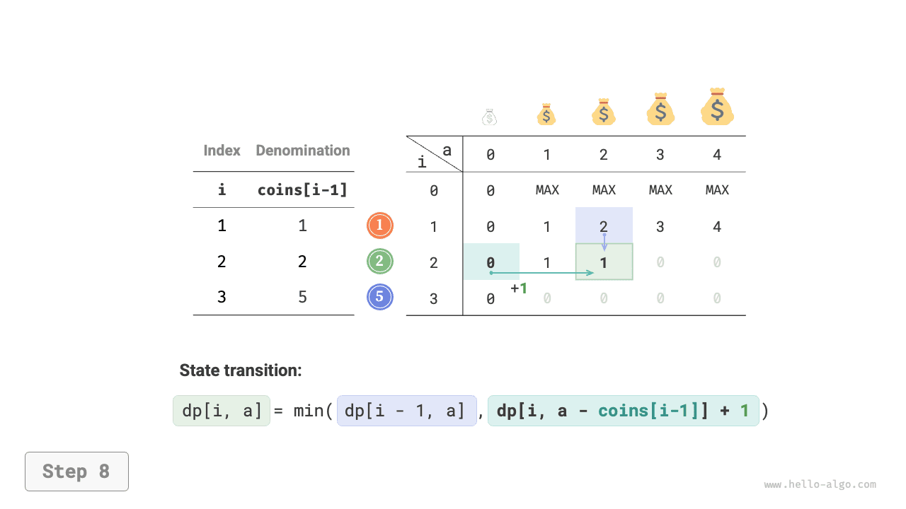

=== "<9>"
    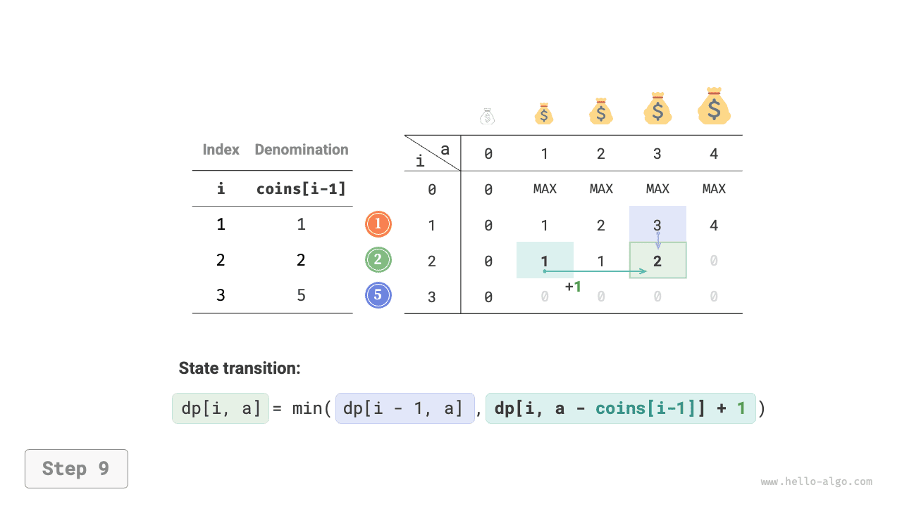

=== "<10>"
    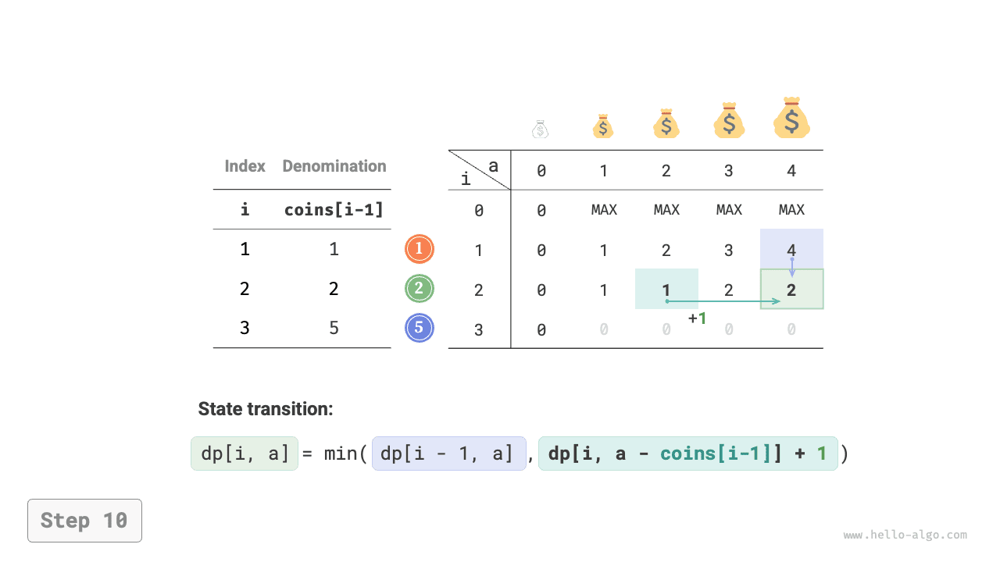

=== "<11>"
    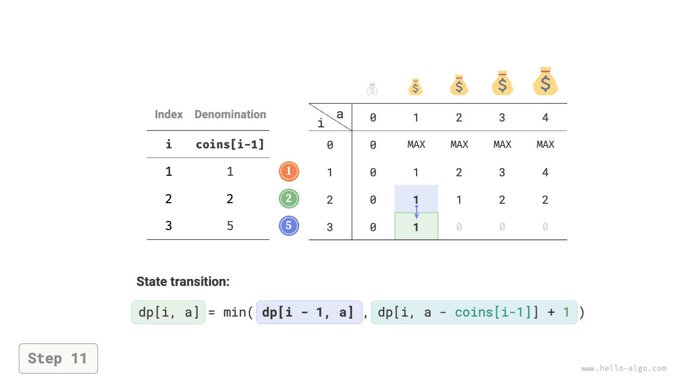

=== "<12>"
    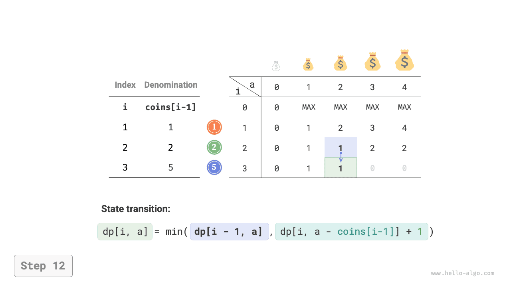

=== "<13>"
    

=== "<14>"
    

=== "<15>"
    

### Tối ưu không gian

Việc tối ưu không gian cho bài toán đổi tiền xu được xử lý theo cách giống như bài toán cái túi không giới hạn:

```src
[file]{coin_change}-[class]{}-[func]{coin_change_dp_comp}
```

## Bài toán đổi tiền xu II

!!! question

    Cho $n$ loại tiền xu, trong đó mệnh giá của loại tiền xu thứ $i$ là $coins[i - 1]$, và số tiền mục tiêu là $amt$. Mỗi loại tiền xu có thể được chọn nhiều lần. **Hỏi có bao nhiêu tổ hợp đồng xu có thể tạo thành số tiền mục tiêu?** Một ví dụ được minh họa trong hình bên dưới.

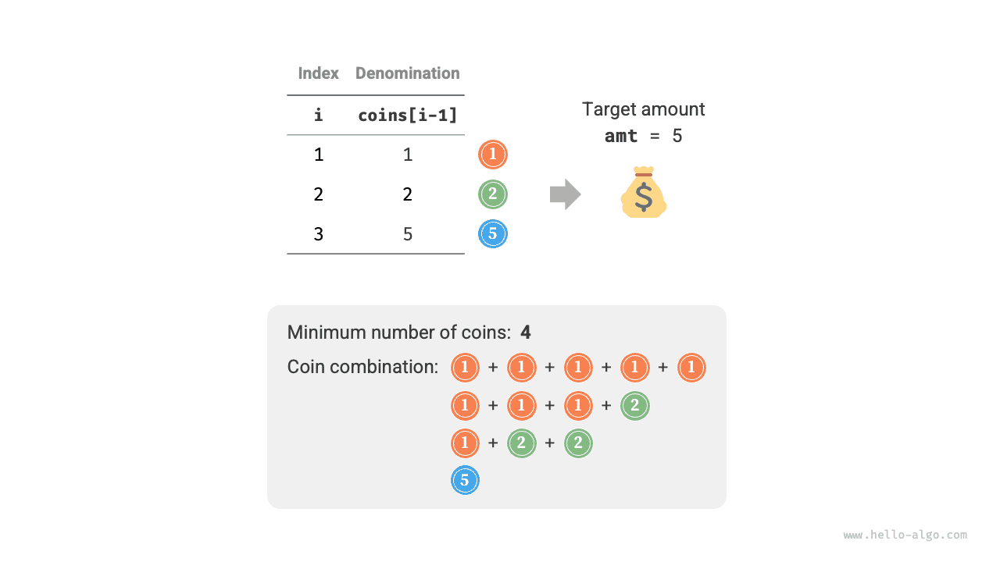

### Phương pháp quy hoạch động

So với bài toán trước, mục tiêu của bài toán này là tìm số lượng tổ hợp, nên bài toán con trở thành: **số lượng tổ hợp trong số $i$ loại tiền xu đầu tiên có thể tạo thành số tiền $a$**. Bảng $dp$ vẫn là một ma trận hai chiều có kích thước $(n+1) \times (amt + 1)$.

Số lượng tổ hợp cho trạng thái hiện tại bằng tổng số tổ hợp từ việc không chọn đồng xu hiện tại và việc chọn đồng xu hiện tại. Phương trình chuyển trạng thái là:

$$
dp[i, a] = dp[i-1, a] + dp[i, a - coins[i-1]]
$$

Khi số tiền mục tiêu bằng $0$, không cần chọn đồng xu nào để tạo thành số tiền mục tiêu, nên tất cả $dp[i, 0]$ ở cột đầu tiên nên được khởi tạo bằng $1$. Khi không có đồng xu nào, không thể tạo thành bất kỳ số tiền $>0$ nào, nên tất cả $dp[0, a]$ ở hàng đầu tiên bằng $0$.

### Triển khai mã

```src
[file]{coin_change_ii}-[class]{}-[func]{coin_change_ii_dp}
```

### Tối ưu không gian

Việc tối ưu không gian được xử lý theo cách tương tự, chỉ cần xóa chiều đồng xu:

```src
[file]{coin_change_ii}-[class]{}-[func]{coin_change_ii_dp_comp}
```
