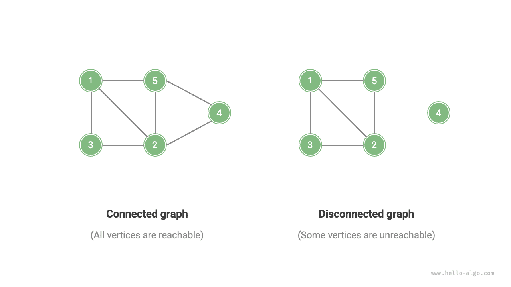
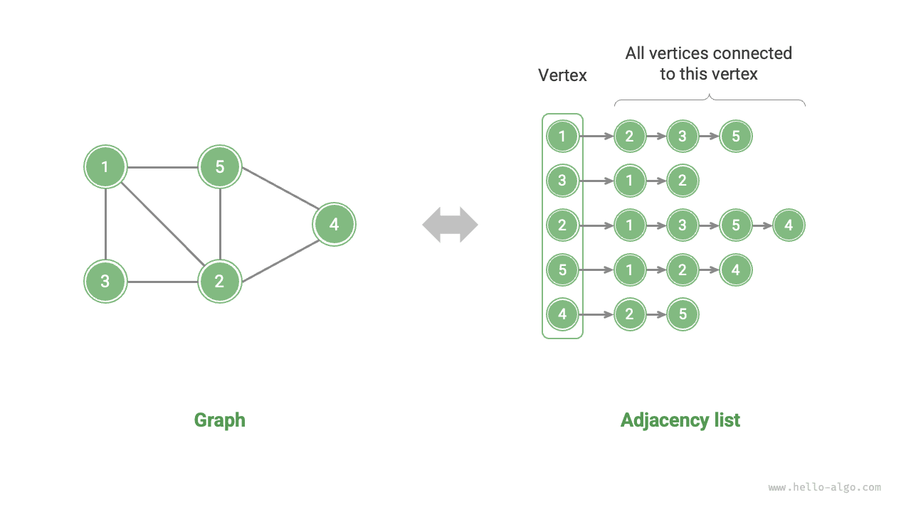

# Đồ thị

<u>Đồ thị</u> là một cấu trúc dữ liệu phi tuyến tính bao gồm các <u>đỉnh</u> và <u>cạnh</u>. Ta có thể biểu diễn một đồ thị $G$ một cách trừu tượng dưới dạng tập đỉnh $V$ và tập cạnh $E$. Ví dụ dưới đây cho thấy một đồ thị gồm 5 đỉnh và 7 cạnh.

$$
\begin{aligned}
V & = \{ 1, 2, 3, 4, 5 \} \newline
E & = \{ (1,2), (1,3), (1,5), (2,3), (2,4), (2,5), (4,5) \} \newline
G & = \{ V, E \} \newline
\end{aligned}
$$

Nếu xem đỉnh là các nút và cạnh là các tham chiếu (con trỏ) nối chúng lại với nhau, ta có thể coi đồ thị là phần mở rộng của cấu trúc dữ liệu danh sách liên kết. Như hình minh họa dưới đây, **so với mối quan hệ tuyến tính (danh sách liên kết) và mối quan hệ chia để trị (cây), mối quan hệ dạng mạng lưới (đồ thị) có mức độ tự do cao hơn nên phức tạp hơn**.

## Các loại và thuật ngữ thường gặp của đồ thị

Đồ thị có thể được chia thành <u>đồ thị vô hướng</u> và <u>đồ thị có hướng</u> tùy theo việc cạnh có hướng hay không, như hình minh họa dưới đây.

- Trong đồ thị vô hướng, cạnh biểu thị một kết nối "hai chiều" giữa hai đỉnh, chẳng hạn như quan hệ bạn bè trên WeChat hoặc QQ.
- Trong đồ thị có hướng, cạnh có tính định hướng, nghĩa là cạnh $A \rightarrow B$ và $A \leftarrow B$ độc lập với nhau, chẳng hạn như quan hệ theo dõi và người theo dõi trên Weibo hoặc TikTok.

Đồ thị có thể được chia thành <u>đồ thị liên thông</u> và <u>đồ thị không liên thông</u> tùy theo việc tất cả các đỉnh có được kết nối với nhau hay không, như hình minh họa dưới đây.

- Đối với đồ thị liên thông, xuất phát từ bất kỳ đỉnh nào, ta đều có thể đến được tất cả các đỉnh còn lại.
- Đối với đồ thị không liên thông, xuất phát từ một đỉnh nhất định, sẽ có ít nhất một đỉnh không thể đến được.

Ta cũng có thể thêm một biến "trọng số" vào các cạnh, tạo thành <u>đồ thị có trọng số</u> như hình minh họa dưới đây. Ví dụ, trong các trò chơi di động như "Liên Quân Mobile", hệ thống tính toán "độ thân thiết" giữa các người chơi dựa trên thời gian họ chơi cùng nhau, và mạng lưới độ thân thiết như vậy có thể được biểu diễn bằng đồ thị có trọng số.

Cấu trúc dữ liệu đồ thị bao gồm các thuật ngữ thường dùng sau đây.

- <u>Kề nhau</u>: Khi hai đỉnh được nối với nhau bởi một cạnh, hai đỉnh đó được gọi là "kề nhau". Trong hình trên, các đỉnh kề của đỉnh 1 là các đỉnh 2, 3 và 5.
- <u>Đường đi</u>: Dãy các cạnh từ đỉnh A đến đỉnh B được gọi là "đường đi" từ A đến B. Trong hình trên, dãy cạnh 1-5-2-4 là một đường đi từ đỉnh 1 đến đỉnh 4.
- <u>Bậc</u>: Số cạnh mà một đỉnh có. Đối với đồ thị có hướng, <u>bậc vào</u> cho biết có bao nhiêu cạnh đi vào đỉnh đó, còn <u>bậc ra</u> cho biết có bao nhiêu cạnh đi ra khỏi đỉnh đó.

## Biểu diễn đồ thị

Các cách biểu diễn đồ thị thường dùng gồm "ma trận kề" và "danh sách kề". Phần dưới đây sử dụng đồ thị vô hướng làm ví dụ minh họa.

### Ma trận kề

Cho một đồ thị có $n$ đỉnh, <u>ma trận kề</u> sử dụng một ma trận kích thước $n \times n$ để biểu diễn đồ thị, trong đó mỗi hàng (cột) đại diện cho một đỉnh, và các phần tử của ma trận đại diện cho các cạnh, dùng giá trị $1$ hoặc $0$ để biểu thị có tồn tại cạnh giữa hai đỉnh hay không.

Như hình minh họa dưới đây, giả sử ma trận kề là $M$ và danh sách đỉnh là $V$. Khi đó phần tử ma trận $M[i, j] = 1$ cho biết tồn tại một cạnh giữa đỉnh $V[i]$ và đỉnh $V[j]$, còn $M[i, j] = 0$ cho biết không có cạnh giữa hai đỉnh đó.

Ma trận kề có các tính chất sau đây.

- Trong đồ thị đơn, các đỉnh không thể tự nối với chính nó, vì vậy các phần tử trên đường chéo chính của ma trận kề không có ý nghĩa.
- Đối với đồ thị vô hướng, cạnh theo cả hai chiều là tương đương nhau, do đó ma trận kề đối xứng qua đường chéo chính.
- Thay các giá trị $1$ và $0$ trong ma trận kề bằng trọng số cho phép nó biểu diễn đồ thị có trọng số.

Khi sử dụng ma trận kề để biểu diễn đồ thị, ta có thể truy cập trực tiếp các phần tử của ma trận để lấy thông tin về cạnh, giúp các thao tác thêm, xóa, tra cứu và sửa đổi có hiệu suất rất cao, với độ phức tạp thời gian đều là $O(1)$. Tuy nhiên, độ phức tạp không gian của ma trận là $O(n^2)$, tiêu tốn khá nhiều bộ nhớ.

### Danh sách kề

<u>Danh sách kề</u> sử dụng $n$ danh sách liên kết để biểu diễn đồ thị, trong đó các nút của danh sách liên kết đại diện cho các đỉnh. Danh sách liên kết thứ $i$ tương ứng với đỉnh $i$ và lưu trữ tất cả các đỉnh kề của đỉnh đó (các đỉnh được nối với đỉnh đó). Hình dưới đây minh họa ví dụ về một đồ thị được lưu trữ bằng danh sách kề.

Danh sách kề chỉ lưu trữ những cạnh thực sự tồn tại, và tổng số cạnh thường ít hơn nhiều so với $n^2$, giúp tiết kiệm không gian hơn. Tuy nhiên, việc tìm cạnh trong danh sách kề đòi hỏi phải duyệt qua danh sách liên kết, nên kém hiệu quả về thời gian hơn so với ma trận kề.

Như hình minh họa ở trên, **cấu trúc của danh sách kề rất giống với phương pháp nối chuỗi (separate chaining) trong bảng băm, nên ta có thể áp dụng các phương pháp tương tự để cải thiện hiệu suất**. Ví dụ, khi một danh sách liên kết trở nên quá dài, nó có thể được chuyển đổi thành cây AVL hoặc cây đỏ đen, giúp cải thiện độ phức tạp thời gian từ $O(n)$ xuống $O(\log n)$; nó cũng có thể được chuyển đổi thành bảng băm, giảm độ phức tạp thời gian xuống còn $O(1)$.

## Các ứng dụng phổ biến của đồ thị

Như bảng dưới đây cho thấy, nhiều hệ thống trong thực tế có thể được mô hình hóa bằng đồ thị, và các bài toán tương ứng có thể được quy về bài toán tính toán trên đồ thị.

 Bảng <id> &nbsp; Các đồ thị thường gặp trong thực tế 

|                   | Đỉnh              | Cạnh                                        | Bài toán tính toán trên đồ thị  |
| ----------------- | ----------------- | -------------------------------------------- | -------------------------------- |
| Mạng xã hội        | Người dùng         | Quan hệ bạn bè                               | Gợi ý bạn bè tiềm năng            |
| Tuyến tàu điện ngầm | Ga tàu             | Khả năng kết nối giữa các ga                 | Gợi ý lộ trình ngắn nhất          |
| Hệ mặt trời         | Thiên thể          | Lực hấp dẫn giữa các thiên thể                | Tính toán quỹ đạo hành tinh       |
