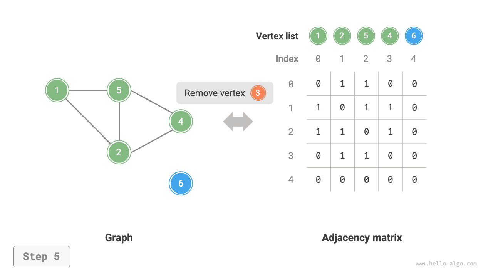
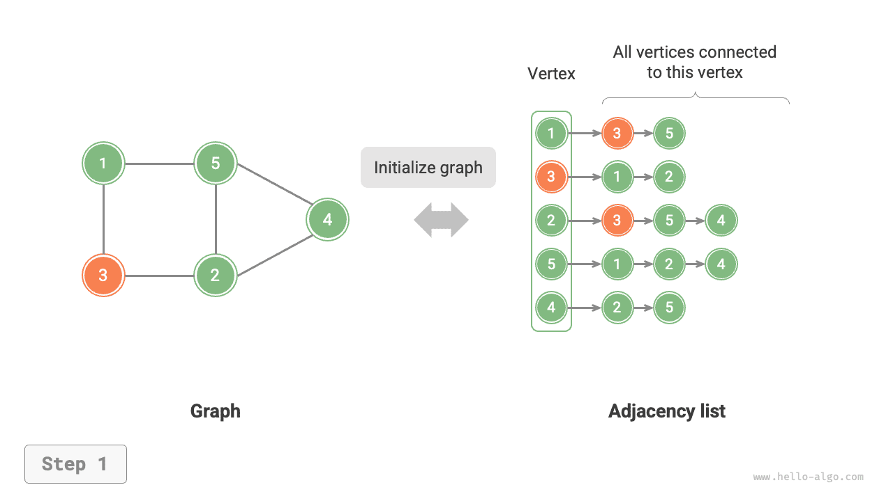
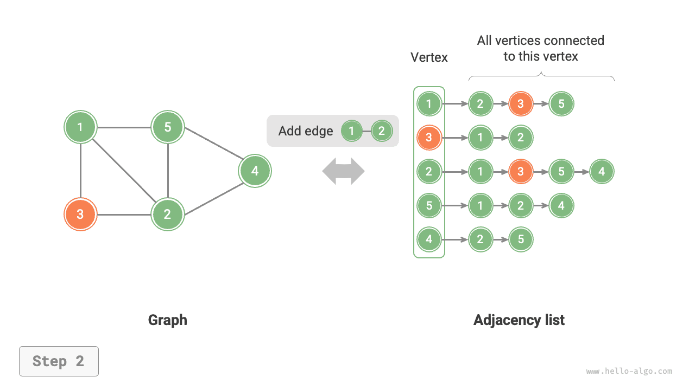
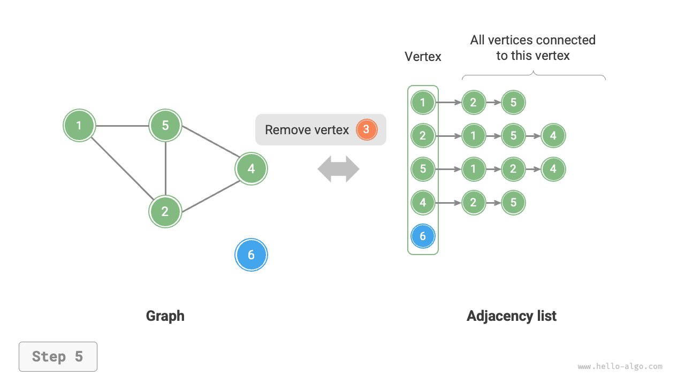

# Các thao tác cơ bản trên đồ thị

Các thao tác cơ bản trên đồ thị có thể được chia thành thao tác trên "cạnh" và thao tác trên "đỉnh". Cách triển khai của chúng khác nhau tùy theo việc đồ thị được biểu diễn dưới dạng "ma trận kề" hay "danh sách kề".

## Triển khai dựa trên ma trận kề

Cho một đồ thị vô hướng có $n$ đỉnh, các thao tác khác nhau được triển khai như hình minh họa dưới đây.

- **Thêm hoặc xóa một cạnh**: Sửa đổi trực tiếp cạnh được chỉ định trong ma trận kề, sử dụng thời gian $O(1)$. Vì đây là đồ thị vô hướng nên cả hai chiều của cạnh cần được cập nhật đồng thời.
- **Thêm một đỉnh**: Thêm một hàng và một cột vào cuối ma trận kề rồi điền toàn bộ giá trị $0$, sử dụng thời gian $O(n)$.
- **Xóa một đỉnh**: Xóa một hàng và một cột trong ma trận kề. Trường hợp xấu nhất xảy ra khi xóa hàng và cột đầu tiên, đòi hỏi phải "dịch chuyển lên trên và sang trái" $(n-1)^2$ phần tử, do đó sử dụng thời gian $O(n^2)$.
- **Khởi tạo**: Cho $n$ đỉnh, khởi tạo một danh sách đỉnh `vertices` có độ dài $n$, sử dụng thời gian $O(n)$; khởi tạo một ma trận kề `adjMat` có kích thước $n \times n$, sử dụng thời gian $O(n^2)$.

=== "<1>"
    

=== "<2>"
    

=== "<3>"
    

=== "<4>"
    

=== "<5>"
    

Dưới đây là mã triển khai cho đồ thị được biểu diễn bằng ma trận kề:

```src
[file]{graph_adjacency_matrix}-[class]{graph_adj_mat}-[func]{}
```

## Triển khai dựa trên danh sách kề

Cho một đồ thị vô hướng có tổng cộng $n$ đỉnh và $m$ cạnh, các thao tác khác nhau có thể được triển khai như hình minh họa dưới đây.

- **Thêm một cạnh**: Thêm cạnh vào cuối danh sách liên kết của đỉnh tương ứng, sử dụng thời gian $O(1)$. Vì đây là đồ thị vô hướng nên cần thêm cạnh theo cả hai chiều đồng thời.
- **Xóa một cạnh**: Tìm và xóa cạnh được chỉ định trong danh sách liên kết của đỉnh tương ứng, sử dụng thời gian $O(m)$. Trong đồ thị vô hướng, cần xóa cạnh theo cả hai chiều đồng thời.
- **Thêm một đỉnh**: Thêm một danh sách liên kết vào danh sách kề, với đỉnh mới làm nút đầu, sử dụng thời gian $O(1)$.
- **Xóa một đỉnh**: Duyệt qua toàn bộ danh sách kề và xóa tất cả các cạnh chứa đỉnh được chỉ định, sử dụng thời gian $O(n + m)$.
- **Khởi tạo**: Tạo $n$ đỉnh và $2m$ cạnh trong danh sách kề, sử dụng thời gian $O(n + m)$.

=== "<1>"
    

=== "<2>"
    

=== "<3>"
    

=== "<4>"
    

=== "<5>"
    

Đoạn mã dưới đây minh họa cách triển khai danh sách kề. So với hình minh họa ở trên, mã thực tế có một số điểm khác biệt sau.

- Để thuận tiện cho việc thêm và xóa đỉnh, đồng thời đơn giản hóa mã nguồn, ta sử dụng danh sách (mảng động) thay vì danh sách liên kết.
- Một bảng băm được sử dụng để lưu trữ danh sách kề, trong đó `key` là thực thể đỉnh và `value` là danh sách (danh sách liên kết) các đỉnh kề của đỉnh đó.

Ngoài ra, ta sử dụng lớp `Vertex` để biểu diễn các đỉnh trong danh sách kề vì lý do sau: nếu ta dùng chỉ số danh sách để phân biệt các đỉnh khác nhau, giống như với ma trận kề, thì để xóa đỉnh tại chỉ số $i$, ta sẽ phải duyệt qua toàn bộ danh sách kề và giảm tất cả các chỉ số lớn hơn $i$ đi $1$, việc này rất kém hiệu quả. Tuy nhiên, nếu mỗi đỉnh là một thực thể `Vertex` duy nhất, việc xóa một đỉnh sẽ không đòi hỏi phải sửa đổi các đỉnh khác.

```src
[file]{graph_adjacency_list}-[class]{graph_adj_list}-[func]{}
```

## So sánh hiệu suất

Giả sử đồ thị có $n$ đỉnh và $m$ cạnh, bảng dưới đây so sánh hiệu suất về thời gian và không gian giữa ma trận kề và danh sách kề. Lưu ý rằng danh sách kề (danh sách liên kết) tương ứng với cách triển khai được sử dụng trong phần này, còn danh sách kề (bảng băm) đề cập cụ thể đến cách triển khai trong đó tất cả các danh sách liên kết được thay thế bằng bảng băm.

<p align="center"> Bảng <id> &nbsp; So sánh ma trận kề và danh sách kề </p>

|                          | Ma trận kề | Danh sách kề (danh sách liên kết) | Danh sách kề (bảng băm) |
| ------------------------ | ---------- | ---------------------------------- | ------------------------- |
| Xác định tính kề nhau    | $O(1)$     | $O(n)$                              | $O(1)$                     |
| Thêm một cạnh            | $O(1)$     | $O(1)$                              | $O(1)$                     |
| Xóa một cạnh             | $O(1)$     | $O(n)$                              | $O(1)$                     |
| Thêm một đỉnh            | $O(n)$     | $O(1)$                              | $O(1)$                     |
| Xóa một đỉnh             | $O(n^2)$   | $O(n + m)$                          | $O(n)$                     |
| Dung lượng bộ nhớ sử dụng | $O(n^2)$   | $O(n + m)$                          | $O(n + m)$                 |

Quan sát bảng trên, có vẻ như danh sách kề (bảng băm) có hiệu suất tốt nhất cả về thời gian lẫn không gian. Tuy nhiên, trong thực tế, các thao tác trên cạnh của ma trận kề lại hiệu quả hơn, vì chỉ cần một lần truy cập hoặc gán giá trị mảng duy nhất. Nhìn chung, ma trận kề thể hiện nguyên tắc "đánh đổi không gian lấy thời gian", trong khi danh sách kề thể hiện nguyên tắc "đánh đổi thời gian lấy không gian".
