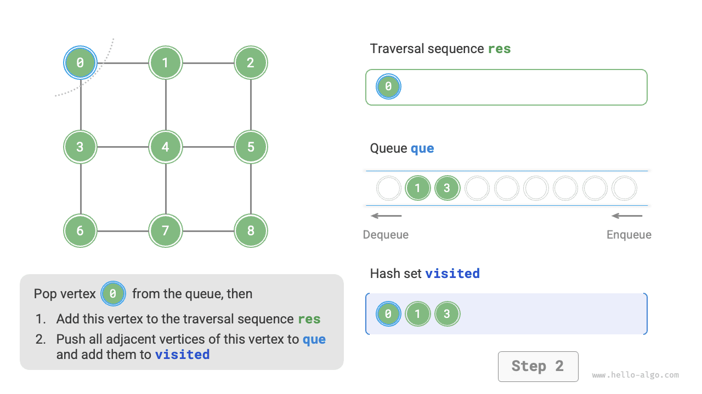
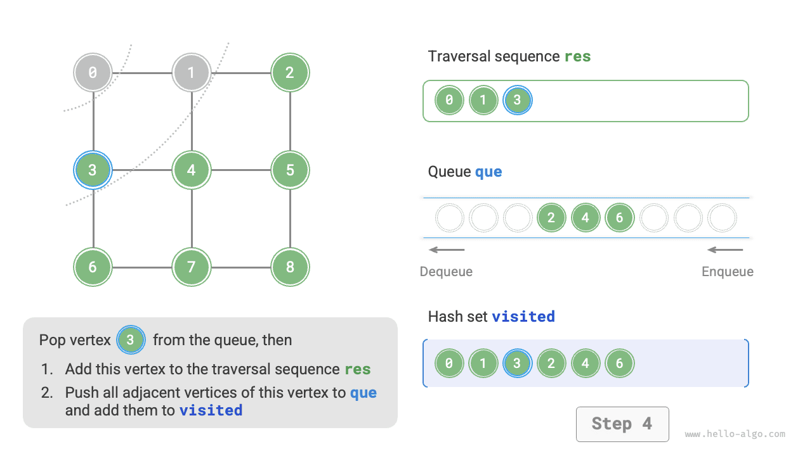
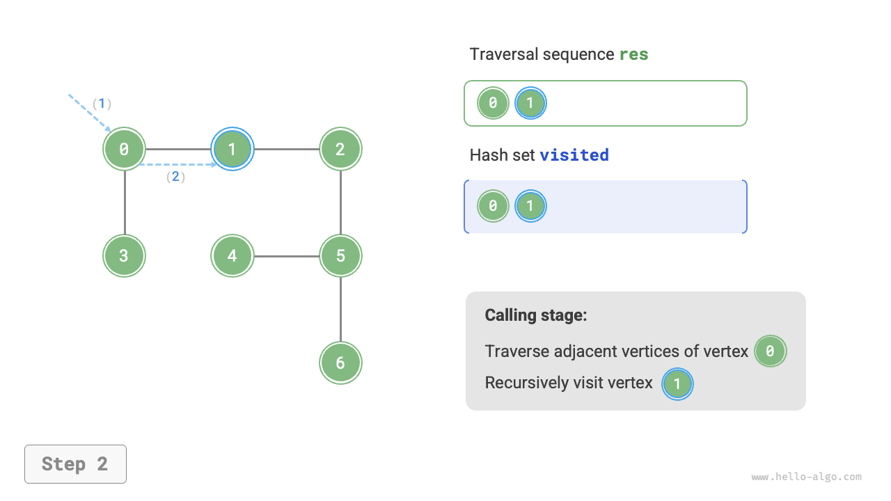
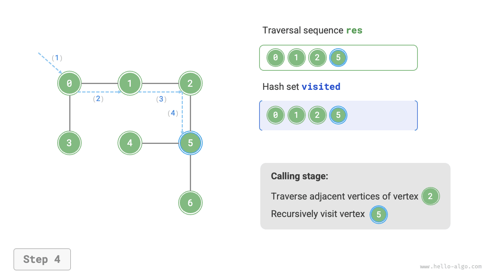
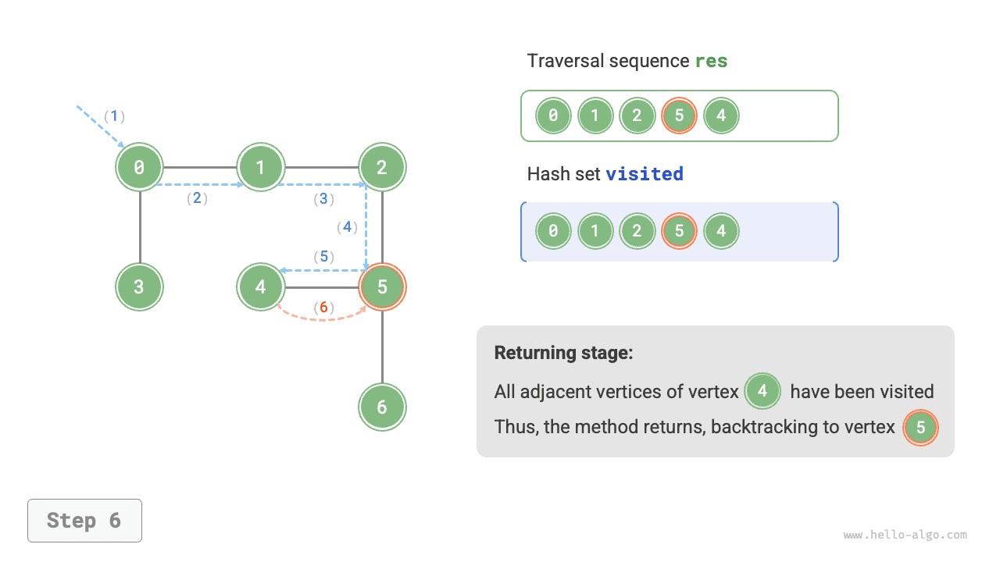
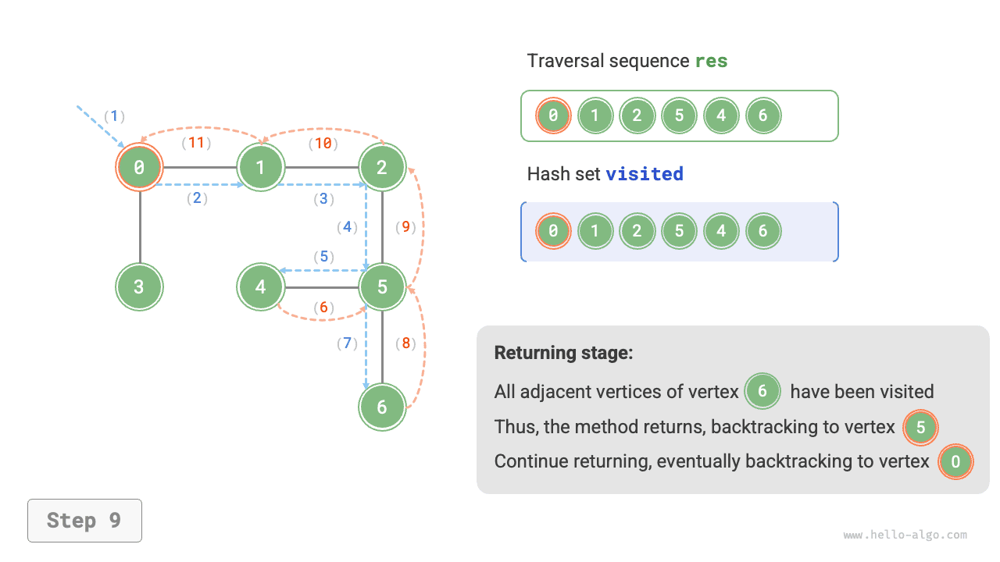

# Duyệt đồ thị

Cây biểu diễn mối quan hệ "một-nhiều", trong khi đồ thị có mức độ tự do cao hơn và có thể biểu diễn bất kỳ mối quan hệ "nhiều-nhiều" nào. Do đó, ta có thể xem cây là một trường hợp đặc biệt của đồ thị. Rõ ràng, **các thao tác duyệt cây cũng là một trường hợp đặc biệt của các thao tác duyệt đồ thị**.

Cả đồ thị và cây đều cần áp dụng các thuật toán tìm kiếm để thực hiện thao tác duyệt. Các phương pháp duyệt đồ thị cũng có thể được chia thành hai loại: <u>duyệt theo chiều rộng</u> và <u>duyệt theo chiều sâu</u>.

## Tìm kiếm theo chiều rộng

**Tìm kiếm theo chiều rộng tiến hành từ gần đến xa: xuất phát từ một nút cho trước, nó luôn ghé thăm các đỉnh gần nhất trước, rồi mở rộng dần ra xa theo từng lớp**. Như hình minh họa dưới đây, xuất phát từ đỉnh trên cùng bên trái, trước tiên duyệt qua tất cả các đỉnh kề của đỉnh đó, sau đó duyệt qua tất cả các đỉnh kề của đỉnh tiếp theo, và cứ như vậy cho đến khi tất cả các đỉnh đã được ghé thăm.


### Triển khai thuật toán

BFS thường được triển khai với sự trợ giúp của hàng đợi, như đoạn mã dưới đây. Hàng đợi có tính chất "vào trước ra trước", phù hợp với ý tưởng "từ gần đến xa" của BFS.

1. Thêm đỉnh xuất phát `startVet` vào hàng đợi và bắt đầu vòng lặp.
2. Trong mỗi lần lặp, lấy đỉnh ở đầu hàng đợi ra và đánh dấu là đã ghé thăm, sau đó thêm tất cả các đỉnh kề của đỉnh đó vào cuối hàng đợi.
3. Lặp lại bước `2.` cho đến khi tất cả các đỉnh đã được ghé thăm.

Để tránh ghé thăm lại các đỉnh, ta sử dụng một tập băm `visited` để ghi lại những nút đã được ghé thăm.

!!! tip

    Tập băm có thể được xem như một bảng băm chỉ lưu trữ `key` mà không lưu `value`. Nó hỗ trợ các thao tác thêm, xóa, tra cứu và cập nhật `key` với thời gian $O(1)$. Dựa trên tính duy nhất của `key`, tập băm thường được dùng trong các tình huống như khử trùng lặp dữ liệu.

```src
[file]{graph_bfs}-[class]{}-[func]{graph_bfs}
```

Đoạn mã trên khá trừu tượng, nên tham khảo hình minh họa dưới đây để hiểu rõ hơn.

=== "<1>"
    

=== "<2>"
    

=== "<3>"
    

=== "<4>"
    

=== "<5>"
    

=== "<6>"
    

=== "<7>"
    

=== "<8>"
    

=== "<9>"
    

=== "<10>"
    

=== "<11>"
    

!!! question "Thứ tự duyệt theo chiều rộng có phải là duy nhất?"

    Không phải là duy nhất. Tìm kiếm theo chiều rộng chỉ yêu cầu duyệt theo thứ tự "từ gần đến xa", **và thứ tự duyệt của các đỉnh có cùng khoảng cách có thể được xáo trộn tùy ý**. Lấy hình trên làm ví dụ, thứ tự ghé thăm của đỉnh $1$ và $3$ có thể hoán đổi cho nhau, và thứ tự ghé thăm của các đỉnh $2$, $4$, $6$ cũng vậy.

### Phân tích độ phức tạp

**Độ phức tạp thời gian**: Tất cả các đỉnh đều sẽ được đưa vào và lấy ra khỏi hàng đợi một lần, sử dụng thời gian $O(|V|)$; trong quá trình duyệt các đỉnh kề, vì đây là đồ thị vô hướng nên tất cả các cạnh sẽ được ghé thăm $2$ lần, sử dụng thời gian $O(2|E|)$; tổng cộng sử dụng thời gian $O(|V| + |E|)$.

**Độ phức tạp không gian**: Danh sách `res`, tập băm `visited` và hàng đợi `que` có thể chứa tối đa $|V|$ đỉnh, sử dụng không gian $O(|V|)$.

## Tìm kiếm theo chiều sâu

**Tìm kiếm theo chiều sâu là phương pháp duyệt ưu tiên đi càng xa càng tốt, sau đó quay lui khi không còn đường đi nào nữa**. Như hình minh họa dưới đây, xuất phát từ đỉnh trên cùng bên trái, ghé thăm một đỉnh kề của đỉnh hiện tại, tiếp tục cho đến khi gặp ngõ cụt, rồi quay lại và tiếp tục đi càng xa càng tốt trước khi quay lại lần nữa, và cứ như vậy cho đến khi tất cả các đỉnh đã được duyệt qua.


### Triển khai thuật toán

Kiểu thuật toán "đi càng xa càng tốt rồi quay lại" này thường được triển khai bằng đệ quy. Tương tự như tìm kiếm theo chiều rộng, trong tìm kiếm theo chiều sâu ta cũng cần một tập băm `visited` để ghi lại các đỉnh đã ghé thăm nhằm tránh ghé thăm lại.

```src
[file]{graph_dfs}-[class]{}-[func]{graph_dfs}
```

Luồng hoạt động của thuật toán tìm kiếm theo chiều sâu được minh họa trong hình dưới đây.

- **Đường đứt nét thẳng biểu thị việc đệ quy đi xuống**, cho biết một lệnh gọi đệ quy mới đã được khởi động để ghé thăm một đỉnh mới.
- **Đường đứt nét cong biểu thị việc quay lui đi lên**, cho biết lệnh gọi đệ quy này đã trở về điểm mà nó được gọi.

Để hiểu sâu hơn, nên kết hợp hình minh họa dưới đây với đoạn mã để mô phỏng trong đầu (hoặc vẽ ra) toàn bộ quá trình DFS, bao gồm cả thời điểm mỗi lệnh gọi đệ quy bắt đầu và khi nào nó trả về.

=== "<1>"
    

=== "<2>"
    

=== "<3>"
    

=== "<4>"
    

=== "<5>"
    

=== "<6>"
    

=== "<7>"
    

=== "<8>"
    

=== "<9>"
    

=== "<10>"
    

=== "<11>"
    

!!! question "Thứ tự duyệt theo chiều sâu có phải là duy nhất?"

    Tương tự như tìm kiếm theo chiều rộng, thứ tự duyệt theo chiều sâu cũng không phải là duy nhất. Với một đỉnh cho trước, ta có thể chọn bất kỳ hướng khám phá nào trước; nghĩa là thứ tự các đỉnh kề có thể được sắp xếp lại tùy ý mà vẫn tạo thành tìm kiếm theo chiều sâu.

    Lấy việc duyệt cây làm ví dụ, "gốc $\rightarrow$ trái $\rightarrow$ phải", "trái $\rightarrow$ gốc $\rightarrow$ phải" và "trái $\rightarrow$ phải $\rightarrow$ gốc" lần lượt tương ứng với duyệt tiền thứ tự, trung thứ tự và hậu thứ tự. Chúng đại diện cho ba mức độ ưu tiên duyệt khác nhau, nhưng cả ba đều thuộc về tìm kiếm theo chiều sâu.

### Phân tích độ phức tạp

**Độ phức tạp thời gian**: Tất cả các đỉnh sẽ được ghé thăm $1$ lần, sử dụng thời gian $O(|V|)$; tất cả các cạnh sẽ được ghé thăm $2$ lần, sử dụng thời gian $O(2|E|)$; tổng cộng sử dụng thời gian $O(|V| + |E|)$.

**Độ phức tạp không gian**: Danh sách `res` và tập băm `visited` có thể chứa tối đa $|V|$ đỉnh, và độ sâu đệ quy tối đa là $|V|$, do đó sử dụng không gian $O(|V|)$.
