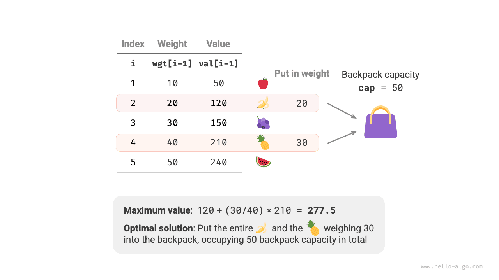
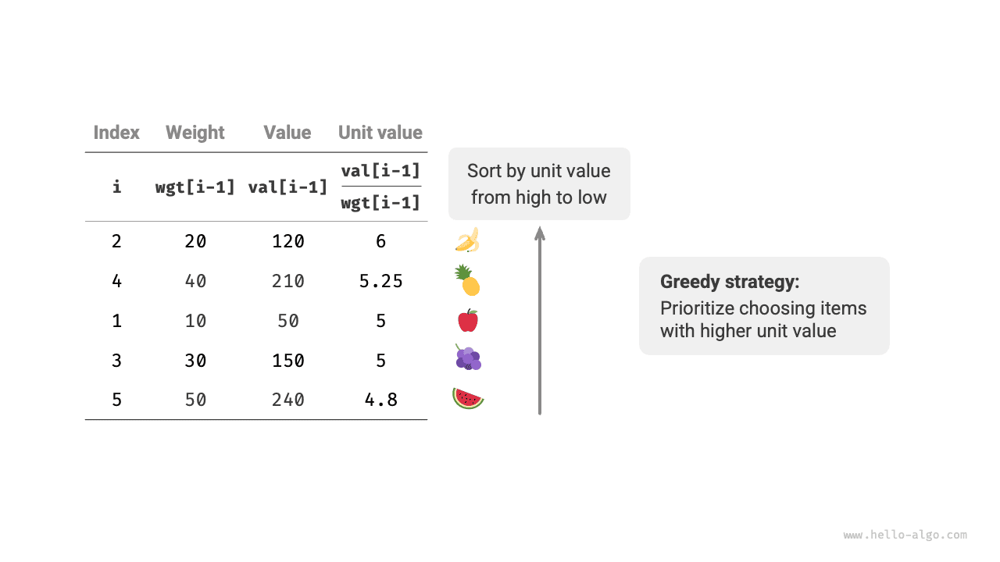

# Bài toán cái túi phân số

!!! question

    Cho $n$ vật phẩm, trong đó trọng lượng của vật phẩm thứ $i$ là $wgt[i-1]$ và giá trị của nó là $val[i-1]$, cùng một cái túi có dung tích $cap$. Mỗi vật phẩm chỉ có thể được chọn một lần, **nhưng có thể chọn một phần của vật phẩm, với giá trị tỷ lệ thuận với trọng lượng được chọn**. Hỏi tổng giá trị lớn nhất có thể đặt vào túi dưới ràng buộc về dung tích là bao nhiêu? Một ví dụ được thể hiện trong hình dưới đây.



Bài toán cái túi phân số nhìn chung rất giống với bài toán cái túi 0-1, với các trạng thái bao gồm vật phẩm hiện tại $i$ và dung tích $c$, và mục tiêu là tối đa hóa giá trị trong giới hạn dung tích của túi.

Điểm khác biệt là bài toán này cho phép chọn chỉ một phần của vật phẩm. Như hình dưới đây cho thấy, **ta có thể chia nhỏ một vật phẩm tùy ý và tính giá trị của nó tỷ lệ theo trọng lượng được chọn**.

1. Với vật phẩm $i$, giá trị trên mỗi đơn vị trọng lượng của nó là $val[i-1] / wgt[i-1]$, gọi là giá trị đơn vị.
2. Giả sử ta đặt một phần của vật phẩm $i$ với trọng lượng $w$ vào túi, thì giá trị được thêm vào túi là $w \times val[i-1] / wgt[i-1]$.


### Xác định chiến lược tham lam

Việc tối đa hóa tổng giá trị trong túi **về bản chất có nghĩa là ưu tiên các vật phẩm có giá trị trên mỗi đơn vị trọng lượng cao hơn**. Từ quan sát này, ta có thể suy ra chiến lược tham lam được thể hiện trong hình dưới đây.

1. Sắp xếp các vật phẩm theo giá trị đơn vị từ cao xuống thấp.
2. Duyệt qua tất cả các vật phẩm, **tham lam chọn vật phẩm có giá trị đơn vị cao nhất trong mỗi vòng**.
3. Nếu dung tích túi còn lại không đủ, sử dụng một phần của vật phẩm hiện tại để lấp đầy túi.



### Triển khai mã nguồn

Ta định nghĩa một lớp `Item` để có thể sắp xếp các vật phẩm theo giá trị đơn vị. Sau đó ta duyệt tham lam qua các vật phẩm đã sắp xếp, dừng lại khi túi đầy và trả về kết quả:

```src
[file]{fractional_knapsack}-[class]{}-[func]{fractional_knapsack}
```

Các giải thuật sắp xếp có sẵn thường mất thời gian $O(n \log n)$, và độ phức tạp không gian của chúng thường là $O(\log n)$ hoặc $O(n)$, tùy thuộc vào cách triển khai cụ thể của ngôn ngữ lập trình.

Ngoài việc sắp xếp, trong trường hợp xấu nhất toàn bộ danh sách vật phẩm cần được duyệt qua, **do đó độ phức tạp thời gian là $O(n)$**, trong đó $n$ là số lượng vật phẩm.

Vì một danh sách đối tượng `Item` được khởi tạo, **độ phức tạp không gian là $O(n)$**.

### Chứng minh tính đúng đắn

Ta sử dụng phương pháp phản chứng. Giả sử vật phẩm $x$ có giá trị đơn vị cao nhất, và một giải thuật nào đó cho ra giá trị tối ưu `res`, nhưng lời giải thu được lại không bao gồm vật phẩm $x$.

Bây giờ ta bỏ ra một đơn vị trọng lượng từ bất kỳ vật phẩm nào trong túi và thay bằng một đơn vị trọng lượng của vật phẩm $x$. Vì vật phẩm $x$ có giá trị đơn vị cao nhất, tổng giá trị sau khi thay thế chắc chắn lớn hơn `res`. **Điều này mâu thuẫn với giả thiết rằng `res` là tối ưu, chứng tỏ rằng bất kỳ lời giải tối ưu nào cũng phải bao gồm vật phẩm $x$**.

Ta có thể xây dựng mâu thuẫn tương tự cho các vật phẩm khác trong lời giải. Tóm lại, **các vật phẩm có giá trị đơn vị cao hơn luôn là lựa chọn tốt hơn**, điều này chứng minh chiến lược tham lam là hiệu quả.

Như hình dưới đây cho thấy, nếu ta xem trọng lượng vật phẩm và giá trị đơn vị là trục hoành và trục tung của một biểu đồ hai chiều, thì bài toán cái túi phân số có thể được xem như "tìm diện tích lớn nhất được bao trong một khoảng giới hạn trên trục hoành." Phép loại suy này giúp giải thích tính hiệu quả của chiến lược tham lam từ góc độ hình học.


