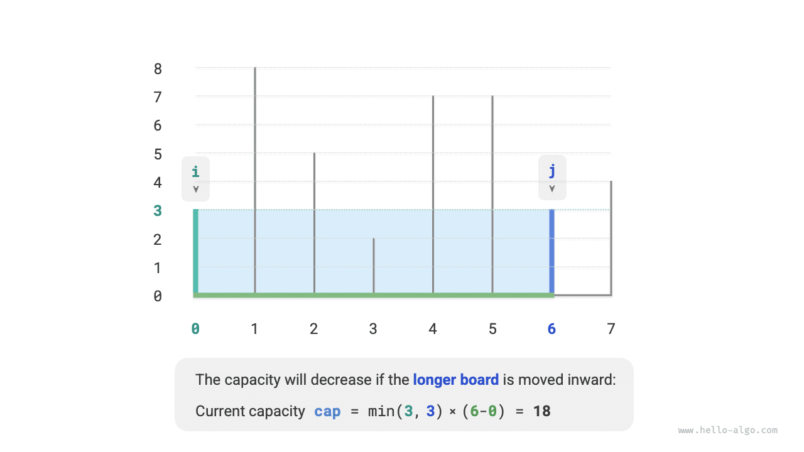
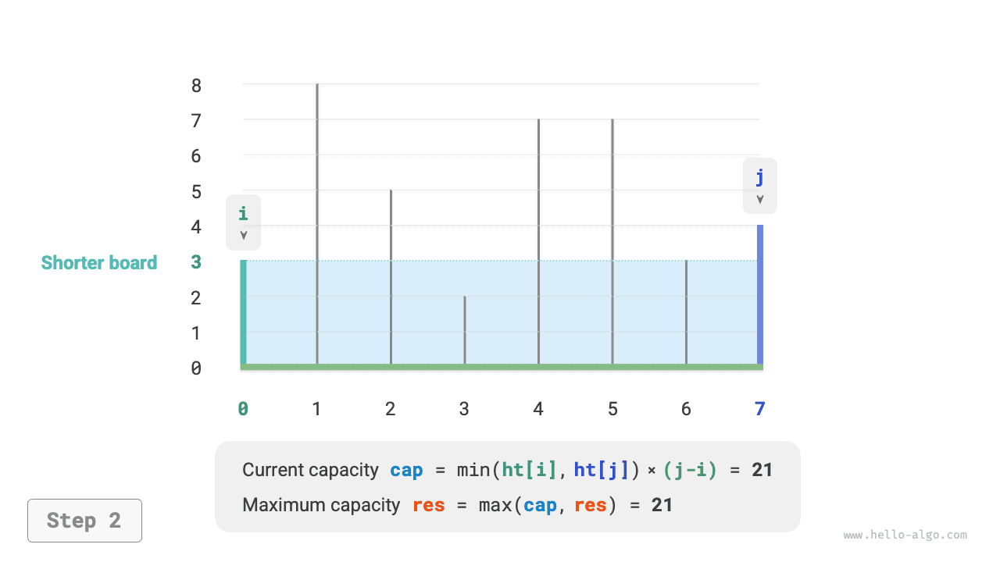
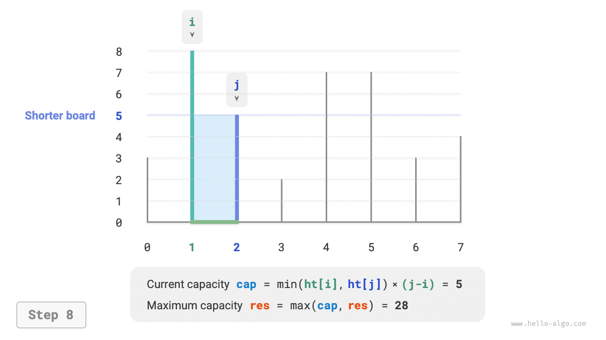
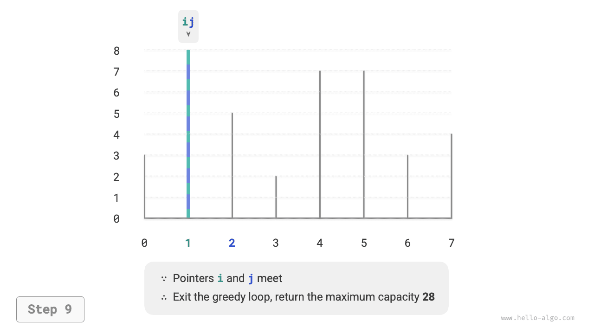

# Bài toán dung tích lớn nhất

!!! question

    Cho một mảng $ht$, trong đó mỗi phần tử biểu diễn chiều cao của một vách ngăn thẳng đứng. Bất kỳ hai vách ngăn nào trong mảng, cùng với khoảng không gian giữa chúng, đều có thể tạo thành một vật chứa.

    Dung tích của vật chứa bằng tích của chiều cao và chiều rộng của nó (tức là diện tích), trong đó chiều cao được xác định bởi vách ngăn thấp hơn và chiều rộng là hiệu giữa chỉ số mảng của hai vách ngăn.

    Hãy chọn hai vách ngăn trong mảng sao cho dung tích của vật chứa thu được là lớn nhất, và trả về dung tích lớn nhất đó. Một ví dụ được thể hiện trong hình dưới đây.


Vật chứa được tạo thành bởi bất kỳ hai vách ngăn nào, **do đó trạng thái của bài toán này là chỉ số của hai vách ngăn, ký hiệu là $[i, j]$**.

Theo đề bài, dung tích bằng chiều cao nhân chiều rộng, trong đó chiều cao được xác định bởi vách ngăn thấp hơn và chiều rộng là hiệu giữa chỉ số mảng của hai vách ngăn. Gọi dung tích là $cap[i, j]$; ta có công thức sau:

$$
cap[i, j] = \min(ht[i], ht[j]) \times (j - i)
$$

Gọi độ dài mảng là $n$. Khi đó số cách chọn hai vách ngăn (tức tổng số trạng thái) là $C_n^2 = \frac{n(n - 1)}{2}$. Cách tiếp cận đơn giản nhất là **liệt kê toàn bộ các trạng thái** để tìm dung tích lớn nhất, với độ phức tạp thời gian là $O(n^2)$.

### Xác định chiến lược tham lam

Bài toán này có một lời giải hiệu quả hơn. Như hình dưới đây cho thấy, xét một trạng thái $[i, j]$ trong đó $i < j$ và $ht[i] < ht[j]$. Trong trường hợp này, $i$ là vách ngăn thấp hơn và $j$ là vách ngăn cao hơn.


Như hình dưới đây cho thấy, **nếu bây giờ ta di chuyển vách ngăn cao hơn $j$ vào phía trong hướng về vách ngăn thấp hơn $i$, dung tích chắc chắn sẽ giảm**.

Đó là vì sau khi di chuyển vách ngăn cao hơn $j$, chiều rộng $j-i$ chắc chắn giảm. Vì chiều cao được xác định bởi vách ngăn thấp hơn, chiều cao chỉ có thể giữ nguyên ($i$ vẫn là vách ngăn thấp hơn) hoặc giảm ($j$ trở thành vách ngăn thấp hơn sau khi được di chuyển).



Ngược lại, **chỉ khi di chuyển vách ngăn thấp hơn $i$ vào phía trong thì dung tích mới có khả năng tăng**. Mặc dù chiều rộng chắc chắn sẽ giảm, **chiều cao có thể tăng** (vách ngăn được di chuyển tại $i$ có thể cao hơn). Ví dụ, trong hình dưới đây, diện tích tăng lên sau khi di chuyển vách ngăn thấp hơn.


Từ đó, ta có thể suy ra chiến lược tham lam cho bài toán này: khởi tạo hai con trỏ ở hai đầu, và trong mỗi vòng di chuyển con trỏ ứng với vách ngăn thấp hơn vào phía trong cho đến khi hai con trỏ gặp nhau.

Hình dưới đây thể hiện quá trình thực thi của chiến lược tham lam.

1. Ở trạng thái ban đầu, con trỏ $i$ và $j$ nằm ở hai đầu của mảng.
2. Tính dung tích của trạng thái hiện tại $cap[i, j]$, và cập nhật dung tích lớn nhất.
3. So sánh chiều cao của vách ngăn $i$ và $j$, và di chuyển con trỏ ứng với vách ngăn thấp hơn vào trong một vị trí.
4. Lặp lại bước `2.` và `3.` cho đến khi $i$ và $j$ gặp nhau.

=== "<1>"
    

=== "<2>"
    

=== "<3>"
    

=== "<4>"
    

=== "<5>"
    

=== "<6>"
    

=== "<7>"
    

=== "<8>"
    

=== "<9>"
    

### Triển khai mã nguồn

Đoạn mã chạy tối đa $n$ vòng, **do đó độ phức tạp thời gian là $O(n)$**.

Các biến $i$, $j$, và $res$ chỉ sử dụng một lượng không gian phụ không đổi, **do đó độ phức tạp không gian là $O(1)$**.

```src
[file]{max_capacity}-[class]{}-[func]{max_capacity}
```

### Chứng minh tính đúng đắn

Lý do giải thuật tham lam nhanh hơn so với liệt kê toàn bộ là mỗi vòng lựa chọn tham lam "bỏ qua" một số trạng thái.

Ví dụ, ở trạng thái $cap[i, j]$, giả sử $i$ là vách ngăn thấp hơn và $j$ là vách ngăn cao hơn. Nếu ta tham lam di chuyển vách ngăn thấp hơn $i$ vào trong một vị trí, các trạng thái được thể hiện trong hình dưới đây sẽ bị "bỏ qua." **Điều này có nghĩa là dung tích của chúng không thể được kiểm tra sau này nữa**.

$$
cap[i, i+1], cap[i, i+2], \dots, cap[i, j-2], cap[i, j-1]
$$


Xem xét kỹ hơn cho thấy **các trạng thái bị bỏ qua này chính là các trạng thái thu được khi di chuyển vách ngăn cao hơn $j$ vào trong**. Ta đã chứng minh rằng việc di chuyển vách ngăn cao hơn vào trong chắc chắn sẽ làm giảm dung tích. Do đó, không trạng thái nào bị bỏ qua có thể là lời giải tối ưu, **vì vậy việc bỏ qua chúng không khiến ta bỏ lỡ giá trị tối ưu**.

Phân tích trên cho thấy việc di chuyển vách ngăn thấp hơn là một thao tác "an toàn," và chiến lược tham lam là hiệu quả.
