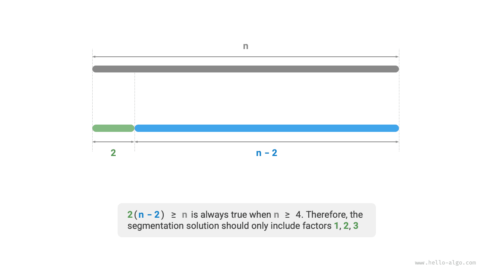

# Bài toán cắt tối ưu tích

!!! question

    Cho một số nguyên dương $n$, hãy chia nó thành tổng của ít nhất hai số nguyên dương và tìm tích lớn nhất của các số nguyên thu được, như hình dưới đây.


Giả sử ta chia $n$ thành $m$ thừa số nguyên, trong đó thừa số thứ $i$ được ký hiệu là $n_i$, tức là

$$
n = \sum_{i=1}^{m}n_i
$$

Mục tiêu của bài toán này là tìm tích lớn nhất của tất cả các thừa số nguyên, tức là

$$
\max(\prod_{i=1}^{m}n_i)
$$

Ta cần xác định có bao nhiêu phần $m$ và mỗi $n_i$ nên là bao nhiêu.

### Xác định chiến lược tham lam

Theo kinh nghiệm, tích của hai số nguyên thường lớn hơn tổng của chúng. Giả sử ta tách một thừa số $2$ ra khỏi $n$; tích thu được là $2(n-2)$. Ta so sánh tích này với $n$:

$$
\begin{aligned}
2(n-2) & \geq n \newline
2n - n - 4 & \geq 0 \newline
n & \geq 4
\end{aligned}
$$

Như hình dưới đây cho thấy, khi $n \geq 4$, việc tách ra một $2$ sẽ làm tăng tích, **điều này cho thấy rằng các số nguyên lớn hơn hoặc bằng $4$ đều nên được tách ra**.

**Chiến lược tham lam một**: Nếu phương án chia có chứa một thừa số $\geq 4$, nó nên được chia tiếp. Phương án chia cuối cùng chỉ nên chứa các thừa số $1$, $2$, và $3$.



Tiếp theo, xét xem thừa số nào là tối ưu. Trong ba thừa số $1$, $2$, và $3$, rõ ràng $1$ là tệ nhất, vì $1 \times (n-1) < n$ luôn đúng, nghĩa là việc tách ra $1$ thực chất sẽ làm giảm tích.

Như hình dưới đây cho thấy, khi $n = 6$, ta có $3 \times 3 > 2 \times 2 \times 2$. **Điều này có nghĩa là tách ra $3$ tốt hơn tách ra $2$**.

**Chiến lược tham lam hai**: Trong phương án chia, chỉ nên có tối đa hai số $2$, vì ba số $2$ luôn có thể được thay bằng hai số $3$ để thu được tích lớn hơn.


Tóm lại, ta có thể suy ra các chiến lược tham lam sau.

1. Nhập số nguyên $n$, liên tục tách ra thừa số $3$ cho đến khi phần dư là $0$, $1$, hoặc $2$.
2. Khi phần dư là $0$, tức là $n$ là bội số của $3$, nên không cần thêm hành động nào.
3. Khi phần dư là $2$, không chia nó thêm nữa; giữ nguyên như vậy.
4. Khi phần dư là $1$, vì $2 \times 2 > 1 \times 3$, hãy thay thừa số $3$ cuối cùng và số $1$ còn lại bằng hai số $2$.

### Triển khai mã nguồn

Như hình dưới đây cho thấy, ta không cần vòng lặp để chia số nguyên. Thay vào đó, ta sử dụng phép chia lấy nguyên để lấy số lượng thừa số $3$, ký hiệu là $a$, và phép chia lấy dư để lấy phần dư $b$, ta có:

$$
n = 3 a + b
$$

Lưu ý rằng với trường hợp biên $n \leq 3$, phải tách ra một $1$, với tích $1 \times (n - 1)$.

```src
[file]{max_product_cutting}-[class]{}-[func]{max_product_cutting}
```


**Độ phức tạp thời gian phụ thuộc vào cách phép lũy thừa được triển khai trong ngôn ngữ lập trình**. Lấy Python làm ví dụ, có ba cách thường dùng để tính lũy thừa.

- Cả toán tử `**` và hàm `pow()` đều có độ phức tạp thời gian $O(\log⁡ a)$.
- Hàm `math.pow()` gọi nội bộ hàm `pow()` của thư viện C, thực hiện phép lũy thừa dấu phẩy động, với độ phức tạp thời gian $O(1)$.

Các biến $a$ và $b$ sử dụng một lượng không gian phụ không đổi, **do đó độ phức tạp không gian là $O(1)$**.

### Chứng minh tính đúng đắn

Ta sử dụng phương pháp phản chứng và chỉ xét trường hợp $n \geq 4$.

1. **Tất cả các thừa số $\leq 3$**: Giả sử phương án chia tối ưu có chứa một thừa số $x \geq 4$. Khi đó nó có thể được chia tiếp thành $2(x-2)$ để thu được tích lớn hơn (hoặc bằng). Điều này mâu thuẫn với giả thiết.
2. **Phương án chia không chứa $1$**: Giả sử phương án chia tối ưu có chứa một thừa số $1$. Khi đó nó có thể được hợp nhất vào một thừa số khác để thu được tích lớn hơn. Điều này mâu thuẫn với giả thiết.
3. **Phương án chia chứa tối đa hai số $2$**: Giả sử phương án chia tối ưu có chứa ba số $2$. Khi đó chúng có thể được thay bằng hai số $3$, cho ra tích lớn hơn. Điều này mâu thuẫn với giả thiết.
