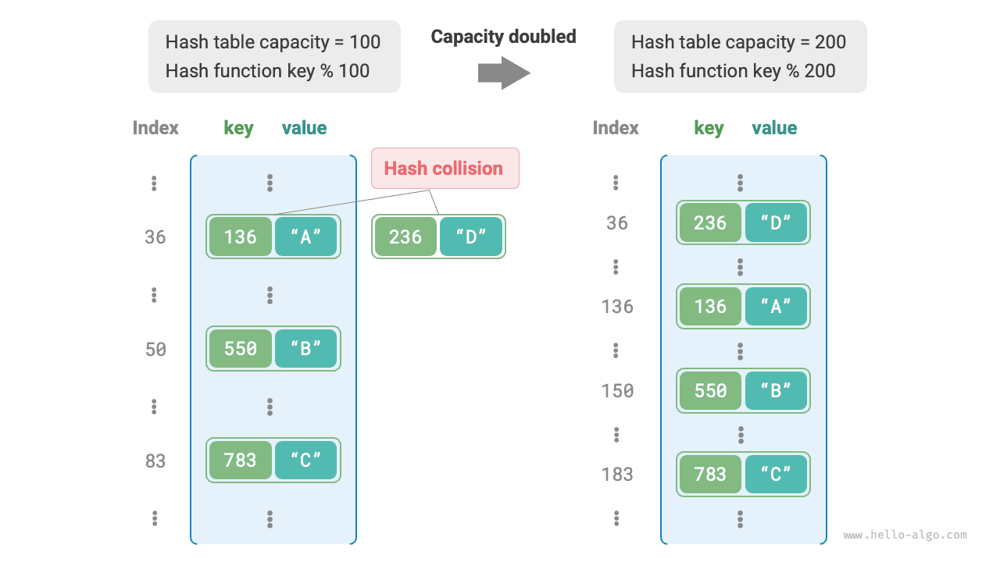

# Bảng băm

<u>Bảng băm</u> (hash table), còn được gọi là <u>hash map</u>, lưu trữ ánh xạ từ khóa `key` đến giá trị `value`, giúp việc tra cứu trở nên hiệu quả. Cụ thể, với một khóa `key` cho trước, ta có thể lấy được giá trị `value` tương ứng từ bảng băm trong thời gian $O(1)$.

Như minh họa dưới đây, giả sử chúng ta có $n$ học sinh, mỗi học sinh có hai thông tin: tên và mã số học sinh. Nếu muốn hỗ trợ truy vấn "cho mã số học sinh, trả về tên tương ứng", ta có thể dùng bảng băm như hình dưới đây.


Ngoài bảng băm, mảng và danh sách liên kết cũng có thể thực hiện chức năng tra cứu. Hiệu quả của chúng được so sánh trong bảng dưới đây.

- **Thêm phần tử**: Chỉ cần thêm phần tử vào cuối mảng (danh sách liên kết), mất thời gian $O(1)$.
- **Tra cứu phần tử**: Vì mảng (danh sách liên kết) không có thứ tự, nên cần duyệt qua tất cả phần tử, mất thời gian $O(n)$.
- **Xóa phần tử**: Trước tiên cần tìm ra phần tử, sau đó xóa khỏi mảng (danh sách liên kết), mất thời gian $O(n)$.

<p align="center"> Bảng <id> &nbsp; So sánh hiệu quả tra cứu phần tử </p>

|                 | Mảng   | Danh sách liên kết | Bảng băm |
| --------------- | ------ | ------------------- | -------- |
| Tìm phần tử      | $O(n)$ | $O(n)$               | $O(1)$   |
| Thêm phần tử     | $O(1)$ | $O(1)$               | $O(1)$   |
| Xóa phần tử      | $O(n)$ | $O(n)$               | $O(1)$   |

Có thể thấy, **các thao tác thêm, xóa, tra cứu và cập nhật trong bảng băm đều có độ phức tạp thời gian $O(1)$**, khiến bảng băm trở nên vô cùng hiệu quả.

## Các thao tác thường dùng với bảng băm

Các thao tác phổ biến trên bảng băm bao gồm: khởi tạo, tra cứu, thêm cặp khóa-giá trị và xóa cặp khóa-giá trị. Mã ví dụ như sau:

=== "Python"

    ```python title="hash_map.py"
    # Khởi tạo bảng băm
    hmap: dict = {}

    # Thao tác thêm
    # Thêm cặp khóa-giá trị (key, value) vào bảng băm
    hmap[12836] = "XiaoHa"
    hmap[15937] = "XiaoLuo"
    hmap[16750] = "XiaoSuan"
    hmap[13276] = "XiaoFa"
    hmap[10583] = "XiaoYa"

    # Thao tác tra cứu
    # Đưa khóa vào bảng băm để lấy giá trị
    name: str = hmap[15937]

    # Thao tác xóa
    # Xóa cặp khóa-giá trị (key, value) khỏi bảng băm
    hmap.pop(10583)
    ```

=== "C++"

    ```cpp title="hash_map.cpp"
    /* Khởi tạo bảng băm */
    unordered_map<int, string> map;

    /* Thao tác thêm */
    // Thêm cặp khóa-giá trị (key, value) vào bảng băm
    map[12836] = "XiaoHa";
    map[15937] = "XiaoLuo";
    map[16750] = "XiaoSuan";
    map[13276] = "XiaoFa";
    map[10583] = "XiaoYa";

    /* Thao tác tra cứu */
    // Đưa khóa vào bảng băm để lấy giá trị
    string name = map[15937];

    /* Thao tác xóa */
    // Xóa cặp khóa-giá trị (key, value) khỏi bảng băm
    map.erase(10583);
    ```

=== "Java"

    ```java title="hash_map.java"
    /* Khởi tạo bảng băm */
    Map<Integer, String> map = new HashMap<>();

    /* Thao tác thêm */
    // Thêm cặp khóa-giá trị (key, value) vào bảng băm
    map.put(12836, "XiaoHa");
    map.put(15937, "XiaoLuo");
    map.put(16750, "XiaoSuan");
    map.put(13276, "XiaoFa");
    map.put(10583, "XiaoYa");

    /* Thao tác tra cứu */
    // Đưa khóa vào bảng băm để lấy giá trị
    String name = map.get(15937);

    /* Thao tác xóa */
    // Xóa cặp khóa-giá trị (key, value) khỏi bảng băm
    map.remove(10583);
    ```

=== "C#"

    ```csharp title="hash_map.cs"
    /* Khởi tạo bảng băm */
    Dictionary<int, string> map = new() {
        /* Thao tác thêm */
        // Thêm cặp khóa-giá trị (key, value) vào bảng băm
        { 12836, "XiaoHa" },
        { 15937, "XiaoLuo" },
        { 16750, "XiaoSuan" },
        { 13276, "XiaoFa" },
        { 10583, "XiaoYa" }
    };

    /* Thao tác tra cứu */
    // Đưa khóa vào bảng băm để lấy giá trị
    string name = map[15937];

    /* Thao tác xóa */
    // Xóa cặp khóa-giá trị (key, value) khỏi bảng băm
    map.Remove(10583);
    ```

=== "Go"

    ```go title="hash_map_test.go"
    /* Khởi tạo bảng băm */
    hmap := make(map[int]string)

    /* Thao tác thêm */
    // Thêm cặp khóa-giá trị (key, value) vào bảng băm
    hmap[12836] = "XiaoHa"
    hmap[15937] = "XiaoLuo"
    hmap[16750] = "XiaoSuan"
    hmap[13276] = "XiaoFa"
    hmap[10583] = "XiaoYa"

    /* Thao tác tra cứu */
    // Đưa khóa vào bảng băm để lấy giá trị
    name := hmap[15937]

    /* Thao tác xóa */
    // Xóa cặp khóa-giá trị (key, value) khỏi bảng băm
    delete(hmap, 10583)
    ```

=== "Swift"

    ```swift title="hash_map.swift"
    /* Khởi tạo bảng băm */
    var map: [Int: String] = [:]

    /* Thao tác thêm */
    // Thêm cặp khóa-giá trị (key, value) vào bảng băm
    map[12836] = "XiaoHa"
    map[15937] = "XiaoLuo"
    map[16750] = "XiaoSuan"
    map[13276] = "XiaoFa"
    map[10583] = "XiaoYa"

    /* Thao tác tra cứu */
    // Đưa khóa vào bảng băm để lấy giá trị
    let name = map[15937]!

    /* Thao tác xóa */
    // Xóa cặp khóa-giá trị (key, value) khỏi bảng băm
    map.removeValue(forKey: 10583)
    ```

=== "JS"

    ```javascript title="hash_map.js"
    /* Khởi tạo bảng băm */
    const map = new Map();
    /* Thao tác thêm */
    // Thêm cặp khóa-giá trị (key, value) vào bảng băm
    map.set(12836, 'XiaoHa');
    map.set(15937, 'XiaoLuo');
    map.set(16750, 'XiaoSuan');
    map.set(13276, 'XiaoFa');
    map.set(10583, 'XiaoYa');

    /* Thao tác tra cứu */
    // Đưa khóa vào bảng băm để lấy giá trị
    let name = map.get(15937);

    /* Thao tác xóa */
    // Xóa cặp khóa-giá trị (key, value) khỏi bảng băm
    map.delete(10583);
    ```

=== "TS"

    ```typescript title="hash_map.ts"
    /* Khởi tạo bảng băm */
    const map = new Map<number, string>();
    /* Thao tác thêm */
    // Thêm cặp khóa-giá trị (key, value) vào bảng băm
    map.set(12836, 'XiaoHa');
    map.set(15937, 'XiaoLuo');
    map.set(16750, 'XiaoSuan');
    map.set(13276, 'XiaoFa');
    map.set(10583, 'XiaoYa');
    console.info('\nSau khi thêm, bảng băm là\nKey -> Value');
    console.info(map);

    /* Thao tác tra cứu */
    // Đưa khóa vào bảng băm để lấy giá trị
    let name = map.get(15937);
    console.info('\nNhập mã số học sinh 15937, tên tra được là ' + name);

    /* Thao tác xóa */
    // Xóa cặp khóa-giá trị (key, value) khỏi bảng băm
    map.delete(10583);
    console.info('\nSau khi xóa 10583, bảng băm là\nKey -> Value');
    console.info(map);
    ```

=== "Dart"

    ```dart title="hash_map.dart"
    /* Khởi tạo bảng băm */
    Map<int, String> map = {};

    /* Thao tác thêm */
    // Thêm cặp khóa-giá trị (key, value) vào bảng băm
    map[12836] = "XiaoHa";
    map[15937] = "XiaoLuo";
    map[16750] = "XiaoSuan";
    map[13276] = "XiaoFa";
    map[10583] = "XiaoYa";

    /* Thao tác tra cứu */
    // Đưa khóa vào bảng băm để lấy giá trị
    String name = map[15937];

    /* Thao tác xóa */
    // Xóa cặp khóa-giá trị (key, value) khỏi bảng băm
    map.remove(10583);
    ```

=== "Rust"

    ```rust title="hash_map.rs"
    use std::collections::HashMap;

    /* Khởi tạo bảng băm */
    let mut map: HashMap<i32, String> = HashMap::new();

    /* Thao tác thêm */
    // Thêm cặp khóa-giá trị (key, value) vào bảng băm
    map.insert(12836, "XiaoHa".to_string());
    map.insert(15937, "XiaoLuo".to_string());
    map.insert(16750, "XiaoSuan".to_string());
    map.insert(13276, "XiaoFa".to_string());
    map.insert(10583, "XiaoYa".to_string());

    /* Thao tác tra cứu */
    // Đưa khóa vào bảng băm để lấy giá trị
    let _name: Option<&String> = map.get(&15937);

    /* Thao tác xóa */
    // Xóa cặp khóa-giá trị (key, value) khỏi bảng băm
    let _removed_value: Option<String> = map.remove(&10583);
    ```

=== "C"

    ```c title="hash_map.c"
    // C không cung cấp sẵn bảng băm dựng sẵn
    ```

=== "Kotlin"

    ```kotlin title="hash_map.kt"
    /* Khởi tạo bảng băm */
    val map = HashMap<Int,String>()

    /* Thao tác thêm */
    // Thêm cặp khóa-giá trị (key, value) vào bảng băm
    map[12836] = "XiaoHa"
    map[15937] = "XiaoLuo"
    map[16750] = "XiaoSuan"
    map[13276] = "XiaoFa"
    map[10583] = "XiaoYa"

    /* Thao tác tra cứu */
    // Đưa khóa vào bảng băm để lấy giá trị
    val name = map[15937]

    /* Thao tác xóa */
    // Xóa cặp khóa-giá trị (key, value) khỏi bảng băm
    map.remove(10583)
    ```

=== "Ruby"

    ```ruby title="hash_map.rb"
    # Khởi tạo bảng băm
    hmap = {}

    # Thao tác thêm
    # Thêm cặp khóa-giá trị (key, value) vào bảng băm
    hmap[12836] = "XiaoHa"
    hmap[15937] = "XiaoLuo"
    hmap[16750] = "XiaoSuan"
    hmap[13276] = "XiaoFa"
    hmap[10583] = "XiaoYa"

    # Thao tác tra cứu
    # Đưa khóa vào bảng băm để lấy giá trị
    name = hmap[15937]

    # Thao tác xóa
    # Xóa cặp khóa-giá trị (key, value) khỏi bảng băm
    hmap.delete(10583)
    ```

??? pythontutor "Chạy trực quan"

    https://pythontutor.com/render.html#code=%22%22%22Driver%20Code%22%22%22%0Aif%20__name__%20%3D%3D%20%22__main__%22%3A%0A%20%20%20%20%23%20%E5%88%9D%E5%A7%8B%E5%8C%96%E5%93%88%E5%B8%8C%E8%A1%A8%0A%20%20%20%20hmap%20%3D%20%7B%7D%0A%20%20%20%20%0A%20%20%20%20%23%20%E6%B7%BB%E5%8A%A0%E6%93%8D%E4%BD%9C%0A%20%20%20%20%23%20%E5%9C%A8%E5%93%88%E5%B8%8C%E8%A1%A8%E4%B8%AD%E6%B7%BB%E5%8A%A0%E9%94%AE%E5%80%BC%E5%AF%B9%20%28key,%20value%29%0A%20%20%20%20hmap%5B12836%5D%20%3D%20%22%E5%B0%8F%E5%93%88%22%0A%20%20%20%20hmap%5B15937%5D%20%3D%20%22%E5%B0%8F%E5%95%B0%22%0A%20%20%20%20hmap%5B16750%5D%20%3D%20%22%E5%B0%8F%E7%AE%97%22%0A%20%20%20%20hmap%5B13276%5D%20%3D%20%22%E5%B0%8F%E6%B3%95%22%0A%20%20%20%20hmap%5B10583%5D%20%3D%20%22%E5%B0%8F%E9%B8%AD%22%0A%20%20%20%20%0A%20%20%20%20%23%20%E6%9F%A5%E8%AF%A2%E6%93%8D%E4%BD%9C%0A%20%20%20%20%23%20%E5%90%91%E5%93%88%E5%B8%8C%E8%A1%A8%E4%B8%AD%E8%BE%93%E5%85%A5%E9%94%AE%20key%20%EF%BC%8C%E5%BE%97%E5%88%B0%E5%80%BC%20value%0A%20%20%20%20name%20%3D%20hmap%5B15937%5D%0A%20%20%20%20%0A%20%20%20%20%23%20%E5%88%A0%E9%99%A4%E6%93%8D%E4%BD%9C%0A%20%20%20%20%23%20%E5%9C%A8%E5%93%88%E5%B8%8C%E8%A1%A8%E4%B8%AD%E5%88%A0%E9%99%A4%E9%94%AE%E5%80%BC%E5%AF%B9%20%28key,%20value%29%0A%20%20%20%20hmap.pop%2810583%29&cumulative=false&curInstr=2&heapPrimitives=nevernest&mode=display&origin=opt-frontend.js&py=311&rawInputLstJSON=%5B%5D&textReferences=false

Có ba cách phổ biến để duyệt bảng băm: duyệt cặp khóa-giá trị, duyệt khóa và duyệt giá trị. Mã ví dụ như sau:

=== "Python"

    ```python title="hash_map.py"
    # Duyệt bảng băm
    # Duyệt cặp khóa-giá trị key->value
    for key, value in hmap.items():
        print(key, "->", value)
    # Chỉ duyệt khóa
    for key in hmap.keys():
        print(key)
    # Chỉ duyệt giá trị
    for value in hmap.values():
        print(value)
    ```

=== "C++"

    ```cpp title="hash_map.cpp"
    /* Duyệt bảng băm */
    // Duyệt cặp khóa-giá trị key->value
    for (auto kv: map) {
        cout << kv.first << " -> " << kv.second << endl;
    }
    // Duyệt bằng iterator key->value
    for (auto iter = map.begin(); iter != map.end(); iter++) {
        cout << iter->first << "->" << iter->second << endl;
    }
    ```

=== "Java"

    ```java title="hash_map.java"
    /* Duyệt bảng băm */
    // Duyệt cặp khóa-giá trị key->value
    for (Map.Entry<Integer, String> kv: map.entrySet()) {
        System.out.println(kv.getKey() + " -> " + kv.getValue());
    }
    // Chỉ duyệt khóa
    for (int key: map.keySet()) {
        System.out.println(key);
    }
    // Chỉ duyệt giá trị
    for (String val: map.values()) {
        System.out.println(val);
    }
    ```

=== "C#"

    ```csharp title="hash_map.cs"
    /* Duyệt bảng băm */
    // Duyệt cặp khóa-giá trị Key->Value
    foreach (var kv in map) {
        Console.WriteLine(kv.Key + " -> " + kv.Value);
    }
    // Chỉ duyệt khóa
    foreach (int key in map.Keys) {
        Console.WriteLine(key);
    }
    // Chỉ duyệt giá trị
    foreach (string val in map.Values) {
        Console.WriteLine(val);
    }
    ```

=== "Go"

    ```go title="hash_map_test.go"
    /* Duyệt bảng băm */
    // Duyệt cặp khóa-giá trị key->value
    for key, value := range hmap {
        fmt.Println(key, "->", value)
    }
    // Chỉ duyệt khóa
    for key := range hmap {
        fmt.Println(key)
    }
    // Chỉ duyệt giá trị
    for _, value := range hmap {
        fmt.Println(value)
    }
    ```

=== "Swift"

    ```swift title="hash_map.swift"
    /* Duyệt bảng băm */
    // Duyệt cặp khóa-giá trị Key->Value
    for (key, value) in map {
        print("\(key) -> \(value)")
    }
    // Chỉ duyệt khóa
    for key in map.keys {
        print(key)
    }
    // Chỉ duyệt giá trị
    for value in map.values {
        print(value)
    }
    ```

=== "JS"

    ```javascript title="hash_map.js"
    /* Duyệt bảng băm */
    console.info('\nDuyệt cặp khóa-giá trị Key->Value');
    for (const [k, v] of map.entries()) {
        console.info(k + ' -> ' + v);
    }
    console.info('\nChỉ duyệt khóa Key');
    for (const k of map.keys()) {
        console.info(k);
    }
    console.info('\nChỉ duyệt giá trị Value');
    for (const v of map.values()) {
        console.info(v);
    }
    ```

=== "TS"

    ```typescript title="hash_map.ts"
    /* Duyệt bảng băm */
    console.info('\nDuyệt cặp khóa-giá trị Key->Value');
    for (const [k, v] of map.entries()) {
        console.info(k + ' -> ' + v);
    }
    console.info('\nChỉ duyệt khóa Key');
    for (const k of map.keys()) {
        console.info(k);
    }
    console.info('\nChỉ duyệt giá trị Value');
    for (const v of map.values()) {
        console.info(v);
    }
    ```

=== "Dart"

    ```dart title="hash_map.dart"
    /* Duyệt bảng băm */
    // Duyệt cặp khóa-giá trị Key->Value
    map.forEach((key, value) {
      print('$key -> $value');
    });

    // Chỉ duyệt khóa
    map.keys.forEach((key) {
      print(key);
    });

    // Chỉ duyệt giá trị
    map.values.forEach((value) {
      print(value);
    });
    ```

=== "Rust"

    ```rust title="hash_map.rs"
    /* Duyệt bảng băm */
    // Duyệt cặp khóa-giá trị Key->Value
    for (key, value) in &map {
        println!("{key} -> {value}");
    }

    // Chỉ duyệt khóa
    for key in map.keys() {
        println!("{key}");
    }

    // Chỉ duyệt giá trị
    for value in map.values() {
        println!("{value}");
    }
    ```

=== "C"

    ```c title="hash_map.c"
    // C không cung cấp sẵn bảng băm dựng sẵn
    ```

=== "Kotlin"

    ```kotlin title="hash_map.kt"
    /* Duyệt bảng băm */
    // Duyệt cặp khóa-giá trị key->value
    for ((key, value) in map) {
        println("$key -> $value")
    }
    // Chỉ duyệt khóa
    for (key in map.keys) {
        println(key)
    }
    // Chỉ duyệt giá trị
    for (_val in map.values) {
        println(_val)
    }
    ```

=== "Ruby"

    ```ruby title="hash_map.rb"
    # Duyệt bảng băm
    # Duyệt cặp khóa-giá trị key->value
    hmap.entries.each { |key, value| puts "#{key} -> #{value}" }

    # Chỉ duyệt khóa
    hmap.keys.each { |key| puts key }

    # Chỉ duyệt giá trị
    hmap.values.each { |val| puts val }
    ```

??? pythontutor "Chạy trực quan"

    https://pythontutor.com/render.html#code=%22%22%22Driver%20Code%22%22%22%0Aif%20__name__%20%3D%3D%20%22__main__%22%3A%0A%20%20%20%20%23%20%E5%88%9D%E5%A7%8B%E5%8C%96%E5%93%88%E5%B8%8C%E8%A1%A8%0A%20%20%20%20hmap%20%3D%20%7B%7D%0A%20%20%20%20%0A%20%20%20%20%23%20%E6%B7%BB%E5%8A%A0%E6%93%8D%E4%BD%9C%0A%20%20%20%20%23%20%E5%9C%A8%E5%93%88%E5%B8%8C%E8%A1%A8%E4%B8%AD%E6%B7%BB%E5%8A%A0%E9%94%AE%E5%80%BC%E5%AF%B9%20%28key,%20value%29%0A%20%20%20%20hmap%5B12836%5D%20%3D%20%22%E5%B0%8F%E5%93%88%22%0A%20%20%20%20hmap%5B15937%5D%20%3D%20%22%E5%B0%8F%E5%95%B0%22%0A%20%20%20%20hmap%5B16750%5D%20%3D%20%22%E5%B0%8F%E7%AE%97%22%0A%20%20%20%20hmap%5B13276%5D%20%3D%20%22%E5%B0%8F%E6%B3%95%22%0A%20%20%20%20hmap%5B10583%5D%20%3D%20%22%E5%B0%8F%E9%B8%AD%22%0A%20%20%20%20%0A%20%20%20%20%23%20%E9%81%8D%E5%8E%86%E5%93%88%E5%B8%8C%E8%A1%A8%0A%20%20%20%20%23%20%E9%81%8D%E5%8E%86%E9%94%AE%E5%80%BC%E5%AF%B9%20key-%3Evalue%0A%20%20%20%20for%20key,%20value%20in%20hmap.items%28%29%3A%0A%20%20%20%20%20%20%20%20print%28key,%20%22-%3E%22,%20value%29%0A%20%20%20%20%23%20%E5%8D%95%E7%8B%AC%E9%81%8D%E5%8E%86%E9%94%AE%20key%0A%20%20%20%20for%20key%20in%20hmap.keys%28%29%3A%0A%20%20%20%20%20%20%20%20print%28key%29%0A%20%20%20%20%23%20%E5%8D%95%E7%8B%AC%E9%81%8D%E5%8E%86%E5%80%BC%20value%0A%20%20%20%20for%20value%20in%20hmap.values%28%29%3A%0A%20%20%20%20%20%20%20%20print%28value%29&cumulative=false&curInstr=8&heapPrimitives=nevernest&mode=display&origin=opt-frontend.js&py=311&rawInputLstJSON=%5B%5D&textReferences=false

## Cài đặt bảng băm đơn giản

Hãy bắt đầu với trường hợp đơn giản nhất: **cài đặt một bảng băm chỉ bằng mảng**. Trong bảng băm, mỗi ô trống trong mảng được gọi là một <u>bucket</u>, và mỗi bucket có thể lưu trữ một cặp khóa-giá trị. Do đó, việc tra cứu chính là tìm bucket ứng với `key` rồi đọc `value` được lưu ở đó.

Vậy làm sao để tìm đúng bucket ứng với một `key` cho trước? Ta thực hiện điều này bằng <u>hàm băm</u> (hash function). Hàm băm ánh xạ một không gian đầu vào lớn hơn sang một không gian đầu ra nhỏ hơn. Trong bảng băm, không gian đầu vào là tập hợp tất cả các `key`, còn không gian đầu ra là tập hợp tất cả các bucket (chỉ số mảng). Nói cách khác, với một `key` cho trước, **hàm băm cho ta biết cặp khóa-giá trị tương ứng nên được lưu ở đâu trong mảng**.

Với một `key` cho trước, việc tính chỉ số bucket gồm hai bước sau:

1. Dùng giải thuật băm `hash()` để tính giá trị băm.
2. Lấy giá trị băm đó modulo số lượng bucket (độ dài mảng) `capacity`, để có được bucket (chỉ số mảng) `index` tương ứng với `key`.

```shell
index = hash(key) % capacity
```

Sau đó, ta có thể dùng `index` để truy cập bucket tương ứng trong bảng băm và lấy `value`.

Giả sử độ dài mảng là `capacity = 100` và giải thuật băm là `hash(key) = key`. Khi đó hàm băm là `key % 100`. Hình dưới đây minh họa cách hàm băm này hoạt động, sử dụng mã số học sinh làm `key` và tên làm `value`.


Đoạn mã dưới đây cài đặt một bảng băm đơn giản. Ở đây, ta đóng gói `key` và `value` vào một lớp `Pair` để biểu diễn một cặp khóa-giá trị.

```src
[file]{array_hash_map}-[class]{array_hash_map}-[func]{}
```

## Xung đột băm và mở rộng bảng

Về bản chất, hàm băm ánh xạ không gian đầu vào gồm tất cả các `key` sang không gian đầu ra gồm tất cả các chỉ số mảng, và không gian đầu vào thường lớn hơn nhiều so với không gian đầu ra. Do đó, **về lý thuyết, đôi khi các đầu vào khác nhau chắc chắn phải ánh xạ về cùng một đầu ra**.

Với hàm băm trong ví dụ trên, khi các `key` đầu vào có cùng hai chữ số cuối, hàm băm sẽ cho ra cùng một kết quả. Ví dụ, khi tra cứu hai học sinh có mã số 12836 và 20336, ta có:

```shell
12836 % 100 = 36
20336 % 100 = 36
```

Như minh họa dưới đây, hai mã số học sinh giờ đây cùng trỏ đến một cái tên, điều này rõ ràng là không đúng. Ta gọi tình huống mà nhiều đầu vào ánh xạ về cùng một đầu ra là <u>xung đột băm</u>.


Dễ thấy, dung lượng bảng băm $n$ càng lớn thì xác suất nhiều `key` bị gán vào cùng một bucket càng thấp, và số lượng xung đột càng ít. Do đó, **ta có thể giảm xung đột băm bằng cách mở rộng bảng băm**.

Như minh họa trong hình dưới đây, trước khi mở rộng, các cặp khóa-giá trị `(136, A)` và `(236, D)` xảy ra xung đột, nhưng sau khi mở rộng, xung đột này biến mất.



Giống như việc mở rộng mảng, mở rộng bảng băm đòi hỏi phải di chuyển toàn bộ các cặp khóa-giá trị từ bảng cũ sang bảng mới, việc này khá tốn kém. Ngoài ra, vì dung lượng bảng băm `capacity` thay đổi, ta phải tính lại vị trí lưu trữ của mọi cặp khóa-giá trị bằng hàm băm, điều này càng làm tăng chi phí mở rộng. Vì lý do này, các ngôn ngữ lập trình thường dành sẵn một dung lượng bảng băm đủ lớn để tránh việc mở rộng diễn ra thường xuyên.

<u>Hệ số tải</u> (load factor) là một khái niệm quan trọng trong bảng băm. Nó được định nghĩa là số phần tử trong bảng băm chia cho số lượng bucket, dùng để đo mức độ nghiêm trọng của xung đột băm. **Nó cũng thường được dùng làm ngưỡng để kích hoạt việc mở rộng bảng băm**. Ví dụ, trong Java, khi hệ số tải vượt quá $0.75$, hệ thống sẽ mở rộng bảng băm lên gấp đôi kích thước ban đầu.
