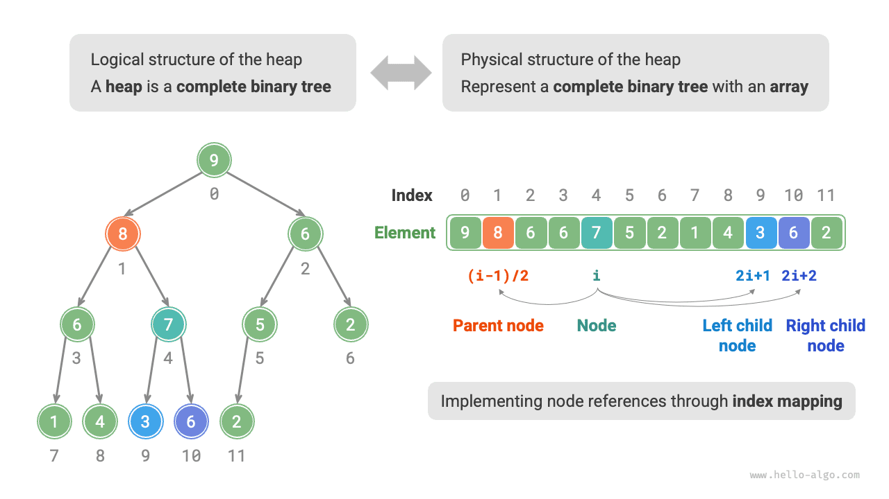
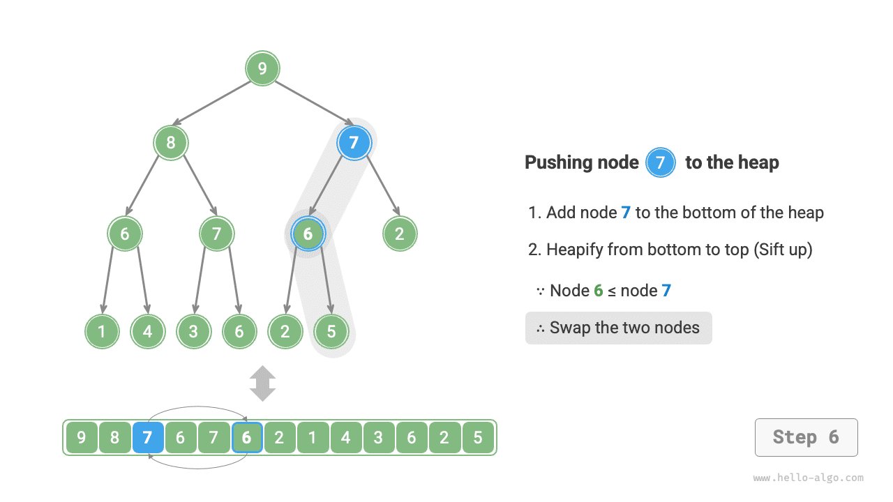
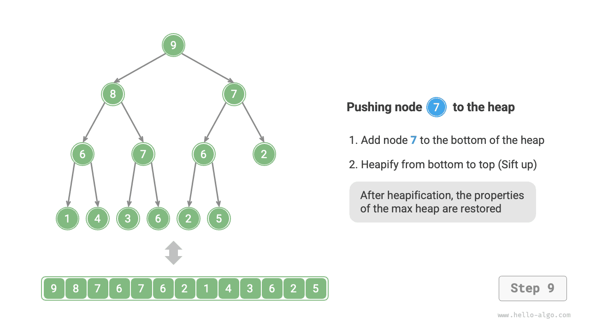
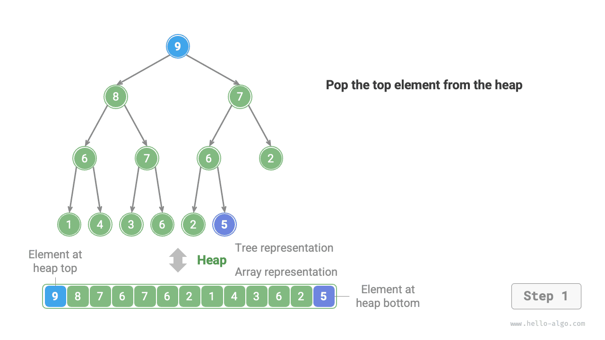
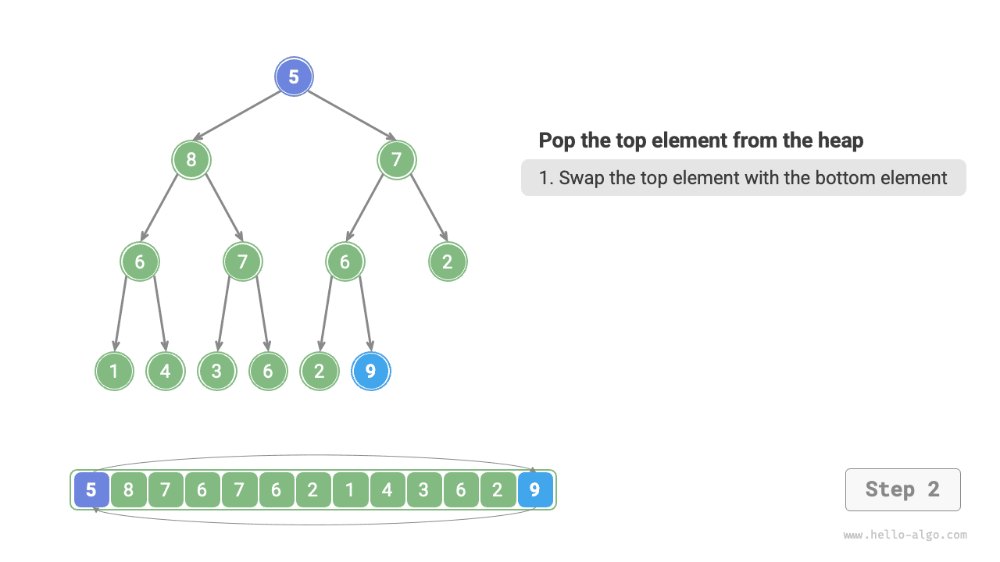
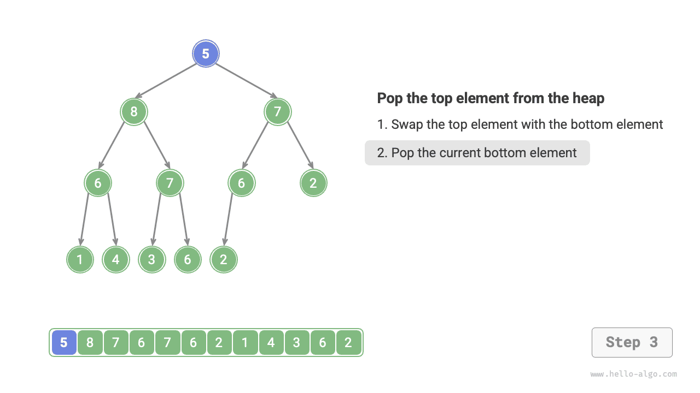
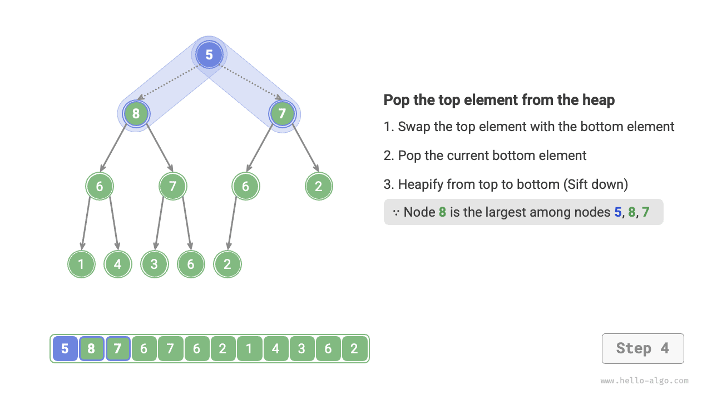
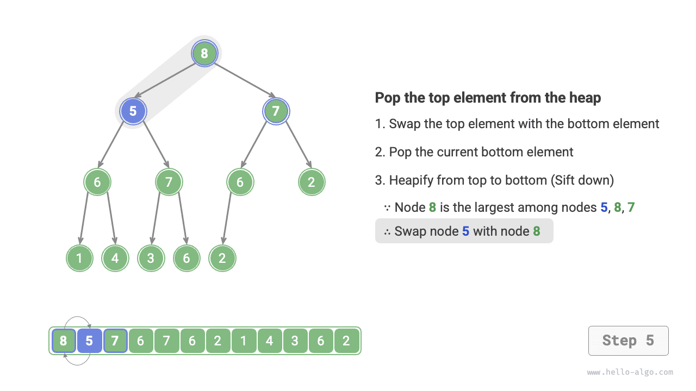
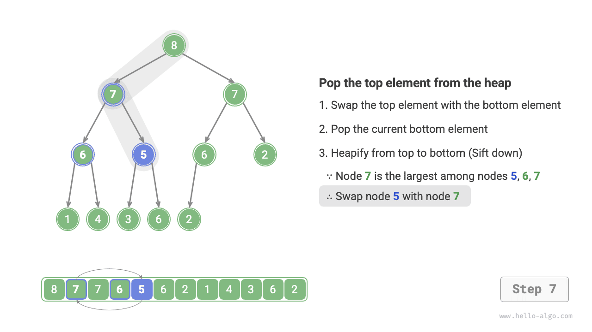
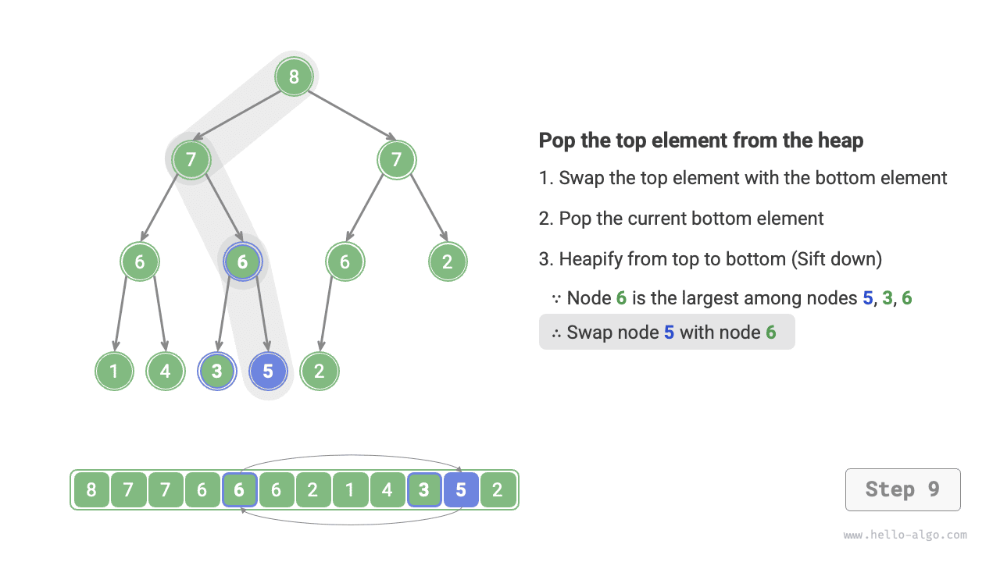

# Đống

<u>Đống</u> (heap) là một cây nhị phân hoàn chỉnh thỏa mãn những điều kiện nhất định, và chủ yếu được phân thành hai loại như hình minh họa dưới đây.

- <u>Đống nhỏ nhất</u> (min heap): Giá trị của bất kỳ nút nào $\leq$ giá trị các nút con của nó.
- <u>Đống lớn nhất</u> (max heap): Giá trị của bất kỳ nút nào $\geq$ giá trị các nút con của nó.


Là một trường hợp đặc biệt của cây nhị phân hoàn chỉnh, đống có các đặc điểm sau.

- Các nút ở tầng dưới cùng được lấp đầy từ trái sang phải, còn các tầng khác đều được lấp đầy hoàn toàn.
- Ta gọi nút gốc của cây nhị phân là "đỉnh đống" và nút ở dưới cùng bên phải là "đáy đống."
- Với đống lớn nhất (đống nhỏ nhất), giá trị của phần tử ở đỉnh đống (nút gốc) là lớn nhất (nhỏ nhất).

## Các thao tác phổ biến trên đống

Cần lưu ý rằng nhiều ngôn ngữ lập trình cung cấp sẵn <u>hàng đợi ưu tiên</u> (priority queue), một cấu trúc dữ liệu trừu tượng được định nghĩa là một hàng đợi mà các phần tử được sắp xếp theo mức độ ưu tiên.

Trên thực tế, **đống thường được dùng để cài đặt hàng đợi ưu tiên, trong đó đống lớn nhất tương ứng với hàng đợi ưu tiên mà các phần tử được lấy ra theo thứ tự giảm dần**. Xét từ góc độ sử dụng, ta có thể coi "hàng đợi ưu tiên" và "đống" là các cấu trúc dữ liệu tương đương. Vì vậy, cuốn sách này không phân biệt đặc biệt giữa hai khái niệm này mà gọi chung là "đống."

Các thao tác phổ biến trên đống được trình bày trong bảng dưới đây, tên phương thức cụ thể cần được xác định tùy theo ngôn ngữ lập trình.

<p align="center"> Bảng <id> &nbsp; Hiệu suất của các thao tác trên đống </p>

| Tên phương thức | Mô tả                                                       | Độ phức tạp thời gian |
| ----------- | ----------------------------------------------------------------- | --------------- |
| `push()`    | Chèn một phần tử vào đống                                   | $O(\log n)$     |
| `pop()`     | Xóa phần tử ở đỉnh đống                                       | $O(\log n)$     |
| `peek()`    | Truy cập phần tử ở đỉnh đống (giá trị lớn/nhỏ nhất của đống lớn nhất/nhỏ nhất)     | $O(1)$          |
| `size()`    | Lấy số lượng phần tử trong đống                            | $O(1)$          |
| `isEmpty()` | Kiểm tra đống có rỗng hay không                                        | $O(1)$          |

Trong các ứng dụng thực tế, ta có thể sử dụng trực tiếp lớp đống (hoặc lớp hàng đợi ưu tiên) do ngôn ngữ lập trình cung cấp.

Tương tự như "thứ tự tăng dần" và "thứ tự giảm dần" trong các giải thuật sắp xếp, ta có thể chuyển đổi qua lại giữa "đống nhỏ nhất" và "đống lớn nhất" bằng cách thiết lập một `flag` hoặc sửa đổi `Comparator`. Đoạn mã như sau:

=== "Python"

    ```python title="heap.py"
    # Khởi tạo một đống nhỏ nhất
    min_heap, flag = [], 1
    # Khởi tạo một đống lớn nhất
    max_heap, flag = [], -1

    # Module heapq của Python mặc định cài đặt đống nhỏ nhất
    # Có thể đảo dấu các phần tử trước khi đưa vào đống, việc này đảo ngược quan hệ so sánh và nhờ đó cài đặt được đống lớn nhất
    # Trong ví dụ này, flag = 1 tương ứng với đống nhỏ nhất, flag = -1 tương ứng với đống lớn nhất

    # Đưa các phần tử vào đống
    heapq.heappush(max_heap, flag * 1)
    heapq.heappush(max_heap, flag * 3)
    heapq.heappush(max_heap, flag * 2)
    heapq.heappush(max_heap, flag * 5)
    heapq.heappush(max_heap, flag * 4)

    # Lấy phần tử ở đỉnh đống
    peek: int = flag * max_heap[0] # 5

    # Xóa phần tử ở đỉnh đống
    # Các phần tử bị xóa sẽ tạo thành một dãy giảm dần
    val = flag * heapq.heappop(max_heap) # 5
    val = flag * heapq.heappop(max_heap) # 4
    val = flag * heapq.heappop(max_heap) # 3
    val = flag * heapq.heappop(max_heap) # 2
    val = flag * heapq.heappop(max_heap) # 1

    # Lấy kích thước của đống
    size: int = len(max_heap)

    # Kiểm tra đống có rỗng hay không
    is_empty: bool = not max_heap

    # Xây dựng đống từ một danh sách đầu vào
    min_heap: list[int] = [1, 3, 2, 5, 4]
    heapq.heapify(min_heap)
    ```

=== "C++"

    ```cpp title="heap.cpp"
    /* Khởi tạo một đống */
    // Khởi tạo một đống nhỏ nhất
    priority_queue<int, vector<int>, greater<int>> minHeap;
    // Khởi tạo một đống lớn nhất
    priority_queue<int, vector<int>, less<int>> maxHeap;

    /* Đưa các phần tử vào đống */
    maxHeap.push(1);
    maxHeap.push(3);
    maxHeap.push(2);
    maxHeap.push(5);
    maxHeap.push(4);

    /* Lấy phần tử ở đỉnh đống */
    int peek = maxHeap.top(); // 5

    /* Xóa phần tử ở đỉnh đống */
    // Các phần tử bị xóa sẽ tạo thành một dãy giảm dần
    maxHeap.pop(); // 5
    maxHeap.pop(); // 4
    maxHeap.pop(); // 3
    maxHeap.pop(); // 2
    maxHeap.pop(); // 1

    /* Lấy kích thước của đống */
    int size = maxHeap.size();

    /* Kiểm tra đống có rỗng hay không */
    bool isEmpty = maxHeap.empty();

    /* Xây dựng đống từ một danh sách đầu vào */
    vector<int> input{1, 3, 2, 5, 4};
    priority_queue<int, vector<int>, greater<int>> minHeap(input.begin(), input.end());
    ```

=== "Java"

    ```java title="heap.java"
    /* Khởi tạo một đống */
    // Khởi tạo một đống nhỏ nhất
    Queue<Integer> minHeap = new PriorityQueue<>();
    // Khởi tạo một đống lớn nhất (dùng biểu thức lambda để sửa đổi Comparator)
    Queue<Integer> maxHeap = new PriorityQueue<>((a, b) -> b - a);

    /* Đưa các phần tử vào đống */
    maxHeap.offer(1);
    maxHeap.offer(3);
    maxHeap.offer(2);
    maxHeap.offer(5);
    maxHeap.offer(4);

    /* Lấy phần tử ở đỉnh đống */
    int peek = maxHeap.peek(); // 5

    /* Xóa phần tử ở đỉnh đống */
    // Các phần tử bị xóa sẽ tạo thành một dãy giảm dần
    peek = maxHeap.poll(); // 5
    peek = maxHeap.poll(); // 4
    peek = maxHeap.poll(); // 3
    peek = maxHeap.poll(); // 2
    peek = maxHeap.poll(); // 1

    /* Lấy kích thước của đống */
    int size = maxHeap.size();

    /* Kiểm tra đống có rỗng hay không */
    boolean isEmpty = maxHeap.isEmpty();

    /* Xây dựng đống từ một danh sách đầu vào */
    minHeap = new PriorityQueue<>(Arrays.asList(1, 3, 2, 5, 4));
    ```

=== "C#"

    ```csharp title="heap.cs"
    /* Khởi tạo một đống */
    // Khởi tạo một đống nhỏ nhất
    PriorityQueue<int, int> minHeap = new();
    // Khởi tạo một đống lớn nhất (dùng biểu thức lambda để sửa đổi Comparer)
    PriorityQueue<int, int> maxHeap = new(Comparer<int>.Create((x, y) => y.CompareTo(x)));

    /* Đưa các phần tử vào đống */
    maxHeap.Enqueue(1, 1);
    maxHeap.Enqueue(3, 3);
    maxHeap.Enqueue(2, 2);
    maxHeap.Enqueue(5, 5);
    maxHeap.Enqueue(4, 4);

    /* Lấy phần tử ở đỉnh đống */
    int peek = maxHeap.Peek();//5

    /* Xóa phần tử ở đỉnh đống */
    // Các phần tử bị xóa sẽ tạo thành một dãy giảm dần
    peek = maxHeap.Dequeue();  // 5
    peek = maxHeap.Dequeue();  // 4
    peek = maxHeap.Dequeue();  // 3
    peek = maxHeap.Dequeue();  // 2
    peek = maxHeap.Dequeue();  // 1

    /* Lấy kích thước của đống */
    int size = maxHeap.Count;

    /* Kiểm tra đống có rỗng hay không */
    bool isEmpty = maxHeap.Count == 0;

    /* Xây dựng đống từ một danh sách đầu vào */
    minHeap = new PriorityQueue<int, int>([(1, 1), (3, 3), (2, 2), (5, 5), (4, 4)]);
    ```

=== "Go"

    ```go title="heap.go"
    // Trong Go, ta có thể xây dựng một đống lớn nhất chứa số nguyên bằng cách cài đặt heap.Interface
    // Việc cài đặt heap.Interface cũng yêu cầu cài đặt sort.Interface
    type intHeap []any

    // Push cài đặt phương thức của heap.Interface để đưa một phần tử vào đống
    func (h *intHeap) Push(x any) {
        // Push và Pop dùng con trỏ receiver làm tham số
        // vì chúng không chỉ điều chỉnh nội dung của slice mà còn thay đổi độ dài của slice
        *h = append(*h, x.(int))
    }

    // Pop cài đặt phương thức của heap.Interface để lấy ra phần tử ở đỉnh đống
    func (h *intHeap) Pop() any {
        // Phần tử cần xóa được lưu ở cuối
        last := (*h)[len(*h)-1]
        *h = (*h)[:len(*h)-1]
        return last
    }

    // Len là một phương thức của sort.Interface
    func (h *intHeap) Len() int {
        return len(*h)
    }

    // Less là một phương thức của sort.Interface
    func (h *intHeap) Less(i, j int) bool {
        // Để cài đặt đống nhỏ nhất, đổi thành dấu nhỏ hơn
        return (*h)[i].(int) > (*h)[j].(int)
    }

    // Swap là một phương thức của sort.Interface
    func (h *intHeap) Swap(i, j int) {
        (*h)[i], (*h)[j] = (*h)[j], (*h)[i]
    }

    // Top lấy phần tử ở đỉnh đống
    func (h *intHeap) Top() any {
        return (*h)[0]
    }

    /* Mã điều khiển */
    func TestHeap(t *testing.T) {
        /* Khởi tạo một đống */
        // Khởi tạo một đống lớn nhất
        maxHeap := &intHeap{}
        heap.Init(maxHeap)
        /* Đưa các phần tử vào đống */
        // Gọi các phương thức của heap.Interface để thêm phần tử
        heap.Push(maxHeap, 1)
        heap.Push(maxHeap, 3)
        heap.Push(maxHeap, 2)
        heap.Push(maxHeap, 4)
        heap.Push(maxHeap, 5)

        /* Lấy phần tử ở đỉnh đống */
        top := maxHeap.Top()
        fmt.Printf("Heap top element is %d\n", top)

        /* Xóa phần tử ở đỉnh đống */
        // Gọi các phương thức của heap.Interface để xóa phần tử
        heap.Pop(maxHeap) // 5
        heap.Pop(maxHeap) // 4
        heap.Pop(maxHeap) // 3
        heap.Pop(maxHeap) // 2
        heap.Pop(maxHeap) // 1

        /* Lấy kích thước của đống */
        size := len(*maxHeap)
        fmt.Printf("Number of heap elements is %d\n", size)

        /* Kiểm tra đống có rỗng hay không */
        isEmpty := len(*maxHeap) == 0
        fmt.Printf("Is the heap empty? %t\n", isEmpty)
    }
    ```

=== "Swift"

    ```swift title="heap.swift"
    /* Khởi tạo một đống */
    // Kiểu Heap của Swift hỗ trợ cả đống lớn nhất và đống nhỏ nhất, cần import swift-collections
    var heap = Heap<Int>()

    /* Đưa các phần tử vào đống */
    heap.insert(1)
    heap.insert(3)
    heap.insert(2)
    heap.insert(5)
    heap.insert(4)

    /* Lấy phần tử ở đỉnh đống */
    var peek = heap.max()!

    /* Xóa phần tử ở đỉnh đống */
    peek = heap.removeMax() // 5
    peek = heap.removeMax() // 4
    peek = heap.removeMax() // 3
    peek = heap.removeMax() // 2
    peek = heap.removeMax() // 1

    /* Lấy kích thước của đống */
    let size = heap.count

    /* Kiểm tra đống có rỗng hay không */
    let isEmpty = heap.isEmpty

    /* Xây dựng đống từ một danh sách đầu vào */
    let heap2 = Heap([1, 3, 2, 5, 4])
    ```

=== "JS"

    ```javascript title="heap.js"
    // JavaScript không cung cấp sẵn lớp Heap
    ```

=== "TS"

    ```typescript title="heap.ts"
    // TypeScript không cung cấp sẵn lớp Heap
    ```

=== "Dart"

    ```dart title="heap.dart"
    // Dart không cung cấp sẵn lớp Heap
    ```

=== "Rust"

    ```rust title="heap.rs"
    use std::collections::BinaryHeap;
    use std::cmp::Reverse;

    /* Khởi tạo một đống */
    // Khởi tạo một đống nhỏ nhất
    let mut min_heap = BinaryHeap::<Reverse<i32>>::new();
    // Khởi tạo một đống lớn nhất
    let mut max_heap = BinaryHeap::new();

    /* Đưa các phần tử vào đống */
    max_heap.push(1);
    max_heap.push(3);
    max_heap.push(2);
    max_heap.push(5);
    max_heap.push(4);

    /* Lấy phần tử ở đỉnh đống */
    let peek = max_heap.peek().unwrap();  // 5

    /* Xóa phần tử ở đỉnh đống */
    // Các phần tử bị xóa sẽ tạo thành một dãy giảm dần
    let peek = max_heap.pop().unwrap();   // 5
    let peek = max_heap.pop().unwrap();   // 4
    let peek = max_heap.pop().unwrap();   // 3
    let peek = max_heap.pop().unwrap();   // 2
    let peek = max_heap.pop().unwrap();   // 1

    /* Lấy kích thước của đống */
    let size = max_heap.len();

    /* Kiểm tra đống có rỗng hay không */
    let is_empty = max_heap.is_empty();

    /* Xây dựng đống từ một danh sách đầu vào */
    let min_heap = BinaryHeap::from(vec![Reverse(1), Reverse(3), Reverse(2), Reverse(5), Reverse(4)]);
    ```

=== "C"

    ```c title="heap.c"
    // C không cung cấp sẵn lớp Heap
    ```

=== "Kotlin"

    ```kotlin title="heap.kt"
    /* Khởi tạo một đống */
    // Khởi tạo một đống nhỏ nhất
    var minHeap = PriorityQueue<Int>()
    // Khởi tạo một đống lớn nhất (dùng biểu thức lambda để sửa đổi Comparator)
    val maxHeap = PriorityQueue { a: Int, b: Int -> b - a }

    /* Đưa các phần tử vào đống */
    maxHeap.offer(1)
    maxHeap.offer(3)
    maxHeap.offer(2)
    maxHeap.offer(5)
    maxHeap.offer(4)

    /* Lấy phần tử ở đỉnh đống */
    var peek = maxHeap.peek() // 5

    /* Xóa phần tử ở đỉnh đống */
    // Các phần tử bị xóa sẽ tạo thành một dãy giảm dần
    peek = maxHeap.poll() // 5
    peek = maxHeap.poll() // 4
    peek = maxHeap.poll() // 3
    peek = maxHeap.poll() // 2
    peek = maxHeap.poll() // 1

    /* Lấy kích thước của đống */
    val size = maxHeap.size

    /* Kiểm tra đống có rỗng hay không */
    val isEmpty = maxHeap.isEmpty()

    /* Xây dựng đống từ một danh sách đầu vào */
    minHeap = PriorityQueue(mutableListOf(1, 3, 2, 5, 4))
    ```

=== "Ruby"

    ```ruby title="heap.rb"
    # Ruby không cung cấp sẵn lớp Heap
    ```

??? pythontutor "Trực quan hóa mã nguồn"

    https://pythontutor.com/render.html#code=import%20heapq%0A%0A%22%22%22Driver%20Code%22%22%22%0Aif%20__name__%20%3D%3D%20%22__main__%22%3A%0A%20%20%20%20%23%20%E5%88%9D%E5%A7%8B%E5%8C%96%E5%B0%8F%E9%A1%B6%E5%A0%86%0A%20%20%20%20min_heap,%20flag%20%3D%20%5B%5D,%201%0A%20%20%20%20%23%20%E5%88%9D%E5%A7%8B%E5%8C%96%E5%A4%A7%E9%A1%B6%E5%A0%86%0A%20%20%20%20max_heap,%20flag%20%3D%20%5B%5D,%20-1%0A%20%20%20%20%0A%20%20%20%20%23%20Python%20%E7%9A%84%20heapq%20%E6%A8%A1%E5%9D%97%E9%BB%98%E8%AE%A4%E5%AE%9E%E7%8E%B0%E5%B0%8F%E9%A1%B6%E5%A0%86%0A%20%20%20%20%23%20%E8%80%83%E8%99%91%E5%B0%86%E2%80%9C%E5%85%83%E7%B4%A0%E5%8F%96%E8%B4%9F%E2%80%9D%E5%90%8E%E5%86%8D%E5%85%A5%E5%A0%86%EF%BC%8C%E8%BF%99%E6%A0%B7%E5%B0%B1%E5%8F%AF%E4%BB%A5%E5%B0%86%E5%A4%A7%E5%B0%8F%E5%85%B3%E7%B3%BB%E9%A2%A0%E5%80%92%EF%BC%8C%E4%BB%8E%E8%80%8C%E5%AE%9E%E7%8E%B0%E5%A4%A7%E9%A1%B6%E5%A0%86%0A%20%20%20%20%23%20%E5%9C%A8%E6%9C%AC%E7%A4%BA%E4%BE%8B%E4%B8%AD%EF%BC%8Cflag%20%3D%201%20%E6%97%B6%E5%AF%B9%E5%BA%94%E5%B0%8F%E9%A1%B6%E5%A0%86%EF%BC%8Cflag%20%3D%20-1%20%E6%97%B6%E5%AF%B9%E5%BA%94%E5%A4%A7%E9%A1%B6%E5%A0%86%0A%20%20%20%20%0A%20%20%20%20%23%20%E5%85%83%E7%B4%A0%E5%85%A5%E5%A0%86%0A%20%20%20%20heapq.heappush%28max_heap,%20flag%20*%201%29%0A%20%20%20%20heapq.heappush%28max_heap,%20flag%20*%203%29%0A%20%20%20%20heapq.heappush%28max_heap,%20flag%20*%202%29%0A%20%20%20%20heapq.heappush%28max_heap,%20flag%20*%205%29%0A%20%20%20%20heapq.heappush%28max_heap,%20flag%20*%204%29%0A%20%20%20%20%0A%20%20%20%20%23%20%E8%8E%B7%E5%8F%96%E5%A0%86%E9%A1%B6%E5%85%83%E7%B4%A0%0A%20%20%20%20peek%20%3D%20flag%20*%20max_heap%5B0%5D%20%23%205%0A%20%20%20%20%0A%20%20%20%20%23%20%E5%A0%86%E9%A1%B6%E5%85%83%E7%B4%A0%E5%87%BA%E5%A0%86%0A%20%20%20%20%23%20%E5%87%BA%E5%A0%86%E5%85%83%E7%B4%A0%E4%BC%9A%E5%BD%A2%E6%88%90%E4%B8%80%E4%B8%AA%E4%BB%8E%E5%A4%A7%E5%88%B0%E5%B0%8F%E7%9A%84%E5%BA%8F%E5%88%97%0A%20%20%20%20val%20%3D%20flag%20*%20heapq.heappop%28max_heap%29%20%23%205%0A%20%20%20%20val%20%3D%20flag%20*%20heapq.heappop%28max_heap%29%20%23%204%0A%20%20%20%20val%20%3D%20flag%20*%20heapq.heappop%28max_heap%29%20%23%203%0A%20%20%20%20val%20%3D%20flag%20*%20heapq.heappop%28max_heap%29%20%23%202%0A%20%20%20%20val%20%3D%20flag%20*%20heapq.heappop%28max_heap%29%20%23%201%0A%20%20%20%20%0A%20%20%20%20%23%20%E8%8E%B7%E5%8F%96%E5%A0%86%E5%A4%A7%E5%B0%8F%0A%20%20%20%20size%20%3D%20len%28max_heap%29%0A%20%20%20%20%0A%20%20%20%20%23%20%E5%88%A4%E6%96%AD%E5%A0%86%E6%98%AF%E5%90%A6%E4%B8%BA%E7%A9%BA%0A%20%20%20%20is_empty%20%3D%20not%20max_heap%0A%20%20%20%20%0A%20%20%20%20%23%20%E8%BE%93%E5%85%A5%E5%88%97%E8%A1%A8%E5%B9%B6%E5%BB%BA%E5%A0%86%0A%20%20%20%20min_heap%20%3D%20%5B1,%203,%202,%205,%204%5D%0A%20%20%20%20heapq.heapify%28min_heap%29&cumulative=false&curInstr=3&heapPrimitives=nevernest&mode=display&origin=opt-frontend.js&py=311&rawInputLstJSON=%5B%5D&textReferences=false

## Cài đặt đống

Phần cài đặt dưới đây dành cho đống lớn nhất. Để chuyển thành đống nhỏ nhất, chỉ cần đảo ngược toàn bộ logic so sánh liên quan đến thứ tự (ví dụ, thay $\geq$ bằng $\leq$). Bạn đọc quan tâm có thể tự mình cài đặt.

### Lưu trữ và biểu diễn đống

Như đã đề cập trong chương "Cây nhị phân," cây nhị phân hoàn chỉnh rất phù hợp để biểu diễn bằng mảng. Vì đống là một loại cây nhị phân hoàn chỉnh, **ta sẽ dùng mảng để lưu trữ đống**.

Khi biểu diễn cây nhị phân bằng mảng, các phần tử biểu diễn giá trị nút, còn chỉ số biểu diễn vị trí của nút trong cây nhị phân. **Quan hệ cha-con được biểu diễn thông qua các công thức ánh xạ chỉ số**.

Như hình minh họa dưới đây, cho một chỉ số $i$, chỉ số của con trái là $2i + 1$, chỉ số của con phải là $2i + 2$, và chỉ số của nút cha là $(i - 1) / 2$ (chia lấy phần nguyên). Khi một chỉ số vượt ra ngoài phạm vi, điều đó biểu thị một nút rỗng hoặc nút không tồn tại.



Ta có thể đóng gói các công thức ánh xạ chỉ số thành các hàm để tiện sử dụng về sau:

```src
[file]{my_heap}-[class]{max_heap}-[func]{parent}
```

### Truy cập phần tử ở đỉnh đống

Phần tử ở đỉnh đống chính là nút gốc của cây nhị phân, cũng là phần tử đầu tiên của mảng:

```src
[file]{my_heap}-[class]{max_heap}-[func]{peek}
```

### Chèn một phần tử vào đống

Cho một phần tử `val`, trước tiên ta thêm nó vào đáy đống. Sau khi chèn, vì `val` có thể lớn hơn các phần tử khác trong đống, tính chất của đống có thể bị vi phạm. **Do đó, ta cần khôi phục tính chất của đống dọc theo đường đi từ nút vừa chèn đến nút gốc**. Thao tác này được gọi là <u>vun đống</u> (heapify).

Bắt đầu từ nút vừa chèn, **thực hiện vun đống từ dưới lên trên**. Như hình minh họa dưới đây, ta so sánh nút vừa chèn với nút cha của nó, nếu nút vừa chèn lớn hơn thì hoán đổi chúng. Ta tiếp tục quá trình này từ dưới lên trên cho đến khi vượt qua nút gốc hoặc gặp một nút không cần hoán đổi nữa.

=== "<1>"
    

=== "<2>"
    

=== "<3>"
    

=== "<4>"
    

=== "<5>"
    

=== "<6>"
    

=== "<7>"
    

=== "<8>"
    

=== "<9>"
    

Given a total of $n$ nodes, the tree height is $O(\log n)$. Thus, the number of loop iterations in the heapify operation is at most $O(\log n)$, **making the time complexity of the element insertion operation $O(\log n)$**. The code is as follows:

```src
[file]{my_heap}-[class]{max_heap}-[func]{sift_up}
```

### Removing the Heap Top Element

The heap top element is the root node of the binary tree, which is the first element of the list. If we directly remove the first element from the list, all node indexes in the binary tree would change, making subsequent repair with heapify difficult. To minimize changes in element indexes, we use the following steps.

1. Swap the heap top element with the heap bottom element (swap the root node with the rightmost leaf node).
2. After swapping, remove the heap bottom from the list (note that since we've swapped, we're actually removing the original heap top element).
3. Starting from the root node, **perform heapify from top to bottom**.

As shown in the figure below, **the direction of "top-to-bottom heapify" is opposite to "bottom-to-top heapify"**. We compare the root node's value with its two children and swap it with the largest child. Then loop this operation until we pass a leaf node or encounter a node that doesn't need swapping.

=== "<1>"
    

=== "<2>"
    

=== "<3>"
    

=== "<4>"
    

=== "<5>"
    

=== "<6>"
    

=== "<7>"
    

=== "<8>"
    

=== "<9>"
    

=== "<10>"
    

Similar to the element insertion operation, the time complexity of the heap top element removal operation is also $O(\log n)$. The code is as follows:

```src
[file]{my_heap}-[class]{max_heap}-[func]{sift_down}
```

## Common Applications of Heaps

- **Priority queue**: Heaps are typically the preferred data structure for implementing priority queues. The time complexity of both enqueue and dequeue operations is $O(\log n)$, and heap construction has a time complexity of $O(n)$, making these operations highly efficient.
- **Heap sort**: Given a set of data, we can build a heap with them and then continuously perform element removal operations to obtain sorted data. However, we usually use a more elegant approach to implement heap sort, as detailed in the "Heap Sort" chapter.
- **Getting the largest $k$ elements**: This is a classic algorithm problem and also a typical application, such as selecting the top 10 trending news items for Weibo Hot Search or the top 10 best-selling products.
