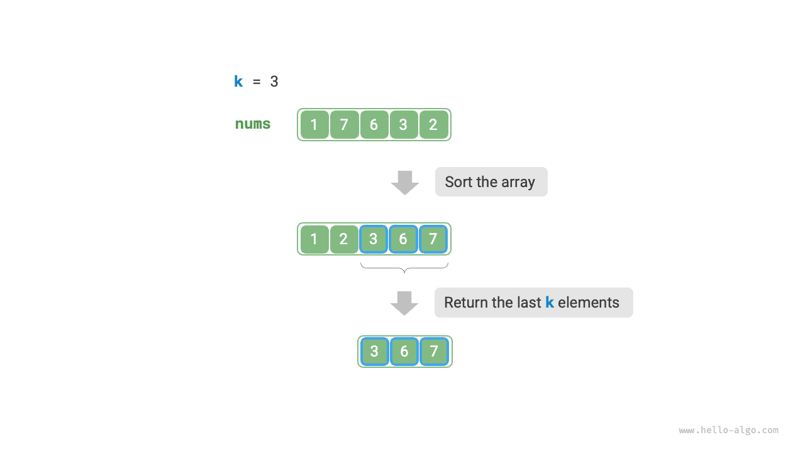
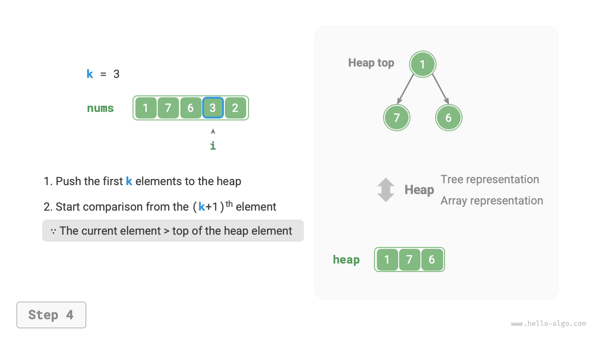
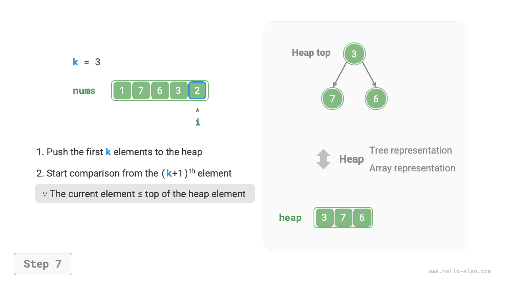

# Bài toán Top-k

!!! question

    Cho một mảng không có thứ tự `nums` gồm $n$ phần tử, hãy trả về $k$ phần tử lớn nhất trong mảng.

Với bài toán này, trước tiên ta sẽ giới thiệu hai cách giải tương đối đơn giản, sau đó là một cách giải hiệu quả hơn sử dụng đống.

## Phương pháp 1: Chọn lặp

Ta có thể thực hiện $k$ vòng duyệt như hình minh họa dưới đây, mỗi vòng lấy ra phần tử lớn thứ $1$, thứ $2$, $\dots$, thứ $k$, với độ phức tạp thời gian $O(nk)$.

Phương pháp này chỉ phù hợp khi $k \ll n$, vì khi $k$ gần bằng $n$, độ phức tạp thời gian sẽ tiệm cận $O(n^2)$, trở nên rất kém hiệu quả.


!!! tip

    Khi $k = n$, ta có thể thu được một dãy đã sắp xếp hoàn chỉnh, điều này tương đương với giải thuật "sắp xếp chọn" (selection sort).

## Phương pháp 2: Sắp xếp

Như hình minh họa dưới đây, ta có thể sắp xếp mảng `nums` trước, sau đó trả về $k$ phần tử ở phía bên phải, với độ phức tạp thời gian $O(n \log n)$.

Rõ ràng, phương pháp này làm nhiều việc hơn mức cần thiết, vì ta chỉ cần tìm $k$ phần tử lớn nhất chứ không cần sắp xếp toàn bộ các phần tử còn lại.



## Phương pháp 3: Đống

Ta có thể giải bài toán Top-k hiệu quả hơn bằng cách sử dụng đống, như hình minh họa dưới đây.

1. Khởi tạo một đống nhỏ nhất, trong đó phần tử ở đỉnh đống là phần tử nhỏ nhất.
2. Trước tiên, chèn lần lượt $k$ phần tử đầu tiên của mảng vào đống.
3. Bắt đầu từ phần tử thứ $(k + 1)$, nếu phần tử hiện tại lớn hơn phần tử ở đỉnh đống, xóa phần tử ở đỉnh đống và chèn phần tử hiện tại vào đống.
4. Sau khi duyệt xong, đống chứa $k$ phần tử lớn nhất.

=== "<1>"
    

=== "<2>"
    

=== "<3>"
    

=== "<4>"
    

=== "<5>"
    

=== "<6>"
    

=== "<7>"
    

=== "<8>"
    

=== "<9>"
    

Mã ví dụ như sau:

```src
[file]{top_k}-[class]{}-[func]{top_k_heap}
```

Tổng cộng có $n$ vòng chèn và xóa phần tử trên đống, với độ dài tối đa của đống là $k$, do đó độ phức tạp thời gian là $O(n \log k)$. Phương pháp này rất hiệu quả; khi $k$ nhỏ, độ phức tạp thời gian tiệm cận $O(n)$; khi $k$ lớn, độ phức tạp thời gian không vượt quá $O(n \log n)$.

Ngoài ra, phương pháp này còn rất phù hợp với các luồng dữ liệu động. Khi có dữ liệu mới xuất hiện, ta có thể liên tục duy trì các phần tử trong đống, giúp cập nhật động $k$ phần tử lớn nhất.
