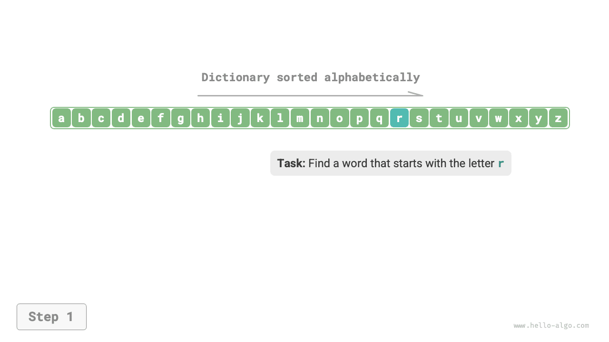
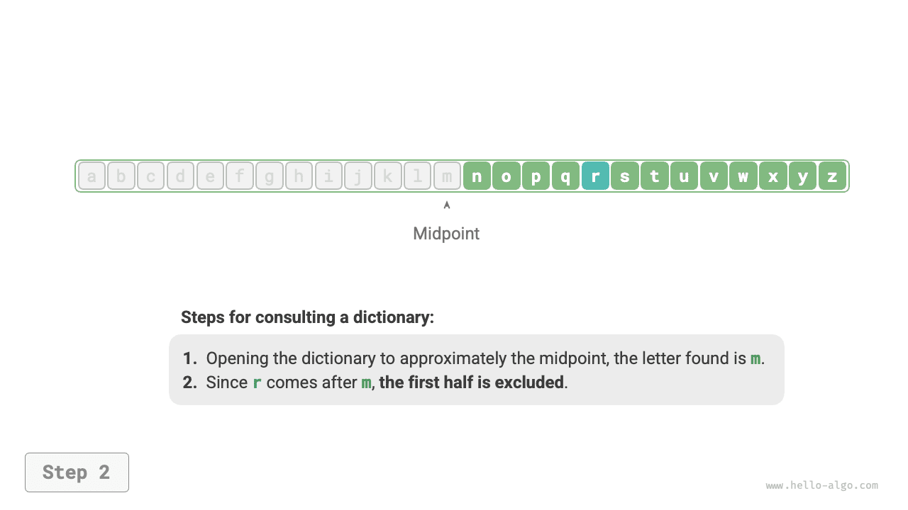
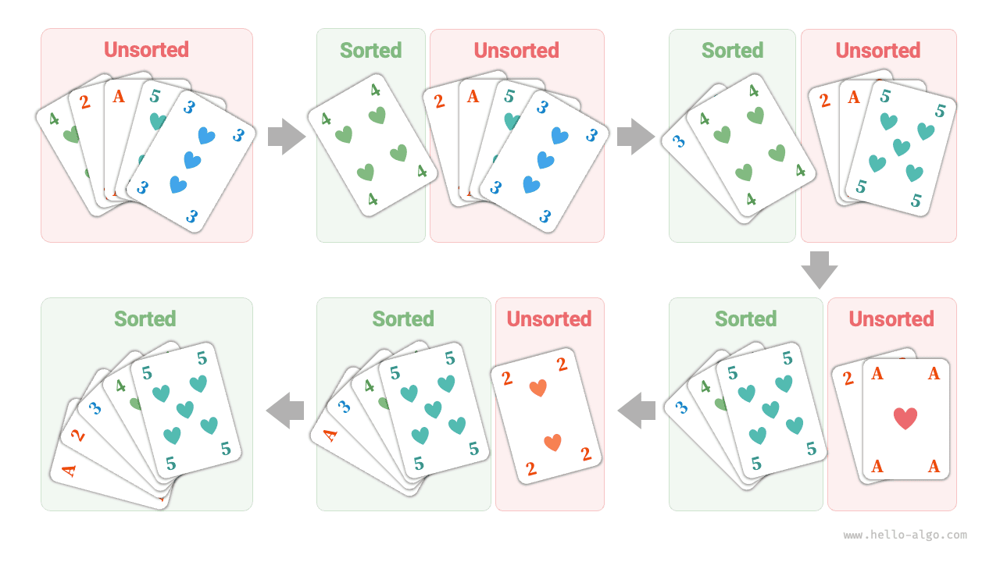

# Giải thuật hiện diện khắp nơi

Khi nghe đến từ "giải thuật," chúng ta thường tự nhiên nghĩ ngay đến toán học. Tuy nhiên, rất nhiều giải thuật không đòi hỏi những kiến thức toán học phức tạp mà chủ yếu dựa vào tư duy logic cơ bản, thứ có thể bắt gặp ở khắp mọi nơi trong đời sống hàng ngày của chúng ta.

Trước khi chính thức khám phá giải thuật, có một sự thật thú vị đáng chia sẻ: **bạn đã học được rất nhiều giải thuật mà không hề nhận ra, và đã quen áp dụng chúng trong cuộc sống hàng ngày**. Hãy để tôi đưa ra một vài ví dụ cụ thể để minh họa điều này.

**Ví dụ 1: Tra từ điển**. Trong một cuốn từ điển tiếng Anh, các từ được liệt kê theo thứ tự bảng chữ cái. Giả sử chúng ta đang tìm một từ bắt đầu bằng chữ cái $r$, việc này thường được thực hiện theo cách sau:

1. Mở từ điển ở khoảng giữa và kiểm tra từ đầu tiên trên trang đó; giả sử nó bắt đầu bằng chữ cái $m$.
2. Vì $r$ đứng sau $m$ trong bảng chữ cái, nửa đầu có thể bị bỏ qua và không gian tìm kiếm được thu hẹp lại còn nửa sau.
3. Lặp lại bước `1.` và `2.` cho đến khi tìm được trang có từ bắt đầu bằng $r$.

=== "<1>"
    

=== "<2>"
    

=== "<3>"
    

=== "<4>"
    

=== "<5>"
    

Việc tra từ điển — một kỹ năng cơ bản mà học sinh tiểu học đã được học — thực chất chính là giải thuật nổi tiếng "Tìm kiếm nhị phân." Từ góc độ cấu trúc dữ liệu, chúng ta có thể xem cuốn từ điển như một "mảng" đã được sắp xếp; từ góc độ giải thuật, chuỗi hành động thực hiện để tra một từ trong từ điển có thể được xem là giải thuật "Tìm kiếm nhị phân."

**Ví dụ 2: Sắp xếp bài chơi**. Khi chơi bài, chúng ta cần sắp xếp các quân bài trên tay theo thứ tự tăng dần, như quá trình dưới đây minh họa.

1. Chia các quân bài thành phần "đã sắp xếp" và phần "chưa sắp xếp," giả sử ban đầu quân bài ngoài cùng bên trái đã ở đúng vị trí.
2. Lấy một quân bài từ phần chưa sắp xếp và chèn nó vào đúng vị trí trong phần đã sắp xếp; sau bước này, hai quân bài ngoài cùng bên trái đã có thứ tự đúng.
3. Lặp lại bước `2` cho đến khi tất cả các quân bài đều được sắp xếp.

Phương pháp sắp xếp bài chơi ở trên thực chất chính là giải thuật "Sắp xếp chèn," rất hiệu quả với các tập dữ liệu nhỏ. Nhiều cài đặt sắp xếp có sẵn của các ngôn ngữ lập trình sử dụng sắp xếp chèn ở bên trong.

**Ví dụ 3: Thối tiền**. Giả sử bạn mua hàng trị giá $69$ tại siêu thị. Nếu bạn đưa cho thu ngân tờ $100$, họ sẽ cần thối lại cho bạn $31$. Quá trình này có thể được hiểu rõ ràng như hình minh họa dưới đây.

1. Các mệnh giá nhỏ hơn $31$ hiện có là $1$, $5$, $10$ và $20$.
2. Lấy ra mệnh giá lớn nhất là $20$ từ các lựa chọn, còn lại $31 - 20 = 11$.
3. Lấy ra mệnh giá lớn nhất là $10$ từ các lựa chọn còn lại, còn lại $11 - 10 = 1$.
4. Lấy ra mệnh giá lớn nhất là $1$ từ các lựa chọn còn lại, còn lại $1 - 1 = 0$.
5. Hoàn tất việc thối tiền, lời giải là $20 + 10 + 1 = 31$.

Trong các bước trên, ở mỗi giai đoạn chúng ta chọn lựa chọn có vẻ tốt nhất bằng cách sử dụng mệnh giá lớn nhất hiện có, từ đó dẫn đến một cách thối tiền hiệu quả. Từ góc độ cấu trúc dữ liệu và giải thuật, cách tiếp cận này được gọi là giải thuật "Tham lam."

Từ việc nấu một bữa ăn cho đến du hành liên vì sao, hầu như mọi quá trình giải quyết vấn đề đều liên quan đến giải thuật. Sự ra đời của máy tính cho phép chúng ta lưu trữ cấu trúc dữ liệu trong bộ nhớ và viết mã nguồn để gọi CPU và GPU thực thi giải thuật. Bằng cách này, chúng ta có thể chuyển các vấn đề trong đời sống thực sang máy tính và giải quyết nhiều vấn đề phức tạp một cách hiệu quả hơn.

!!! tip

    Nếu các khái niệm như cấu trúc dữ liệu, giải thuật, mảng và tìm kiếm nhị phân vẫn còn khá mơ hồ với bạn, hãy tiếp tục đọc. Cuốn sách này sẽ dẫn dắt bạn bước vào thế giới của cấu trúc dữ liệu và giải thuật.
