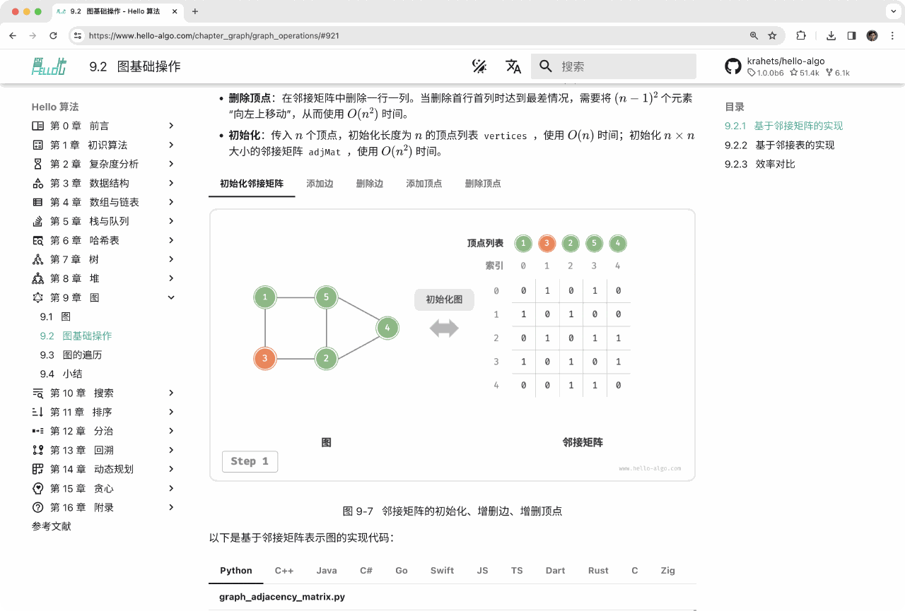
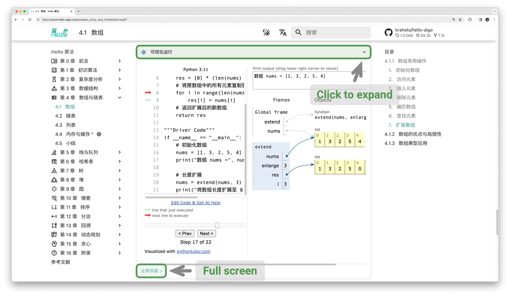
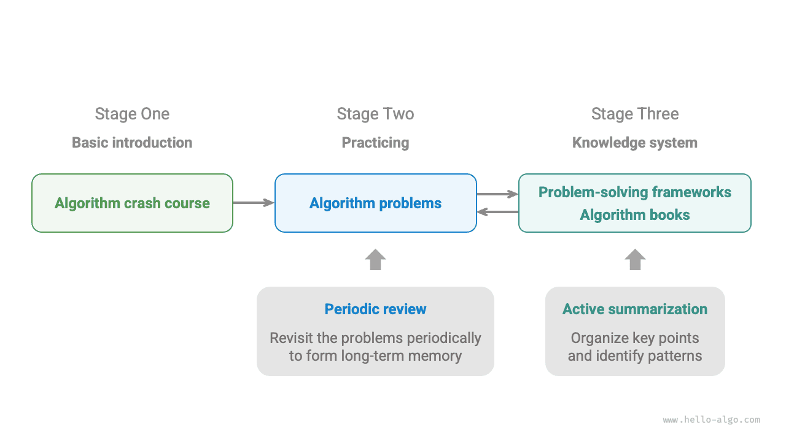

# Hướng dẫn sử dụng sách

!!! tip

    Để có trải nghiệm đọc tốt nhất, bạn nên đọc qua phần này trước.

## Quy ước về văn phong

- Các mục có dấu `*` sau tiêu đề là nội dung tùy chọn và khó hơn một chút. Nếu không có nhiều thời gian, bạn có thể bỏ qua chúng trong lần đọc đầu tiên.
- Các thuật ngữ chuyên môn được in đậm (trong bản in và bản PDF) hoặc gạch chân (trong bản web), chẳng hạn như <u>mảng</u>. Chúng đáng để ghi nhớ, vì sẽ giúp ích khi đọc các tài liệu kỹ thuật.
- Nội dung then chốt và các câu tổng kết sẽ được **in đậm**, những đoạn văn bản như vậy xứng đáng được chú ý đặc biệt.
- Các từ và cụm từ mang nghĩa đặc biệt sẽ được đánh dấu bằng "dấu ngoặc kép" để tránh gây hiểu nhầm.
- Khi thuật ngữ khác nhau giữa các ngôn ngữ lập trình, cuốn sách này sẽ theo quy ước của Python; ví dụ, sử dụng `None` để biểu diễn "null".
- Cuốn sách này nới lỏng một phần các quy ước chú thích thông thường của ngôn ngữ lập trình để có bố cục gọn gàng hơn. Chú thích chủ yếu được chia thành ba loại: chú thích tiêu đề, chú thích nội dung và chú thích nhiều dòng.

=== "Python"

    ```python title=""
    """Chú thích tiêu đề, dùng để đánh dấu hàm, lớp, trường hợp kiểm thử, v.v."""

    # Chú thích nội dung, dùng để giải thích chi tiết đoạn mã

    """
    Nhiều dòng
    chú thích
    """
    ```

=== "C++"

    ```cpp title=""
    /* Chú thích tiêu đề, dùng để đánh dấu hàm, lớp, trường hợp kiểm thử, v.v. */

    // Chú thích nội dung, dùng để giải thích chi tiết đoạn mã

    /**
     * Nhiều dòng
     * chú thích
     */
    ```

=== "Java"

    ```java title=""
    /* Chú thích tiêu đề, dùng để đánh dấu hàm, lớp, trường hợp kiểm thử, v.v. */

    // Chú thích nội dung, dùng để giải thích chi tiết đoạn mã

    /**
     * Nhiều dòng
     * chú thích
     */
    ```

=== "C#"

    ```csharp title=""
    /* Chú thích tiêu đề, dùng để đánh dấu hàm, lớp, trường hợp kiểm thử, v.v. */

    // Chú thích nội dung, dùng để giải thích chi tiết đoạn mã

    /**
     * Nhiều dòng
     * chú thích
     */
    ```

=== "Go"

    ```go title=""
    /* Chú thích tiêu đề, dùng để đánh dấu hàm, lớp, trường hợp kiểm thử, v.v. */

    // Chú thích nội dung, dùng để giải thích chi tiết đoạn mã

    /**
     * Nhiều dòng
     * chú thích
     */
    ```

=== "Swift"

    ```swift title=""
    /* Chú thích tiêu đề, dùng để đánh dấu hàm, lớp, trường hợp kiểm thử, v.v. */

    // Chú thích nội dung, dùng để giải thích chi tiết đoạn mã

    /**
     * Nhiều dòng
     * chú thích
     */
    ```

=== "JS"

    ```javascript title=""
    /* Chú thích tiêu đề, dùng để đánh dấu hàm, lớp, trường hợp kiểm thử, v.v. */

    // Chú thích nội dung, dùng để giải thích chi tiết đoạn mã

    /**
     * Nhiều dòng
     * chú thích
     */
    ```

=== "TS"

    ```typescript title=""
    /* Chú thích tiêu đề, dùng để đánh dấu hàm, lớp, trường hợp kiểm thử, v.v. */

    // Chú thích nội dung, dùng để giải thích chi tiết đoạn mã

    /**
     * Nhiều dòng
     * chú thích
     */
    ```

=== "Dart"

    ```dart title=""
    /* Chú thích tiêu đề, dùng để đánh dấu hàm, lớp, trường hợp kiểm thử, v.v. */

    // Chú thích nội dung, dùng để giải thích chi tiết đoạn mã

    /**
     * Nhiều dòng
     * chú thích
     */
    ```

=== "Rust"

    ```rust title=""
    /* Chú thích tiêu đề, dùng để đánh dấu hàm, lớp, trường hợp kiểm thử, v.v. */

    // Chú thích nội dung, dùng để giải thích chi tiết đoạn mã

    // Nhiều dòng
    // chú thích
    ```

=== "C"

    ```c title=""
    /* Chú thích tiêu đề, dùng để đánh dấu hàm, lớp, trường hợp kiểm thử, v.v. */

    // Chú thích nội dung, dùng để giải thích chi tiết đoạn mã

    /**
     * Nhiều dòng
     * chú thích
     */
    ```

=== "Kotlin"

    ```kotlin title=""
    /* Chú thích tiêu đề, dùng để đánh dấu hàm, lớp, trường hợp kiểm thử, v.v. */

    // Chú thích nội dung, dùng để giải thích chi tiết đoạn mã

    /**
     * Nhiều dòng
     * chú thích
     */
    ```

=== "Ruby"

    ```ruby title=""
    ### Chú thích tiêu đề, dùng để đánh dấu hàm, lớp, trường hợp kiểm thử, v.v. ###

    # Chú thích nội dung, dùng để giải thích chi tiết đoạn mã

    # Nhiều dòng
    # chú thích
    ```

## Học hiệu quả với hình minh họa động

So với văn bản thuần túy, video và hình ảnh có mật độ thông tin cao hơn và cấu trúc rõ ràng hơn, giúp dễ hiểu hơn. Trong cuốn sách này, **các khái niệm cốt lõi và những chủ đề khó chủ yếu được trình bày thông qua hình minh họa động**, với văn bản đóng vai trò giải thích và bổ trợ.

Nếu trong khi đọc sách, bạn bắt gặp một hình minh họa động như hình dưới đây, hãy **xem hình minh họa là nội dung chính và văn bản là phần bổ trợ**, sử dụng cả hai cùng nhau để hiểu nội dung.



## Đào sâu hiểu biết thông qua thực hành mã nguồn

Mã nguồn đi kèm cuốn sách này được lưu trữ tại [kho GitHub](https://github.com/krahets/hello-algo). Như hình dưới đây cho thấy, **mã nguồn đi kèm các trường hợp kiểm thử và có thể chạy chỉ với một cú nhấp chuột**.

Nếu có thời gian, **bạn nên tự tay gõ lại mã nguồn**. Nếu thời gian học tập có hạn, ít nhất hãy đọc qua và chạy thử toàn bộ mã nguồn.

So với việc chỉ đọc mã nguồn, việc tự tay viết lại thường mang lại nhiều lợi ích hơn. **Thực hành trực tiếp mới chính là nơi việc học thực sự diễn ra**.


Để chạy được mã nguồn, chủ yếu cần thực hiện ba bước chuẩn bị sau.

**Bước 1: Cài đặt môi trường lập trình cục bộ**. Vui lòng làm theo [hướng dẫn](https://www.hello-algo.com/chapter_appendix/installation/) trong phần phụ lục. Nếu đã cài đặt sẵn, bạn có thể bỏ qua bước này.

**Bước 2: Sao chép (clone) hoặc tải kho mã nguồn về máy**. Truy cập [kho GitHub](https://github.com/krahets/hello-algo). Nếu đã cài đặt [Git](https://git-scm.com/downloads), bạn có thể sao chép kho này bằng lệnh sau:

```shell
git clone https://github.com/krahets/hello-algo.git
```

Ngoài ra, bạn cũng có thể nhấn nút "Download ZIP" như hình dưới đây để tải trực tiếp một tệp ZIP của kho mã nguồn rồi giải nén nó ở máy cục bộ.


**Bước 3: Chạy mã nguồn**. Như hình dưới đây, đối với các khối mã có tên tệp ở phía trên, chúng ta có thể tìm thấy tệp mã nguồn tương ứng trong thư mục `codes` của kho mã nguồn. Các tệp mã nguồn này có thể chạy chỉ với một cú nhấp chuột, giúp bạn tiết kiệm thời gian gỡ lỗi không cần thiết và tập trung vào nội dung học tập.


Ngoài việc chạy mã nguồn cục bộ, **phiên bản web cũng hỗ trợ chạy trực quan mã nguồn Python** (được cài đặt dựa trên [pythontutor](https://pythontutor.com/)). Như hình dưới đây, bạn có thể nhấn "Visual Run" bên dưới khối mã để mở rộng khung nhìn và quan sát quá trình thực thi của mã giải thuật; bạn cũng có thể nhấn "Full Screen View" để có trải nghiệm xem tốt hơn.



## Cùng nhau tiến bộ qua câu hỏi và thảo luận

Khi đọc cuốn sách này, xin đừng bỏ qua những điểm mà bạn vẫn chưa hiểu hết. **Hãy thoải mái đặt câu hỏi trong phần bình luận**, tôi và các bạn của tôi sẽ cố gắng hết sức để trả lời, thường trong vòng hai ngày.

Như hình dưới đây, phiên bản web có phần bình luận ở cuối mỗi chương. Tôi khuyến khích bạn theo dõi sát các cuộc thảo luận ở đó. Một mặt, bạn có thể biết được những vấn đề mà người khác gặp phải, từ đó lấp đầy những lỗ hổng trong hiểu biết của chính mình và thúc đẩy tư duy sâu hơn. Mặt khác, tôi hy vọng bạn sẽ nhiệt tình trả lời câu hỏi của các độc giả khác, chia sẻ hiểu biết của mình và giúp đỡ người khác tiến bộ.


## Lộ trình học giải thuật

Nhìn chung, chúng ta có thể chia quá trình học cấu trúc dữ liệu và giải thuật thành ba giai đoạn.

1. **Giai đoạn 1: Nhập môn giải thuật**. Chúng ta cần làm quen với đặc điểm và cách sử dụng của các cấu trúc dữ liệu khác nhau, đồng thời học nguyên lý, quy trình, công dụng và hiệu năng của các giải thuật khác nhau.
2. **Giai đoạn 2: Luyện tập giải bài toán giải thuật**. Nên bắt đầu với những bài toán phổ biến và giải ít nhất 100 bài trước, để làm quen với các dạng câu hỏi giải thuật chủ đạo. Khi mới bắt đầu luyện tập, việc "quên kiến thức" có thể là một thử thách, nhưng đừng lo, điều này hoàn toàn bình thường. Chúng ta có thể ôn lại bài toán theo "đường cong quên lãng Ebbinghaus", và sau 3-5 vòng lặp lại, kiến thức thường sẽ ghi nhớ chắc chắn. Để biết danh sách bài toán được đề xuất và kế hoạch luyện tập, vui lòng xem [kho GitHub](https://github.com/krahets/LeetCode-Book) này.
3. **Giai đoạn 3: Xây dựng hệ thống kiến thức**. Về mặt học tập, chúng ta có thể đọc các bài viết chuyên mục giải thuật, khung giải bài toán và giáo trình giải thuật để liên tục làm phong phú hệ thống kiến thức của mình. Về mặt luyện tập, chúng ta có thể thử các chiến lược giải bài toán nâng cao, chẳng hạn như phân loại theo chủ đề, một bài toán nhiều cách giải, một cách giải nhiều bài toán, v.v. Những chia sẻ kinh nghiệm giải bài toán liên quan có thể được tìm thấy trong nhiều cộng đồng khác nhau.

Như hình dưới đây, nội dung của cuốn sách này chủ yếu bao phủ "Giai đoạn 1", nhằm giúp bạn thực hiện việc học ở Giai đoạn 2 và Giai đoạn 3 hiệu quả hơn.


