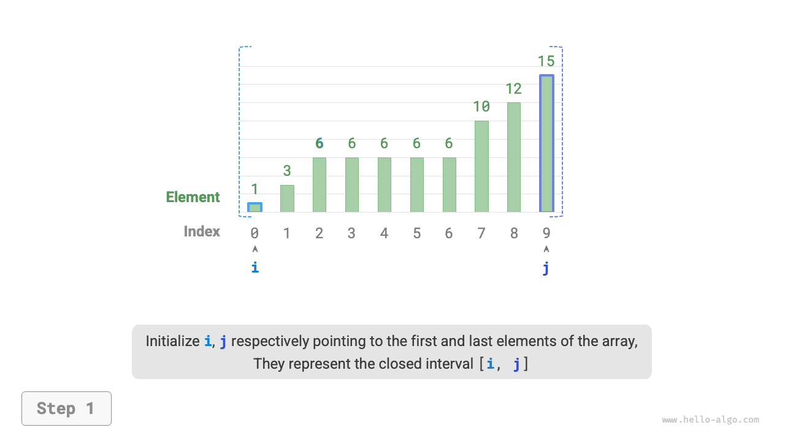
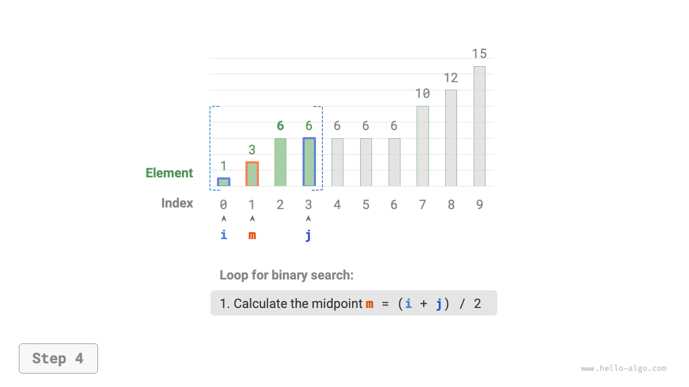

# Điểm chèn của tìm kiếm nhị phân

Tìm kiếm nhị phân không chỉ được dùng để tìm phần tử mục tiêu, mà còn có thể giải nhiều bài toán biến thể, chẳng hạn như tìm vị trí chèn của một phần tử mục tiêu.

## Trường hợp không có phần tử trùng lặp

!!! question

    Cho một mảng đã sắp xếp `nums` có độ dài $n$ và một phần tử `target`, trong đó mảng không chứa phần tử trùng lặp, hãy chèn `target` vào `nums` sao cho vẫn giữ được thứ tự đã sắp xếp. Nếu `target` đã tồn tại trong mảng, hãy chèn nó vào bên trái. Trả về chỉ số của `target` sau khi chèn. Ví dụ minh họa như hình dưới đây.


Nếu muốn tái sử dụng mã tìm kiếm nhị phân ở mục trước, chúng ta cần trả lời hai câu hỏi sau.

**Câu hỏi 1**: Khi mảng chứa `target`, chỉ số điểm chèn có trùng với chỉ số của phần tử đó không?

Đề bài yêu cầu chèn `target` vào bên trái các phần tử bằng nó, nghĩa là `target` mới được chèn sẽ thay thế vị trí của `target` gốc. Nói cách khác, **khi mảng chứa `target`, chỉ số điểm chèn chính là chỉ số của `target` đó**.

**Câu hỏi 2**: Khi mảng không chứa `target`, chỉ số điểm chèn là gì?

Để phân tích sâu hơn, hãy xét quá trình tìm kiếm nhị phân: khi `nums[m] < target`, $i$ dịch chuyển, nghĩa là con trỏ $i$ đang tiến dần đến các phần tử lớn hơn hoặc bằng `target`. Tương tự, con trỏ $j$ luôn tiến dần đến các phần tử nhỏ hơn hoặc bằng `target`.

Do đó, khi tìm kiếm nhị phân kết thúc, $i$ chắc chắn trỏ đến phần tử lớn hơn `target` đầu tiên, còn $j$ chắc chắn trỏ đến phần tử nhỏ hơn `target` cuối cùng. **Từ đó suy ra rằng khi mảng không chứa `target`, chỉ số chèn chính là $i$**. Mã nguồn được trình bày dưới đây:

```src
[file]{binary_search_insertion}-[class]{}-[func]{binary_search_insertion_simple}
```

## Trường hợp có phần tử trùng lặp

!!! question

    Dựa trên bài toán trước, giả sử mảng có thể chứa các phần tử trùng lặp, các điều kiện còn lại giữ nguyên.

Giả sử có nhiều phần tử `target` trong mảng. Tìm kiếm nhị phân thông thường chỉ có thể trả về chỉ số của một `target`, **và không thể xác định có bao nhiêu phần tử `target` nằm bên trái và bên phải của phần tử đó**.

Đề bài yêu cầu chèn phần tử mục tiêu vào vị trí ngoài cùng bên trái, **vì vậy chúng ta cần tìm chỉ số của `target` ngoài cùng bên trái trong mảng**. Một cách tiếp cận ban đầu đơn giản là làm theo các bước như hình dưới đây:

1. Thực hiện tìm kiếm nhị phân để lấy chỉ số của một `target` bất kỳ, gọi là $k$.
2. Bắt đầu từ chỉ số $k$, duyệt tuyến tính sang trái, và trả về khi tìm thấy `target` ngoài cùng bên trái.


Mặc dù cách này hoạt động đúng, nhưng nó bao gồm bước tìm kiếm tuyến tính, dẫn đến độ phức tạp thời gian $O(n)$. Khi mảng chứa nhiều phần tử `target` trùng lặp, phương pháp này rất kém hiệu quả.

Bây giờ hãy xem xét việc mở rộng mã tìm kiếm nhị phân. Như hình dưới đây, quy trình tổng thể không đổi: trong mỗi vòng lặp, trước tiên ta tính chỉ số điểm giữa $m$, sau đó so sánh `target` với `nums[m]`, dẫn đến các trường hợp sau:

- Khi `nums[m] < target` hoặc `nums[m] > target`, nghĩa là chưa tìm thấy `target`, nên sử dụng thao tác thu hẹp khoảng chuẩn của tìm kiếm nhị phân để **đưa các con trỏ $i$ và $j$ tiến gần hơn đến `target`**.
- Khi `nums[m] == target`, nghĩa là các phần tử nhỏ hơn `target` nằm trong khoảng $[i, m - 1]$, nên dùng $j = m - 1$ để thu hẹp khoảng, từ đó **đưa con trỏ $j$ tiến gần hơn đến các phần tử nhỏ hơn `target`**.

Sau khi vòng lặp kết thúc, $i$ trỏ đến `target` ngoài cùng bên trái, còn $j$ trỏ đến phần tử nhỏ hơn `target` cuối cùng, **do đó chỉ số $i$ chính là điểm chèn**.

=== "<1>"
    

=== "<2>"
    

=== "<3>"
    

=== "<4>"
    

=== "<5>"
    

=== "<6>"
    

=== "<7>"
    

=== "<8>"
    

Quan sát đoạn mã sau: hai nhánh `nums[m] > target` và `nums[m] == target` thực hiện cùng một thao tác, nên có thể gộp lại.

Dù vậy, chúng ta vẫn có thể giữ các nhánh điều kiện riêng biệt, vì như vậy logic sẽ rõ ràng và dễ đọc hơn.

```src
[file]{binary_search_insertion}-[class]{}-[func]{binary_search_insertion}
```

!!! tip

    Mã nguồn trong mục này sử dụng xuyên suốt cách tiếp cận "khoảng đóng". Bạn đọc quan tâm có thể tự triển khai cách tiếp cận "trái đóng, phải mở".

Nhìn chung, tìm kiếm nhị phân chỉ đơn giản là việc thiết lập các mục tiêu tìm kiếm riêng cho con trỏ $i$ và $j$. Mục tiêu đó có thể là một phần tử cụ thể (như `target`) hoặc một khoảng các phần tử (như các phần tử nhỏ hơn `target`).

Ở mỗi vòng lặp của tìm kiếm nhị phân, các con trỏ $i$ và $j$ dần tiến đến mục tiêu đã định trước. Cuối cùng, chúng hoặc tìm ra đáp án, hoặc dừng lại sau khi vượt qua ranh giới.
