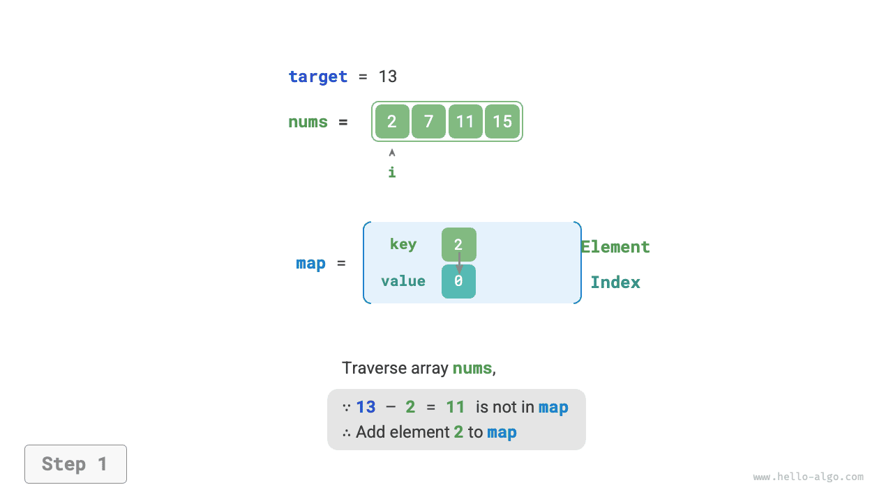
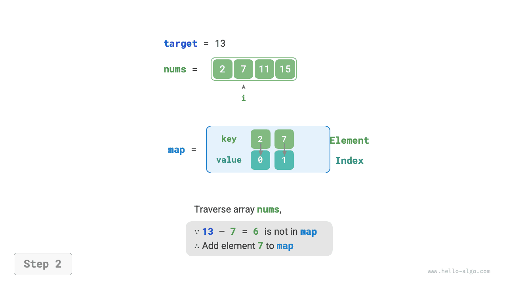

# Chiến lược tối ưu bằng bảng băm

Trong các bài toán thuật toán, **chúng ta thường giảm độ phức tạp thời gian của thuật toán bằng cách thay thế tìm kiếm tuyến tính bằng tìm kiếm dựa trên bảng băm**. Hãy cùng dùng một bài toán thuật toán để hiểu sâu hơn về điều này.

!!! question

    Cho một mảng số nguyên `nums` và một giá trị mục tiêu `target`, hãy tìm hai phần tử trong mảng có tổng bằng `target`, và trả về chỉ số của chúng. Chỉ cần trả về một cặp chỉ số hợp lệ bất kỳ.

## Tìm kiếm tuyến tính: đánh đổi thời gian lấy không gian

Xem xét việc duyệt trực tiếp tất cả các tổ hợp có thể. Như hình dưới đây, ta dùng vòng lặp lồng nhau và trong mỗi vòng lặp kiểm tra xem tổng của hai số nguyên có bằng `target` hay không. Nếu có, trả về chỉ số của chúng.


Mã nguồn được trình bày dưới đây:

```src
[file]{two_sum}-[class]{}-[func]{two_sum_brute_force}
```

Phương pháp này có độ phức tạp thời gian là $O(n^2)$ và độ phức tạp không gian là $O(1)$, khiến nó rất tốn thời gian khi đầu vào lớn.

## Tìm kiếm dựa trên bảng băm: đánh đổi không gian lấy thời gian

Xem xét việc sử dụng một bảng băm với khóa là các phần tử của mảng và giá trị là chỉ số của chúng. Duyệt qua mảng và thực hiện các bước như hình dưới đây trong mỗi vòng lặp:

1. Kiểm tra xem số `target - nums[i]` có nằm trong bảng băm hay không. Nếu có, trả về ngay chỉ số của hai phần tử này.
2. Thêm cặp khóa-giá trị `nums[i]` và chỉ số `i` vào bảng băm.

=== "<1>"
    

=== "<2>"
    

=== "<3>"
    

Cách triển khai được trình bày dưới đây và chỉ cần một vòng lặp duy nhất:

```src
[file]{two_sum}-[class]{}-[func]{two_sum_hash_table}
```

Phương pháp này giảm độ phức tạp thời gian từ $O(n^2)$ xuống $O(n)$ nhờ tìm kiếm dựa trên bảng băm, cải thiện đáng kể hiệu suất chạy.

Vì cần duy trì thêm một bảng băm, độ phức tạp không gian là $O(n)$. **Tuy nhiên, phương pháp này mang lại sự cân bằng tổng thể tốt hơn giữa thời gian và không gian, khiến nó trở thành giải pháp tối ưu cho bài toán này**.
