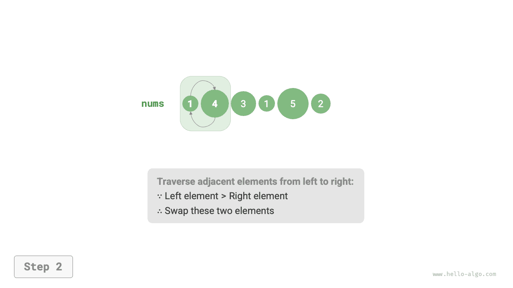
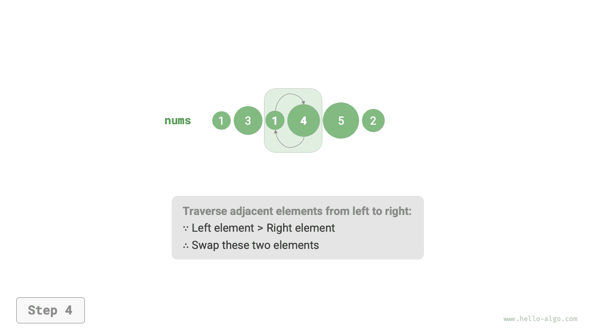

# Sắp xếp nổi bọt

<u>Sắp xếp nổi bọt</u> sắp xếp một mảng bằng cách liên tục so sánh và hoán đổi các phần tử liền kề nhau. Quá trình này giống như các bọt khí nổi từ đáy lên mặt nước, do đó có tên gọi là sắp xếp nổi bọt.

Như hình dưới đây cho thấy, quá trình "nổi bọt" có thể được mô phỏng bằng cách hoán đổi các phần tử: bắt đầu từ đầu bên trái của mảng và duyệt sang phải, so sánh từng cặp phần tử liền kề, nếu "phần tử bên trái > phần tử bên phải" thì hoán đổi chúng. Sau khi duyệt xong, phần tử lớn nhất sẽ được đưa về vị trí ngoài cùng bên phải của mảng.

=== "<1>"
    

=== "<2>"
    

=== "<3>"
    

=== "<4>"
    

=== "<5>"
    

=== "<6>"
    

=== "<7>"
    

## Luồng giải thuật

Giả sử mảng có độ dài $n$. Các bước của sắp xếp nổi bọt được minh họa trong hình dưới đây.

1. Đầu tiên, thực hiện "nổi bọt" trên $n$ phần tử, **đưa phần tử lớn nhất của mảng về đúng vị trí của nó**.
2. Tiếp theo, thực hiện "nổi bọt" trên $n - 1$ phần tử còn lại, **đưa phần tử lớn thứ hai về đúng vị trí của nó**.
3. Cứ tiếp tục như vậy. Sau $n - 1$ vòng "nổi bọt", **$n - 1$ phần tử lớn nhất đều đã được đưa về đúng vị trí**.
4. Phần tử duy nhất còn lại chắc chắn là phần tử nhỏ nhất, không cần sắp xếp thêm, do đó quá trình sắp xếp mảng đã hoàn tất.


Đoạn mã ví dụ như sau:

```src
[file]{bubble_sort}-[class]{}-[func]{bubble_sort}
```

## Tối ưu hiệu suất

Ta có thể nhận thấy rằng nếu không có phép hoán đổi nào xảy ra trong một vòng "nổi bọt", thì mảng đã được sắp xếp xong và giải thuật có thể trả về ngay lập tức. Do đó, ta có thể thêm một cờ `flag` để phát hiện tình huống này và dừng ngay khi nó xảy ra.

Sau khi tối ưu này, độ phức tạp thời gian trong trường hợp xấu nhất và trung bình của sắp xếp nổi bọt vẫn là $O(n^2)$; tuy nhiên, khi mảng đầu vào đã được sắp xếp sẵn, độ phức tạp thời gian trong trường hợp tốt nhất trở thành $O(n)$.

```src
[file]{bubble_sort}-[class]{}-[func]{bubble_sort_with_flag}
```

## Đặc điểm giải thuật

- **Độ phức tạp thời gian là $O(n^2)$; có tính thích nghi**: Trong các vòng "nổi bọt" liên tiếp, phần mảng được duyệt qua có độ dài lần lượt là $n - 1$, $n - 2$, $\dots$, $2$, $1$, tổng cộng là $(n - 1) n / 2$. Sau khi áp dụng tối ưu `flag`, độ phức tạp thời gian trong trường hợp tốt nhất có thể đạt $O(n)$.
- **Độ phức tạp không gian là $O(1)$, sắp xếp tại chỗ**: Các con trỏ $i$ và $j$ sử dụng một lượng không gian phụ trợ không đổi.
- **Sắp xếp ổn định**: Các phần tử bằng nhau không bị hoán đổi trong quá trình "nổi bọt".
