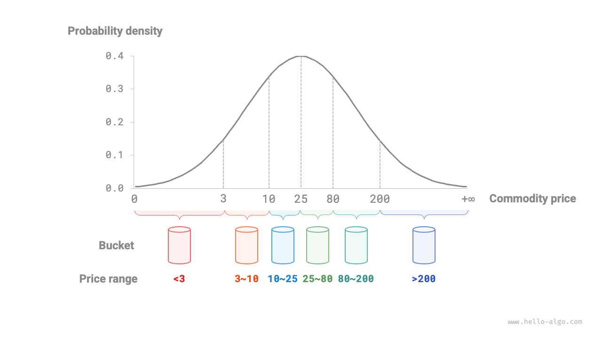

# Sắp xếp theo giỏ

Các giải thuật sắp xếp đã trình bày trước đây đều là các giải thuật sắp xếp dựa trên so sánh, sắp xếp bằng cách so sánh thứ tự tương đối giữa các phần tử. Độ phức tạp thời gian của các giải thuật này không thể vượt qua $O(n \log n)$. Tiếp theo, chúng ta sẽ khám phá một số giải thuật sắp xếp không so sánh, có độ phức tạp thời gian có thể đạt mức tuyến tính.

<u>Sắp xếp theo giỏ</u> là một ứng dụng điển hình của chiến lược chia để trị. Nó hoạt động bằng cách tạo ra một dãy các giỏ có thứ tự, mỗi giỏ tương ứng với một khoảng dữ liệu, và phân bố dữ liệu đều vào các giỏ đó. Các phần tử trong mỗi giỏ sau đó được sắp xếp riêng biệt. Cuối cùng, tất cả các giỏ được ghép lại theo đúng thứ tự.

## Luồng giải thuật

Xét một mảng có độ dài $n$, các phần tử là số thực trong khoảng $[0, 1)$. Luồng của sắp xếp theo giỏ được minh họa trong hình dưới đây.

1. Khởi tạo $k$ giỏ và phân bố $n$ phần tử vào $k$ giỏ đó.
2. Sắp xếp riêng từng giỏ (ở đây ta dùng hàm sắp xếp có sẵn của ngôn ngữ lập trình).
3. Ghép các kết quả theo thứ tự từ giỏ nhỏ nhất đến giỏ lớn nhất.


Đoạn mã như sau:

```src
[file]{bucket_sort}-[class]{}-[func]{bucket_sort}
```

## Đặc điểm giải thuật

Sắp xếp theo giỏ phù hợp để xử lý các tập dữ liệu rất lớn. Ví dụ, giả sử đầu vào chứa 1 triệu phần tử, và bộ nhớ hạn chế khiến hệ thống không thể nạp tất cả cùng một lúc. Trong trường hợp đó, dữ liệu có thể được chia thành 1000 giỏ, mỗi giỏ được sắp xếp riêng, sau đó các kết quả được ghép lại.

- **Độ phức tạp thời gian là $O(n + k)$**: Giả sử các phần tử được phân bố đều vào các giỏ, mỗi giỏ chứa $\frac{n}{k}$ phần tử. Nếu sắp xếp một giỏ mất $O(\frac{n}{k} \log\frac{n}{k})$ thời gian, thì sắp xếp tất cả các giỏ mất $O(n \log\frac{n}{k})$ thời gian. **Khi số lượng giỏ $k$ tương đối lớn, độ phức tạp thời gian tiệm cận $O(n)$**. Việc ghép các kết quả đòi hỏi duyệt qua tất cả các giỏ và phần tử, mất $O(n + k)$ thời gian. Trong trường hợp xấu nhất, toàn bộ dữ liệu đều rơi vào một giỏ duy nhất, và việc sắp xếp giỏ đó mất $O(n^2)$ thời gian.
- **Độ phức tạp không gian là $O(n + k)$, sắp xếp theo giỏ không phải sắp xếp tại chỗ**: Cần thêm không gian cho $k$ giỏ và tổng cộng $n$ phần tử.
- Việc sắp xếp theo giỏ có ổn định hay không phụ thuộc vào giải thuật dùng để sắp xếp phần tử bên trong từng giỏ có ổn định hay không.

## Làm sao để đạt được phân bố đều

Về mặt lý thuyết, sắp xếp theo giỏ có thể đạt độ phức tạp thời gian $O(n)$. **Điều then chốt là phân bố các phần tử đều vào các giỏ**, vì dữ liệu trong thực tế thường không được phân bố đồng đều. Ví dụ, giả sử ta muốn chia đều tất cả sản phẩm trên Taobao vào 10 giỏ theo khoảng giá, nhưng phân bố giá lại không đồng đều: có rất nhiều sản phẩm giá dưới 100 tệ và rất ít sản phẩm giá trên 1000 tệ. Nếu chia khoảng giá đều thành 10 khoảng, số lượng sản phẩm trong các giỏ sẽ chênh lệch rất lớn.

Để đạt được phân bố đồng đều hơn, ta có thể trước tiên chọn một ranh giới thô và chia dữ liệu thành 3 giỏ. **Sau đó, các giỏ chứa nhiều sản phẩm hơn có thể tiếp tục được chia thành 3 giỏ nhỏ hơn cho đến khi số lượng phần tử trong tất cả các giỏ tương đối bằng nhau**.

Như hình dưới đây cho thấy, phương pháp này về bản chất xây dựng một cây đệ quy với mục tiêu làm cho các nút lá càng cân bằng càng tốt. Tất nhiên, dữ liệu không nhất thiết phải chia thành 3 giỏ trong mỗi vòng; chiến lược phân chia cụ thể có thể được lựa chọn linh hoạt tùy theo đặc điểm của dữ liệu.


Nếu ta biết trước phân bố xác suất của giá sản phẩm, **ta có thể thiết lập ranh giới giá cho từng giỏ dựa trên phân bố đó**. Đáng chú ý là, phân bố dữ liệu không cần phải được đo lường chính xác; nó cũng có thể được xấp xỉ bằng một mô hình xác suất được chọn sao cho phù hợp với đặc điểm của dữ liệu.

Như hình dưới đây cho thấy, ta giả định giá sản phẩm tuân theo phân bố chuẩn, điều này cho phép ta thiết lập hợp lý các khoảng giá để phân bố đều sản phẩm vào từng giỏ.


