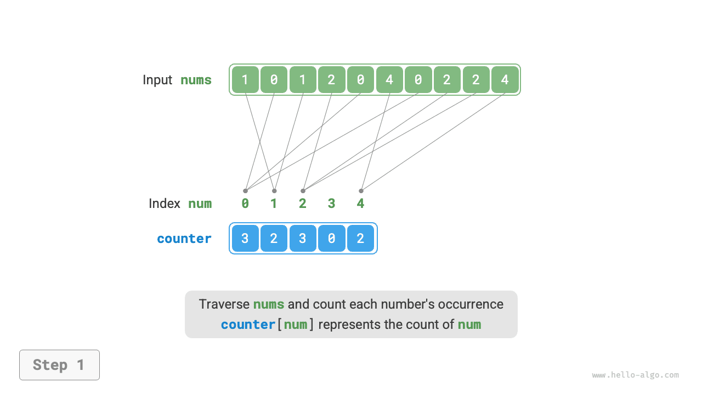

# Sắp xếp đếm

<u>Sắp xếp đếm</u> sắp xếp bằng cách đếm số lần xuất hiện của các phần tử và thường được áp dụng cho mảng số nguyên.

## Cách hiện thực đơn giản

Hãy bắt đầu với một ví dụ đơn giản. Cho một mảng `nums` có độ dài $n$, các phần tử đều là "số nguyên không âm", toàn bộ luồng của sắp xếp đếm được minh họa trong hình dưới đây.

1. Duyệt mảng để tìm số lớn nhất, ký hiệu là $m$, sau đó tạo một mảng phụ `counter` có độ dài $m + 1$.
2. **Dùng `counter` để đếm số lần mỗi số xuất hiện trong `nums`**, trong đó `counter[num]` lưu số lần xuất hiện của `num`. Việc này đơn giản: duyệt `nums` (gọi số hiện tại là `num`) và tăng `counter[num]` lên $1$ mỗi lần.
3. **Vì các chỉ số của `counter` tự nhiên đã có thứ tự, các số thực chất đã được sắp xếp**. Tiếp theo, duyệt `counter` và ghi các số trở lại vào `nums` theo thứ tự tăng dần dựa trên số lần xuất hiện của chúng.


Đoạn mã như sau:

```src
[file]{counting_sort}-[class]{}-[func]{counting_sort_naive}
```

!!! note "Mối liên hệ giữa sắp xếp đếm và sắp xếp theo giỏ"

    Nhìn từ góc độ của sắp xếp theo giỏ, mỗi chỉ số của mảng đếm `counter` có thể được xem như một giỏ, và quá trình đếm có thể được xem là việc phân phối các phần tử vào giỏ tương ứng của chúng. Về bản chất, sắp xếp đếm là một trường hợp đặc biệt của sắp xếp theo giỏ dành cho dữ liệu số nguyên.

## Cách hiện thực đầy đủ

Độc giả tinh ý có thể nhận thấy rằng **nếu đầu vào gồm các đối tượng, bước `3.` ở trên sẽ không còn hiệu quả nữa**. Giả sử đầu vào gồm các đối tượng sản phẩm và ta muốn sắp xếp chúng theo giá (một biến thành viên của lớp); giải thuật trên chỉ có thể tạo ra thứ tự sắp xếp của bản thân các giá trị giá.

Vậy làm sao ta có thể lấy được thứ tự sắp xếp của dữ liệu gốc? Trước tiên ta tính tổng tiền tố (prefix sum) của `counter`. Đúng như tên gọi, tổng tiền tố tại chỉ số `i`, `prefix[i]`, bằng tổng các phần tử từ chỉ số `0` đến `i`:

$$
\text{prefix}[i] = \sum_{j=0}^i \text{counter[j]}
$$

**Tổng tiền tố có một ý nghĩa rõ ràng: `prefix[num] - 1` cho biết chỉ số của lần xuất hiện cuối cùng của phần tử `num` trong mảng kết quả `res`**. Thông tin này rất quan trọng vì nó cho ta biết mỗi phần tử nên được đặt ở đâu trong mảng kết quả. Tiếp theo, ta duyệt mảng gốc `nums` theo chiều ngược lại, và với mỗi phần tử `num`, thực hiện hai bước sau.

1. Đặt `num` vào chỉ số `prefix[num] - 1` của mảng `res`.
2. Giảm tổng tiền tố `prefix[num]` đi $1$ để có được chỉ số cho lần đặt tiếp theo của `num`.

Sau khi duyệt xong, mảng `res` chứa kết quả đã sắp xếp, và cuối cùng `res` được dùng để ghi đè lên mảng gốc `nums`. Toàn bộ luồng của sắp xếp đếm được minh họa trong hình dưới đây.

=== "<1>"
    

=== "<2>"
    

=== "<3>"
    

=== "<4>"
    

=== "<5>"
    

=== "<6>"
    

=== "<7>"
    

=== "<8>"
    

Cách hiện thực sắp xếp đếm được thể hiện dưới đây:

```src
[file]{counting_sort}-[class]{}-[func]{counting_sort}
```

## Đặc điểm giải thuật

- **Độ phức tạp thời gian là $O(n + m)$, sắp xếp đếm không thích nghi**: Việc duyệt `nums` và `counter` đều mất thời gian tuyến tính. Nhìn chung, khi $n \gg m$, độ phức tạp thời gian tiệm cận $O(n)$.
- **Độ phức tạp không gian $O(n + m)$, sắp xếp không tại chỗ**: Sử dụng các mảng `res` và `counter` có độ dài lần lượt là $n$ và $m$.
- **Sắp xếp ổn định**: Vì các phần tử được điền vào `res` theo thứ tự "từ phải sang trái", việc duyệt `nums` theo chiều ngược có thể tránh làm thay đổi vị trí tương đối của các phần tử bằng nhau, nhờ đó đạt được sắp xếp ổn định. Thực tế, duyệt `nums` theo chiều thuận cũng có thể cho kết quả sắp xếp đúng, nhưng kết quả sẽ không ổn định.

## Hạn chế

Đến đây, bạn có thể nghĩ rằng sắp xếp đếm khá tinh tế vì nó đạt được việc sắp xếp hiệu quả chỉ bằng cách đếm số lần xuất hiện. Tuy nhiên, các điều kiện tiên quyết để sử dụng sắp xếp đếm khá khắt khe.

**Sắp xếp đếm chỉ áp dụng được cho số nguyên không âm**. Để áp dụng nó cho các kiểu dữ liệu khác, bạn phải đảm bảo rằng chúng có thể chuyển đổi thành số nguyên không âm mà không làm thay đổi thứ tự tương đối giữa các phần tử. Ví dụ, đối với một mảng số nguyên chứa số âm, bạn có thể cộng thêm một hằng số vào mọi số để dịch chúng vào khoảng không âm, sau đó dịch ngược lại sau khi sắp xếp.

**Sắp xếp đếm phù hợp với các trường hợp có nhiều phần tử nhưng khoảng giá trị nhỏ**. Ví dụ, trong tình huống trên, $m$ không được quá lớn; nếu không nó sẽ tiêu tốn quá nhiều không gian. Và khi $n \ll m$, sắp xếp đếm mất $O(m)$ thời gian, có thể chậm hơn các giải thuật sắp xếp có độ phức tạp thời gian $O(n \log n)$.
