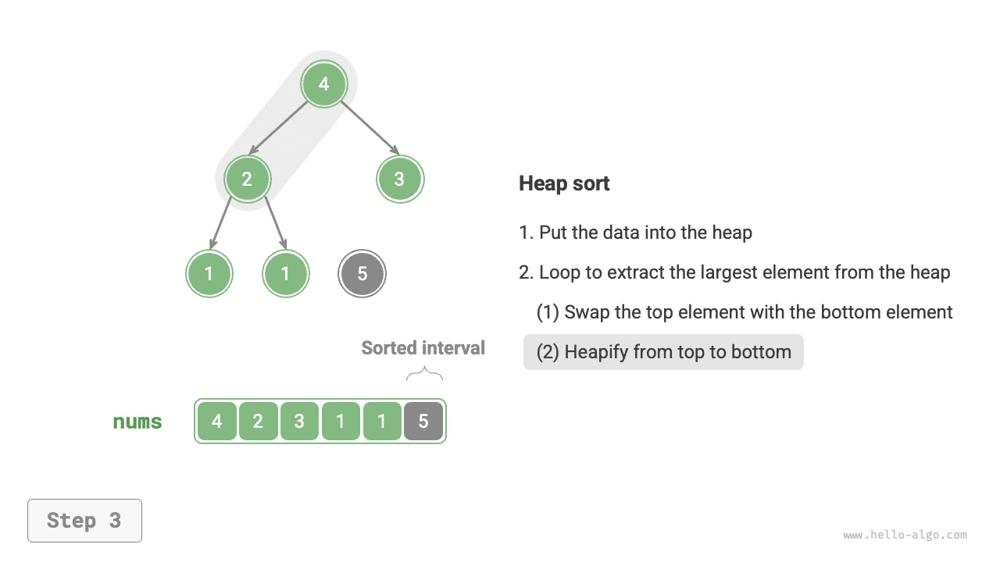
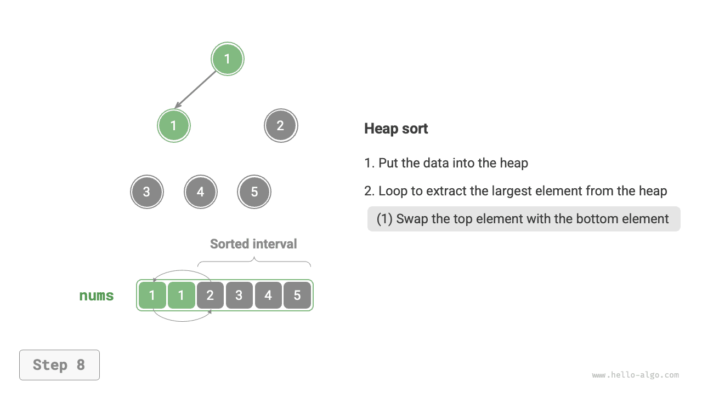
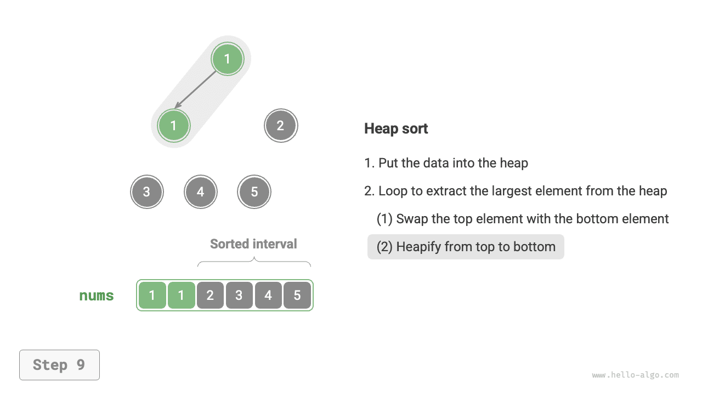

# Sắp xếp vun đống

!!! tip

    Trước khi đọc phần này, hãy đảm bảo bạn đã hoàn thành chương "Đống".

<u>Sắp xếp vun đống</u> là một giải thuật sắp xếp hiệu quả dựa trên cấu trúc dữ liệu đống (heap). Ta có thể hiện thực sắp xếp vun đống bằng cách sử dụng các thao tác xây dựng đống và loại bỏ phần tử đã giới thiệu trước đó.

1. Nhập mảng và xây dựng một đống nhỏ nhất (min-heap), lúc này phần tử nhỏ nhất nằm ở đỉnh đống.
2. Liên tục thực hiện thao tác loại bỏ phần tử và ghi lại các phần tử đã loại bỏ theo thứ tự để thu được một dãy được sắp xếp tăng dần.

Mặc dù phương pháp trên khả thi, nó đòi hỏi một mảng phụ để lưu các phần tử đã lấy ra, khá lãng phí không gian. Trong thực tế, ta thường dùng một cách hiện thực tinh gọn hơn.

## Luồng giải thuật

Giả sử độ dài mảng là $n$. Luồng của sắp xếp vun đống được minh họa trong hình dưới đây.

1. Nhập mảng và xây dựng một đống lớn nhất (max-heap). Sau khi hoàn thành, phần tử lớn nhất nằm ở đỉnh đống.
2. Hoán đổi phần tử đỉnh đống (phần tử đầu tiên) với phần tử đáy đống (phần tử cuối cùng). Sau khi hoán đổi xong, giảm độ dài đống đi $1$ và tăng số lượng phần tử đã sắp xếp lên $1$.
3. Bắt đầu từ phần tử đỉnh đống, thực hiện thao tác vun đống từ trên xuống dưới (sift down). Sau khi vun đống xong, tính chất đống được khôi phục.
4. Lặp lại bước `2.` và `3.` Sau $n - 1$ vòng, mảng đã được sắp xếp.

!!! tip

    Thực tế, thao tác loại bỏ phần tử cũng bao gồm bước `2.` và `3.`, cộng thêm bước loại bỏ phần tử.

=== "<1>"
    

=== "<2>"
    

=== "<3>"
    

=== "<4>"
    

=== "<5>"
    

=== "<6>"
    

=== "<7>"
    

=== "<8>"
    

=== "<9>"
    

=== "<10>"
    

=== "<11>"
    

=== "<12>"
    

Trong đoạn mã dưới đây, ta sử dụng cùng hàm `sift_down()` để vun đống từ trên xuống dưới như trong chương "Đống". Cần lưu ý rằng vì độ dài đống giảm dần khi phần tử lớn nhất được lấy ra, ta cần thêm một tham số độ dài $n$ vào `sift_down()` để chỉ định độ dài hiệu lực hiện tại của đống. Đoạn mã như sau:

```src
[file]{heap_sort}-[class]{}-[func]{heap_sort}
```

## Đặc điểm giải thuật

- **Độ phức tạp thời gian là $O(n \log n)$; sắp xếp vun đống không thích nghi**: Việc xây dựng đống mất $O(n)$ thời gian. Việc lấy phần tử lớn nhất ra khỏi đống mất $O(\log n)$ thời gian, và thao tác này được lặp lại tổng cộng $n - 1$ vòng.
- **Độ phức tạp không gian là $O(1)$; sắp xếp vun đống là sắp xếp tại chỗ**: Một vài biến con trỏ sử dụng $O(1)$ không gian. Việc hoán đổi phần tử và vun đống đều được thực hiện trên mảng gốc.
- **Sắp xếp không ổn định**: Khi hoán đổi phần tử đỉnh đống và phần tử đáy đống, vị trí tương đối của các phần tử bằng nhau có thể thay đổi.
