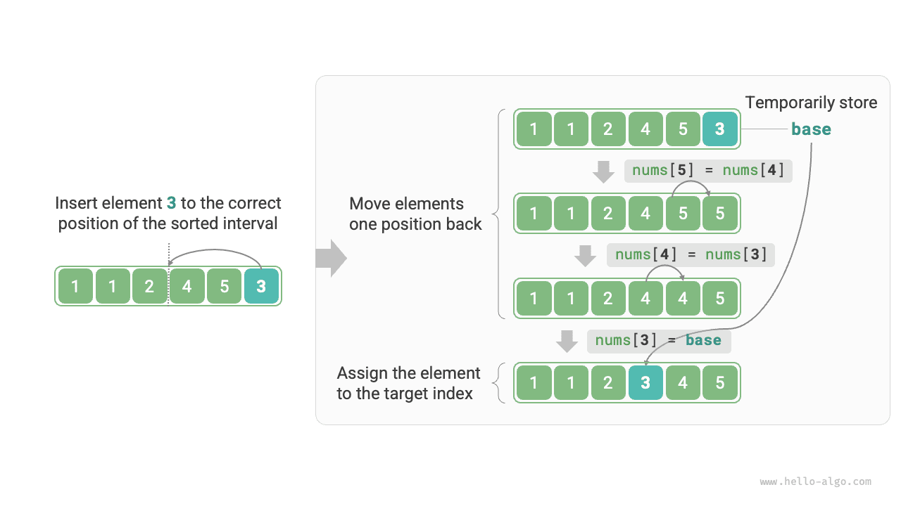

# Sắp xếp chèn

<u>Sắp xếp chèn</u> là một giải thuật sắp xếp đơn giản, hoạt động rất giống với cách ta sắp xếp một bộ bài bằng tay.

Cụ thể, ta chọn một phần tử cơ sở từ phần chưa sắp xếp, so sánh lần lượt nó với các phần tử trong phần đã sắp xếp ở bên trái, rồi chèn nó vào đúng vị trí.

Hình dưới đây minh họa cách một phần tử được chèn vào mảng. Gọi phần tử cơ sở là `base`. Ta cần dịch chuyển tất cả các phần tử nằm giữa chỉ số đích và `base` sang phải một vị trí, sau đó gán `base` vào chỉ số đích.



## Luồng giải thuật

Toàn bộ luồng của sắp xếp chèn được minh họa trong hình dưới đây.

1. Ban đầu, phần tử đầu tiên của mảng đã được coi là sắp xếp xong.
2. Chọn phần tử thứ hai của mảng làm `base`, sau khi chèn nó vào đúng vị trí, **2 phần tử đầu tiên của mảng đã được sắp xếp**.
3. Chọn phần tử thứ ba làm `base`, sau khi chèn nó vào đúng vị trí, **3 phần tử đầu tiên của mảng đã được sắp xếp**.
4. Cứ tiếp tục như vậy. Ở vòng cuối cùng, chọn phần tử cuối cùng làm `base`, sau khi chèn nó vào đúng vị trí, **toàn bộ mảng đã được sắp xếp**.


Đoạn mã ví dụ như sau:

```src
[file]{insertion_sort}-[class]{}-[func]{insertion_sort}
```

## Đặc điểm giải thuật

- **Độ phức tạp thời gian $O(n^2)$, sắp xếp thích nghi**: Trong trường hợp xấu nhất, các thao tác chèn cần lần lượt $n - 1$, $n-2$, $\dots$, $2$, và $1$ lần lặp, tổng cộng là $(n - 1) n / 2$, do đó độ phức tạp thời gian là $O(n^2)$. Khi dữ liệu đã được sắp xếp sẵn, mỗi thao tác chèn sẽ kết thúc sớm. Khi mảng đầu vào đã hoàn toàn được sắp xếp, sắp xếp chèn đạt độ phức tạp thời gian tốt nhất là $O(n)$.
- **Độ phức tạp không gian $O(1)$, sắp xếp tại chỗ**: Các con trỏ $i$ và $j$ sử dụng một lượng không gian phụ trợ không đổi.
- **Sắp xếp ổn định**: Trong quá trình chèn, ta đặt các phần tử vào bên phải các phần tử bằng nó, do đó thứ tự tương đối giữa chúng không thay đổi.

## Ưu điểm của sắp xếp chèn

Độ phức tạp thời gian của sắp xếp chèn là $O(n^2)$, trong khi độ phức tạp thời gian của sắp xếp nhanh, giải thuật ta sẽ học tiếp theo, là $O(n \log n)$. Mặc dù sắp xếp chèn có độ phức tạp thời gian cao hơn, **nó thường nhanh hơn trên các tập dữ liệu nhỏ**.

Kết luận này tương tự với kết luận về khi nào tìm kiếm tuyến tính và tìm kiếm nhị phân phù hợp để sử dụng. Các giải thuật như sắp xếp nhanh, với độ phức tạp $O(n \log n)$, là các giải thuật sắp xếp chia để trị và thường liên quan đến nhiều thao tác cơ bản hơn. Khi tập dữ liệu nhỏ, giá trị của $n^2$ và $n \log n$ tương đối gần nhau, nên độ phức tạp tiệm cận không còn chiếm ưu thế; thay vào đó, số lượng thao tác cơ bản trong mỗi vòng lặp mới là yếu tố quyết định.

Trên thực tế, các hàm sắp xếp có sẵn của nhiều ngôn ngữ lập trình (chẳng hạn như Java) sử dụng sắp xếp chèn. Ý tưởng chung là: đối với mảng lớn, sử dụng các giải thuật sắp xếp chia để trị như sắp xếp nhanh; đối với mảng ngắn, sử dụng trực tiếp sắp xếp chèn.

Mặc dù sắp xếp nổi bọt, sắp xếp chọn và sắp xếp chèn đều có độ phức tạp thời gian $O(n^2)$, nhưng trong thực tế, **sắp xếp chèn được sử dụng phổ biến hơn đáng kể so với sắp xếp nổi bọt và sắp xếp chọn**, chủ yếu vì các lý do sau.

- Sắp xếp nổi bọt được thực hiện thông qua việc hoán đổi phần tử, đòi hỏi một biến tạm thời và bao gồm 3 thao tác cơ bản; sắp xếp chèn được thực hiện thông qua phép gán phần tử và chỉ cần 1 thao tác cơ bản. Do đó, **sắp xếp nổi bọt thường có chi phí tính toán cao hơn sắp xếp chèn**.
- Sắp xếp chọn có độ phức tạp thời gian $O(n^2)$ trong mọi trường hợp. **Nếu cho một tập dữ liệu đã được sắp xếp một phần, sắp xếp chèn thường hiệu quả hơn sắp xếp chọn**.
- Sắp xếp chọn không ổn định và không thể áp dụng cho sắp xếp nhiều cấp.
