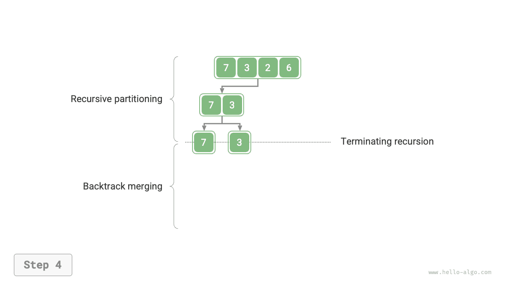
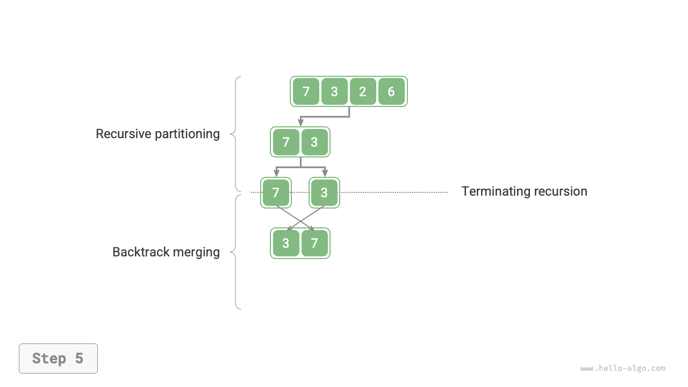
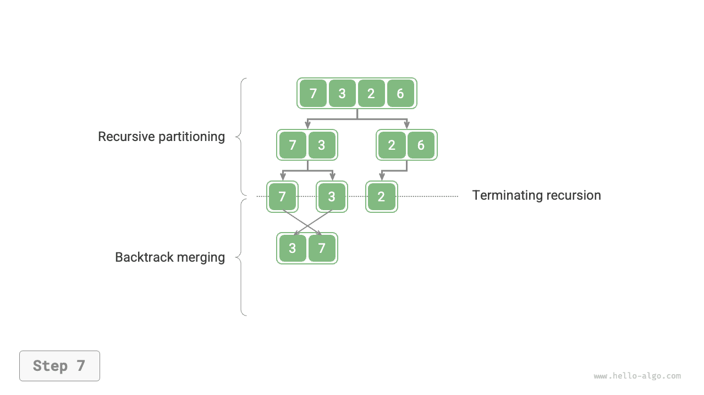
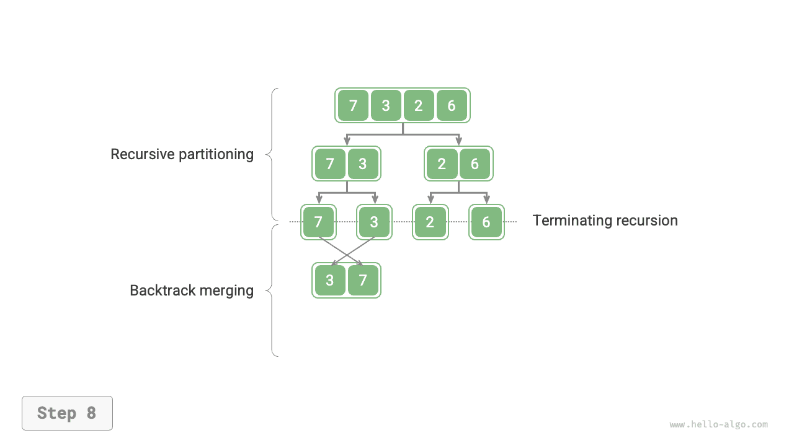

# Sắp xếp trộn

<u>Sắp xếp trộn</u> là một giải thuật sắp xếp dựa trên chiến lược chia để trị, gồm hai giai đoạn "chia" và "trộn" được minh họa trong hình dưới đây.

1. **Giai đoạn chia**: Đệ quy chia mảng tại điểm giữa, đưa bài toán sắp xếp một mảng dài về bài toán sắp xếp các mảng ngắn hơn.
2. **Giai đoạn trộn**: Khi một mảng con có độ dài 1, dừng việc chia và bắt đầu trộn, liên tục kết hợp các mảng con đã sắp xếp ngắn hơn ở bên trái và bên phải thành một mảng đã sắp xếp dài hơn cho đến khi hoàn tất.


## Luồng giải thuật

Như hình dưới đây cho thấy, "giai đoạn chia" đệ quy chia mảng từ điểm giữa thành hai mảng con theo hướng từ trên xuống dưới.

1. Tính điểm giữa của mảng `mid`, đệ quy chia mảng con bên trái (khoảng `[left, mid]`) và mảng con bên phải (khoảng `[mid + 1, right]`).
2. Lặp lại bước `1.` một cách đệ quy cho đến khi một mảng con có độ dài 1.

"Giai đoạn trộn" kết hợp các mảng con bên trái và bên phải thành một mảng đã sắp xếp theo hướng từ dưới lên trên. Lưu ý rằng việc trộn bắt đầu từ các mảng con có độ dài 1, do đó mọi mảng con tham gia vào giai đoạn này đều đã được sắp xếp sẵn.

=== "<1>"
    

=== "<2>"
    

=== "<3>"
    

=== "<4>"
    

=== "<5>"
    

=== "<6>"
    

=== "<7>"
    

=== "<8>"
    

=== "<9>"
    

=== "<10>"
    

Thứ tự đệ quy của sắp xếp trộn tương ứng với thứ tự duyệt sau (post-order traversal) của cây nhị phân.

- **Duyệt sau**: Trước tiên đệ quy duyệt cây con bên trái, sau đó đệ quy duyệt cây con bên phải, và cuối cùng xử lý nút gốc.
- **Sắp xếp trộn**: Trước tiên đệ quy xử lý mảng con bên trái, sau đó đệ quy xử lý mảng con bên phải, và cuối cùng thực hiện việc trộn.

Cách hiện thực sắp xếp trộn được thể hiện trong đoạn mã dưới đây. Lưu ý rằng khoảng cần trộn trong `nums` là `[left, right]`, còn khoảng tương ứng trong `tmp` là `[0, right - left]`.

```src
[file]{merge_sort}-[class]{}-[func]{merge_sort}
```

## Đặc điểm giải thuật

- **Độ phức tạp thời gian là $O(n \log n)$; sắp xếp trộn không thích nghi**: Giai đoạn chia tạo ra một cây đệ quy có chiều cao $\log n$, và tổng số thao tác được thực hiện trong quá trình trộn ở mỗi tầng là $n$, do đó độ phức tạp thời gian tổng thể là $O(n \log n)$.
- **Độ phức tạp không gian là $O(n)$; sắp xếp trộn không phải sắp xếp tại chỗ**: Độ sâu đệ quy là $\log n$, sử dụng $O(\log n)$ không gian khung ngăn xếp. Thao tác trộn cần một mảng phụ trợ, sử dụng thêm $O(n)$ không gian.
- **Sắp xếp ổn định**: Trong quá trình trộn, thứ tự tương đối của các phần tử bằng nhau không thay đổi.

## Sắp xếp danh sách liên kết

Đối với danh sách liên kết, sắp xếp trộn có ưu thế đáng kể so với các giải thuật sắp xếp khác, **và nó có thể giảm độ phức tạp không gian của tác vụ sắp xếp xuống $O(1)$**.

- **Giai đoạn chia**: Có thể dùng lặp thay cho đệ quy để chia danh sách liên kết, nhờ đó loại bỏ không gian khung ngăn xếp mà đệ quy sử dụng.
- **Giai đoạn trộn**: Trong danh sách liên kết, việc chèn và xóa nút chỉ cần cập nhật con trỏ, do đó giai đoạn trộn (kết hợp hai danh sách liên kết ngắn đã sắp xếp thành một danh sách liên kết dài hơn đã sắp xếp) không cần tạo thêm danh sách liên kết mới.

Các chi tiết hiện thực cụ thể khá phức tạp, độc giả quan tâm có thể tham khảo thêm tài liệu liên quan để tìm hiểu.
