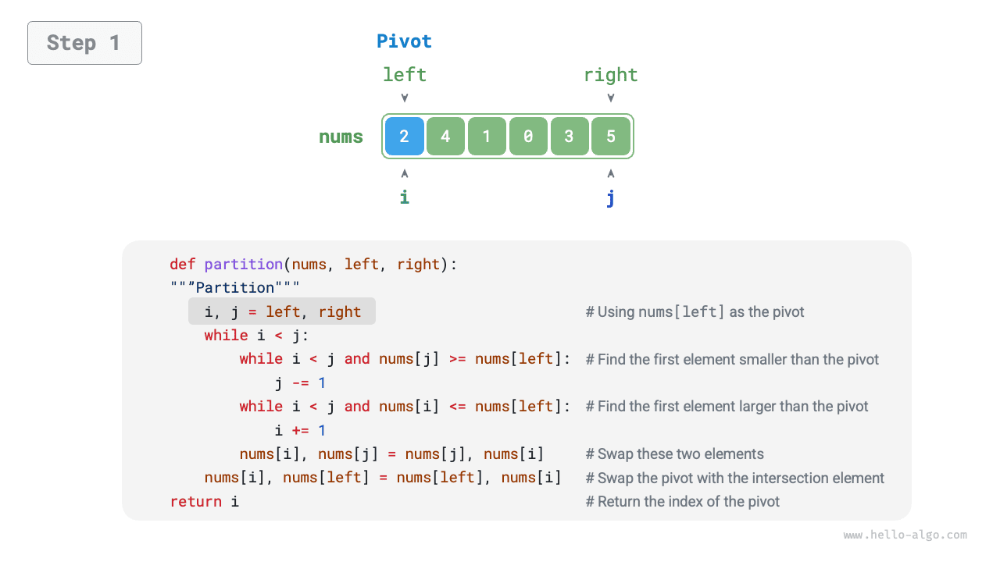
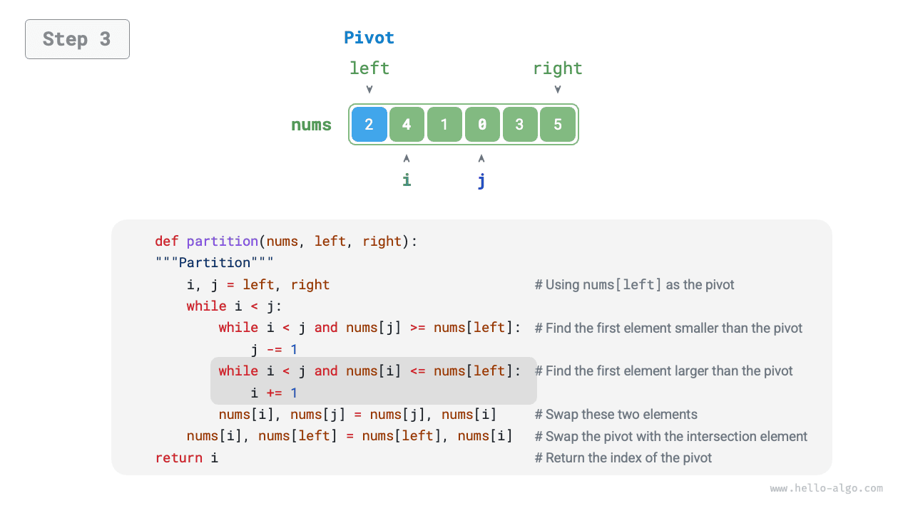
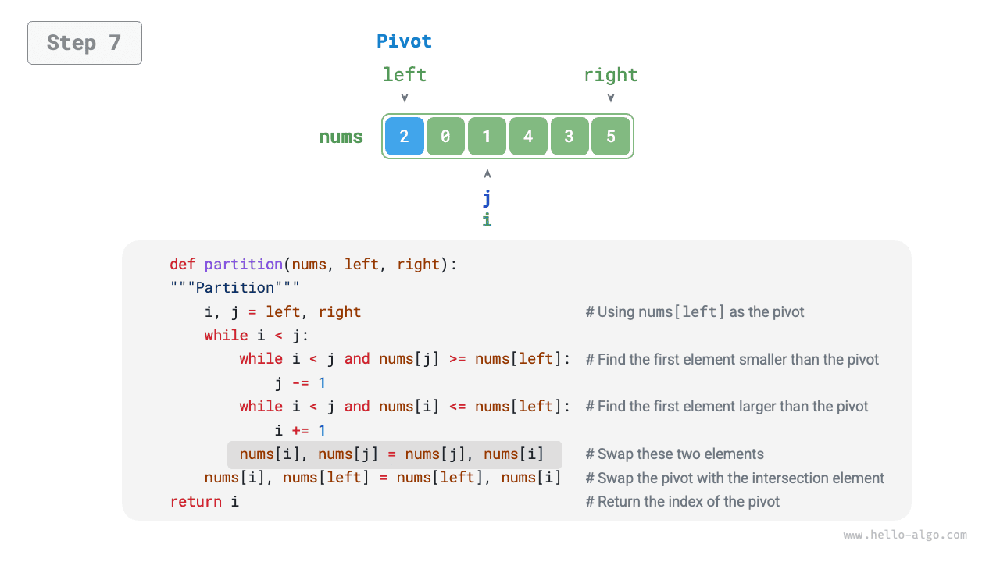

# Sắp xếp nhanh

<u>Sắp xếp nhanh</u> là một giải thuật sắp xếp hiệu quả và được sử dụng rộng rãi, dựa trên chiến lược chia để trị.

Thao tác cốt lõi của sắp xếp nhanh là "phân hoạch canh gác", với mục tiêu là chọn một phần tử làm "chốt" (pivot), di chuyển tất cả các phần tử nhỏ hơn chốt sang bên trái nó, và di chuyển tất cả các phần tử lớn hơn chốt sang bên phải nó. Cụ thể, quy trình được minh họa trong hình dưới đây.

1. Chọn phần tử ngoài cùng bên trái làm chốt, và khởi tạo hai con trỏ `i` và `j` ở hai đầu của mảng.
2. Bước vào vòng lặp. Trong mỗi vòng, dùng `i` (`j`) để tìm phần tử đầu tiên lớn hơn (nhỏ hơn) chốt, sau đó hoán đổi hai phần tử này.
3. Lặp lại bước `2.` cho đến khi `i` và `j` gặp nhau, sau đó hoán đổi chốt vào vị trí ranh giới giữa hai mảng con.

=== "<1>"
    

=== "<2>"
    

=== "<3>"
    

=== "<4>"
    

=== "<5>"
    

=== "<6>"
    

=== "<7>"
    

=== "<8>"
    

=== "<9>"
    

Sau khi phân hoạch canh gác, mảng ban đầu được chia thành ba phần: mảng con bên trái, chốt, và mảng con bên phải, sao cho "bất kỳ phần tử nào trong mảng con bên trái $\leq$ chốt $\leq$ bất kỳ phần tử nào trong mảng con bên phải". Do đó, tiếp theo ta chỉ cần sắp xếp hai mảng con này.

!!! note "Chiến lược chia để trị của sắp xếp nhanh"

    Bản chất của phân hoạch canh gác là đơn giản hóa bài toán sắp xếp một mảng dài thành bài toán sắp xếp hai mảng ngắn hơn.

```src
[file]{quick_sort}-[class]{quick_sort}-[func]{partition}
```

## Luồng giải thuật

Toàn bộ luồng của sắp xếp nhanh được minh họa trong hình dưới đây.

1. Đầu tiên, thực hiện một lần "phân hoạch canh gác" trên mảng ban đầu để thu được mảng con bên trái và mảng con bên phải chưa được sắp xếp.
2. Sau đó, thực hiện đệ quy "phân hoạch canh gác" trên mảng con bên trái và mảng con bên phải tương ứng.
3. Tiếp tục đệ quy cho đến khi độ dài mảng con bằng 1, lúc đó việc sắp xếp toàn bộ mảng đã hoàn tất.


```src
[file]{quick_sort}-[class]{quick_sort}-[func]{quick_sort}
```

## Đặc điểm giải thuật

- **Độ phức tạp thời gian $O(n \log n)$, sắp xếp không thích nghi**: Trung bình, phân hoạch canh gác tạo ra $\log n$ tầng đệ quy, và tổng số lần lặp vòng lặp trên mỗi tầng là $n$, do đó độ phức tạp thời gian tổng thể là $O(n \log n)$. Trong trường hợp xấu nhất, mỗi vòng phân hoạch canh gác chia một mảng có độ dài $n$ thành các mảng con có độ dài $0$ và $n - 1$. Khi đó độ sâu đệ quy đạt đến $n$, với $n$ lần lặp vòng lặp ở mỗi tầng, dẫn đến độ phức tạp thời gian tổng thể là $O(n^2)$.
- **Độ phức tạp không gian $O(n)$, sắp xếp tại chỗ**: Trong trường hợp mảng đầu vào bị đảo ngược hoàn toàn, độ sâu đệ quy xấu nhất đạt đến $n$, sử dụng $O(n)$ không gian khung ngăn xếp. Thao tác sắp xếp được thực hiện trên mảng gốc mà không cần sự hỗ trợ của mảng phụ.
- **Sắp xếp không ổn định**: Ở bước cuối cùng của phân hoạch canh gác, chốt có thể bị hoán đổi sang bên phải của một phần tử bằng nó.

## Vì sao sắp xếp nhanh lại nhanh

Đúng như tên gọi, sắp xếp nhanh có ưu thế rõ rệt về hiệu suất. Mặc dù độ phức tạp thời gian trung bình của nó giống với "sắp xếp trộn" và "sắp xếp vun đống", sắp xếp nhanh thường nhanh hơn trong thực tế vì các lý do sau.

- **Trường hợp xấu nhất khó xảy ra**: Mặc dù độ phức tạp thời gian trong trường hợp xấu nhất của sắp xếp nhanh là $O(n^2)$ và hiệu suất của nó khó dự đoán hơn so với sắp xếp trộn, sắp xếp nhanh chạy với thời gian $O(n \log n)$ trong đại đa số các trường hợp.
- **Hiệu suất bộ nhớ đệm cao**: Trong quá trình phân hoạch canh gác, hệ thống có thể nạp toàn bộ mảng con vào bộ nhớ đệm, nên việc truy cập phần tử tương đối hiệu quả. Ngược lại, các giải thuật như "sắp xếp vun đống" yêu cầu truy cập phần tử không liên tục nên không có được lợi thế này.
- **Hệ số hằng số nhỏ**: Trong ba giải thuật kể trên, sắp xếp nhanh thực hiện ít phép so sánh, phép gán và phép hoán đổi nhất. Điều này tương tự với lý do vì sao "sắp xếp chèn" nhanh hơn "sắp xếp nổi bọt".

## Tối ưu chốt

**Sắp xếp nhanh có thể kém hiệu quả về thời gian với một số đầu vào nhất định**. Xét một ví dụ cực đoan trong đó mảng đầu vào được sắp xếp giảm dần hoàn toàn. Vì ta chọn phần tử ngoài cùng bên trái làm chốt, nên sau khi phân hoạch canh gác hoàn tất, chốt sẽ bị hoán đổi về vị trí ngoài cùng bên phải của mảng, để lại một mảng con bên trái có độ dài $n - 1$ và một mảng con bên phải có độ dài $0$. Nếu tiếp tục đệ quy như vậy, mỗi vòng phân hoạch canh gác sẽ tạo ra một mảng con có độ dài $0$, chiến lược chia để trị bị phá vỡ, và sắp xếp nhanh suy biến gần giống như "sắp xếp nổi bọt".

Để giảm khả năng xảy ra tình huống này, **ta có thể tối ưu chiến lược chọn chốt được sử dụng trong phân hoạch canh gác**. Ví dụ, ta có thể chọn chốt một cách ngẫu nhiên. Tuy nhiên, nếu không may mắn và liên tục chọn phải các chốt kém, hiệu suất vẫn có thể không tốt.

Cần lưu ý rằng các ngôn ngữ lập trình thường tạo ra "số giả ngẫu nhiên". Nếu ta xây dựng một trường hợp kiểm thử cụ thể nhắm vào một dãy giả ngẫu nhiên, sắp xếp nhanh vẫn có thể bị suy giảm hiệu suất.

Để cải thiện hơn nữa, ta có thể chọn ba phần tử ứng viên trong mảng, thường là phần tử đầu, phần tử cuối và phần tử ở giữa, **và dùng số trung vị của ba phần tử này làm chốt**. Cách này làm tăng đáng kể khả năng chốt "không quá nhỏ cũng không quá lớn". Ta cũng có thể chọn nhiều phần tử ứng viên hơn để tiếp tục cải thiện độ bền vững của giải thuật. Với phương pháp này, xác suất độ phức tạp thời gian suy giảm xuống $O(n^2)$ giảm đi đáng kể.

Đoạn mã ví dụ như sau:

```src
[file]{quick_sort}-[class]{quick_sort_median}-[func]{partition}
```

## Tối ưu độ sâu đệ quy

**Sắp xếp nhanh cũng có thể sử dụng nhiều không gian hơn với một số đầu vào nhất định**. Xét một mảng đầu vào đã được sắp xếp hoàn toàn. Gọi độ dài của mảng con hiện tại trong đệ quy là $m$. Mỗi vòng phân hoạch canh gác tạo ra một mảng con bên trái có độ dài $0$ và một mảng con bên phải có độ dài $m - 1$, nghĩa là mỗi lần gọi đệ quy chỉ làm giảm kích thước bài toán đi một phần tử. Do đó cây đệ quy có thể đạt chiều cao $n - 1$, đòi hỏi $O(n)$ không gian khung ngăn xếp.

Để ngăn khung ngăn xếp tích lũy quá nhiều, ta có thể so sánh độ dài của hai mảng con sau mỗi vòng phân hoạch canh gác, **và chỉ đệ quy trên mảng con ngắn hơn**. Vì mảng con ngắn hơn có độ dài tối đa là $n / 2$, phương pháp này đảm bảo độ sâu đệ quy không vượt quá $\log n$, giảm độ phức tạp không gian trong trường hợp xấu nhất xuống $O(\log n)$. Đoạn mã được thể hiện dưới đây:

```src
[file]{quick_sort}-[class]{quick_sort_tail_call}-[func]{quick_sort}
```
