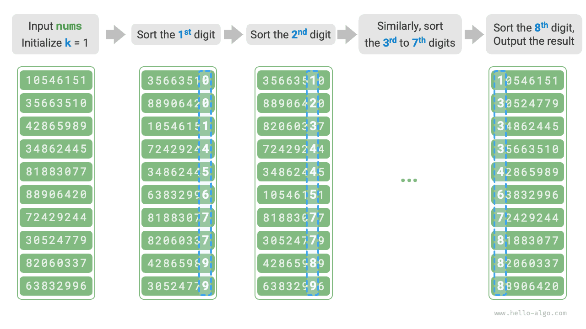

# Sắp xếp cơ số

Phần trước đã giới thiệu sắp xếp đếm, phù hợp khi số lượng phần tử $n$ lớn nhưng khoảng giá trị $m$ nhỏ. Giả sử ta cần sắp xếp $n = 10^6$ mã số sinh viên, mỗi mã là một số 8 chữ số. Khi đó khoảng giá trị $m = 10^8$ rất lớn. Việc sử dụng sắp xếp đếm sẽ đòi hỏi một lượng bộ nhớ lớn, trong khi sắp xếp cơ số tránh được vấn đề này.

<u>Sắp xếp cơ số</u> dựa trên cùng ý tưởng cốt lõi với sắp xếp đếm: nó cũng sắp xếp bằng cách đếm số lần xuất hiện. Dựa trên nền tảng đó, sắp xếp cơ số khai thác mối quan hệ vị trí giữa các chữ số và sắp xếp từng chữ số một để thu được kết quả cuối cùng.

## Luồng giải thuật

Lấy dữ liệu mã số sinh viên làm ví dụ, giả sử chữ số thấp nhất là chữ số thứ $1$ và chữ số cao nhất là chữ số thứ $8$. Luồng của sắp xếp cơ số được minh họa trong hình dưới đây.

1. Khởi tạo chữ số $k = 1$.
2. Thực hiện "sắp xếp đếm" trên chữ số thứ $k$ của các mã số sinh viên. Sau khi hoàn thành, dữ liệu sẽ được sắp xếp từ nhỏ đến lớn theo chữ số thứ $k$.
3. Tăng $k$ lên $1$, sau đó quay lại bước `2.` và tiếp tục lặp cho đến khi tất cả các chữ số đã được sắp xếp, lúc đó quá trình kết thúc.



Tiếp theo, hãy xem đoạn mã. Với một số $x$ ở cơ số $d$, chữ số thứ $k$ của nó, $x_k$, có thể được tính bằng công thức sau:

$$
x_k = \lfloor\frac{x}{d^{k-1}}\rfloor \bmod d
$$

Ở đây, $\lfloor a \rfloor$ biểu thị làm tròn xuống số thực $a$, và $\bmod \: d$ biểu thị lấy phần dư khi chia cho $d$. Đối với dữ liệu mã số sinh viên, $d = 10$ và $k \in [1, 8]$.

Ngoài ra, ta cần chỉnh sửa một chút đoạn mã sắp xếp đếm để nó sắp xếp dựa trên chữ số thứ $k$ của số:

```src
[file]{radix_sort}-[class]{}-[func]{radix_sort}
```

!!! question "Vì sao lại bắt đầu sắp xếp từ chữ số thấp nhất?"

    Trong các lượt sắp xếp liên tiếp, lượt sau sẽ ghi đè kết quả của lượt trước. Ví dụ, nếu lượt đầu tiên cho ra $a < b$ nhưng lượt thứ hai cho ra $a > b$, thì kết quả của lượt thứ hai sẽ được ưu tiên. Vì các chữ số cao có mức ưu tiên cao hơn các chữ số thấp, ta nên sắp xếp các chữ số thấp trước rồi mới đến các chữ số cao.

## Đặc điểm giải thuật

So với sắp xếp đếm, sắp xếp cơ số phù hợp với các khoảng giá trị lớn hơn, **nhưng chỉ khi dữ liệu có thể được biểu diễn bằng một số chữ số cố định và số chữ số đó không quá lớn**. Ví dụ, số thực không phù hợp với sắp xếp cơ số vì số chữ số $k$ có thể quá lớn, tiềm ẩn nguy cơ dẫn đến độ phức tạp thời gian $O(nk) \gg O(n^2)$.

- **Độ phức tạp thời gian $O(nk)$, sắp xếp không thích nghi**: Gọi số lượng phần tử là $n$, gọi các giá trị được biểu diễn ở cơ số $d$, và gọi số chữ số tối đa là $k$. Sắp xếp đếm trên một chữ số mất $O(n + d)$ thời gian, do đó sắp xếp tất cả $k$ chữ số mất $O((n + d)k)$ thời gian. Trong thực tế, $d$ và $k$ thường tương đối nhỏ, nên độ phức tạp thời gian tổng thể tiệm cận $O(n)$.
- **Độ phức tạp không gian $O(n + d)$, sắp xếp không tại chỗ**: Giống như sắp xếp đếm, sắp xếp cơ số cần các mảng phụ trợ `res` và `counter` có độ dài lần lượt là $n$ và $d$.
- **Sắp xếp ổn định**: Khi sắp xếp đếm ổn định, sắp xếp cơ số cũng ổn định; khi sắp xếp đếm không ổn định, sắp xếp cơ số không thể đảm bảo kết quả sắp xếp đúng.
