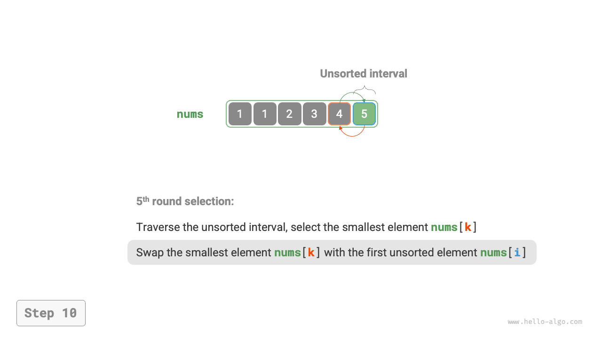

# Sắp xếp chọn

<u>Sắp xếp chọn</u> hoạt động rất đơn giản: ở mỗi vòng lặp, nó chọn ra phần tử nhỏ nhất từ khoảng chưa sắp xếp và đặt phần tử đó vào cuối khoảng đã sắp xếp.

Giả sử mảng có độ dài $n$. Quy trình của sắp xếp chọn được minh họa trong hình dưới đây.

1. Ban đầu, tất cả các phần tử đều chưa được sắp xếp, tức là khoảng (chỉ số) chưa sắp xếp là $[0, n-1]$.
2. Chọn phần tử nhỏ nhất trong khoảng $[0, n-1]$ và hoán đổi nó với phần tử tại chỉ số $0$. Sau khi hoàn thành, phần tử đầu tiên của mảng đã được sắp xếp.
3. Chọn phần tử nhỏ nhất trong khoảng $[1, n-1]$ và hoán đổi nó với phần tử tại chỉ số $1$. Sau khi hoàn thành, 2 phần tử đầu tiên của mảng đã được sắp xếp.
4. Cứ tiếp tục như vậy. Sau $n - 1$ vòng chọn và hoán đổi, $n - 1$ phần tử đầu tiên của mảng đã được sắp xếp.
5. Phần tử duy nhất còn lại chắc chắn là phần tử lớn nhất, nên không cần sắp xếp thêm và mảng đã được sắp xếp xong.

=== "<1>"
    

=== "<2>"
    

=== "<3>"
    

=== "<4>"
    

=== "<5>"
    

=== "<6>"
    

=== "<7>"
    

=== "<8>"
    

=== "<9>"
    

=== "<10>"
    

=== "<11>"
    

Trong đoạn mã, ta dùng $k$ để theo dõi phần tử nhỏ nhất trong khoảng chưa sắp xếp:

```src
[file]{selection_sort}-[class]{}-[func]{selection_sort}
```

## Đặc điểm giải thuật

- **Độ phức tạp thời gian $O(n^2)$, sắp xếp không thích nghi**: Vòng lặp ngoài có tổng cộng $n - 1$ vòng. Độ dài khoảng chưa sắp xếp ở vòng đầu tiên là $n$, và độ dài khoảng chưa sắp xếp ở vòng cuối cùng là $2$. Nghĩa là, các vòng lặp ngoài chứa các vòng lặp trong với $n$, $n - 1$, $\dots$, $3$, và $2$ lần lặp, tổng cộng là $\frac{(n - 1)(n + 2)}{2}$.
- **Độ phức tạp không gian $O(1)$, sắp xếp tại chỗ**: Các con trỏ $i$ và $j$ sử dụng một lượng không gian phụ trợ không đổi.
- **Sắp xếp không ổn định**: Như hình dưới đây cho thấy, phần tử `nums[i]` có thể bị hoán đổi sang bên phải của một phần tử bằng với nó, dẫn đến thay đổi thứ tự tương đối giữa chúng.


