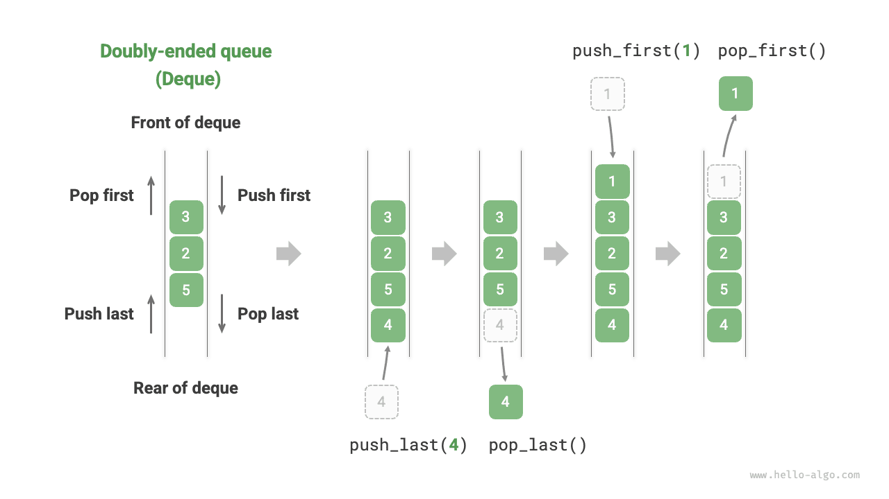
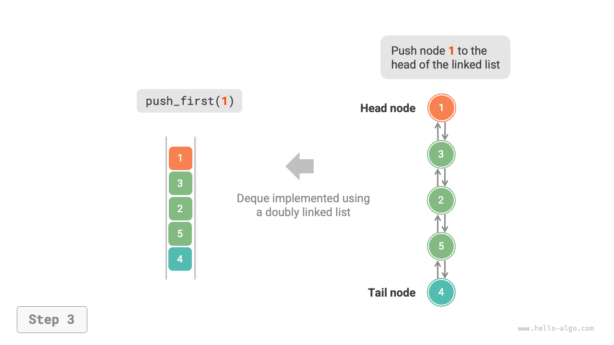
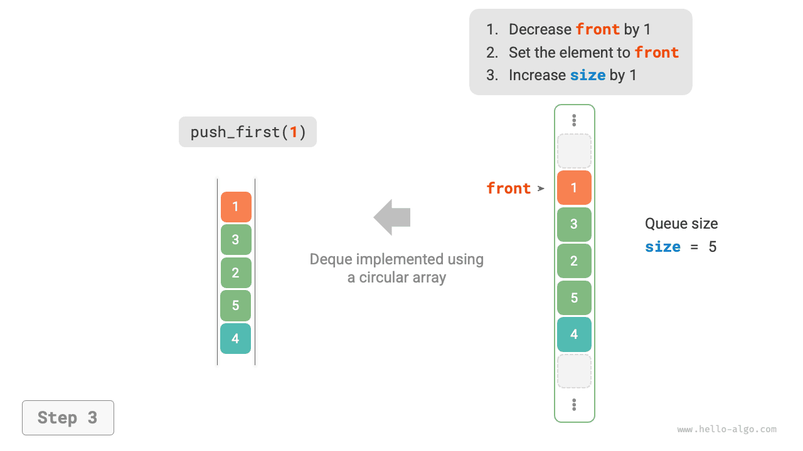

# Hàng đợi hai đầu

Trong hàng đợi thông thường, ta chỉ có thể xóa phần tử ở đầu hoặc thêm phần tử ở cuối. Như hình minh họa dưới đây, <u>hàng đợi hai đầu (deque)</u> mang lại sự linh hoạt hơn, cho phép thêm hoặc xóa phần tử ở cả đầu lẫn cuối.



## Các thao tác thường dùng trên hàng đợi hai đầu

Các thao tác thường dùng trên hàng đợi hai đầu được trình bày trong bảng dưới đây. Tên phương thức cụ thể tùy thuộc vào ngôn ngữ lập trình được sử dụng.

<p align="center"> Bảng <id> &nbsp; Hiệu suất của các thao tác trên hàng đợi hai đầu </p>

| Phương thức     | Mô tả                       | Độ phức tạp thời gian |
| --------------- | ---------------------------- | ---------------------- |
| `push_first()`  | Thêm phần tử vào đầu         | $O(1)$                 |
| `push_last()`   | Thêm phần tử vào cuối        | $O(1)$                 |
| `pop_first()`   | Xóa phần tử ở đầu            | $O(1)$                 |
| `pop_last()`    | Xóa phần tử ở cuối           | $O(1)$                 |
| `peek_first()`  | Truy cập phần tử ở đầu       | $O(1)$                 |
| `peek_last()`   | Truy cập phần tử ở cuối      | $O(1)$                 |

Tương tự, ta có thể trực tiếp sử dụng các lớp hàng đợi hai đầu do ngôn ngữ lập trình cung cấp:

=== "Python"

    ```python title="deque.py"
    from collections import deque

    # Khởi tạo hàng đợi hai đầu
    deq: deque[int] = deque()

    # Thêm phần tử vào hàng đợi
    deq.append(2)      # Thêm vào cuối
    deq.append(5)
    deq.append(4)
    deq.appendleft(3)  # Thêm vào đầu
    deq.appendleft(1)

    # Truy cập phần tử
    front: int = deq[0]  # Phần tử ở đầu
    rear: int = deq[-1]  # Phần tử ở cuối

    # Lấy phần tử ra khỏi hàng đợi
    pop_front: int = deq.popleft()  # Lấy phần tử ở đầu
    pop_rear: int = deq.pop()       # Lấy phần tử ở cuối

    # Lấy độ dài hàng đợi hai đầu
    size: int = len(deq)

    # Kiểm tra hàng đợi hai đầu có rỗng không
    is_empty: bool = len(deq) == 0
    ```

=== "C++"

    ```cpp title="deque.cpp"
    /* Khởi tạo hàng đợi hai đầu */
    deque<int> deque;

    /* Thêm phần tử vào hàng đợi */
    deque.push_back(2);   // Thêm vào cuối
    deque.push_back(5);
    deque.push_back(4);
    deque.push_front(3);  // Thêm vào đầu
    deque.push_front(1);

    /* Truy cập phần tử */
    int front = deque.front(); // Phần tử ở đầu
    int back = deque.back();   // Phần tử ở cuối

    /* Lấy phần tử ra khỏi hàng đợi */
    deque.pop_front();  // Lấy phần tử ở đầu
    deque.pop_back();   // Lấy phần tử ở cuối

    /* Lấy độ dài hàng đợi hai đầu */
    int size = deque.size();

    /* Kiểm tra hàng đợi hai đầu có rỗng không */
    bool empty = deque.empty();
    ```

=== "Java"

    ```java title="deque.java"
    /* Khởi tạo hàng đợi hai đầu */
    Deque<Integer> deque = new LinkedList<>();

    /* Thêm phần tử vào hàng đợi */
    deque.offerLast(2);   // Thêm vào cuối
    deque.offerLast(5);
    deque.offerLast(4);
    deque.offerFirst(3);  // Thêm vào đầu
    deque.offerFirst(1);

    /* Truy cập phần tử */
    int peekFirst = deque.peekFirst();  // Phần tử ở đầu
    int peekLast = deque.peekLast();    // Phần tử ở cuối

    /* Lấy phần tử ra khỏi hàng đợi */
    int popFirst = deque.pollFirst();  // Lấy phần tử ở đầu
    int popLast = deque.pollLast();    // Lấy phần tử ở cuối

    /* Lấy độ dài hàng đợi hai đầu */
    int size = deque.size();

    /* Kiểm tra hàng đợi hai đầu có rỗng không */
    boolean isEmpty = deque.isEmpty();
    ```

=== "C#"

    ```csharp title="deque.cs"
    /* Khởi tạo hàng đợi hai đầu */
    // Trong C#, dùng LinkedList làm hàng đợi hai đầu
    LinkedList<int> deque = new();

    /* Thêm phần tử vào hàng đợi */
    deque.AddLast(2);   // Thêm vào cuối
    deque.AddLast(5);
    deque.AddLast(4);
    deque.AddFirst(3);  // Thêm vào đầu
    deque.AddFirst(1);

    /* Truy cập phần tử */
    int peekFirst = deque.First.Value;  // Phần tử ở đầu
    int peekLast = deque.Last.Value;    // Phần tử ở cuối

    /* Lấy phần tử ra khỏi hàng đợi */
    deque.RemoveFirst();  // Lấy phần tử ở đầu
    deque.RemoveLast();   // Lấy phần tử ở cuối

    /* Lấy độ dài hàng đợi hai đầu */
    int size = deque.Count;

    /* Kiểm tra hàng đợi hai đầu có rỗng không */
    bool isEmpty = deque.Count == 0;
    ```

=== "Go"

    ```go title="deque_test.go"
    /* Khởi tạo hàng đợi hai đầu */
    // Trong Go, dùng list làm hàng đợi hai đầu
    deque := list.New()

    /* Thêm phần tử vào hàng đợi */
    deque.PushBack(2)      // Thêm vào cuối
    deque.PushBack(5)
    deque.PushBack(4)
    deque.PushFront(3)     // Thêm vào đầu
    deque.PushFront(1)

    /* Truy cập phần tử */
    front := deque.Front() // Phần tử ở đầu
    rear := deque.Back()   // Phần tử ở cuối

    /* Lấy phần tử ra khỏi hàng đợi */
    deque.Remove(front)    // Lấy phần tử ở đầu
    deque.Remove(rear)     // Lấy phần tử ở cuối

    /* Lấy độ dài hàng đợi hai đầu */
    size := deque.Len()

    /* Kiểm tra hàng đợi hai đầu có rỗng không */
    isEmpty := deque.Len() == 0
    ```

=== "Swift"

    ```swift title="deque.swift"
    /* Khởi tạo hàng đợi hai đầu */
    // Swift không có lớp hàng đợi hai đầu dựng sẵn, có thể dùng Array làm hàng đợi hai đầu
    var deque: [Int] = []

    /* Thêm phần tử vào hàng đợi */
    deque.append(2) // Thêm vào cuối
    deque.append(5)
    deque.append(4)
    deque.insert(3, at: 0) // Thêm vào đầu
    deque.insert(1, at: 0)

    /* Truy cập phần tử */
    let peekFirst = deque.first! // Phần tử ở đầu
    let peekLast = deque.last! // Phần tử ở cuối

    /* Lấy phần tử ra khỏi hàng đợi */
    // Khi mô phỏng bằng Array, popFirst có độ phức tạp O(n)
    let popFirst = deque.removeFirst() // Lấy phần tử ở đầu
    let popLast = deque.removeLast() // Lấy phần tử ở cuối

    /* Lấy độ dài hàng đợi hai đầu */
    let size = deque.count

    /* Kiểm tra hàng đợi hai đầu có rỗng không */
    let isEmpty = deque.isEmpty
    ```

=== "JS"

    ```javascript title="deque.js"
    /* Khởi tạo hàng đợi hai đầu */
    // JavaScript không có hàng đợi hai đầu dựng sẵn, chỉ có thể dùng Array làm hàng đợi hai đầu
    const deque = [];

    /* Thêm phần tử vào hàng đợi */
    deque.push(2);
    deque.push(5);
    deque.push(4);
    // Lưu ý vì đây là mảng nên unshift() có độ phức tạp thời gian O(n)
    deque.unshift(3);
    deque.unshift(1);

    /* Truy cập phần tử */
    const peekFirst = deque[0];
    const peekLast = deque[deque.length - 1];

    /* Lấy phần tử ra khỏi hàng đợi */
    // Lưu ý vì đây là mảng nên shift() có độ phức tạp thời gian O(n)
    const popFront = deque.shift();
    const popBack = deque.pop();

    /* Lấy độ dài hàng đợi hai đầu */
    const size = deque.length;

    /* Kiểm tra hàng đợi hai đầu có rỗng không */
    const isEmpty = size === 0;
    ```

=== "TS"

    ```typescript title="deque.ts"
    /* Khởi tạo hàng đợi hai đầu */
    // TypeScript không có hàng đợi hai đầu dựng sẵn, chỉ có thể dùng Array làm hàng đợi hai đầu
    const deque: number[] = [];

    /* Thêm phần tử vào hàng đợi */
    deque.push(2);
    deque.push(5);
    deque.push(4);
    // Lưu ý vì đây là mảng nên unshift() có độ phức tạp thời gian O(n)
    deque.unshift(3);
    deque.unshift(1);

    /* Truy cập phần tử */
    const peekFirst: number = deque[0];
    const peekLast: number = deque[deque.length - 1];

    /* Lấy phần tử ra khỏi hàng đợi */
    // Lưu ý vì đây là mảng nên shift() có độ phức tạp thời gian O(n)
    const popFront: number = deque.shift() as number;
    const popBack: number = deque.pop() as number;

    /* Lấy độ dài hàng đợi hai đầu */
    const size: number = deque.length;

    /* Kiểm tra hàng đợi hai đầu có rỗng không */
    const isEmpty: boolean = size === 0;
    ```

=== "Dart"

    ```dart title="deque.dart"
    /* Khởi tạo hàng đợi hai đầu */
    // Trong Dart, Queue được định nghĩa là hàng đợi hai đầu
    Queue<int> deque = Queue<int>();

    /* Thêm phần tử vào hàng đợi */
    deque.addLast(2);  // Thêm vào cuối
    deque.addLast(5);
    deque.addLast(4);
    deque.addFirst(3); // Thêm vào đầu
    deque.addFirst(1);

    /* Truy cập phần tử */
    int peekFirst = deque.first; // Phần tử ở đầu
    int peekLast = deque.last;   // Phần tử ở cuối

    /* Lấy phần tử ra khỏi hàng đợi */
    int popFirst = deque.removeFirst(); // Lấy phần tử ở đầu
    int popLast = deque.removeLast();   // Lấy phần tử ở cuối

    /* Lấy độ dài hàng đợi hai đầu */
    int size = deque.length;

    /* Kiểm tra hàng đợi hai đầu có rỗng không */
    bool isEmpty = deque.isEmpty;
    ```

=== "Rust"

    ```rust title="deque.rs"
    /* Khởi tạo hàng đợi hai đầu */
    let mut deque: VecDeque<u32> = VecDeque::new();

    /* Thêm phần tử vào hàng đợi */
    deque.push_back(2);  // Thêm vào cuối
    deque.push_back(5);
    deque.push_back(4);
    deque.push_front(3); // Thêm vào đầu
    deque.push_front(1);

    /* Truy cập phần tử */
    if let Some(front) = deque.front() { // Phần tử ở đầu
    }
    if let Some(rear) = deque.back() {   // Phần tử ở cuối
    }

    /* Lấy phần tử ra khỏi hàng đợi */
    if let Some(pop_front) = deque.pop_front() { // Lấy phần tử ở đầu
    }
    if let Some(pop_rear) = deque.pop_back() {   // Lấy phần tử ở cuối
    }

    /* Lấy độ dài hàng đợi hai đầu */
    let size = deque.len();

    /* Kiểm tra hàng đợi hai đầu có rỗng không */
    let is_empty = deque.is_empty();
    ```

=== "C"

    ```c title="deque.c"
    // C không cung cấp hàng đợi hai đầu dựng sẵn
    ```

=== "Kotlin"

    ```kotlin title="deque.kt"
    /* Khởi tạo hàng đợi hai đầu */
    val deque = LinkedList<Int>()

    /* Thêm phần tử vào hàng đợi */
    deque.offerLast(2)  // Thêm vào cuối
    deque.offerLast(5)
    deque.offerLast(4)
    deque.offerFirst(3) // Thêm vào đầu
    deque.offerFirst(1)

    /* Truy cập phần tử */
    val peekFirst = deque.peekFirst() // Phần tử ở đầu
    val peekLast = deque.peekLast()   // Phần tử ở cuối

    /* Lấy phần tử ra khỏi hàng đợi */
    val popFirst = deque.pollFirst() // Lấy phần tử ở đầu
    val popLast = deque.pollLast()   // Lấy phần tử ở cuối

    /* Lấy độ dài hàng đợi hai đầu */
    val size = deque.size

    /* Kiểm tra hàng đợi hai đầu có rỗng không */
    val isEmpty = deque.isEmpty()
    ```

=== "Ruby"

    ```ruby title="deque.rb"
    # Khởi tạo hàng đợi hai đầu
    # Ruby không có hàng đợi hai đầu dựng sẵn, chỉ có thể dùng Array làm hàng đợi hai đầu
    deque = []

    # Thêm phần tử vào hàng đợi
    deque << 2
    deque << 5
    deque << 4
    # Lưu ý vì đây là mảng nên Array#unshift có độ phức tạp thời gian O(n)
    deque.unshift(3)
    deque.unshift(1)

    # Truy cập phần tử
    peek_first = deque.first
    peek_last = deque.last

    # Lấy phần tử ra khỏi hàng đợi
    # Lưu ý vì đây là mảng nên Array#shift có độ phức tạp thời gian O(n)
    pop_front = deque.shift
    pop_back = deque.pop

    # Lấy độ dài hàng đợi hai đầu
    size = deque.length

    # Kiểm tra hàng đợi hai đầu có rỗng không
    is_empty = size.zero?
    ```

??? pythontutor "Minh họa mã nguồn"

    https://pythontutor.com/render.html#code=from%20collections%20import%20deque%0A%0A%22%22%22Driver%20Code%22%22%22%0Aif%20__name__%20%3D%3D%20%22__main__%22%3A%0A%20%20%20%20%23%20%E5%88%9D%E5%A7%8B%E5%8C%96%E5%8F%8C%E5%90%91%E9%98%9F%E5%88%97%0A%20%20%20%20deq%20%3D%20deque%28%29%0A%0A%20%20%20%20%23%20%E5%85%83%E7%B4%A0%E5%85%A5%E9%98%9F%0A%20%20%20%20deq.append%282%29%20%20%23%20%E6%B7%BB%E5%8A%A0%E8%87%B3%E9%98%9F%E5%B0%BE%0A%20%20%20%20deq.append%285%29%0A%20%20%20%20deq.append%284%29%0A%20%20%20%20deq.appendleft%283%29%20%20%23%20%E6%B7%BB%E5%8A%A0%E8%87%B3%E9%98%9F%E9%A6%96%0A%20%20%20%20deq.appendleft%281%29%0A%20%20%20%20print%28%22%E5%8F%8C%E5%90%91%E9%98%9F%E5%88%97%20deque%20%3D%22,%20deq%29%0A%0A%20%20%20%20%23%20%E8%AE%BF%E9%97%AE%E5%85%83%E7%B4%A0%0A%20%20%20%20front%20%3D%20deq%5B0%5D%20%20%23%20%E9%98%9F%E9%A6%96%E5%85%83%E7%B4%A0%0A%20%20%20%20print%28%22%E9%98%9F%E9%A6%96%E5%85%83%E7%B4%A0%20front%20%3D%22,%20front%29%0A%20%20%20%20rear%20%3D%20deq%5B-1%5D%20%20%23%20%E9%98%9F%E5%B0%BE%E5%85%83%E7%B4%A0%0A%20%20%20%20print%28%22%E9%98%9F%E5%B0%BE%E5%85%83%E7%B4%A0%20rear%20%3D%22,%20rear%29%0A%0A%20%20%20%20%23%20%E5%85%83%E7%B4%A0%E5%87%BA%E9%98%9F%0A%20%20%20%20pop_front%20%3D%20deq.popleft%28%29%20%20%23%20%E9%98%9F%E9%A6%96%E5%85%83%E7%B4%A0%E5%87%BA%E9%98%9F%0A%20%20%20%20print%28%22%E9%98%9F%E9%A6%96%E5%87%BA%E9%98%9F%E5%85%83%E7%B4%A0%20%20pop_front%20%3D%22,%20pop_front%29%0A%20%20%20%20print%28%22%E9%98%9F%E9%A6%96%E5%87%BA%E9%98%9F%E5%90%8E%20deque%20%3D%22,%20deq%29%0A%20%20%20%20pop_rear%20%3D%20deq.pop%28%29%20%20%23%20%E9%98%9F%E5%B0%BE%E5%85%83%E7%B4%A0%E5%87%BA%E9%98%9F%0A%20%20%20%20print%28%22%E9%98%9F%E5%B0%BE%E5%87%BA%E9%98%9F%E5%85%83%E7%B4%A0%20%20pop_rear%20%3D%22,%20pop_rear%29%0A%20%20%20%20print%28%22%E9%98%9F%E5%B0%BE%E5%87%BA%E9%98%9F%E5%90%8E%20deque%20%3D%22,%20deq%29%0A%0A%20%20%20%20%23%20%E8%8E%B7%E5%8F%96%E5%8F%8C%E5%90%91%E9%98%9F%E5%88%97%E7%9A%84%E9%95%BF%E5%BA%A6%0A%20%20%20%20size%20%3D%20len%28deq%29%0A%20%20%20%20print%28%22%E5%8F%8C%E5%90%91%E9%98%9F%E5%88%97%E9%95%BF%E5%BA%A6%20size%20%3D%22,%20size%29%0A%0A%20%20%20%20%23%20%E5%88%A4%E6%96%AD%E5%8F%8C%E5%90%91%E9%98%9F%E5%88%97%E6%98%AF%E5%90%A6%E4%B8%BA%E7%A9%BA%0A%20%20%20%20is_empty%20%3D%20len%28deq%29%20%3D%3D%200%0A%20%20%20%20print%28%22%E5%8F%8C%E5%90%91%E9%98%9F%E5%88%97%E6%98%AF%E5%90%A6%E4%B8%BA%E7%A9%BA%20%3D%22,%20is_empty%29&cumulative=false&curInstr=3&heapPrimitives=nevernest&mode=display&origin=opt-frontend.js&py=311&rawInputLstJSON=%5B%5D&textReferences=false

## Triển khai hàng đợi hai đầu *

Việc triển khai hàng đợi hai đầu tương tự như hàng đợi thông thường. Bạn có thể chọn danh sách liên kết hoặc mảng làm cấu trúc dữ liệu nền.

### Triển khai bằng danh sách liên kết đôi

Nhìn lại phần trước, ta đã dùng danh sách liên kết đơn thông thường để triển khai hàng đợi vì nó cho phép xóa nút đầu (tương ứng với lấy ra khỏi hàng đợi) và thêm nút mới sau nút cuối (tương ứng với thêm vào hàng đợi) một cách thuận tiện.

Đối với hàng đợi hai đầu, cả đầu và cuối đều có thể thực hiện thao tác thêm vào và lấy ra. Nói cách khác, hàng đợi hai đầu cần triển khai thêm các thao tác theo chiều ngược lại. Vì lý do này, ta dùng "danh sách liên kết đôi" (doubly linked list) làm cấu trúc dữ liệu nền cho hàng đợi hai đầu.

Như hình minh họa dưới đây, ta coi nút đầu và nút cuối của danh sách liên kết đôi lần lượt là đầu và cuối của hàng đợi hai đầu, triển khai chức năng thêm và xóa nút ở cả hai đầu.

=== "<1>"
    

=== "<2>"
    

=== "<3>"
    

=== "<4>"
    

=== "<5>"
    

Đoạn mã triển khai được thể hiện dưới đây:

```src
[file]{linkedlist_deque}-[class]{linked_list_deque}-[func]{}
```

### Triển khai bằng mảng

Như hình minh họa dưới đây, tương tự như triển khai hàng đợi dựa trên mảng, ta cũng có thể dùng mảng vòng để triển khai hàng đợi hai đầu.

=== "<1>"
    

=== "<2>"
    

=== "<3>"
    

=== "<4>"
    

=== "<5>"
    

Dựa trên cách triển khai hàng đợi, ta chỉ cần thêm các phương thức "thêm vào đầu" và "lấy ra khỏi cuối":

```src
[file]{array_deque}-[class]{array_deque}-[func]{}
```

## Ứng dụng của hàng đợi hai đầu

Hàng đợi hai đầu kết hợp logic của cả ngăn xếp và hàng đợi. **Do đó, nó có thể triển khai tất cả các kịch bản ứng dụng của cả hai, đồng thời mang lại sự linh hoạt cao hơn**.

Ta biết rằng chức năng "hoàn tác" trong phần mềm thường được triển khai bằng ngăn xếp: hệ thống đẩy mỗi thao tác thay đổi vào ngăn xếp, sau đó thực hiện hoàn tác thông qua lấy ra khỏi ngăn xếp. Tuy nhiên, do giới hạn tài nguyên hệ thống, phần mềm thường giới hạn số bước hoàn tác (ví dụ chỉ cho phép lưu tối đa 50 bước). Khi độ dài ngăn xếp vượt quá 50, phần mềm cần thực hiện thao tác xóa ở đáy ngăn xếp (đầu hàng đợi). **Nhưng ngăn xếp không thể thực hiện chức năng này, nên cần dùng hàng đợi hai đầu để thay thế ngăn xếp**. Lưu ý rằng logic cốt lõi của "hoàn tác" vẫn tuân theo nguyên tắc LIFO của ngăn xếp; chỉ là hàng đợi hai đầu có thể triển khai một số logic bổ sung một cách linh hoạt hơn.
