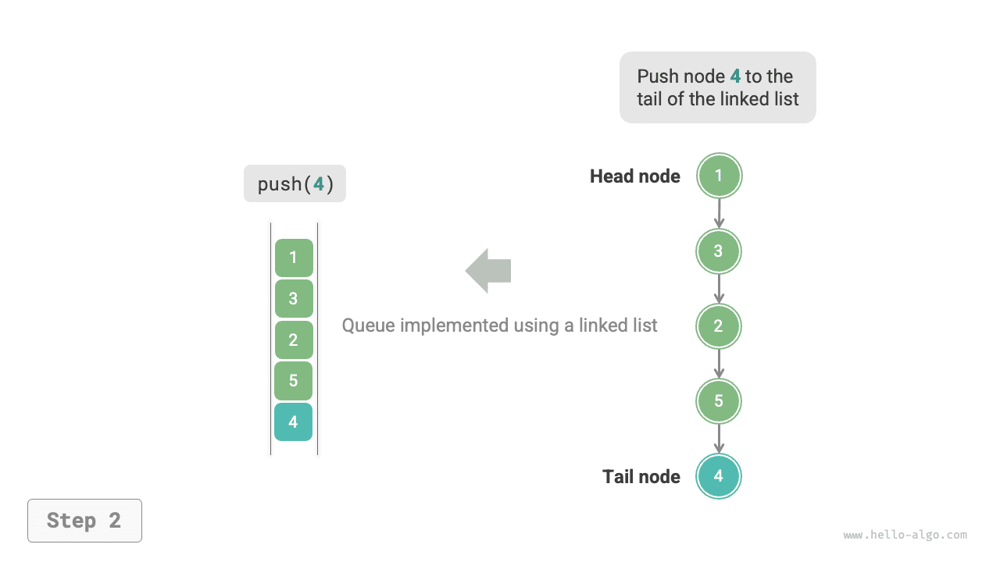
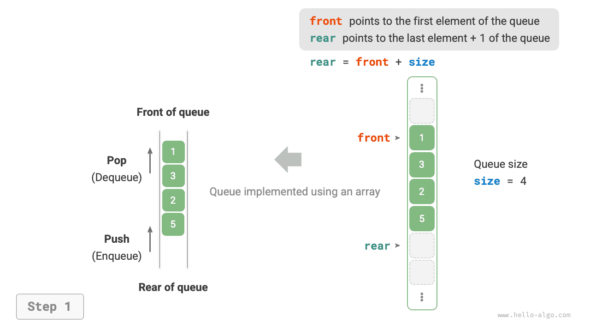
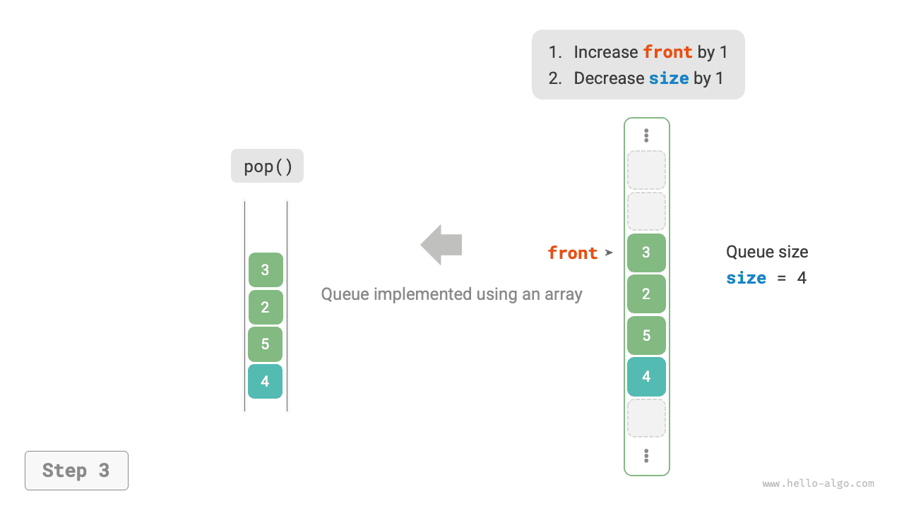

# Hàng đợi

<u>Hàng đợi (queue)</u> là một cấu trúc dữ liệu tuyến tính tuân theo nguyên tắc vào trước ra trước (FIFO - First In, First Out). Đúng như tên gọi, nó mô phỏng cảnh mọi người xếp hàng: người mới liên tục gia nhập ở cuối hàng, trong khi những người ở đầu hàng lần lượt rời đi.

Như hình minh họa dưới đây, ta gọi đầu của hàng đợi là "đầu hàng đợi" (front) và cuối là "cuối hàng đợi" (rear). Thao tác thêm một phần tử vào cuối được gọi là "thêm vào hàng đợi" (enqueue), còn thao tác lấy phần tử ở đầu ra được gọi là "lấy ra khỏi hàng đợi" (dequeue).


## Các thao tác thường dùng trên hàng đợi

Các thao tác thường dùng trên hàng đợi được trình bày trong bảng dưới đây. Lưu ý rằng tên phương thức có thể khác nhau tùy theo ngôn ngữ lập trình. Ở đây, ta sử dụng quy ước đặt tên giống như đối với ngăn xếp.

<p align="center"> Bảng <id> &nbsp; Hiệu suất của các thao tác trên hàng đợi </p>

| Phương thức | Mô tả                                        | Độ phức tạp thời gian |
| ----------- | --------------------------------------------- | ---------------------- |
| `push()`    | Thêm phần tử vào hàng đợi, thêm vào cuối      | $O(1)$                 |
| `pop()`     | Lấy phần tử ở đầu ra khỏi hàng đợi            | $O(1)$                 |
| `peek()`    | Truy cập phần tử ở đầu                        | $O(1)$                 |

Ta có thể trực tiếp sử dụng các lớp hàng đợi do ngôn ngữ lập trình cung cấp:

=== "Python"

    ```python title="queue.py"
    from collections import deque

    # Khởi tạo hàng đợi
    # Trong Python, ta thường dùng lớp deque làm hàng đợi
    # Mặc dù queue.Queue() là một lớp hàng đợi thuần túy, nhưng không thân thiện lắm để sử dụng nên không được khuyến khích
    que: deque[int] = deque()

    # Thêm phần tử vào hàng đợi
    que.append(1)
    que.append(3)
    que.append(2)
    que.append(5)
    que.append(4)

    # Truy cập phần tử ở đầu
    front: int = que[0]

    # Lấy phần tử ra khỏi hàng đợi
    pop: int = que.popleft()

    # Lấy độ dài hàng đợi
    size: int = len(que)

    # Kiểm tra hàng đợi có rỗng không
    is_empty: bool = len(que) == 0
    ```

=== "C++"

    ```cpp title="queue.cpp"
    /* Khởi tạo hàng đợi */
    queue<int> queue;

    /* Thêm phần tử vào hàng đợi */
    queue.push(1);
    queue.push(3);
    queue.push(2);
    queue.push(5);
    queue.push(4);

    /* Truy cập phần tử ở đầu */
    int front = queue.front();

    /* Lấy phần tử ra khỏi hàng đợi */
    queue.pop();

    /* Lấy độ dài hàng đợi */
    int size = queue.size();

    /* Kiểm tra hàng đợi có rỗng không */
    bool empty = queue.empty();
    ```

=== "Java"

    ```java title="queue.java"
    /* Khởi tạo hàng đợi */
    Queue<Integer> queue = new LinkedList<>();

    /* Thêm phần tử vào hàng đợi */
    queue.offer(1);
    queue.offer(3);
    queue.offer(2);
    queue.offer(5);
    queue.offer(4);

    /* Truy cập phần tử ở đầu */
    int peek = queue.peek();

    /* Lấy phần tử ra khỏi hàng đợi */
    int pop = queue.poll();

    /* Lấy độ dài hàng đợi */
    int size = queue.size();

    /* Kiểm tra hàng đợi có rỗng không */
    boolean isEmpty = queue.isEmpty();
    ```

=== "C#"

    ```csharp title="queue.cs"
    /* Khởi tạo hàng đợi */
    Queue<int> queue = new();

    /* Thêm phần tử vào hàng đợi */
    queue.Enqueue(1);
    queue.Enqueue(3);
    queue.Enqueue(2);
    queue.Enqueue(5);
    queue.Enqueue(4);

    /* Truy cập phần tử ở đầu */
    int peek = queue.Peek();

    /* Lấy phần tử ra khỏi hàng đợi */
    int pop = queue.Dequeue();

    /* Lấy độ dài hàng đợi */
    int size = queue.Count;

    /* Kiểm tra hàng đợi có rỗng không */
    bool isEmpty = queue.Count == 0;
    ```

=== "Go"

    ```go title="queue_test.go"
    /* Khởi tạo hàng đợi */
    // Trong Go, dùng list làm hàng đợi
    queue := list.New()

    /* Thêm phần tử vào hàng đợi */
    queue.PushBack(1)
    queue.PushBack(3)
    queue.PushBack(2)
    queue.PushBack(5)
    queue.PushBack(4)

    /* Truy cập phần tử ở đầu */
    peek := queue.Front()

    /* Lấy phần tử ra khỏi hàng đợi */
    pop := queue.Front()
    queue.Remove(pop)

    /* Lấy độ dài hàng đợi */
    size := queue.Len()

    /* Kiểm tra hàng đợi có rỗng không */
    isEmpty := queue.Len() == 0
    ```

=== "Swift"

    ```swift title="queue.swift"
    /* Khởi tạo hàng đợi */
    // Swift không có lớp hàng đợi dựng sẵn, có thể dùng Array làm hàng đợi
    var queue: [Int] = []

    /* Thêm phần tử vào hàng đợi */
    queue.append(1)
    queue.append(3)
    queue.append(2)
    queue.append(5)
    queue.append(4)

    /* Truy cập phần tử ở đầu */
    let peek = queue.first!

    /* Lấy phần tử ra khỏi hàng đợi */
    // Vì đây là mảng nên removeFirst có độ phức tạp O(n)
    let pool = queue.removeFirst()

    /* Lấy độ dài hàng đợi */
    let size = queue.count

    /* Kiểm tra hàng đợi có rỗng không */
    let isEmpty = queue.isEmpty
    ```

=== "JS"

    ```javascript title="queue.js"
    /* Khởi tạo hàng đợi */
    // JavaScript không có hàng đợi dựng sẵn, có thể dùng Array làm hàng đợi
    const queue = [];

    /* Thêm phần tử vào hàng đợi */
    queue.push(1);
    queue.push(3);
    queue.push(2);
    queue.push(5);
    queue.push(4);

    /* Truy cập phần tử ở đầu */
    const peek = queue[0];

    /* Lấy phần tử ra khỏi hàng đợi */
    // Cấu trúc bên dưới là mảng nên shift() có độ phức tạp thời gian O(n)
    const pop = queue.shift();

    /* Lấy độ dài hàng đợi */
    const size = queue.length;

    /* Kiểm tra hàng đợi có rỗng không */
    const empty = queue.length === 0;
    ```

=== "TS"

    ```typescript title="queue.ts"
    /* Khởi tạo hàng đợi */
    // TypeScript không có hàng đợi dựng sẵn, có thể dùng Array làm hàng đợi
    const queue: number[] = [];

    /* Thêm phần tử vào hàng đợi */
    queue.push(1);
    queue.push(3);
    queue.push(2);
    queue.push(5);
    queue.push(4);

    /* Truy cập phần tử ở đầu */
    const peek = queue[0];

    /* Lấy phần tử ra khỏi hàng đợi */
    // Cấu trúc bên dưới là mảng nên shift() có độ phức tạp thời gian O(n)
    const pop = queue.shift();

    /* Lấy độ dài hàng đợi */
    const size = queue.length;

    /* Kiểm tra hàng đợi có rỗng không */
    const empty = queue.length === 0;
    ```

=== "Dart"

    ```dart title="queue.dart"
    /* Khởi tạo hàng đợi */
    // Trong Dart, lớp Queue là hàng đợi hai đầu và cũng có thể dùng làm hàng đợi thông thường
    Queue<int> queue = Queue();

    /* Thêm phần tử vào hàng đợi */
    queue.add(1);
    queue.add(3);
    queue.add(2);
    queue.add(5);
    queue.add(4);

    /* Truy cập phần tử ở đầu */
    int peek = queue.first;

    /* Lấy phần tử ra khỏi hàng đợi */
    int pop = queue.removeFirst();

    /* Lấy độ dài hàng đợi */
    int size = queue.length;

    /* Kiểm tra hàng đợi có rỗng không */
    bool isEmpty = queue.isEmpty;
    ```

=== "Rust"

    ```rust title="queue.rs"
    /* Khởi tạo hàng đợi hai đầu */
    // Trong Rust, dùng deque làm hàng đợi thông thường
    let mut deque: VecDeque<u32> = VecDeque::new();

    /* Thêm phần tử vào hàng đợi */
    deque.push_back(1);
    deque.push_back(3);
    deque.push_back(2);
    deque.push_back(5);
    deque.push_back(4);

    /* Truy cập phần tử ở đầu */
    if let Some(front) = deque.front() {
    }

    /* Lấy phần tử ra khỏi hàng đợi */
    if let Some(pop) = deque.pop_front() {
    }

    /* Lấy độ dài hàng đợi */
    let size = deque.len();

    /* Kiểm tra hàng đợi có rỗng không */
    let is_empty = deque.is_empty();
    ```

=== "C"

    ```c title="queue.c"
    // C không cung cấp hàng đợi dựng sẵn
    ```

=== "Kotlin"

    ```kotlin title="queue.kt"
    /* Khởi tạo hàng đợi */
    val queue = LinkedList<Int>()

    /* Thêm phần tử vào hàng đợi */
    queue.offer(1)
    queue.offer(3)
    queue.offer(2)
    queue.offer(5)
    queue.offer(4)

    /* Truy cập phần tử ở đầu */
    val peek = queue.peek()

    /* Lấy phần tử ra khỏi hàng đợi */
    val pop = queue.poll()

    /* Lấy độ dài hàng đợi */
    val size = queue.size

    /* Kiểm tra hàng đợi có rỗng không */
    val isEmpty = queue.isEmpty()
    ```

=== "Ruby"

    ```ruby title="queue.rb"
    # Khởi tạo hàng đợi
    # Hàng đợi dựng sẵn của Ruby (Thread::Queue) không có phương thức peek và duyệt, có thể dùng Array làm hàng đợi
    queue = []

    # Thêm phần tử vào hàng đợi
    queue.push(1)
    queue.push(3)
    queue.push(2)
    queue.push(5)
    queue.push(4)

    # Truy cập phần tử ở đầu
    peek = queue.first

    # Lấy phần tử ra khỏi hàng đợi
    # Lưu ý vì đây là mảng nên Array#shift có độ phức tạp thời gian O(n)
    pop = queue.shift

    # Lấy độ dài hàng đợi
    size = queue.length

    # Kiểm tra hàng đợi có rỗng không
    is_empty = queue.empty?
    ```

??? pythontutor "Minh họa mã nguồn"

    https://pythontutor.com/render.html#code=from%20collections%20import%20deque%0A%0A%22%22%22Driver%20Code%22%22%22%0Aif%20__name__%20%3D%3D%20%22__main__%22%3A%0A%20%20%20%20%23%20%E5%88%9D%E5%A7%8B%E5%8C%96%E9%98%9F%E5%88%97%0A%20%20%20%20%23%20%E5%9C%A8%20Python%20%E4%B8%AD%EF%BC%8C%E6%88%91%E4%BB%AC%E4%B8%80%E8%88%AC%E5%B0%86%E5%8F%8C%E5%90%91%E9%98%9F%E5%88%97%E7%B1%BB%20deque%20%E7%9C%8B%E4%BD%9C%E9%98%9F%E5%88%97%E4%BD%BF%E7%94%A8%0A%20%20%20%20%23%20%E8%99%BD%E7%84%B6%20queue.Queue%28%29%20%E6%98%AF%E7%BA%AF%E6%AD%A3%E7%9A%84%E9%98%9F%E5%88%97%E7%B1%BB%EF%BC%8C%E4%BD%86%E4%B8%8D%E5%A4%AA%E5%A5%BD%E7%94%A8%0A%20%20%20%20que%20%3D%20deque%28%29%0A%0A%20%20%20%20%23%20%E5%85%83%E7%B4%A0%E5%85%A5%E9%98%9F%0A%20%20%20%20que.append%281%29%0A%20%20%20%20que.append%283%29%0A%20%20%20%20que.append%282%29%0A%20%20%20%20que.append%285%29%0A%20%20%20%20que.append%284%29%0A%20%20%20%20print%28%22%E9%98%9F%E5%88%97%20que%20%3D%22,%20que%29%0A%0A%20%20%20%20%23%20%E8%AE%BF%E9%97%AE%E9%98%9F%E9%A6%96%E5%85%83%E7%B4%A0%0A%20%20%20%20front%20%3D%20que%5B0%5D%0A%20%20%20%20print%28%22%E9%98%9F%E9%A6%96%E5%85%83%E7%B4%A0%20front%20%3D%22,%20front%29%0A%0A%20%20%20%20%23%20%E5%85%83%E7%B4%A0%E5%87%BA%E9%98%9F%0A%20%20%20%20pop%20%3D%20que.popleft%28%29%0A%20%20%20%20print%28%22%E5%87%BA%E9%98%9F%E5%85%83%E7%B4%A0%20pop%20%3D%22,%20pop%29%0A%20%20%20%20print%28%22%E5%87%BA%E9%98%9F%E5%90%8E%20que%20%3D%22,%20que%29%0A%0A%20%20%20%20%23%20%E8%8E%B7%E5%8F%96%E9%98%9F%E5%88%97%E7%9A%84%E9%95%BF%E5%BA%A6%0A%20%20%20%20size%20%3D%20len%28que%29%0A%20%20%20%20print%28%22%E9%98%9F%E5%88%97%E9%95%BF%E5%BA%A6%20size%20%3D%22,%20size%29%0A%0A%20%20%20%20%23%20%E5%88%A4%E6%96%AD%E9%98%9F%E5%88%97%E6%98%AF%E5%90%A6%E4%B8%BA%E7%A9%BA%0A%20%20%20%20is_empty%20%3D%20len%28que%29%20%3D%3D%200%0A%20%20%20%20print%28%22%E9%98%9F%E5%88%97%E6%98%AF%E5%90%A6%E4%B8%BA%E7%A9%BA%20%3D%22,%20is_empty%29&cumulative=false&curInstr=3&heapPrimitives=nevernest&mode=display&origin=opt-frontend.js&py=311&rawInputLstJSON=%5B%5D&textReferences=false

## Triển khai hàng đợi

Để triển khai một hàng đợi, ta cần một cấu trúc dữ liệu cho phép thêm phần tử ở một đầu và xóa phần tử ở đầu kia. Cả danh sách liên kết và mảng đều đáp ứng yêu cầu này.

### Triển khai bằng danh sách liên kết

Như hình minh họa dưới đây, ta có thể coi "nút đầu" và "nút cuối" của danh sách liên kết lần lượt là "đầu hàng đợi" và "cuối hàng đợi", với quy tắc rằng chỉ được thêm nút ở cuối và xóa nút ở đầu.

=== "<1>"
    

=== "<2>"
    

=== "<3>"
    

Dưới đây là đoạn mã triển khai hàng đợi bằng danh sách liên kết:

```src
[file]{linkedlist_queue}-[class]{linked_list_queue}-[func]{}
```

### Triển khai bằng mảng

Việc xóa phần tử đầu tiên trong mảng có độ phức tạp thời gian là $O(n)$, điều này sẽ khiến thao tác lấy ra khỏi hàng đợi kém hiệu quả. Tuy nhiên, ta có thể dùng phương pháp khéo léo sau đây để tránh vấn đề này.

Ta có thể dùng một biến `front` để trỏ đến chỉ số của phần tử đầu hàng đợi, đồng thời duy trì một biến `size` để ghi lại độ dài hàng đợi. Ta định nghĩa `rear = front + size`, giá trị này tính ra vị trí ngay sau phần tử cuối hàng đợi.

Dựa trên thiết kế này, **khoảng hợp lệ chứa các phần tử trong mảng là `[front, rear - 1]`**. Cách triển khai các thao tác được minh họa trong hình dưới đây:

- Thao tác thêm vào hàng đợi: Gán phần tử đầu vào cho chỉ số `rear` và tăng `size` lên 1.
- Thao tác lấy ra khỏi hàng đợi: Chỉ cần tăng `front` lên 1 và giảm `size` đi 1.

Như ta thấy, cả thao tác thêm vào và lấy ra khỏi hàng đợi đều chỉ cần một phép toán, với độ phức tạp thời gian $O(1)$.

=== "<1>"
    

=== "<2>"
    

=== "<3>"
    

Bạn có thể nhận thấy một vấn đề: khi ta liên tục thêm vào và lấy ra khỏi hàng đợi, cả `front` và `rear` đều di chuyển sang phải. **Khi chúng đến cuối mảng, chúng không thể tiếp tục di chuyển được nữa**. Để giải quyết vấn đề này, ta có thể coi mảng như một "mảng vòng" (circular array) với đầu và cuối được nối với nhau.

Đối với mảng vòng, ta cần để `front` hoặc `rear` quay vòng lại đầu mảng khi chúng vượt qua điểm cuối. Quy luật tuần hoàn này có thể được triển khai bằng "phép toán chia lấy dư," như trong đoạn mã dưới đây:

```src
[file]{array_queue}-[class]{array_queue}-[func]{}
```

Hàng đợi được triển khai ở trên vẫn còn hạn chế: độ dài của nó là cố định. Tuy nhiên, vấn đề này không khó giải quyết. Ta có thể thay mảng bằng mảng động để đưa vào cơ chế mở rộng. Bạn đọc quan tâm có thể tự mình thử triển khai điều này.

Kết luận so sánh giữa hai cách triển khai này tương tự như đối với ngăn xếp nên sẽ không nhắc lại ở đây.

## Các ứng dụng điển hình của hàng đợi

- **Đơn hàng Taobao**. Sau khi người mua đặt hàng, các đơn hàng được thêm vào một hàng đợi, và hệ thống sau đó xử lý các đơn hàng trong hàng đợi theo đúng thứ tự của chúng. Trong dịp Song Thập Nhất (11/11), một lượng lớn đơn hàng được tạo ra trong thời gian ngắn, và tính đồng thời cao trở thành thách thức then chốt mà các kỹ sư cần giải quyết.
- **Các tác vụ chờ xử lý khác nhau**. Bất kỳ tình huống nào cần triển khai chức năng "đến trước được phục vụ trước," chẳng hạn như hàng đợi tác vụ của máy in hay hàng đợi đặt món của nhà hàng, đều có thể duy trì hiệu quả thứ tự xử lý bằng cách sử dụng hàng đợi.
