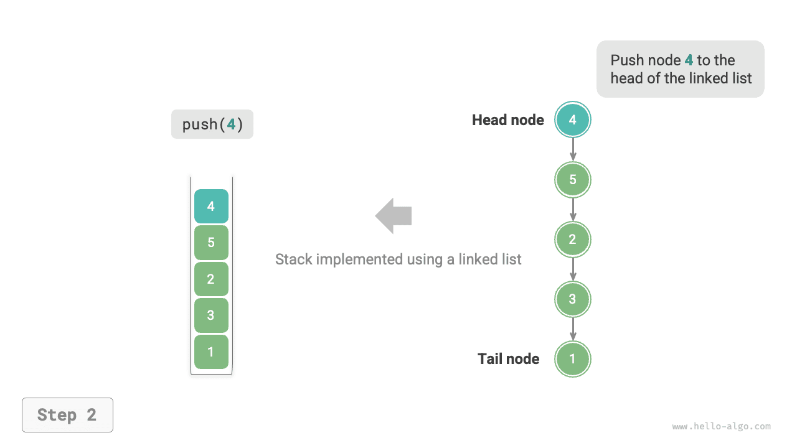
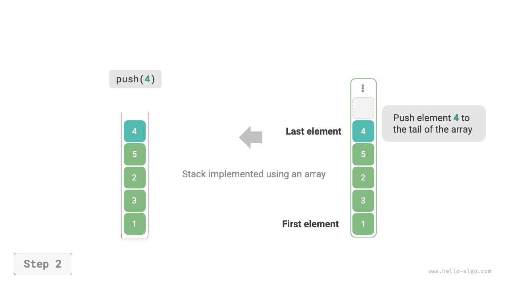
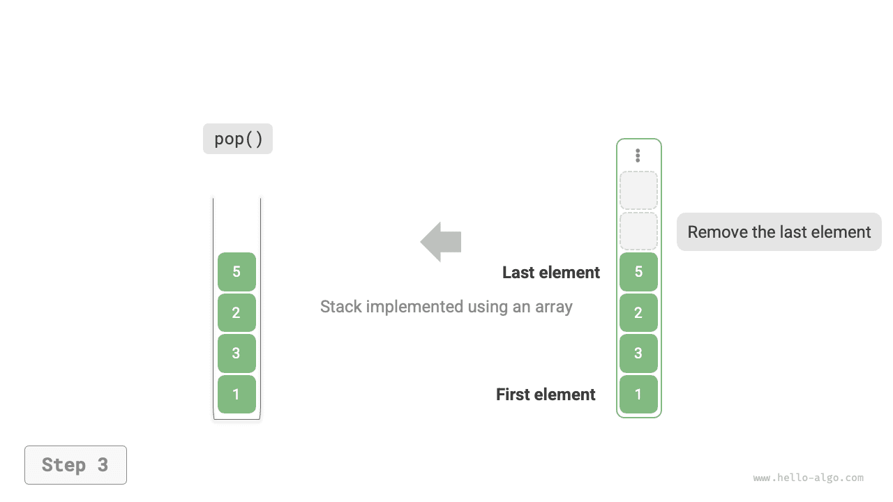

# Ngăn xếp

<u>Ngăn xếp (stack)</u> là một cấu trúc dữ liệu tuyến tính tuân theo nguyên tắc vào sau ra trước (LIFO - Last In, First Out).

Ta có thể hình dung ngăn xếp giống như một chồng đĩa đặt trên bàn. Nếu quy định mỗi lần chỉ được di chuyển một chiếc đĩa, thì để lấy được chiếc đĩa ở dưới cùng, ta phải lần lượt lấy hết các đĩa ở trên ra trước. Nếu thay các đĩa bằng nhiều loại phần tử khác nhau (như số nguyên, ký tự, đối tượng, v.v.), ta sẽ có cấu trúc dữ liệu ngăn xếp.

Như hình minh họa dưới đây, ta gọi đầu trên của các phần tử xếp chồng là "đỉnh" (top) và đầu dưới là "đáy" (bottom). Thao tác thêm một phần tử vào đỉnh được gọi là "đẩy vào ngăn xếp" (push), còn thao tác lấy phần tử ở đỉnh ra được gọi là "lấy ra khỏi ngăn xếp" (pop).


## Các thao tác thường dùng trên ngăn xếp

Các thao tác thường dùng trên ngăn xếp được trình bày trong bảng dưới đây. Tên phương thức cụ thể tùy thuộc vào ngôn ngữ lập trình được sử dụng. Ở đây, ta sử dụng quy ước đặt tên phổ biến là `push()`, `pop()` và `peek()`.

<p align="center"> Bảng <id> &nbsp; Hiệu suất của các thao tác trên ngăn xếp </p>

| Phương thức | Mô tả                                          | Độ phức tạp thời gian |
| ----------- | ----------------------------------------------- | ---------------------- |
| `push()`    | Đẩy phần tử vào ngăn xếp (thêm vào đỉnh)        | $O(1)$                 |
| `pop()`     | Lấy phần tử ở đỉnh ra khỏi ngăn xếp             | $O(1)$                 |
| `peek()`    | Truy cập phần tử ở đỉnh                         | $O(1)$                 |

Thông thường, ta có thể trực tiếp sử dụng lớp ngăn xếp có sẵn do ngôn ngữ lập trình cung cấp. Tuy nhiên, một số ngôn ngữ có thể không cung cấp lớp ngăn xếp chuyên biệt. Trong trường hợp đó, ta có thể dùng "mảng" hoặc "danh sách liên kết" của ngôn ngữ đó để làm ngăn xếp, và chỉ cần tránh sử dụng các thao tác không liên quan đến hành vi của ngăn xếp.

=== "Python"

    ```python title="stack.py"
    # Khởi tạo ngăn xếp
    # Python không có lớp ngăn xếp dựng sẵn, có thể dùng list làm ngăn xếp
    stack: list[int] = []

    # Đẩy phần tử vào ngăn xếp
    stack.append(1)
    stack.append(3)
    stack.append(2)
    stack.append(5)
    stack.append(4)

    # Truy cập phần tử ở đỉnh
    peek: int = stack[-1]

    # Lấy phần tử ra khỏi ngăn xếp
    pop: int = stack.pop()

    # Lấy độ dài ngăn xếp
    size: int = len(stack)

    # Kiểm tra ngăn xếp có rỗng không
    is_empty: bool = len(stack) == 0
    ```

=== "C++"

    ```cpp title="stack.cpp"
    /* Khởi tạo ngăn xếp */
    stack<int> stack;

    /* Đẩy phần tử vào ngăn xếp */
    stack.push(1);
    stack.push(3);
    stack.push(2);
    stack.push(5);
    stack.push(4);

    /* Truy cập phần tử ở đỉnh */
    int top = stack.top();

    /* Lấy phần tử ra khỏi ngăn xếp */
    stack.pop(); // Không có giá trị trả về

    /* Lấy độ dài ngăn xếp */
    int size = stack.size();

    /* Kiểm tra ngăn xếp có rỗng không */
    bool empty = stack.empty();
    ```

=== "Java"

    ```java title="stack.java"
    /* Khởi tạo ngăn xếp */
    Stack<Integer> stack = new Stack<>();

    /* Đẩy phần tử vào ngăn xếp */
    stack.push(1);
    stack.push(3);
    stack.push(2);
    stack.push(5);
    stack.push(4);

    /* Truy cập phần tử ở đỉnh */
    int peek = stack.peek();

    /* Lấy phần tử ra khỏi ngăn xếp */
    int pop = stack.pop();

    /* Lấy độ dài ngăn xếp */
    int size = stack.size();

    /* Kiểm tra ngăn xếp có rỗng không */
    boolean isEmpty = stack.isEmpty();
    ```

=== "C#"

    ```csharp title="stack.cs"
    /* Khởi tạo ngăn xếp */
    Stack<int> stack = new();

    /* Đẩy phần tử vào ngăn xếp */
    stack.Push(1);
    stack.Push(3);
    stack.Push(2);
    stack.Push(5);
    stack.Push(4);

    /* Truy cập phần tử ở đỉnh */
    int peek = stack.Peek();

    /* Lấy phần tử ra khỏi ngăn xếp */
    int pop = stack.Pop();

    /* Lấy độ dài ngăn xếp */
    int size = stack.Count;

    /* Kiểm tra ngăn xếp có rỗng không */
    bool isEmpty = stack.Count == 0;
    ```

=== "Go"

    ```go title="stack_test.go"
    /* Khởi tạo ngăn xếp */
    // Trong Go, nên dùng Slice để làm ngăn xếp
    var stack []int

    /* Đẩy phần tử vào ngăn xếp */
    stack = append(stack, 1)
    stack = append(stack, 3)
    stack = append(stack, 2)
    stack = append(stack, 5)
    stack = append(stack, 4)

    /* Truy cập phần tử ở đỉnh */
    peek := stack[len(stack)-1]

    /* Lấy phần tử ra khỏi ngăn xếp */
    pop := stack[len(stack)-1]
    stack = stack[:len(stack)-1]

    /* Lấy độ dài ngăn xếp */
    size := len(stack)

    /* Kiểm tra ngăn xếp có rỗng không */
    isEmpty := len(stack) == 0
    ```

=== "Swift"

    ```swift title="stack.swift"
    /* Khởi tạo ngăn xếp */
    // Swift không có lớp ngăn xếp dựng sẵn, có thể dùng Array làm ngăn xếp
    var stack: [Int] = []

    /* Đẩy phần tử vào ngăn xếp */
    stack.append(1)
    stack.append(3)
    stack.append(2)
    stack.append(5)
    stack.append(4)

    /* Truy cập phần tử ở đỉnh */
    let peek = stack.last!

    /* Lấy phần tử ra khỏi ngăn xếp */
    let pop = stack.removeLast()

    /* Lấy độ dài ngăn xếp */
    let size = stack.count

    /* Kiểm tra ngăn xếp có rỗng không */
    let isEmpty = stack.isEmpty
    ```

=== "JS"

    ```javascript title="stack.js"
    /* Khởi tạo ngăn xếp */
    // JavaScript không có lớp ngăn xếp dựng sẵn, có thể dùng Array làm ngăn xếp
    const stack = [];

    /* Đẩy phần tử vào ngăn xếp */
    stack.push(1);
    stack.push(3);
    stack.push(2);
    stack.push(5);
    stack.push(4);

    /* Truy cập phần tử ở đỉnh */
    const peek = stack[stack.length-1];

    /* Lấy phần tử ra khỏi ngăn xếp */
    const pop = stack.pop();

    /* Lấy độ dài ngăn xếp */
    const size = stack.length;

    /* Kiểm tra ngăn xếp có rỗng không */
    const is_empty = stack.length === 0;
    ```

=== "TS"

    ```typescript title="stack.ts"
    /* Khởi tạo ngăn xếp */
    // TypeScript không có lớp ngăn xếp dựng sẵn, có thể dùng Array làm ngăn xếp
    const stack: number[] = [];

    /* Đẩy phần tử vào ngăn xếp */
    stack.push(1);
    stack.push(3);
    stack.push(2);
    stack.push(5);
    stack.push(4);

    /* Truy cập phần tử ở đỉnh */
    const peek = stack[stack.length - 1];

    /* Lấy phần tử ra khỏi ngăn xếp */
    const pop = stack.pop();

    /* Lấy độ dài ngăn xếp */
    const size = stack.length;

    /* Kiểm tra ngăn xếp có rỗng không */
    const is_empty = stack.length === 0;
    ```

=== "Dart"

    ```dart title="stack.dart"
    /* Khởi tạo ngăn xếp */
    // Dart không có lớp ngăn xếp dựng sẵn, có thể dùng List làm ngăn xếp
    List<int> stack = [];

    /* Đẩy phần tử vào ngăn xếp */
    stack.add(1);
    stack.add(3);
    stack.add(2);
    stack.add(5);
    stack.add(4);

    /* Truy cập phần tử ở đỉnh */
    int peek = stack.last;

    /* Lấy phần tử ra khỏi ngăn xếp */
    int pop = stack.removeLast();

    /* Lấy độ dài ngăn xếp */
    int size = stack.length;

    /* Kiểm tra ngăn xếp có rỗng không */
    bool isEmpty = stack.isEmpty;
    ```

=== "Rust"

    ```rust title="stack.rs"
    /* Khởi tạo ngăn xếp */
    // Dùng Vec làm ngăn xếp
    let mut stack: Vec<i32> = Vec::new();

    /* Đẩy phần tử vào ngăn xếp */
    stack.push(1);
    stack.push(3);
    stack.push(2);
    stack.push(5);
    stack.push(4);

    /* Truy cập phần tử ở đỉnh */
    let top = stack.last().unwrap();

    /* Lấy phần tử ra khỏi ngăn xếp */
    let pop = stack.pop().unwrap();

    /* Lấy độ dài ngăn xếp */
    let size = stack.len();

    /* Kiểm tra ngăn xếp có rỗng không */
    let is_empty = stack.is_empty();
    ```

=== "C"

    ```c title="stack.c"
    // C không cung cấp ngăn xếp dựng sẵn
    ```

=== "Kotlin"

    ```kotlin title="stack.kt"
    /* Khởi tạo ngăn xếp */
    val stack = Stack<Int>()

    /* Đẩy phần tử vào ngăn xếp */
    stack.push(1)
    stack.push(3)
    stack.push(2)
    stack.push(5)
    stack.push(4)

    /* Truy cập phần tử ở đỉnh */
    val peek = stack.peek()

    /* Lấy phần tử ra khỏi ngăn xếp */
    val pop = stack.pop()

    /* Lấy độ dài ngăn xếp */
    val size = stack.size

    /* Kiểm tra ngăn xếp có rỗng không */
    val isEmpty = stack.isEmpty()
    ```

=== "Ruby"

    ```ruby title="stack.rb"
    # Khởi tạo ngăn xếp
    # Ruby không có lớp ngăn xếp dựng sẵn, có thể dùng Array làm ngăn xếp
    stack = []

    # Đẩy phần tử vào ngăn xếp
    stack << 1
    stack << 3
    stack << 2
    stack << 5
    stack << 4

    # Truy cập phần tử ở đỉnh
    peek = stack.last

    # Lấy phần tử ra khỏi ngăn xếp
    pop = stack.pop

    # Lấy độ dài ngăn xếp
    size = stack.length

    # Kiểm tra ngăn xếp có rỗng không
    is_empty = stack.empty?
    ```

??? pythontutor "Minh họa mã nguồn"

    https://pythontutor.com/render.html#code=%22%22%22Driver%20Code%22%22%22%0Aif%20__name__%20%3D%3D%20%22__main__%22%3A%0A%20%20%20%20%23%20%E5%88%9D%E5%A7%8B%E5%8C%96%E6%A0%88%0A%20%20%20%20%23%20Python%20%E6%B2%A1%E6%9C%89%E5%86%85%E7%BD%AE%E7%9A%84%E6%A0%88%E7%B1%BB%EF%BC%8C%E5%8F%AF%E4%BB%A5%E6%8A%8A%20list%20%E5%BD%93%E4%BD%9C%E6%A0%88%E6%9D%A5%E4%BD%BF%E7%94%A8%0A%20%20%20%20stack%20%3D%20%5B%5D%0A%0A%20%20%20%20%23%20%E5%85%83%E7%B4%A0%E5%85%A5%E6%A0%88%0A%20%20%20%20stack.append%281%29%0A%20%20%20%20stack.append%283%29%0A%20%20%20%20stack.append%282%29%0A%20%20%20%20stack.append%285%29%0A%20%20%20%20stack.append%284%29%0A%20%20%20%20print%28%22%E6%A0%88%20stack%20%3D%22,%20stack%29%0A%0A%20%20%20%20%23%20%E8%AE%BF%E9%97%AE%E6%A0%88%E9%A1%B6%E5%85%83%E7%B4%A0%0A%20%20%20%20peek%20%3D%20stack%5B-1%5D%0A%20%20%20%20print%28%22%E6%A0%88%E9%A1%B6%E5%85%83%E7%B4%A0%20peek%20%3D%22,%20peek%29%0A%0A%20%20%20%20%23%20%E5%85%83%E7%B4%A0%E5%87%BA%E6%A0%88%0A%20%20%20%20pop%20%3D%20stack.pop%28%29%0A%20%20%20%20print%28%22%E5%87%BA%E6%A0%88%E5%85%83%E7%B4%A0%20pop%20%3D%22,%20pop%29%0A%20%20%20%20print%28%22%E5%87%BA%E6%A0%88%E5%90%8E%20stack%20%3D%22,%20stack%29%0A%0A%20%20%20%20%23%20%E8%8E%B7%E5%8F%96%E6%A0%88%E7%9A%84%E9%95%BF%E5%BA%A6%0A%20%20%20%20size%20%3D%20len%28stack%29%0A%20%20%20%20print%28%22%E6%A0%88%E7%9A%84%E9%95%BF%E5%BA%A6%20size%20%3D%22,%20size%29%0A%0A%20%20%20%20%23%20%E5%88%A4%E6%96%AD%E6%98%AF%E5%90%A6%E4%B8%BA%E7%A9%BA%0A%20%20%20%20is_empty%20%3D%20len%28stack%29%20%3D%3D%200%0A%20%20%20%20print%28%22%E6%A0%88%E6%98%AF%E5%90%A6%E4%B8%BA%E7%A9%BA%20%3D%22,%20is_empty%29&cumulative=false&curInstr=2&heapPrimitives=nevernest&mode=display&origin=opt-frontend.js&py=311&rawInputLstJSON=%5B%5D&textReferences=false

## Triển khai ngăn xếp

Để hiểu sâu hơn về cách một ngăn xếp hoạt động, hãy thử tự triển khai một lớp ngăn xếp.

Ngăn xếp tuân theo nguyên tắc LIFO, nên ta chỉ có thể thêm hoặc xóa phần tử ở đỉnh. Tuy nhiên, cả mảng và danh sách liên kết đều cho phép thêm và xóa phần tử tại bất kỳ vị trí nào. **Vì vậy, có thể xem ngăn xếp như một mảng hoặc danh sách liên kết bị giới hạn quyền truy cập**. Nói cách khác, ta có thể "che giấu" một số thao tác không liên quan của mảng hoặc danh sách liên kết, để logic bên ngoài của chúng tuân theo đặc tính của ngăn xếp.

### Triển khai bằng danh sách liên kết

Khi triển khai ngăn xếp bằng danh sách liên kết, ta có thể coi nút đầu của danh sách liên kết là đỉnh ngăn xếp, và nút cuối là đáy.

Như hình minh họa dưới đây, đối với thao tác đẩy vào (push), ta chỉ cần chèn một phần tử vào đầu danh sách liên kết. Cách chèn nút này được gọi là "phương pháp chèn đầu." Đối với thao tác lấy ra (pop), ta chỉ cần xóa nút đầu của danh sách liên kết.

=== "<1>"
    

=== "<2>"
    

=== "<3>"
    

Dưới đây là đoạn mã mẫu triển khai ngăn xếp dựa trên danh sách liên kết:

```src
[file]{linkedlist_stack}-[class]{linked_list_stack}-[func]{}
```

### Triển khai bằng mảng

Khi triển khai ngăn xếp bằng mảng, ta có thể coi phần cuối của mảng là đỉnh ngăn xếp. Như hình minh họa dưới đây, các thao tác đẩy vào và lấy ra tương ứng với việc thêm và xóa phần tử ở cuối mảng, cả hai đều có độ phức tạp thời gian là $O(1)$.

=== "<1>"
    

=== "<2>"
    

=== "<3>"
    

Vì số phần tử được đẩy vào ngăn xếp có thể liên tục tăng lên, ta có thể sử dụng mảng động, giúp loại bỏ nhu cầu tự xử lý việc mở rộng mảng. Dưới đây là đoạn mã mẫu:

```src
[file]{array_stack}-[class]{array_stack}-[func]{}
```

## So sánh hai cách triển khai

**Các thao tác được hỗ trợ**

Cả hai cách triển khai đều hỗ trợ tất cả các thao tác được định nghĩa cho ngăn xếp. Cách triển khai bằng mảng còn hỗ trợ thêm truy cập ngẫu nhiên, nhưng điều này vượt ra ngoài định nghĩa của ngăn xếp và thường không được sử dụng.

**Hiệu suất thời gian**

Trong cách triển khai bằng mảng, cả thao tác đẩy vào và lấy ra đều diễn ra trên vùng nhớ liên tục được cấp phát sẵn, có tính cục bộ bộ nhớ đệm tốt nên hiệu quả hơn. Tuy nhiên, nếu việc đẩy vào vượt quá dung lượng mảng, nó sẽ kích hoạt cơ chế mở rộng, khiến độ phức tạp thời gian của lần đẩy vào đó trở thành $O(n)$.

Trong cách triển khai bằng danh sách liên kết, việc mở rộng danh sách rất linh hoạt và không gặp vấn đề giảm hiệu suất do mở rộng mảng. Tuy nhiên, thao tác đẩy vào đòi hỏi khởi tạo một đối tượng nút và sửa đổi con trỏ, nên hiệu quả tương đối thấp hơn. Dù vậy, nếu các phần tử được đẩy vào vốn đã là đối tượng nút, ta có thể bỏ qua bước khởi tạo, từ đó cải thiện hiệu suất.

Tóm lại, khi các phần tử được đẩy vào và lấy ra là các kiểu dữ liệu cơ bản như `int` hoặc `double`, ta có thể rút ra các kết luận sau:

- Cách triển khai ngăn xếp bằng mảng bị giảm hiệu suất khi kích hoạt mở rộng, nhưng vì mở rộng là thao tác không thường xuyên nên hiệu suất trung bình cao hơn.
- Cách triển khai ngăn xếp bằng danh sách liên kết có thể mang lại hiệu suất ổn định hơn.

**Hiệu suất không gian**

Khi khởi tạo một danh sách, hệ thống cấp phát một "dung lượng ban đầu" có thể vượt quá nhu cầu thực tế. Ngoài ra, cơ chế mở rộng thường mở rộng theo một tỷ lệ nhất định (ví dụ 2 lần), và dung lượng sau khi mở rộng cũng có thể vượt quá nhu cầu thực tế. Do đó, **cách triển khai ngăn xếp bằng mảng có thể gây ra lãng phí không gian nhất định**.

Tuy nhiên, vì các nút trong danh sách liên kết cần lưu thêm con trỏ, **không gian mà mỗi nút danh sách liên kết chiếm dụng tương đối lớn**.

Tóm lại, ta không thể đơn giản kết luận cách triển khai nào tiết kiệm bộ nhớ hơn, mà cần phân tích theo tình huống cụ thể.

## Các ứng dụng điển hình của ngăn xếp

- **Chức năng lùi/tiến trong trình duyệt, hoàn tác/làm lại trong phần mềm**. Mỗi khi ta mở một trang web mới, trình duyệt sẽ đẩy trang trước đó vào ngăn xếp, cho phép ta quay lại trang trước thông qua thao tác lùi. Thao tác lùi về bản chất là thực hiện lấy ra khỏi ngăn xếp. Để hỗ trợ cả lùi và tiến, cần có hai ngăn xếp phối hợp với nhau.
- **Quản lý bộ nhớ chương trình**. Mỗi khi một hàm được gọi, hệ thống sẽ thêm một khung ngăn xếp (stack frame) vào đỉnh ngăn xếp để ghi lại thông tin ngữ cảnh của hàm đó. Trong quá trình đệ quy, giai đoạn đệ quy đi xuống liên tục thực hiện thao tác đẩy vào, còn giai đoạn quay lui đi lên liên tục thực hiện thao tác lấy ra.
