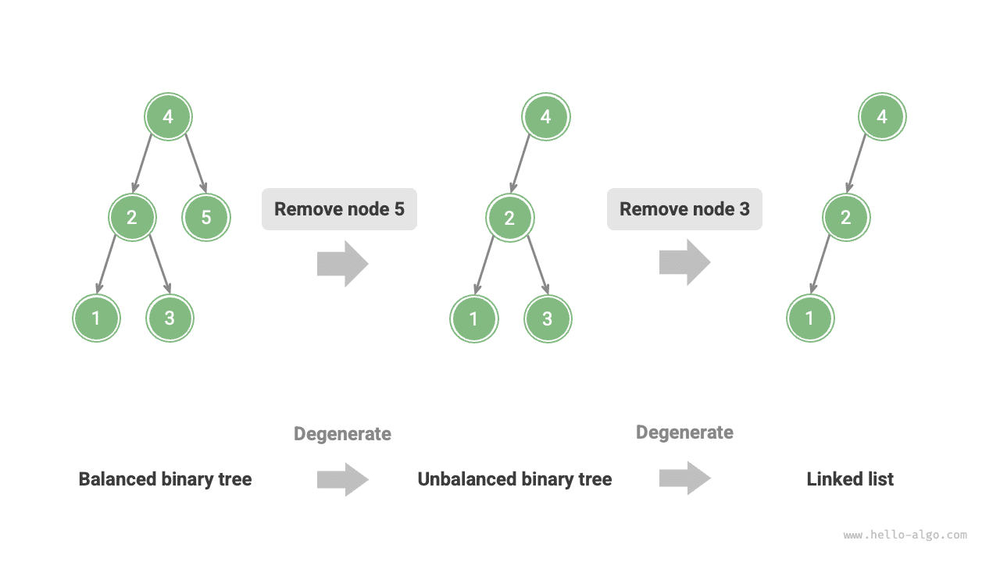
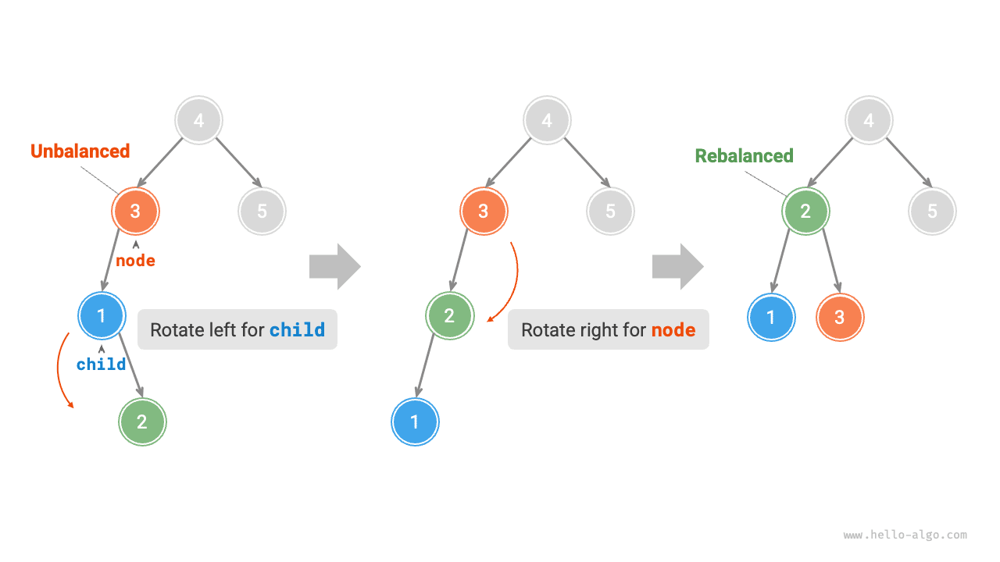
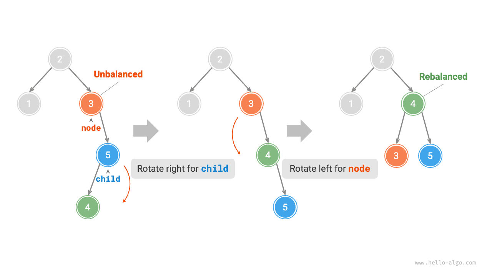
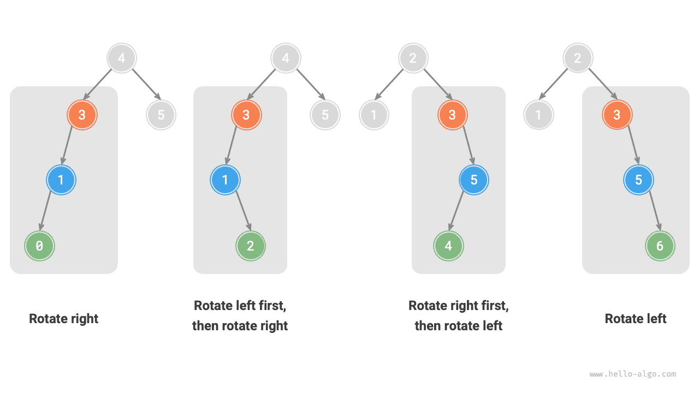

# Cây AVL *

Trong phần "Cây tìm kiếm nhị phân", ta đã đề cập rằng sau nhiều lần thực hiện thao tác chèn và xóa, một cây tìm kiếm nhị phân có thể bị suy biến thành danh sách liên kết. Trong trường hợp đó, độ phức tạp thời gian của tất cả các thao tác sẽ suy giảm từ $O(\log n)$ xuống $O(n)$.

Như hình minh họa dưới đây, sau hai lần xóa nút, cây tìm kiếm nhị phân này sẽ suy biến thành danh sách liên kết.



Chẳng hạn, với cây nhị phân đầy đủ trong hình minh họa dưới đây, sau khi chèn thêm hai nút, cây sẽ nghiêng nặng về bên trái, và độ phức tạp thời gian của thao tác tìm kiếm cũng sẽ suy giảm theo.


Năm 1962, G. M. Adelson-Velsky và E. M. Landis đã đề xuất <u>cây AVL</u> trong bài báo "Một thuật toán tổ chức thông tin" ("An algorithm for the organization of information"). Bài báo này mô tả một chuỗi các thao tác giúp ngăn cây AVL bị suy biến khi các nút được chèn và xóa, nhờ đó duy trì độ phức tạp thời gian của các thao tác luôn ở mức $O(\log n)$. Nói cách khác, trong các tình huống đòi hỏi thực hiện thường xuyên các thao tác chèn, xóa, tìm kiếm và cập nhật, cây AVL có thể duy trì hiệu suất ổn định và hiệu quả, do đó có giá trị thực tiễn cao.

## Thuật ngữ thường dùng trong cây AVL

Cây AVL vừa là một cây tìm kiếm nhị phân, vừa là một cây nhị phân cân bằng, đồng thời thỏa mãn mọi tính chất của cả hai loại cây nhị phân này, vì vậy nó còn được gọi là <u>cây tìm kiếm nhị phân cân bằng</u>.

### Chiều cao nút

Vì các thao tác liên quan đến cây AVL đòi hỏi phải lấy được chiều cao của nút, ta cần bổ sung một biến `height` vào lớp nút:

=== "Python"

    ```python title=""
    class TreeNode:
        """Nút của cây AVL"""
        def __init__(self, val: int):
            self.val: int = val                 # Giá trị nút
            self.height: int = 0                # Chiều cao nút
            self.left: TreeNode | None = None   # Tham chiếu đến nút con trái
            self.right: TreeNode | None = None  # Tham chiếu đến nút con phải
    ```

=== "C++"

    ```cpp title=""
    /* Nút của cây AVL */
    struct TreeNode {
        int val{};          // Giá trị nút
        int height = 0;     // Chiều cao nút
        TreeNode *left{};   // Nút con trái
        TreeNode *right{};  // Nút con phải
        TreeNode() = default;
        explicit TreeNode(int x) : val(x){}
    };
    ```

=== "Java"

    ```java title=""
    /* Nút của cây AVL */
    class TreeNode {
        public int val;        // Giá trị nút
        public int height;     // Chiều cao nút
        public TreeNode left;  // Nút con trái
        public TreeNode right; // Nút con phải
        public TreeNode(int x) { val = x; }
    }
    ```

=== "C#"

    ```csharp title=""
    /* Nút của cây AVL */
    class TreeNode(int? x) {
        public int? val = x;    // Giá trị nút
        public int height;      // Chiều cao nút
        public TreeNode? left;  // Tham chiếu đến nút con trái
        public TreeNode? right; // Tham chiếu đến nút con phải
    }
    ```

=== "Go"

    ```go title=""
    /* Nút của cây AVL */
    type TreeNode struct {
        Val    int       // Giá trị nút
        Height int       // Chiều cao nút
        Left   *TreeNode // Tham chiếu đến nút con trái
        Right  *TreeNode // Tham chiếu đến nút con phải
    }
    ```

=== "Swift"

    ```swift title=""
    /* Nút của cây AVL */
    class TreeNode {
        var val: Int // Giá trị nút
        var height: Int // Chiều cao nút
        var left: TreeNode? // Nút con trái
        var right: TreeNode? // Nút con phải

        init(x: Int) {
            val = x
            height = 0
        }
    }
    ```

=== "JS"

    ```javascript title=""
    /* Nút của cây AVL */
    class TreeNode {
        val; // Giá trị nút
        height; // Chiều cao nút
        left; // Con trỏ nút con trái
        right; // Con trỏ nút con phải
        constructor(val, left, right, height) {
            this.val = val === undefined ? 0 : val;
            this.height = height === undefined ? 0 : height;
            this.left = left === undefined ? null : left;
            this.right = right === undefined ? null : right;
        }
    }
    ```

=== "TS"

    ```typescript title=""
    /* Nút của cây AVL */
    class TreeNode {
        val: number;            // Giá trị nút
        height: number;         // Chiều cao nút
        left: TreeNode | null;  // Con trỏ nút con trái
        right: TreeNode | null; // Con trỏ nút con phải
        constructor(val?: number, height?: number, left?: TreeNode | null, right?: TreeNode | null) {
            this.val = val === undefined ? 0 : val;
            this.height = height === undefined ? 0 : height; 
            this.left = left === undefined ? null : left; 
            this.right = right === undefined ? null : right; 
        }
    }
    ```

=== "Dart"

    ```dart title=""
    /* Nút của cây AVL */
    class TreeNode {
      int val;         // Giá trị nút
      int height;      // Chiều cao nút
      TreeNode? left;  // Nút con trái
      TreeNode? right; // Nút con phải
      TreeNode(this.val, [this.height = 0, this.left, this.right]);
    }
    ```

=== "Rust"

    ```rust title=""
    use std::rc::Rc;
    use std::cell::RefCell;

    /* Nút của cây AVL */
    struct TreeNode {
        val: i32,                               // Giá trị nút
        height: i32,                            // Chiều cao nút
        left: Option<Rc<RefCell<TreeNode>>>,    // Nút con trái
        right: Option<Rc<RefCell<TreeNode>>>,   // Nút con phải
    }

    impl TreeNode {
        /* Hàm khởi tạo */
        fn new(val: i32) -> Rc<RefCell<Self>> {
            Rc::new(RefCell::new(Self {
                val,
                height: 0,
                left: None,
                right: None
            }))
        }
    }
    ```

=== "C"

    ```c title=""
    /* Nút của cây AVL */
    typedef struct TreeNode {
        int val;
        int height;
        struct TreeNode *left;
        struct TreeNode *right;
    } TreeNode;

    /* Hàm khởi tạo */
    TreeNode *newTreeNode(int val) {
        TreeNode *node;

        node = (TreeNode *)malloc(sizeof(TreeNode));
        node->val = val;
        node->height = 0;
        node->left = NULL;
        node->right = NULL;
        return node;
    }
    ```

=== "Kotlin"

    ```kotlin title=""
    /* Nút của cây AVL */
    class TreeNode(val _val: Int) {  // Giá trị nút
        val height: Int = 0          // Chiều cao nút
        val left: TreeNode? = null   // Nút con trái
        val right: TreeNode? = null  // Nút con phải
    }
    ```

=== "Ruby"

    ```ruby title=""
    ### Lớp nút của cây AVL ###
    class TreeNode
      attr_accessor :val    # Giá trị nút
      attr_accessor :height # Chiều cao nút
      attr_accessor :left   # Tham chiếu đến nút con trái
      attr_accessor :right  # Tham chiếu đến nút con phải

      def initialize(val)
        @val = val
        @height = 0
      end
    end
    ```

"Chiều cao nút" là khoảng cách từ nút đó đến nút lá xa nhất của nó, tức là số cạnh trên đường đi. Cần lưu ý rằng chiều cao của một nút lá là $0$, còn chiều cao của một nút rỗng là $-1$. Ta sẽ tạo hai hàm tiện ích để lấy và cập nhật chiều cao của một nút:

```src
[file]{avl_tree}-[class]{avl_tree}-[func]{update_height}
```

### Hệ số cân bằng của nút

<u>Hệ số cân bằng</u> của một nút được định nghĩa là chiều cao của cây con trái trừ đi chiều cao của cây con phải của nút đó, và hệ số cân bằng của một nút rỗng được định nghĩa là $0$. Ta cũng đóng gói hàm lấy hệ số cân bằng của nút để tiện sử dụng về sau:

```src
[file]{avl_tree}-[class]{avl_tree}-[func]{balance_factor}
```

!!! tip

    Gọi hệ số cân bằng là $f$, thì hệ số cân bằng của bất kỳ nút nào trong cây AVL đều thỏa mãn $-1 \le f \le 1$.

## Phép xoay trong cây AVL

Đặc trưng của cây AVL nằm ở thao tác "xoay", có thể khôi phục sự cân bằng cho các nút mất cân bằng mà không làm ảnh hưởng đến chuỗi duyệt giữa của cây nhị phân. Nói cách khác, **các thao tác xoay vừa có thể duy trì tính chất của "cây tìm kiếm nhị phân", vừa giúp cây quay trở lại trạng thái "cây nhị phân cân bằng"**.

Ta gọi các nút có giá trị tuyệt đối của hệ số cân bằng $> 1$ là "nút mất cân bằng". Tùy theo tình huống mất cân bằng, các thao tác xoay được chia thành bốn loại: xoay phải, xoay trái, xoay trái rồi xoay phải, và xoay phải rồi xoay trái. Dưới đây, ta sẽ mô tả chi tiết các thao tác xoay này.

### Xoay phải

Như hình minh họa dưới đây, giá trị bên dưới mỗi nút là hệ số cân bằng của nút đó. Xét từ dưới lên trên, nút mất cân bằng đầu tiên trong cây nhị phân là "nút 3". Ta tập trung vào cây con có nút mất cân bằng này làm gốc, gọi nút đó là `node` và nút con trái của nó là `child`, rồi thực hiện thao tác "xoay phải". Sau khi xoay phải hoàn tất, cây con lấy lại sự cân bằng và vẫn duy trì tính chất của cây tìm kiếm nhị phân.

=== "<1>"
    

=== "<2>"
    

=== "<3>"
    

=== "<4>"
    

Như hình minh họa dưới đây, khi nút `child` có một nút con phải (gọi là `grand_child`), cần bổ sung thêm một bước trong quá trình xoay phải: đặt `grand_child` làm nút con trái của `node`.


"Xoay phải" là một cách gọi hình tượng; trên thực tế, nó được thực hiện bằng cách chỉnh sửa các con trỏ nút, như đoạn mã dưới đây:

```src
[file]{avl_tree}-[class]{avl_tree}-[func]{right_rotate}
```

### Xoay trái

Tương tự, nếu xét "ảnh gương" của cây nhị phân mất cân bằng nêu trên, ta cần thực hiện thao tác "xoay trái" như hình minh họa dưới đây.


Tương tự, như hình minh họa dưới đây, khi nút `child` có một nút con trái (gọi là `grand_child`), cần bổ sung thêm một bước trong quá trình xoay trái: đặt `grand_child` làm nút con phải của `node`.


Có thể nhận thấy **các thao tác xoay phải và xoay trái đối xứng gương nhau về mặt logic, và hai tình huống mất cân bằng mà chúng giải quyết cũng đối xứng nhau**. Dựa trên tính đối xứng này, ta chỉ cần thay tất cả `left` trong mã cài đặt xoay phải bằng `right`, và tất cả `right` bằng `left`, là có thể thu được mã cài đặt xoay trái:

```src
[file]{avl_tree}-[class]{avl_tree}-[func]{left_rotate}
```

### Xoay trái rồi xoay phải

Đối với nút 3 mất cân bằng trong hình minh họa dưới đây, việc chỉ dùng riêng xoay trái hoặc xoay phải đều không thể khôi phục sự cân bằng cho cây con. Trong trường hợp này, cần thực hiện "xoay trái" trên `child` trước, sau đó "xoay phải" trên `node`.



### Xoay phải rồi xoay trái

Như hình minh họa dưới đây, đối với trường hợp đối xứng gương của cây nhị phân mất cân bằng nêu trên, cần thực hiện "xoay phải" trên `child` trước, sau đó "xoay trái" trên `node`.



### Lựa chọn phép xoay

Bốn tình huống mất cân bằng trong hình minh họa dưới đây tương ứng một-một với các trường hợp nêu trên, lần lượt yêu cầu thực hiện xoay phải, xoay trái rồi xoay phải, xoay phải rồi xoay trái, và xoay trái.



Như bảng dưới đây cho thấy, ta xác định nút mất cân bằng thuộc trường hợp nào bằng cách xét dấu của hệ số cân bằng của nút mất cân bằng và hệ số cân bằng của nút con ở phía cao hơn của nó.

<p align="center"> Bảng <id> &nbsp; Điều kiện lựa chọn giữa bốn trường hợp xoay </p>

| Hệ số cân bằng của nút mất cân bằng | Hệ số cân bằng của nút con | Phép xoay cần áp dụng          |
| ------------------------------------- | --------------------------- | -------------------------------- |
| $> 1$ (cây nghiêng trái)              | $\geq 0$                    | Xoay phải                        |
| $> 1$ (cây nghiêng trái)              | $<0$                        | Xoay trái rồi xoay phải          |
| $< -1$ (cây nghiêng phải)             | $\leq 0$                    | Xoay trái                        |
| $< -1$ (cây nghiêng phải)             | $>0$                        | Xoay phải rồi xoay trái          |

Để tiện sử dụng, ta đóng gói các thao tác xoay thành một hàm duy nhất. **Với hàm này, ta có thể thực hiện phép xoay cho mọi tình huống mất cân bằng, khôi phục sự cân bằng cho các nút mất cân bằng**. Mã như sau:

```src
[file]{avl_tree}-[class]{avl_tree}-[func]{rotate}
```

## Các thao tác thường dùng trong cây AVL

### Chèn nút

Thao tác chèn nút trong cây AVL có nguyên lý tương tự như trong cây tìm kiếm nhị phân. Điểm khác biệt duy nhất là sau khi chèn một nút vào cây AVL, một chuỗi các nút mất cân bằng có thể xuất hiện trên đường đi từ nút đó đến gốc. Do đó, **ta cần bắt đầu từ nút đó và thực hiện các thao tác xoay từ dưới lên trên, khôi phục sự cân bằng cho tất cả các nút mất cân bằng**. Mã như sau:

```src
[file]{avl_tree}-[class]{avl_tree}-[func]{insert_helper}
```

### Xóa nút

Tương tự, dựa trên phương pháp xóa nút của cây tìm kiếm nhị phân, ta cần thực hiện các thao tác xoay từ dưới lên trên để khôi phục sự cân bằng cho tất cả các nút mất cân bằng. Mã như sau:

```src
[file]{avl_tree}-[class]{avl_tree}-[func]{remove_helper}
```

### Tìm kiếm nút

Thao tác tìm kiếm nút trong cây AVL giống hệt như trong cây tìm kiếm nhị phân, nên sẽ không trình bày chi tiết ở đây.

## Ứng dụng tiêu biểu của cây AVL

- Tổ chức và lưu trữ dữ liệu quy mô lớn, phù hợp với các tình huống tìm kiếm với tần suất cao còn chèn và xóa với tần suất thấp.
- Dùng để xây dựng các hệ thống chỉ mục trong cơ sở dữ liệu.
- Cây đỏ đen cũng là một loại cây tìm kiếm nhị phân cân bằng phổ biến. So với cây AVL, cây đỏ đen có điều kiện cân bằng lỏng lẻo hơn, cần ít thao tác xoay hơn khi chèn và xóa nút, và có hiệu suất trung bình cao hơn cho các thao tác thêm và xóa nút.
