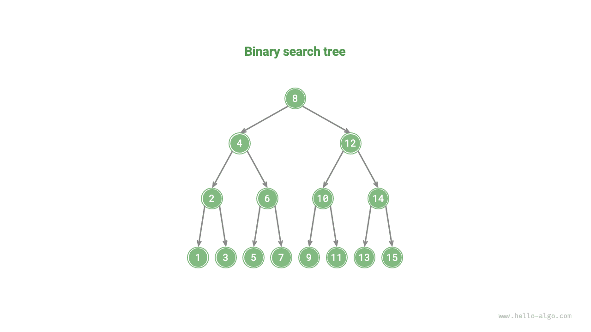
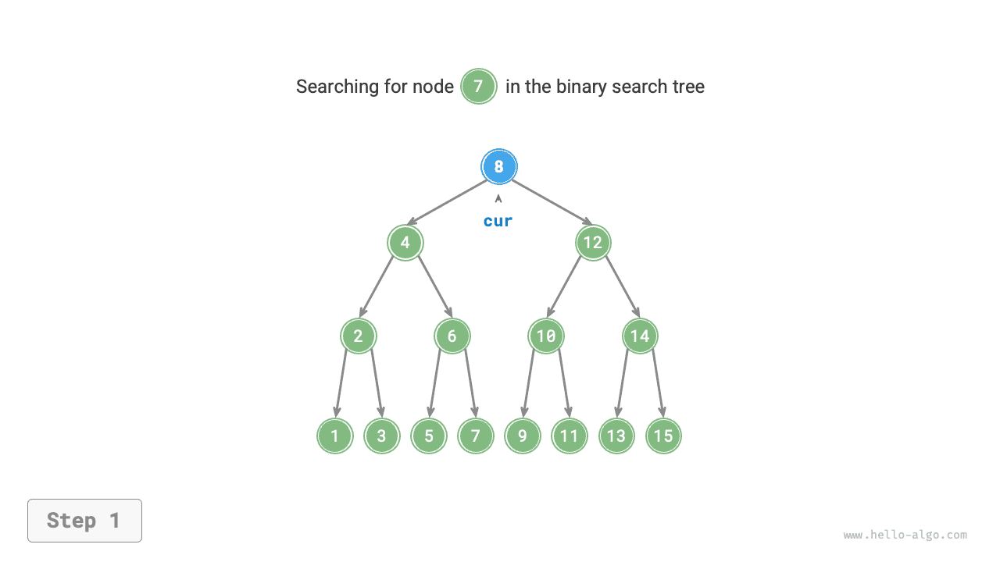
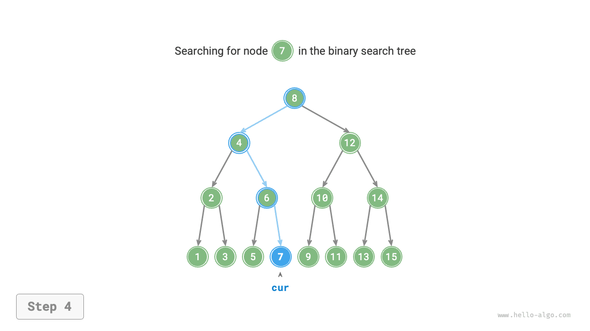
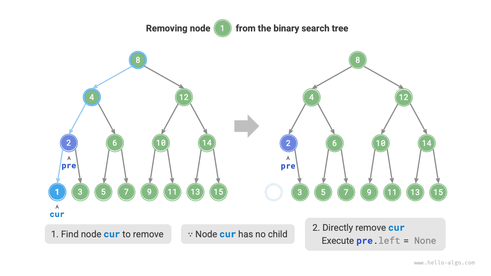
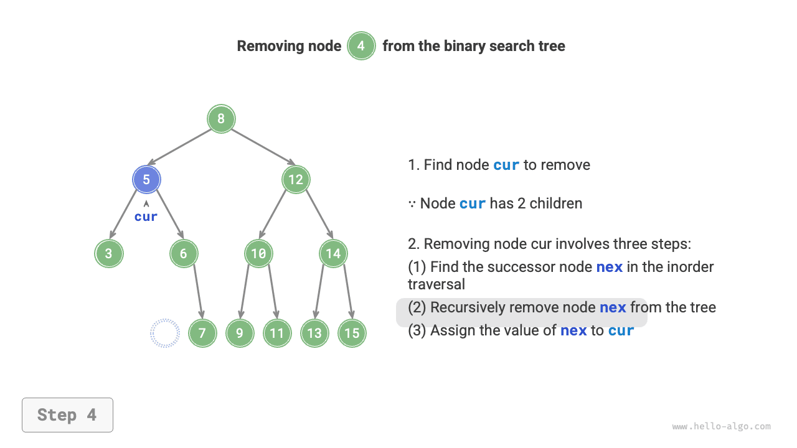

# Cây tìm kiếm nhị phân

Như hình minh họa dưới đây, <u>cây tìm kiếm nhị phân</u> thỏa mãn các điều kiện sau.

1. Đối với nút gốc, giá trị của mọi nút trong cây con trái $<$ giá trị của nút gốc $<$ giá trị của mọi nút trong cây con phải.
2. Cây con trái và cây con phải của bất kỳ nút nào cũng đều là cây tìm kiếm nhị phân, tức là chúng cũng thỏa mãn điều kiện `1.` nêu trên.



## Các thao tác trên cây tìm kiếm nhị phân

Ta đóng gói cây tìm kiếm nhị phân thành một lớp `BinarySearchTree` và khai báo một biến thành viên `root` trỏ đến nút gốc của cây.

### Tìm kiếm một nút

Cho trước giá trị `num` của nút cần tìm, ta có thể tìm kiếm dựa trên các tính chất của cây tìm kiếm nhị phân. Như hình minh họa dưới đây, ta khai báo một nút `cur`, bắt đầu từ nút gốc `root` của cây tìm kiếm nhị phân, rồi lặp lại việc so sánh `cur.val` với `num`.

- Nếu `cur.val < num`, nghĩa là nút đích nằm trong cây con phải của `cur`, do đó thực hiện `cur = cur.right`.
- Nếu `cur.val > num`, nghĩa là nút đích nằm trong cây con trái của `cur`, do đó thực hiện `cur = cur.left`.
- Nếu `cur.val = num`, nghĩa là đã tìm thấy nút đích, thoát khỏi vòng lặp và trả về nút đó.

=== "<1>"
    

=== "<2>"
    

=== "<3>"
    

=== "<4>"
    

Thao tác tìm kiếm trong cây tìm kiếm nhị phân tuân theo nguyên lý giống với tìm kiếm nhị phân: mỗi vòng lặp loại bỏ một nửa số trường hợp còn lại. Số lần lặp tối đa bằng chiều cao của cây. Khi cây cân bằng, việc tìm kiếm mất thời gian $O(\log n)$. Mã ví dụ như sau:

```src
[file]{binary_search_tree}-[class]{binary_search_tree}-[func]{search}
```

### Chèn một nút

Cho trước một phần tử `num` cần chèn, để duy trì tính chất "cây con trái < nút gốc < cây con phải" của cây tìm kiếm nhị phân, quá trình chèn được thực hiện như hình minh họa dưới đây.

1. **Tìm vị trí chèn**: Tương tự thao tác tìm kiếm, bắt đầu từ nút gốc, lặp đi xuống tìm kiếm dựa trên quan hệ lớn nhỏ giữa giá trị nút hiện tại và `num`, cho đến khi vượt qua nút lá (duyệt tới `None`) thì thoát khỏi vòng lặp.
2. **Chèn nút vào vị trí đó**: Tạo một nút cho `num` và đặt nó vào vị trí `None`.


Trong khi cài đặt mã nguồn, cần lưu ý hai điểm sau:

- Cây tìm kiếm nhị phân không cho phép các nút trùng lặp; nếu không, cây sẽ không còn thỏa mãn định nghĩa của nó nữa. Do đó, nếu nút cần chèn đã tồn tại trong cây, thao tác chèn sẽ được bỏ qua và hàm trả về ngay lập tức.
- Để cài đặt thao tác chèn nút, ta cần dùng một nút `pre` để lưu lại nút của vòng lặp trước đó. Nhờ vậy, khi duyệt tới `None`, ta có thể lấy được nút cha của nó, từ đó hoàn thành thao tác chèn nút.

```src
[file]{binary_search_tree}-[class]{binary_search_tree}-[func]{insert}
```

Tương tự như tìm kiếm một nút, việc chèn một nút cũng tốn thời gian $O(\log n)$.

### Xóa một nút

Trước tiên, tìm nút đích trong cây tìm kiếm nhị phân, sau đó xóa nút đó. Tương tự thao tác chèn nút, ta cần đảm bảo rằng sau khi thao tác xóa hoàn tất, tính chất "cây con trái $<$ nút gốc $<$ cây con phải" của cây tìm kiếm nhị phân vẫn được duy trì. Do đó, tùy theo số lượng nút con của nút đích, ta xét ba trường hợp: bậc $0$, bậc $1$ và bậc $2$, rồi thực hiện thao tác xóa tương ứng.

Như hình minh họa dưới đây, khi bậc của nút cần xóa là $0$, nghĩa là nút đó là nút lá và có thể xóa trực tiếp.



Như hình minh họa dưới đây, khi bậc của nút cần xóa là $1$, chỉ cần thay thế nút đó bằng nút con của nó là đủ.


Khi bậc của nút cần xóa là $2$, ta không thể xóa trực tiếp; thay vào đó, ta cần dùng một nút khác để thay thế nó. Để duy trì tính chất "cây con trái $<$ nút gốc $<$ cây con phải" của cây tìm kiếm nhị phân, **nút thay thế này có thể là nút nhỏ nhất trong cây con phải hoặc nút lớn nhất trong cây con trái**.

Giả sử ta chọn nút nhỏ nhất trong cây con phải, tức là nút kế tiếp theo thứ tự duyệt giữa, quá trình xóa được thực hiện như hình minh họa dưới đây.

1. Tìm nút tiếp theo của nút cần xóa trong "chuỗi duyệt giữa", gọi là `tmp`.
2. Thay giá trị của nút cần xóa bằng giá trị của `tmp`, rồi đệ quy xóa nút `tmp` trong cây.

=== "<1>"
    

=== "<2>"
    

=== "<3>"
    

=== "<4>"
    

Thao tác xóa nút cũng tốn thời gian $O(\log n)$, trong đó việc tìm nút cần xóa tốn $O(\log n)$ thời gian, và việc tìm nút kế tiếp theo thứ tự duyệt giữa cũng tốn $O(\log n)$ thời gian. Mã ví dụ như sau:

```src
[file]{binary_search_tree}-[class]{binary_search_tree}-[func]{remove}
```

### Duyệt giữa cho kết quả có thứ tự

Như hình minh họa dưới đây, duyệt giữa của cây nhị phân tuân theo thứ tự "trái $\rightarrow$ gốc $\rightarrow$ phải", trong khi cây tìm kiếm nhị phân thỏa mãn quan hệ về độ lớn "nút con trái $<$ nút gốc $<$ nút con phải".

Điều này có nghĩa là khi thực hiện duyệt giữa trong cây tìm kiếm nhị phân, nút nhỏ tiếp theo luôn được duyệt trước tiên, từ đó tạo ra một tính chất quan trọng: **Chuỗi duyệt giữa của cây tìm kiếm nhị phân có thứ tự tăng dần**.

Nhờ tận dụng tính chất chuỗi duyệt giữa có thứ tự tăng dần này, ta có thể lấy ra dữ liệu đã được sắp xếp trong cây tìm kiếm nhị phân chỉ với thời gian $O(n)$, mà không cần thực hiện thêm bất kỳ thao tác sắp xếp nào, rất hiệu quả.


## Hiệu suất của cây tìm kiếm nhị phân

Cho trước một tập dữ liệu, ta xem xét việc sử dụng mảng hoặc cây tìm kiếm nhị phân để lưu trữ. Quan sát bảng dưới đây, tất cả các thao tác trong cây tìm kiếm nhị phân đều có độ phức tạp thời gian logarit, mang lại hiệu suất ổn định và hiệu quả. Mảng chỉ hiệu quả hơn cây tìm kiếm nhị phân trong các trường hợp thêm phần tử với tần suất cao còn tìm kiếm và xóa với tần suất thấp.

<p align="center"> Bảng <id> &nbsp; So sánh hiệu suất giữa mảng và cây tìm kiếm </p>

|                | Mảng chưa sắp xếp | Cây tìm kiếm nhị phân |
| -------------- | ------------------ | ---------------------- |
| Tìm kiếm phần tử | $O(n)$            | $O(\log n)$             |
| Chèn phần tử     | $O(1)$            | $O(\log n)$             |
| Xóa phần tử      | $O(n)$            | $O(\log n)$             |

Trong trường hợp lý tưởng, cây tìm kiếm nhị phân là cân bằng, vì vậy bất kỳ nút nào cũng có thể được tìm thấy trong vòng $O(\log n)$ lần lặp.

Tuy nhiên, nếu ta liên tục chèn và xóa nút trong cây tìm kiếm nhị phân, cây có thể suy biến thành danh sách liên kết như hình minh họa dưới đây, khi đó độ phức tạp thời gian của các thao tác cũng suy giảm về $O(n)$.


## Ứng dụng phổ biến của cây tìm kiếm nhị phân

- Được dùng làm chỉ mục đa cấp trong các hệ thống để hiện thực hóa các thao tác tìm kiếm, chèn và xóa hiệu quả.
- Đóng vai trò là cấu trúc dữ liệu nền tảng cho một số thuật toán tìm kiếm.
- Dùng để lưu trữ luồng dữ liệu nhằm duy trì trạng thái có thứ tự của chúng.
