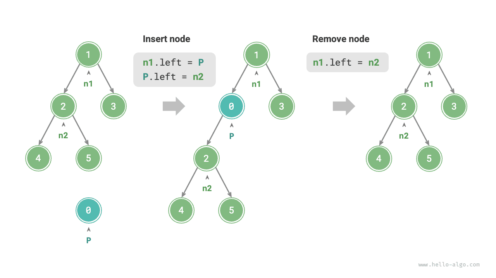
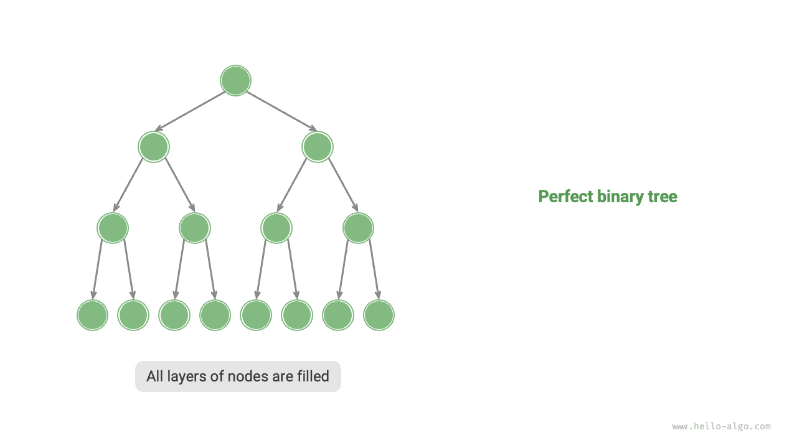
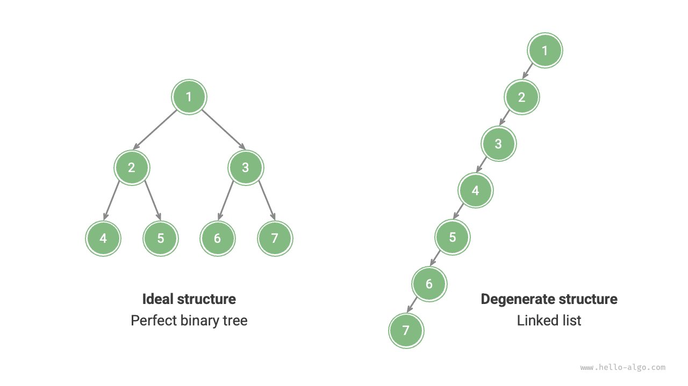

# Cây nhị phân

<u>Cây nhị phân</u> là một cấu trúc dữ liệu phi tuyến tính, mô hình hóa mối quan hệ phân cấp giữa "tổ tiên" và "con cháu", thể hiện tư duy chia để trị theo kiểu mỗi lần tách sẽ chia thành hai nhánh. Tương tự danh sách liên kết, đơn vị cơ bản của cây nhị phân là nút, mỗi nút chứa một giá trị, một tham chiếu đến nút con trái và một tham chiếu đến nút con phải.

=== "Python"

    ```python title=""
    class TreeNode:
        """Nút của cây nhị phân"""
        def __init__(self, val: int):
            self.val: int = val                # Giá trị nút
            self.left: TreeNode | None = None  # Tham chiếu đến nút con trái
            self.right: TreeNode | None = None # Tham chiếu đến nút con phải
    ```

=== "C++"

    ```cpp title=""
    /* Nút của cây nhị phân */
    struct TreeNode {
        int val;          // Giá trị nút
        TreeNode *left;   // Con trỏ đến nút con trái
        TreeNode *right;  // Con trỏ đến nút con phải
        TreeNode(int x) : val(x), left(nullptr), right(nullptr) {}
    };
    ```

=== "Java"

    ```java title=""
    /* Nút của cây nhị phân */
    class TreeNode {
        int val;         // Giá trị nút
        TreeNode left;   // Tham chiếu đến nút con trái
        TreeNode right;  // Tham chiếu đến nút con phải
        TreeNode(int x) { val = x; }
    }
    ```

=== "C#"

    ```csharp title=""
    /* Nút của cây nhị phân */
    class TreeNode(int? x) {
        public int? val = x;    // Giá trị nút
        public TreeNode? left;  // Tham chiếu đến nút con trái
        public TreeNode? right; // Tham chiếu đến nút con phải
    }
    ```

=== "Go"

    ```go title=""
    /* Nút của cây nhị phân */
    type TreeNode struct {
        Val   int
        Left  *TreeNode
        Right *TreeNode
    }
    /* Hàm khởi tạo */
    func NewTreeNode(v int) *TreeNode {
        return &TreeNode{
            Left:  nil, // Con trỏ đến nút con trái
            Right: nil, // Con trỏ đến nút con phải
            Val:   v,   // Giá trị nút
        }
    }
    ```

=== "Swift"

    ```swift title=""
    /* Nút của cây nhị phân */
    class TreeNode {
        var val: Int // Giá trị nút
        var left: TreeNode? // Tham chiếu đến nút con trái
        var right: TreeNode? // Tham chiếu đến nút con phải

        init(x: Int) {
            val = x
        }
    }
    ```

=== "JS"

    ```javascript title=""
    /* Nút của cây nhị phân */
    class TreeNode {
        val; // Giá trị nút
        left; // Con trỏ đến nút con trái
        right; // Con trỏ đến nút con phải
        constructor(val, left, right) {
            this.val = val === undefined ? 0 : val;
            this.left = left === undefined ? null : left;
            this.right = right === undefined ? null : right;
        }
    }
    ```

=== "TS"

    ```typescript title=""
    /* Nút của cây nhị phân */
    class TreeNode {
        val: number;
        left: TreeNode | null;
        right: TreeNode | null;

        constructor(val?: number, left?: TreeNode | null, right?: TreeNode | null) {
            this.val = val === undefined ? 0 : val; // Giá trị nút
            this.left = left === undefined ? null : left; // Tham chiếu đến nút con trái
            this.right = right === undefined ? null : right; // Tham chiếu đến nút con phải
        }
    }
    ```

=== "Dart"

    ```dart title=""
    /* Nút của cây nhị phân */
    class TreeNode {
      int val;         // Giá trị nút
      TreeNode? left;  // Tham chiếu đến nút con trái
      TreeNode? right; // Tham chiếu đến nút con phải
      TreeNode(this.val, [this.left, this.right]);
    }
    ```

=== "Rust"

    ```rust title=""
    use std::rc::Rc;
    use std::cell::RefCell;

    /* Nút của cây nhị phân */
    struct TreeNode {
        val: i32,                               // Giá trị nút
        left: Option<Rc<RefCell<TreeNode>>>,    // Tham chiếu đến nút con trái
        right: Option<Rc<RefCell<TreeNode>>>,   // Tham chiếu đến nút con phải
    }

    impl TreeNode {
        /* Hàm khởi tạo */
        fn new(val: i32) -> Rc<RefCell<Self>> {
            Rc::new(RefCell::new(Self {
                val,
                left: None,
                right: None
            }))
        }
    }
    ```

=== "C"

    ```c title=""
    /* Nút của cây nhị phân */
    typedef struct TreeNode {
        int val;                // Giá trị nút
        int height;             // Chiều cao nút
        struct TreeNode *left;  // Con trỏ đến nút con trái
        struct TreeNode *right; // Con trỏ đến nút con phải
    } TreeNode;

    /* Hàm khởi tạo */
    TreeNode *newTreeNode(int val) {
        TreeNode *node;

        node = (TreeNode *)malloc(sizeof(TreeNode));
        node->val = val;
        node->height = 0;
        node->left = NULL;
        node->right = NULL;
        return node;
    }
    ```

=== "Kotlin"

    ```kotlin title=""
    /* Nút của cây nhị phân */
    class TreeNode(val _val: Int) {  // Giá trị nút
        val left: TreeNode? = null   // Tham chiếu đến nút con trái
        val right: TreeNode? = null  // Tham chiếu đến nút con phải
    }
    ```

=== "Ruby"

    ```ruby title=""
    ### Lớp nút của cây nhị phân ###
    class TreeNode
      attr_accessor :val    # Giá trị nút
      attr_accessor :left   # Tham chiếu đến nút con trái
      attr_accessor :right  # Tham chiếu đến nút con phải

      def initialize(val)
        @val = val
      end
    end
    ```

Mỗi nút có hai tham chiếu (con trỏ), lần lượt trỏ đến <u>nút con trái</u> và <u>nút con phải</u>. Nút này được gọi là <u>nút cha</u> của hai nút con đó. Khi xét một nút bất kỳ của cây nhị phân, ta gọi cây được tạo thành từ nút con trái của nút đó cùng tất cả các nút bên dưới là <u>cây con trái</u> của nút này. Tương tự, ta cũng có thể định nghĩa <u>cây con phải</u>.

**Trong cây nhị phân, mọi nút không phải nút lá đều có nút con, do đó cây con của chúng luôn khác rỗng.** Như hình minh họa dưới đây, nếu coi "Nút 2" là nút cha thì nút con trái và nút con phải của nó lần lượt là "Nút 4" và "Nút 5". Cây con trái được tạo bởi "Nút 4" cùng tất cả các nút bên dưới nó, còn cây con phải được tạo bởi "Nút 5" cùng tất cả các nút bên dưới nó.


## Thuật ngữ thường dùng của cây nhị phân

Các thuật ngữ thường dùng của cây nhị phân được minh họa trong hình dưới đây.

- <u>Nút gốc</u>: Nút ở tầng cao nhất của cây nhị phân, không có nút cha.
- <u>Nút lá</u>: Nút không có bất kỳ nút con nào, cả hai con trỏ của nó đều trỏ đến `None`.
- <u>Cạnh</u>: Đoạn nối giữa hai nút, biểu diễn một tham chiếu (con trỏ) giữa các nút.
- <u>Tầng</u> của một nút: Tăng dần từ trên xuống dưới, nút gốc nằm ở tầng 1.
- <u>Bậc</u> của một nút: Số lượng nút con mà một nút sở hữu. Trong cây nhị phân, bậc có thể là 0, 1 hoặc 2.
- <u>Chiều cao</u> của cây nhị phân: Số cạnh tính từ nút gốc đến nút lá xa nhất.
- <u>Độ sâu</u> của một nút: Số cạnh tính từ nút gốc đến nút đó.
- <u>Chiều cao</u> của một nút: Số cạnh tính từ nút lá xa nhất đến nút đó.


!!! tip

    Chúng ta thường định nghĩa "chiều cao" và "độ sâu" theo số cạnh đã đi qua, nhưng một số giáo trình và đề bài lại định nghĩa chúng theo số nút trên đường đi. Trong trường hợp đó, cả hai giá trị đều lớn hơn 1 đơn vị.

## Các thao tác cơ bản của cây nhị phân

### Khởi tạo cây nhị phân

Tương tự danh sách liên kết, việc khởi tạo cây nhị phân bao gồm việc tạo các nút trước, sau đó thiết lập các tham chiếu (con trỏ) giữa chúng.

=== "Python"

    ```python title="binary_tree.py"
    # Khởi tạo cây nhị phân
    # Khởi tạo các nút
    n1 = TreeNode(val=1)
    n2 = TreeNode(val=2)
    n3 = TreeNode(val=3)
    n4 = TreeNode(val=4)
    n5 = TreeNode(val=5)
    # Liên kết tham chiếu (con trỏ) giữa các nút
    n1.left = n2
    n1.right = n3
    n2.left = n4
    n2.right = n5
    ```

=== "C++"

    ```cpp title="binary_tree.cpp"
    /* Khởi tạo cây nhị phân */
    // Khởi tạo các nút
    TreeNode* n1 = new TreeNode(1);
    TreeNode* n2 = new TreeNode(2);
    TreeNode* n3 = new TreeNode(3);
    TreeNode* n4 = new TreeNode(4);
    TreeNode* n5 = new TreeNode(5);
    // Liên kết tham chiếu (con trỏ) giữa các nút
    n1->left = n2;
    n1->right = n3;
    n2->left = n4;
    n2->right = n5;
    ```

=== "Java"

    ```java title="binary_tree.java"
    // Khởi tạo các nút
    TreeNode n1 = new TreeNode(1);
    TreeNode n2 = new TreeNode(2);
    TreeNode n3 = new TreeNode(3);
    TreeNode n4 = new TreeNode(4);
    TreeNode n5 = new TreeNode(5);
    // Liên kết tham chiếu (con trỏ) giữa các nút
    n1.left = n2;
    n1.right = n3;
    n2.left = n4;
    n2.right = n5;
    ```

=== "C#"

    ```csharp title="binary_tree.cs"
    /* Khởi tạo cây nhị phân */
    // Khởi tạo các nút
    TreeNode n1 = new(1);
    TreeNode n2 = new(2);
    TreeNode n3 = new(3);
    TreeNode n4 = new(4);
    TreeNode n5 = new(5);
    // Liên kết tham chiếu (con trỏ) giữa các nút
    n1.left = n2;
    n1.right = n3;
    n2.left = n4;
    n2.right = n5;
    ```

=== "Go"

    ```go title="binary_tree.go"
    /* Khởi tạo cây nhị phân */
    // Khởi tạo các nút
    n1 := NewTreeNode(1)
    n2 := NewTreeNode(2)
    n3 := NewTreeNode(3)
    n4 := NewTreeNode(4)
    n5 := NewTreeNode(5)
    // Liên kết tham chiếu (con trỏ) giữa các nút
    n1.Left = n2
    n1.Right = n3
    n2.Left = n4
    n2.Right = n5
    ```

=== "Swift"

    ```swift title="binary_tree.swift"
    // Khởi tạo các nút
    let n1 = TreeNode(x: 1)
    let n2 = TreeNode(x: 2)
    let n3 = TreeNode(x: 3)
    let n4 = TreeNode(x: 4)
    let n5 = TreeNode(x: 5)
    // Liên kết tham chiếu (con trỏ) giữa các nút
    n1.left = n2
    n1.right = n3
    n2.left = n4
    n2.right = n5
    ```

=== "JS"

    ```javascript title="binary_tree.js"
    /* Khởi tạo cây nhị phân */
    // Khởi tạo các nút
    let n1 = new TreeNode(1),
        n2 = new TreeNode(2),
        n3 = new TreeNode(3),
        n4 = new TreeNode(4),
        n5 = new TreeNode(5);
    // Liên kết tham chiếu (con trỏ) giữa các nút
    n1.left = n2;
    n1.right = n3;
    n2.left = n4;
    n2.right = n5;
    ```

=== "TS"

    ```typescript title="binary_tree.ts"
    /* Khởi tạo cây nhị phân */
    // Khởi tạo các nút
    let n1 = new TreeNode(1),
        n2 = new TreeNode(2),
        n3 = new TreeNode(3),
        n4 = new TreeNode(4),
        n5 = new TreeNode(5);
    // Liên kết tham chiếu (con trỏ) giữa các nút
    n1.left = n2;
    n1.right = n3;
    n2.left = n4;
    n2.right = n5;
    ```

=== "Dart"

    ```dart title="binary_tree.dart"
    /* Khởi tạo cây nhị phân */
    // Khởi tạo các nút
    TreeNode n1 = new TreeNode(1);
    TreeNode n2 = new TreeNode(2);
    TreeNode n3 = new TreeNode(3);
    TreeNode n4 = new TreeNode(4);
    TreeNode n5 = new TreeNode(5);
    // Liên kết tham chiếu (con trỏ) giữa các nút
    n1.left = n2;
    n1.right = n3;
    n2.left = n4;
    n2.right = n5;
    ```

=== "Rust"

    ```rust title="binary_tree.rs"
    // Khởi tạo các nút
    let n1 = TreeNode::new(1);
    let n2 = TreeNode::new(2);
    let n3 = TreeNode::new(3);
    let n4 = TreeNode::new(4);
    let n5 = TreeNode::new(5);
    // Liên kết tham chiếu (con trỏ) giữa các nút
    n1.borrow_mut().left = Some(n2.clone());
    n1.borrow_mut().right = Some(n3);
    n2.borrow_mut().left = Some(n4);
    n2.borrow_mut().right = Some(n5);
    ```

=== "C"

    ```c title="binary_tree.c"
    /* Khởi tạo cây nhị phân */
    // Khởi tạo các nút
    TreeNode *n1 = newTreeNode(1);
    TreeNode *n2 = newTreeNode(2);
    TreeNode *n3 = newTreeNode(3);
    TreeNode *n4 = newTreeNode(4);
    TreeNode *n5 = newTreeNode(5);
    // Liên kết tham chiếu (con trỏ) giữa các nút
    n1->left = n2;
    n1->right = n3;
    n2->left = n4;
    n2->right = n5;
    ```

=== "Kotlin"

    ```kotlin title="binary_tree.kt"
    // Khởi tạo các nút
    val n1 = TreeNode(1)
    val n2 = TreeNode(2)
    val n3 = TreeNode(3)
    val n4 = TreeNode(4)
    val n5 = TreeNode(5)
    // Liên kết tham chiếu (con trỏ) giữa các nút
    n1.left = n2
    n1.right = n3
    n2.left = n4
    n2.right = n5
    ```

=== "Ruby"

    ```ruby title="binary_tree.rb"
    # Khởi tạo cây nhị phân
    # Khởi tạo các nút
    n1 = TreeNode.new(1)
    n2 = TreeNode.new(2)
    n3 = TreeNode.new(3)
    n4 = TreeNode.new(4)
    n5 = TreeNode.new(5)
    # Liên kết tham chiếu (con trỏ) giữa các nút
    n1.left = n2
    n1.right = n3
    n2.left = n4
    n2.right = n5
    ```

??? pythontutor "Minh họa mã nguồn"

    https://pythontutor.com/render.html#code=class%20TreeNode%3A%0A%20%20%20%20%22%22%22%E4%BA%8C%E5%8F%89%E6%A0%91%E8%8A%82%E7%82%B9%E7%B1%BB%22%22%22%0A%20%20%20%20def%20__init__%28self,%20val%3A%20int%29%3A%0A%20%20%20%20%20%20%20%20self.val%3A%20int%20%3D%20val%20%20%20%20%20%20%20%20%20%20%20%20%20%20%20%20%23%20%E8%8A%82%E7%82%B9%E5%80%BC%0A%20%20%20%20%20%20%20%20self.left%3A%20TreeNode%20%7C%20None%20%3D%20None%20%20%23%20%E5%B7%A6%E5%AD%90%E8%8A%82%E7%82%B9%E5%BC%95%E7%94%A8%0A%20%20%20%20%20%20%20%20self.right%3A%20TreeNode%20%7C%20None%20%3D%20None%20%23%20%E5%8F%B3%E5%AD%90%E8%8A%82%E7%82%B9%E5%BC%95%E7%94%A8%0A%0A%22%22%22Driver%20Code%22%22%22%0Aif%20__name__%20%3D%3D%20%22__main__%22%3A%0A%20%20%20%20%23%20%E5%88%9D%E5%A7%8B%E5%8C%96%E4%BA%8C%E5%8F%89%E6%A0%91%0A%20%20%20%20%23%20%E5%88%9D%E5%A7%8B%E5%8C%96%E8%8A%82%E7%82%B9%0A%20%20%20%20n1%20%3D%20TreeNode%28val%3D1%29%0A%20%20%20%20n2%20%3D%20TreeNode%28val%3D2%29%0A%20%20%20%20n3%20%3D%20TreeNode%28val%3D3%29%0A%20%20%20%20n4%20%3D%20TreeNode%28val%3D4%29%0A%20%20%20%20n5%20%3D%20TreeNode%28val%3D5%29%0A%20%20%20%20%23%20%E6%9E%84%E5%BB%BA%E8%8A%82%E7%82%B9%E4%B9%8B%E9%97%B4%E7%9A%84%E5%BC%95%E7%94%A8%EF%BC%88%E6%8C%87%E9%92%88%EF%BC%89%0A%20%20%20%20n1.left%20%3D%20n2%0A%20%20%20%20n1.right%20%3D%20n3%0A%20%20%20%20n2.left%20%3D%20n4%0A%20%20%20%20n2.right%20%3D%20n5&cumulative=false&curInstr=3&heapPrimitives=nevernest&mode=display&origin=opt-frontend.js&py=311&rawInputLstJSON=%5B%5D&textReferences=false

### Chèn và xóa nút

Tương tự danh sách liên kết, việc chèn và xóa nút trong cây nhị phân có thể thực hiện bằng cách chỉnh sửa các con trỏ. Hình dưới đây minh họa một ví dụ.



=== "Python"

    ```python title="binary_tree.py"
    # Chèn và xóa nút
    p = TreeNode(0)
    # Chèn nút P vào giữa n1 -> n2
    n1.left = p
    p.left = n2
    # Xóa nút P
    n1.left = n2
    ```

=== "C++"

    ```cpp title="binary_tree.cpp"
    /* Chèn và xóa nút */
    TreeNode* P = new TreeNode(0);
    // Chèn nút P vào giữa n1 và n2
    n1->left = P;
    P->left = n2;
    // Xóa nút P
    n1->left = n2;
    ```

=== "Java"

    ```java title="binary_tree.java"
    TreeNode P = new TreeNode(0);
    // Chèn nút P vào giữa n1 và n2
    n1.left = P;
    P.left = n2;
    // Xóa nút P
    n1.left = n2;
    ```

=== "C#"

    ```csharp title="binary_tree.cs"
    /* Chèn và xóa nút */
    TreeNode P = new(0);
    // Chèn nút P vào giữa n1 và n2
    n1.left = P;
    P.left = n2;
    // Xóa nút P
    n1.left = n2;
    ```

=== "Go"

    ```go title="binary_tree.go"
    /* Chèn và xóa nút */
    // Chèn nút P vào giữa n1 và n2
    p := NewTreeNode(0)
    n1.Left = p
    p.Left = n2
    // Xóa nút P
    n1.Left = n2
    ```

=== "Swift"

    ```swift title="binary_tree.swift"
    let P = TreeNode(x: 0)
    // Chèn nút P vào giữa n1 và n2
    n1.left = P
    P.left = n2
    // Xóa nút P
    n1.left = n2
    ```

=== "JS"

    ```javascript title="binary_tree.js"
    /* Chèn và xóa nút */
    let P = new TreeNode(0);
    // Chèn nút P vào giữa n1 và n2
    n1.left = P;
    P.left = n2;
    // Xóa nút P
    n1.left = n2;
    ```

=== "TS"

    ```typescript title="binary_tree.ts"
    /* Chèn và xóa nút */
    const P = new TreeNode(0);
    // Chèn nút P vào giữa n1 và n2
    n1.left = P;
    P.left = n2;
    // Xóa nút P
    n1.left = n2;
    ```

=== "Dart"

    ```dart title="binary_tree.dart"
    /* Chèn và xóa nút */
    TreeNode P = new TreeNode(0);
    // Chèn nút P vào giữa n1 và n2
    n1.left = P;
    P.left = n2;
    // Xóa nút P
    n1.left = n2;
    ```

=== "Rust"

    ```rust title="binary_tree.rs"
    let p = TreeNode::new(0);
    // Chèn nút P vào giữa n1 và n2
    n1.borrow_mut().left = Some(p.clone());
    p.borrow_mut().left = Some(n2.clone());
    // Xóa nút P
    n1.borrow_mut().left = Some(n2);
    ```

=== "C"

    ```c title="binary_tree.c"
    /* Chèn và xóa nút */
    TreeNode *P = newTreeNode(0);
    // Chèn nút P vào giữa n1 và n2
    n1->left = P;
    P->left = n2;
    // Xóa nút P
    n1->left = n2;
    ```

=== "Kotlin"

    ```kotlin title="binary_tree.kt"
    val P = TreeNode(0)
    // Chèn nút P vào giữa n1 và n2
    n1.left = P
    P.left = n2
    // Xóa nút P
    n1.left = n2
    ```

=== "Ruby"

    ```ruby title="binary_tree.rb"
    # Chèn và xóa nút
    _p = TreeNode.new(0)
    # Chèn nút _p vào giữa n1 và n2
    n1.left = _p
    _p.left = n2
    # Xóa nút _p
    n1.left = n2
    ```

??? pythontutor "Minh họa mã nguồn"

    https://pythontutor.com/render.html#code=class%20TreeNode%3A%0A%20%20%20%20%22%22%22%E4%BA%8C%E5%8F%89%E6%A0%91%E8%8A%82%E7%82%B9%E7%B1%BB%22%22%22%0A%20%20%20%20def%20__init__%28self,%20val%3A%20int%29%3A%0A%20%20%20%20%20%20%20%20self.val%3A%20int%20%3D%20val%20%20%20%20%20%20%20%20%20%20%20%20%20%20%20%20%23%20%E8%8A%82%E7%82%B9%E5%80%BC%0A%20%20%20%20%20%20%20%20self.left%3A%20TreeNode%20%7C%20None%20%3D%20None%20%20%23%20%E5%B7%A6%E5%AD%90%E8%8A%82%E7%82%B9%E5%BC%95%E7%94%A8%0A%20%20%20%20%20%20%20%20self.right%3A%20TreeNode%20%7C%20None%20%3D%20None%20%23%20%E5%8F%B3%E5%AD%90%E8%8A%82%E7%82%B9%E5%BC%95%E7%94%A8%0A%0A%22%22%22Driver%20Code%22%22%22%0Aif%20__name__%20%3D%3D%20%22__main__%22%3A%0A%20%20%20%20%23%20%E5%88%9D%E5%A7%8B%E5%8C%96%E4%BA%8C%E5%8F%89%E6%A0%91%0A%20%20%20%20%23%20%E5%88%9D%E5%A7%8B%E5%8C%96%E8%8A%82%E7%82%B9%0A%20%20%20%20n1%20%3D%20TreeNode%28val%3D1%29%0A%20%20%20%20n2%20%3D%20TreeNode%28val%3D2%29%0A%20%20%20%20n3%20%3D%20TreeNode%28val%3D3%29%0A%20%20%20%20n4%20%3D%20TreeNode%28val%3D4%29%0A%20%20%20%20n5%20%3D%20TreeNode%28val%3D5%29%0A%20%20%20%20%23%20%E6%9E%84%E5%BB%BA%E8%8A%82%E7%82%B9%E4%B9%8B%E9%97%B4%E7%9A%84%E5%BC%95%E7%94%A8%EF%BC%88%E6%8C%87%E9%92%88%EF%BC%89%0A%20%20%20%20n1.left%20%3D%20n2%0A%20%20%20%20n1.right%20%3D%20n3%0A%20%20%20%20n2.left%20%3D%20n4%0A%20%20%20%20n2.right%20%3D%20n5%0A%0A%20%20%20%20%23%20%E6%8F%92%E5%85%A5%E4%B8%8E%E5%88%A0%E9%99%A4%E8%8A%82%E7%82%B9%0A%20%20%20%20p%20%3D%20TreeNode%280%29%0A%20%20%20%20%23%20%E5%9C%A8%20n1%20-%3E%20n2%20%E4%B8%AD%E9%97%B4%E6%8F%92%E5%85%A5%E8%8A%82%E7%82%B9%20P%0A%20%20%20%20n1.left%20%3D%20p%0A%20%20%20%20p.left%20%3D%20n2%0A%20%20%20%20%23%20%E5%88%A0%E9%99%A4%E8%8A%82%E7%82%B9%20P%0A%20%20%20%20n1.left%20%3D%20n2&cumulative=false&curInstr=37&heapPrimitives=nevernest&mode=display&origin=opt-frontend.js&py=311&rawInputLstJSON=%5B%5D&textReferences=false

!!! tip

    Cần lưu ý rằng việc chèn một nút có thể làm thay đổi cấu trúc logic ban đầu của cây nhị phân, còn việc xóa một nút thường kéo theo việc loại bỏ nút đó cùng toàn bộ cây con của nó. Do đó trên thực tế, thao tác chèn và xóa trong cây nhị phân thường được triển khai như một chuỗi các bước phối hợp với nhau để đạt được kết quả mong muốn.

## Các loại cây nhị phân thường gặp

### Cây nhị phân đầy đủ

Như hình minh họa dưới đây, <u>cây nhị phân đầy đủ</u> (perfect binary tree) có mọi tầng đều được lấp đầy hoàn toàn. Trong cây nhị phân đầy đủ, các nút lá có bậc bằng $0$, còn tất cả các nút khác đều có bậc bằng $2$. Nếu chiều cao của cây là $h$ thì tổng số nút là $2^{h+1} - 1$, tuân theo quy luật tăng theo cấp số nhân tương tự hiện tượng phân bào phổ biến trong tự nhiên.

!!! tip

    Lưu ý rằng trong cộng đồng Trung Quốc, loại cây nhị phân này thường được gọi là "cây nhị phân toàn phần" (full binary tree theo cách gọi của họ), khác với cách dùng thuật ngữ "full binary tree" phổ biến ở phương Tây.



### Cây nhị phân hoàn chỉnh

Như hình minh họa dưới đây, <u>cây nhị phân hoàn chỉnh</u> chỉ cho phép tầng dưới cùng không được lấp đầy hoàn toàn, và các nút ở tầng dưới cùng đó phải được lấp liên tục từ trái sang phải. Lưu ý rằng một cây nhị phân đầy đủ cũng đồng thời là một cây nhị phân hoàn chỉnh.


### Cây nhị phân toàn phần

Như hình minh họa dưới đây, trong <u>cây nhị phân toàn phần</u>, tất cả các nút không phải nút lá đều có đủ hai nút con.


### Cây nhị phân cân bằng

Như hình minh họa dưới đây, trong <u>cây nhị phân cân bằng</u>, độ chênh lệch tuyệt đối giữa chiều cao của cây con trái và cây con phải của bất kỳ nút nào cũng không vượt quá 1.


## Sự suy biến của cây nhị phân

Hình dưới đây so sánh cấu trúc lý tưởng và cấu trúc suy biến của cây nhị phân. Khi mọi tầng đều được lấp đầy, cây trở thành "cây nhị phân đầy đủ"; khi tất cả các nút đều nghiêng về một phía, cây nhị phân sẽ suy biến thành một "danh sách liên kết".

- Cây nhị phân đầy đủ là trường hợp lý tưởng, tận dụng tối đa ưu thế chia để trị của cây nhị phân.
- Danh sách liên kết đại diện cho thái cực còn lại, khi đó mọi thao tác đều trở thành thao tác tuyến tính với độ phức tạp thời gian suy giảm về $O(n)$.



Như bảng dưới đây cho thấy, ở cấu trúc tốt nhất và tệ nhất, cây nhị phân đạt giá trị lớn nhất hoặc nhỏ nhất về số lượng nút lá, tổng số nút, và chiều cao.

<p align="center"> Bảng <id> &nbsp; Cấu trúc tốt nhất và tệ nhất của cây nhị phân </p>

|                                                 | Cây nhị phân đầy đủ | Danh sách liên kết |
| ----------------------------------------------- | -------------------- | ------------------- |
| Số nút ở tầng $i$                               | $2^{i-1}$             | $1$                  |
| Số nút lá của cây có chiều cao $h$              | $2^h$                 | $1$                  |
| Tổng số nút của cây có chiều cao $h$            | $2^{h+1} - 1$         | $h + 1$              |
| Chiều cao của cây có tổng cộng $n$ nút          | $\log_2 (n+1) - 1$    | $n - 1$              |
