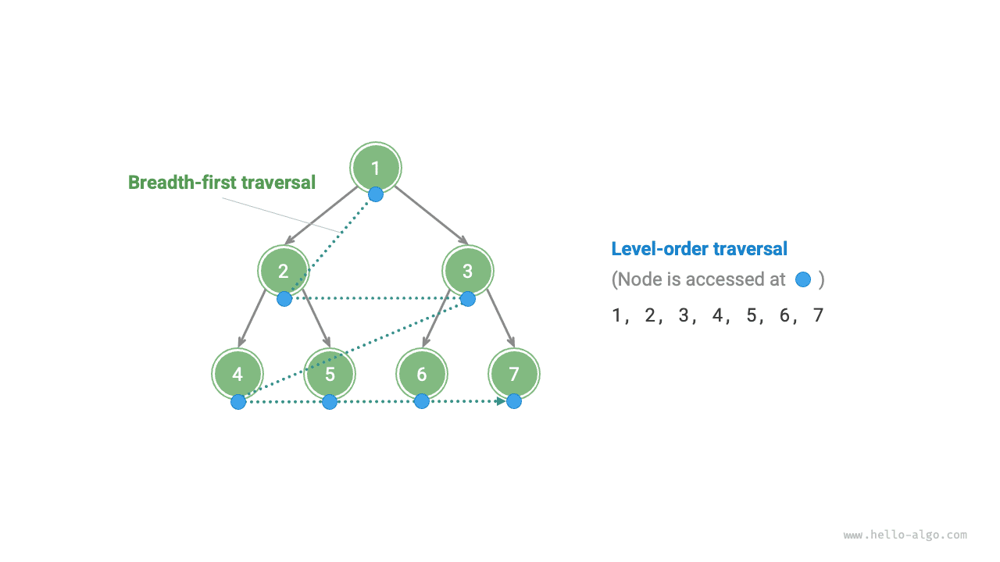
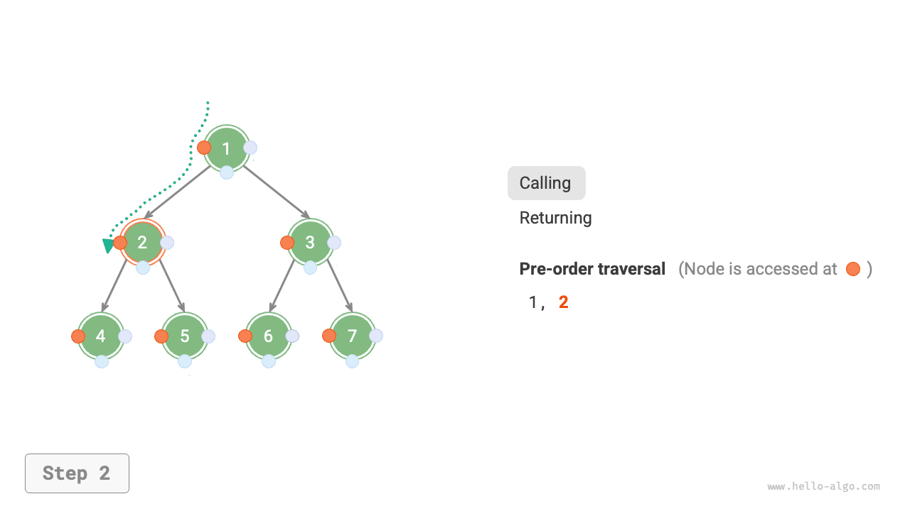
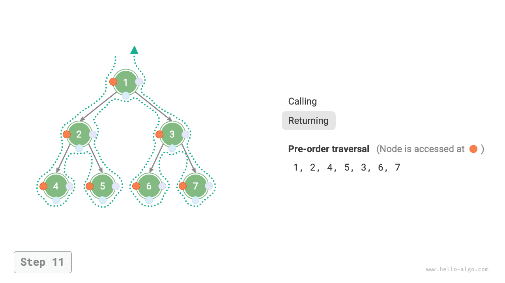

# Duyệt cây nhị phân

Xét từ góc độ cấu trúc vật lý, cây là một cấu trúc dữ liệu được xây dựng dựa trên danh sách liên kết. Do đó, phương pháp duyệt cây cũng thực hiện bằng cách truy cập lần lượt từng nút thông qua con trỏ. Tuy nhiên, cây là một cấu trúc dữ liệu phi tuyến tính, khiến việc duyệt cây phức tạp hơn nhiều so với duyệt danh sách liên kết, đòi hỏi phải có sự hỗ trợ của các thuật toán tìm kiếm.

Các phương pháp duyệt cây nhị phân phổ biến bao gồm duyệt theo tầng, duyệt trước, duyệt giữa và duyệt sau.

## Duyệt theo tầng

Như hình minh họa dưới đây, <u>duyệt theo tầng</u> duyệt cây nhị phân từ trên xuống dưới, theo từng tầng một. Trong mỗi tầng, các nút được thăm theo thứ tự từ trái sang phải.

Duyệt theo tầng về bản chất chính là <u>duyệt theo chiều rộng</u>, hay còn gọi là <u>tìm kiếm theo chiều rộng (BFS)</u>, mở rộng dần ra ngoài theo từng tầng.



### Cài đặt mã nguồn

Duyệt theo chiều rộng thường được cài đặt với sự trợ giúp của một "hàng đợi". Hàng đợi tuân theo quy tắc "vào trước ra trước", còn duyệt theo chiều rộng tuân theo quy tắc "tiến dần theo từng tầng"; ý tưởng cốt lõi của cả hai là nhất quán với nhau. Mã cài đặt như sau:

```src
[file]{binary_tree_bfs}-[class]{}-[func]{level_order}
```

### Phân tích độ phức tạp

- **Độ phức tạp thời gian là $O(n)$**: Tất cả các nút đều được thăm một lần, tốn thời gian $O(n)$, trong đó $n$ là số lượng nút.
- **Độ phức tạp không gian là $O(n)$**: Trong trường hợp xấu nhất, tức là cây nhị phân toàn phần, trước khi duyệt đến tầng dưới cùng, hàng đợi chứa tối đa $(n + 1) / 2$ nút cùng lúc, chiếm không gian $O(n)$.

## Duyệt trước, duyệt giữa và duyệt sau

Tương ứng, duyệt trước, duyệt giữa và duyệt sau đều thuộc nhóm <u>duyệt theo chiều sâu</u>, hay còn gọi là <u>tìm kiếm theo chiều sâu (DFS)</u>, đi càng sâu càng tốt trước khi quay lui.

Hình dưới đây minh họa cách duyệt theo chiều sâu hoạt động trên cây nhị phân. **Duyệt theo chiều sâu giống như việc "đi dạo" quanh toàn bộ chu vi của cây nhị phân**, tại mỗi nút sẽ gặp ba vị trí, tương ứng với duyệt trước, duyệt giữa và duyệt sau.


### Cài đặt mã nguồn

Tìm kiếm theo chiều sâu thường được cài đặt dựa trên đệ quy:

```src
[file]{binary_tree_dfs}-[class]{}-[func]{post_order}
```

!!! tip

    Tìm kiếm theo chiều sâu cũng có thể được cài đặt theo cách lặp, bạn đọc quan tâm có thể tự tìm hiểu thêm.

Hình dưới đây minh họa quá trình đệ quy của duyệt trước trên cây nhị phân, có thể chia thành hai giai đoạn đối lập nhau: "đi xuống" và "quay về".

1. "Đi xuống" nghĩa là thực hiện một lời gọi đệ quy mới, trong đó chương trình thăm nút tiếp theo.
2. "Quay về" nghĩa là lời gọi hàm kết thúc và trả về, cho biết nút hiện tại đã được xử lý xong.

=== "<1>"
    

=== "<2>"
    

=== "<3>"
    

=== "<4>"
    

=== "<5>"
    

=== "<6>"
    

=== "<7>"
    

=== "<8>"
    

=== "<9>"
    

=== "<10>"
    

=== "<11>"
    

### Phân tích độ phức tạp

- **Độ phức tạp thời gian là $O(n)$**: Tất cả các nút đều được thăm một lần, tốn thời gian $O(n)$.
- **Độ phức tạp không gian là $O(n)$**: Trong trường hợp xấu nhất, tức là cây suy biến thành danh sách liên kết, độ sâu đệ quy đạt tới $n$, hệ thống chiếm không gian ngăn xếp $O(n)$.
